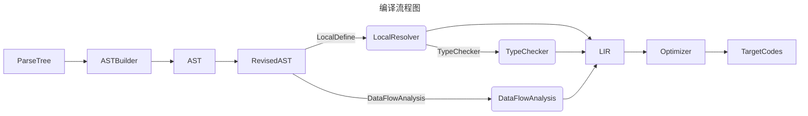
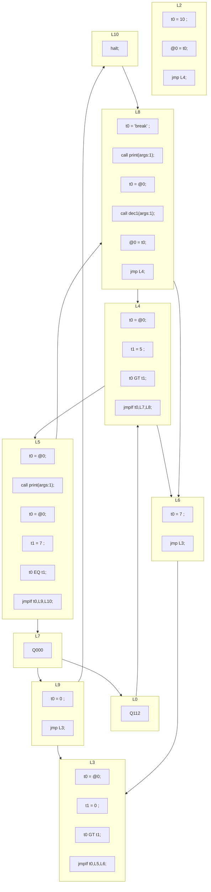

## 编译步骤流程图

## DONE
- [x] 通过访问者模式构建抽象语法树
- [x] 增加ASTree printer以检查语法树构建是否合乎期望
- [x] 增加类型实体和相关类型处理内容
- [x] 将作用域和变量及函数的生命周期进行关联
- [x] 编译到[ep18](..%2Fep18)的VM
- [x] 扩展[ep18](..%2Fep18)的VM支持更丰富的[指令实现](../ep18/VM_Design.md)
- [x] 线性化IR和CFG

### 线性化IR
我们的IR本质上是tree模式的，这样一来我们的线性化实际上延迟到了指令生成时。
但是，这样一来我们就无法进行活性分析和很多与TAC表示相关的分析（或者是我没找到
直接对栈代码做分析的例子）。因此，我要对ep20的输出code过程进行线性改造。

### CFG

