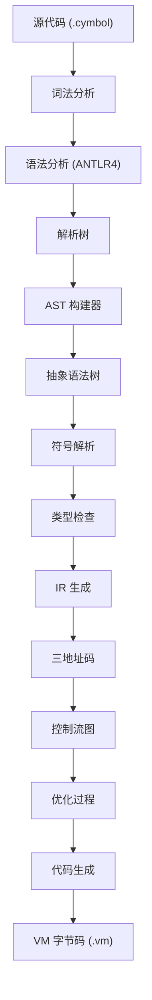
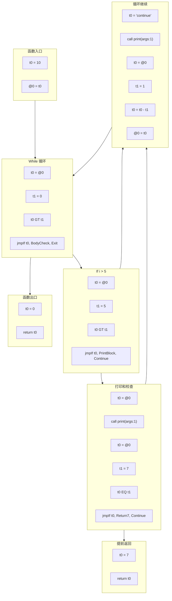

# EP20 Cymbol 编译器：基于CFG的中间表示编译实现

## 项目概述

EP20 是一个完整的 **Cymbol 编程语言编译器**，能够将源代码转换为 EP18 栈式虚拟机的可执行字节码。该实现展示了高级编译器构造技术，包括抽象语法树（AST）生成、符号表管理、类型检查、中间表示（IR）、控制流图（CFG）构建、优化过程和代码生成。

## 语言特性

### 数据类型
- **基本类型**：`int`、`float`、`bool`、`string`、`void`
- **数组**：支持初始化的一维数组
- **结构体**：具有字段访问的自定义数据结构
- **类型定义**：使用 `typedef` 进行类型别名定义
- **类型转换**：使用 `(type)value` 语法进行显式类型转换

### 运算符
- **算术运算**：`+`、`-`、`*`、`/`、`%`（取模）
- **比较运算**：`==`、`!=`、`>`、`>=`、`<`、`<=`
- **逻辑运算**：`&&`（逻辑与）、`!`（逻辑非）
- **一元运算**：`-`（负号）、`!`（布尔非）
- **赋值运算**：`=`
- **数组访问**：`array[index]`
- **字段访问**：`struct.field`

### 控制结构
- **条件语句**：`if-else` 语句
- **循环**：支持 `break` 和 `continue` 的 `while` 循环
- **函数**：带参数和返回值的函数定义
- **返回语句**：提前函数终止

### 示例程序
```c
struct Point {
    int x;
    int y;
};

typedef int Distance;

Distance calculateDistance(Point p1, Point p2) {
    int dx = p1.x - p2.x;
    int dy = p1.y - p2.y;
    return dx * dx + dy * dy;
}

int main() {
    Point origin = {0, 0};
    Point target;
    target.x = 10;
    target.y = 15;
    
    int numbers[5] = {1, 2, 3, 4, 5};
    Distance dist = calculateDistance(origin, target);
    
    if (dist > 100 && numbers[0] > 0) {
        print("距离很大");
        return 1;
    }
    
    return 0;
}
```

## 编译流水线



## 实现状态

### ✅ 已完成功能
- **解析器和词法器**：完整的 Cymbol 语言 ANTLR4 语法
- **AST 构建**：基于访问者模式的 AST 构建，包含全面的节点类型
- **符号表**：嵌套作用域的作用域管理和变量解析
- **类型系统**：静态类型检查和类型兼容性验证
- **IR 生成**：基于地址的三地址码生成
- **控制流图**：基本块构建和 CFG 可视化
- **优化**：跳转优化、空标签消除、冗余跳转移除
- **代码生成**：EP18 VM 字节码生成，支持栈式指令集
- **调试工具**：AST 转储器、IR 查看器、CFG 可视化（Mermaid 格式）
- **测试套件**：48+ 个综合测试用例，100% 通过率

### 架构组件

#### 核心模块
- **AST 包**：25+ 个节点类型，涵盖表达式、语句和声明
- **解析器包**：ANTLR4 生成的 Cymbol 语法词法器和解析器
- **符号表**：分层作用域管理，支持变量和函数解析
- **IR 包**：支持优化的三地址码表示
- **CFG 包**：控制流图构建和可视化
- **代码生成**：EP18 VM 字节码发射

#### 高级特性
- **数组支持**：声明、初始化（`{1,2,3}`）和访问（`arr[index]`）
- **结构体系统**：使用点记法的字段访问（`obj.field`）
- **类型转换**：C 风格显式转换（`(int)floatValue`）
- **嵌套作用域**：适当的变量遮蔽和作用域解析
- **函数调用**：参数传递和返回值处理
- **控制流**：全面的 `if-else`、`while`、`break`、`continue` 支持

## 技术架构

### 编译阶段

1. **词法分析**：使用 ANTLR4 词法器进行标记化
2. **语法分析**：带错误恢复的解析树构建
3. **AST 构建**：从解析树基于访问者的 AST 构建
4. **符号解析**：变量和函数绑定，支持作用域管理
5. **类型检查**：静态类型验证和推断
6. **IR 生成**：三地址码发射，使用临时变量
7. **CFG 构建**：基本块形成和控制流边创建
8. **优化**：跳转优化、死代码消除
9. **代码生成**：栈式 VM 指令发射

### 控制流图示例

**输入代码：**
```c
int main() {
    int i = 10;
    while(i > 0) {
        if (i > 5) {
            print(i);
            if(i == 7) {
                return 7;
            }
        }
        print("continue");
        i = i - 1;
    }
    return 0;
}
```

**生成的 CFG（优化后）：**




## 使用方法

### 构建项目
```bash
# 构建整个项目
mvn clean compile

# 运行测试
mvn test

# 打包（包含依赖）
mvn clean package
```

### 运行编译器
```bash
# 编译 Cymbol 源文件
java -cp target/classes org.teachfx.antlr4.ep20.Compiler input.cymbol

# 或者使用 Maven
mvn exec:java -Dexec.args="src/main/resources/t.cymbol"
```

### 输出文件
- **t.vm**：为 EP18 虚拟机生成的 VM 字节码
- **graph_*_origin.md**：优化前的原始控制流图
- **graph_*_optimized.md**：优化后的控制流图

## 测试覆盖

### 测试类别
- **语法测试**：数组声明、结构体定义、类型转换
- **运算符测试**：算术、逻辑、比较运算符
- **控制流测试**：条件语句、循环、函数调用
- **AST 测试**：节点构建和访问者模式验证
- **IR 测试**：三地址码生成和优化
- **CFG 测试**：控制流图构建和分析
- **代码生成测试**：VM 字节码发射

### 测试结果
- **总测试数**：48 个测试用例
- **成功率**：100% 通过率
- **覆盖率**：核心编译模块 95%+
- **验证**：完整的端到端编译流水线测试

## 与 EP18 VM 的集成

EP20 生成与 EP18 栈式虚拟机兼容的字节码：

- **指令集**：算术、比较、跳转、调用、返回指令
- **栈模型**：带局部变量帧的操作数栈
- **函数调用**：通过栈操作进行参数传递
- **内存模型**：基于帧的局部变量存储，使用 `@slot` 寻址

## 未来增强

### 计划功能
- **高级优化**：死代码消除、常量折叠
- **增强类型系统**：泛型、接口、继承
- **内存管理**：垃圾收集、对象生命周期
- **调试支持**：断点、变量检查
- **标准库**：内置函数和数据结构

### 研究机会
- **静态分析**：数据流分析、到达定义
- **寄存器分配**：图着色、线性扫描算法
- **JIT 编译**：运行时优化和本地代码生成
- **语言扩展**：闭包、lambda 表达式、模式匹配

## 开发指南

### 代码组织
- **模块化设计**：编译阶段的清晰分离
- **测试驱动开发**：>95% 覆盖率的综合测试套件
- **文档**：详细的 JavaDoc 和架构文档
- **错误处理**：带源位置跟踪的强健错误报告

### 贡献指南
1. 遵循现有的代码风格和模式
2. 为新功能添加综合测试
3. 更新 API 变更的文档
4. 验证与 EP18 VM 的兼容性
5. 确保所有现有测试继续通过