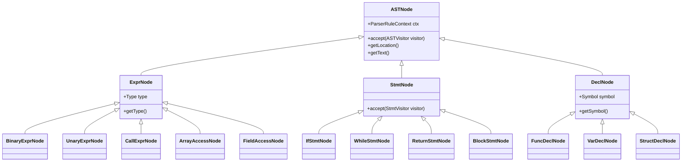
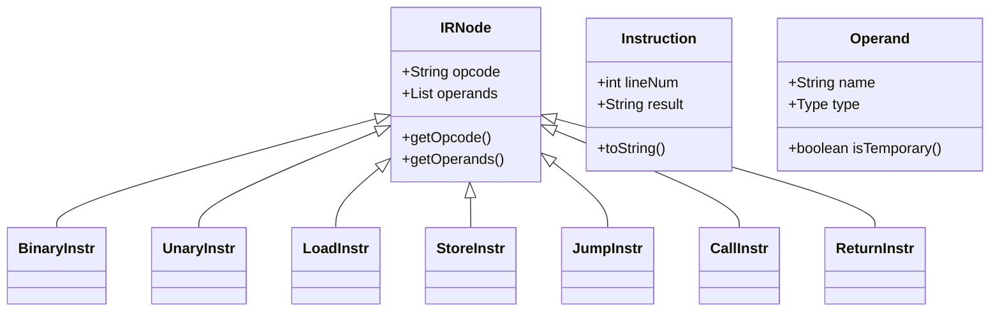
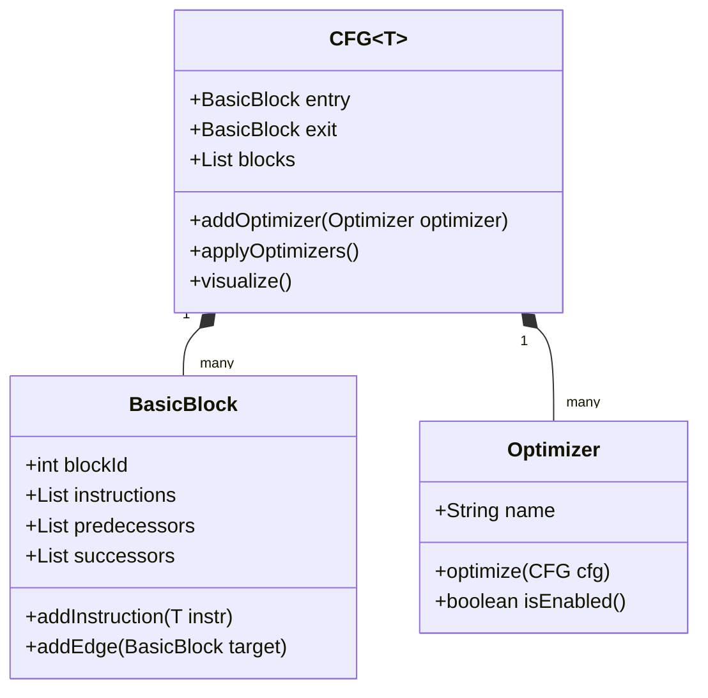

# EP20 项目架构设计规范

**版本**: v1.0 | **状态**: 已通过 | **最后更新**: 2026-01-09

## 1. 项目概述

EP20 Cymbol编译器是一个基于ANTLR4的完整编译器项目，实现了从Cymbol语言源代码到虚拟机指令的完整编译流程。项目采用模块化设计，涵盖词法分析、语法分析、AST构建、语义分析、中间表示(IR)生成、控制流图(CFG)构建、优化和代码生成等阶段。

### 1.1 设计目标
- 实现完整的编译器架构，支持从源代码到目标代码的端到端编译
- 构建基于控制流图(CFG)和地址化的编译架构
- 支持中间表示(IR)生成、优化和虚拟机代码生成
- 提供全面的调试支持和可视化工具
- 采用测试驱动开发(TDD)，确保代码质量和功能完整性

### 1.2 核心特性
- **完整编译流程**: 词法分析 → 语法分析 → AST构建 → 语义分析 → IR生成 → CFG构建 → 优化 → 代码生成
- **高级语言特性**: 支持数组、结构体、类型转换、typedef等C语言核心特性
- **优化框架**: 实现跳转优化、空标签消除、冗余跳转移除等优化算法
- **调试支持**: 提供AST可视化、IR查看、CFG图形化展示工具
- **虚拟机兼容**: 生成EP18栈式虚拟机字节码

## 2. 系统架构设计

### 2.1 整体架构

```
┌─────────────────────────────────────────────────────────────┐
│                    EP20编译器架构                           │
├─────────────────────────────────────────────────────────────┤
│  前端层 (Frontend Layer)                                   │
│  ├── 词法分析器 (Lexer)                                     │
│  ├── 语法分析器 (Parser)                                    │
│  └── AST构建器 (AST Builder)                                │
├─────────────────────────────────────────────────────────────┤
│  中端层 (Middle End Layer)                                 │
│  ├── 符号表管理 (Symbol Table)                              │
│  ├── 类型检查器 (Type Checker)                              │
│  └── IR生成器 (IR Generator)                                │
├─────────────────────────────────────────────────────────────┤
│  优化层 (Optimization Layer)                               │
│  ├── CFG构建器 (CFG Builder)                                │
│  ├── 控制流分析 (Control Flow Analysis)                     │
│  └── 优化Pass (Optimization Passes)                        │
├─────────────────────────────────────────────────────────────┤
│  后端层 (Backend Layer)                                    │
│  └── 代码生成器 (Code Generator)                            │
├─────────────────────────────────────────────────────────────┤
│  目标代码 (Target Code)                                    │
│  └── EP18 VM字节码 (.vm文件)                                 │
└─────────────────────────────────────────────────────────────┘
```

### 2.2 模块交互设计

#### 2.2.1 编译流程时序

```mermaid
sequenceDiagram
    participant Source as 源代码
    participant Lexer as 词法分析器
    participant Parser as 语法分析器
    participant AST as AST构建器
    participant Symbol as 符号表
    participant Type as 类型检查器
    participant IR as IR生成器
    participant CFG as CFG构建器
    participant Opt as 优化器
    participant CG as 代码生成器
    participant VM as VM字节码

    Source->>Lexer: 字符流
    Lexer->>Parser: Token流
    Parser->>AST: 解析树
    AST->>Symbol: AST节点
    Symbol->>Type: 符号表
    Type->>IR: 类型信息
    IR->>CFG: 三地址码
    CFG->>Opt: 控制流图
    Opt->>CG: 优化后IR
    CG->>VM: 目标代码
```

#### 2.2.2 核心模块职责

| 模块 | 主要职责 | 输入 | 输出 | 关键类 |
|------|----------|------|------|---------|
| 词法分析 | 字符流 → Token流 | .cymbol文件 | Token列表 | CymbolLexer |
| 语法分析 | Token流 → 解析树 | Token流 | ParseTree | CymbolParser |
| AST构建 | 解析树 → AST | ParseTree | ASTNode | CymbolASTBuilder |
| 符号解析 | 变量/函数绑定 | ASTNode | 符号表 | LocalDefine |
| 类型检查 | 静态类型验证 | ASTNode | 类型信息 | TypeChecker |
| IR生成 | AST → 三地址码 | ASTNode | IRNode | IRBuilder |
| CFG构建 | IR → 控制流图 | IRNode列表 | CFG | CFGBuilder |
| 优化 | CFG优化 | CFG | 优化CFG | ControlFlowAnalysis |
| 代码生成 | IR → VM字节码 | IRNode列表 | VM指令 | CodeGen |

## 3. 编译序列设计

### 3.1 标准编译流程

```java
// EP20编译器主流程 (Compiler.java:74)
public void compile(String fileName) {
    // 1. 词法和语法分析
    CharStream input = CharStreams.fromFileName(fileName);
    CymbolLexer lexer = new CymbolLexer(input);
    CommonTokenStream tokens = new CommonTokenStream(lexer);
    CymbolParser parser = new CymbolParser(tokens);
    ParseTree tree = parser.file();
    
    // 2. AST构建
    CymbolASTBuilder astBuilder = new CymbolASTBuilder();
    ASTNode astRoot = astBuilder.visit(tree);
    
    // 3. 符号解析和类型检查
    astRoot.accept(new LocalDefine());
    astRoot.accept(new TypeChecker());
    
    // 4. IR生成
    IRBuilder irBuilder = new IRBuilder();
    astRoot.accept(irBuilder);
    
    // 5. 基本块优化
    irBuilder.prog.optimizeBasicBlock();
    
    // 6. CFG构建和优化
    Stream.of(irBuilder.prog.blockList.stream()
        .map(irBuilder::getCFG))
        .peek(cfgPair -> {
            CFG<IRNode> cfg = cfgPair.getRight();
            cfg.addOptimizer(new ControlFlowAnalysis());
            cfg.applyOptimizers();
        });
    
    // 7. 代码生成
    CodeGen codeGen = new CodeGen();
    List<IRNode> optimizedIR = cfg.getIRNodes();
    codeGen.generate(optimizedIR);
}
```

### 3.2 并行优化策略

EP20支持在CFG层面进行并行优化处理：

```java
// 多函数并行优化
Stream<Pair<Integer, CFG<IRNode>>> cfgStream = 
    irBuilder.prog.blockList.stream()
        .map(irBuilder::getCFG)
        .parallel(); // 并行处理

cfgStream.forEach(cfgPair -> {
    CFG<IRNode> cfg = cfgPair.getRight();
    
    // 应用多种优化Pass
    cfg.addOptimizer(new JumpOptimizer());      // 跳转优化
    cfg.addOptimizer(new EmptyLabelEliminator()); // 空标签消除
    cfg.addOptimizer(new RedundantJumpRemover()); // 冗余跳转移除
    
    cfg.applyOptimizers();
});
```

## 4. 数据结构架构

### 4.1 AST节点体系



### 4.2 IR表示架构



### 4.3 CFG结构设计



## 5. 扩展性设计

### 5.1 优化Pass框架

EP20采用可插拔的优化Pass架构：

```java
// 优化器接口
public interface Optimizer<T> {
    String getName();
    void optimize(CFG<T> cfg);
    boolean isEnabled();
    int getPriority();
}

// 具体优化器实现
public class JumpOptimizer implements Optimizer<IRNode> {
    @Override
    public void optimize(CFG<IRNode> cfg) {
        // 跳转优化逻辑
        for (BasicBlock<IRNode> block : cfg.getBlocks()) {
            optimizeJump(block);
        }
    }
}
```

### 5.2 代码生成器架构

支持多目标代码生成：

```java
// 代码生成器接口
public interface CodeGenerator<T> {
    void generate(List<T> instructions, String outputFile);
    String getTargetName();
    boolean validate(List<T> instructions);
}

// EP18 VM代码生成器
public class EP18VMCodeGenerator implements CodeGenerator<IRNode> {
    @Override
    public void generate(List<IRNode> instructions, String outputFile) {
        // 生成EP18栈式虚拟机代码
    }
}
```

## 6. 调试和可视化支持

### 6.1 AST可视化

```java
// ASTDumper提供树形结构输出
public class ASTDumper implements ASTVisitor<String> {
    private int indent = 0;
    
    @Override
    public String visit(BinaryExprNode node) {
        StringBuilder sb = new StringBuilder();
        sb.append("\n").append(getIndent()).append("BinaryExpr:");
        sb.append("\n").append(getIndent()).append("  op: ").append(node.getOp());
        sb.append("\n").append(getIndent()).append("  left: ").append(node.getLeft().accept(this));
        sb.append("\n").append(getIndent()).append("  right: ").append(node.getRight().accept(this));
        return sb.toString();
    }
}
```

### 6.2 CFG图形化

```java
// CFG Mermaid格式输出
public class CFGraphVisualizer {
    public String toMermaid(CFG<IRNode> cfg) {
        StringBuilder sb = new StringBuilder("graph TD\n");
        
        for (BasicBlock<IRNode> block : cfg.getBlocks()) {
            sb.append("    ").append(block.getId())
              .append("[\"").append(block.getLabel()).append(\"\\n\"");
            
            // 添加指令列表
            for (IRNode instr : block.getInstructions()) {
                sb.append(instr.toString()).append(\"\\n\"");
            }
            sb.append(\"\"]\n"");
            
            // 添加边
            for (BasicBlock<IRNode> succ : block.getSuccessors()) {
                sb.append("    ").append(block.getId())
                  .append(" --> ").append(succ.getId()).append("\n");
            }
        }
        
        return sb.toString();
    }
}
```

## 7. 性能优化考虑

### 7.1 内存管理

- **对象池化**: 重用临时对象，减少GC压力
- **延迟初始化**: 按需创建复杂数据结构
- **流式处理**: 大文件采用流式处理，避免内存溢出

### 7.2 并行处理

- **函数级并行**: 不同函数的CFG可以并行优化
- **无锁设计**: 采用不可变数据结构，避免锁竞争
- **异步I/O**: 文件读写采用异步方式

## 8. 质量保证

### 8.1 测试策略

- **单元测试**: 每个模块独立测试，覆盖率>95%
- **集成测试**: 验证模块间协作，端到端测试
- **回归测试**: 修改后确保现有功能正常
- **性能测试**: 大规模代码编译性能验证

### 8.2 代码质量

- **静态分析**: 使用SonarQube等进行代码质量检查
- **代码审查**: 关键模块必须经过同行审查
- **文档要求**: 公共API必须有完整JavaDoc

## 9. 部署和运维

### 9.1 构建系统

- **Maven多模块**: 支持模块化构建和依赖管理
- **持续集成**: GitHub Actions自动化测试
- **版本管理**: 语义化版本号管理

### 9.2 监控指标

- **编译时间**: 各阶段耗时统计
- **内存使用**: 峰值内存和GC频率
- **错误率**: 编译失败率和错误类型分布

## 附录A: 版本历史

| 版本 | 日期 | 变更内容 | 作者 |
|------|------|----------|------|
| v1.0 | 2026-01-09 | 初始版本，整合项目架构文档 | EP20开发团队 |

---

**相关文档**:
- 详见[EP20寄存器分配设计规范](EP20_寄存器分配设计规范.md)
- 详见[EP20技术设计规范](EP20_技术设计规范.md)
- 详见[EP20 TDD实施标准](EP20_TDD实施标准.md)

**最后更新**: 2026-01-09
**维护者**: EP20开发团队