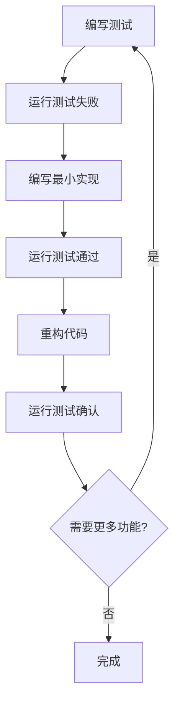

# EP20 TDD实施标准

**版本**: v1.0 | **状态**: 已通过 | **最后更新**: 2026-01-09

## 1. 概述

### 1.1 目标与范围
本文档定义了EP20编译器项目中测试驱动开发(TDD)的实施标准，包括方法论、流程规范、测试用例设计、执行步骤和质量要求。适用于所有EP20相关的开发活动，确保代码质量和功能完整性。

### 1.2 TDD核心原则
- **测试先行**: 先写测试，再写实现代码
- **小步快跑**: 小步迭代，快速反馈
- **持续重构**: 不断改进代码结构和设计
- **红绿循环**: 测试失败→实现通过→重构优化

## 2. TDD方法论

### 2.1 红-绿-重构循环



### 2.2 实施流程

#### 2.2.1 测试编写阶段（红色）
1. **需求分析**: 明确功能需求和边界条件
2. **测试设计**: 设计测试用例覆盖正常和异常情况
3. **代码编写**: 编写测试代码，此时应为编译错误或失败
4. **验证失败**: 确认测试确实失败，避免假阳性

#### 2.2.2 实现开发阶段（绿色）
1. **最小实现**: 编写刚好让测试通过的最简单代码
2. **快速验证**: 运行测试确保通过
3. **功能确认**: 验证实现满足基本需求
4. **避免过度设计**: 只实现当前测试需要的功能

#### 2.2.3 重构优化阶段（重构）
1. **代码清理**: 消除重复，提高可读性
2. **结构优化**: 改善设计模式，增强可维护性
3. **性能调优**: 在不影响功能的前提下优化性能
4. **测试验证**: 重构后重新运行测试确保功能正确

## 3. 测试架构设计

### 3.1 测试层次结构

```
┌─────────────────────────────────────────────────────────────┐
│                    EP20测试架构                             │
├─────────────────────────────────────────────────────────────┤
│  系统测试层 (System Tests)                                 │
│  ├── 端到端编译测试                                        │
│  └── 集成验证测试                                          │
├─────────────────────────────────────────────────────────────┤
│  集成测试层 (Integration Tests)                            │
│  ├── 模块间协作测试                                        │
│  └── 数据流测试                                            │
├─────────────────────────────────────────────────────────────┤
│  单元测试层 (Unit Tests)                                   │
│  ├── AST节点测试                                           │
│  ├── IR指令测试                                            │
│  ├── CFG构建测试                                           │
│  └── 优化Pass测试                                          │
├─────────────────────────────────────────────────────────────┤
│  组件测试层 (Component Tests)                              │
│  ├── 词法分析器测试                                        │
│  ├── 语法分析器测试                                        │
│  └── 代码生成器测试                                        │
└─────────────────────────────────────────────────────────────┘
```

### 3.2 测试用例设计规范

#### 3.2.1 测试用例命名规范

```
格式: [模块]_[功能]_[条件]_[预期结果]

示例:
- AST_BinaryExpr_ValidOperands_CorrectType()
- IR_AddInstruction_IntOperands_GeneratesAddIR()
- CFG_IfStatement_TwoBranches_CreatesTwoBlocks()
- CodeGen_FunctionCall_WithArgs_GeneratesCallInstr()
```

#### 3.2.2 测试结构模板

```java
/**
 * 标准测试用例模板
 */
public class StandardTestTemplate {
    
    @Test
    @DisplayName("测试用例描述")
    public void module_Function_Condition_Expectation() {
        // 1. 测试准备 (Arrange)
        TestData input = prepareTestInput();
        TestEnvironment env = setupTestEnvironment();
        
        // 2. 执行操作 (Act)
        TestResult result = executeFunction(input, env);
        
        // 3. 验证结果 (Assert)
        assertThat(result).isNotNull();
        assertThat(result.getStatus()).isEqualTo(EXPECTED_STATUS);
        assertThat(result.getData()).containsExactlyInAnyOrder(EXPECTED_DATA);
        
        // 4. 清理资源 (Cleanup)
        cleanupTestEnvironment(env);
    }
    
    private TestData prepareTestInput() {
        return TestData.builder()
                .withValidInput()
                .withExpectedOutput()
                .build();
    }
}
```

### 3.3 测试数据管理

#### 3.3.1 测试数据源

```java
/**
 * 测试数据提供器
 */
public class TestDataProvider {
    
    /**
     * 提供有效的Cymbol程序示例
     */
    public static Stream<String> validCymbolPrograms() {
        return Stream.of(
            "int main() { return 0; }",
            "int add(int a, int b) { return a + b; }",
            """
            struct Point { int x; int y; };
            int distance(Point p1, Point p2) {
                return (p1.x - p2.x) * (p1.x - p2.x) + 
                       (p1.y - p2.y) * (p1.y - p2.y);
            }
            """
        );
    }
    
    /**
     * 提供边界条件测试数据
     */
    public static Stream<Arguments> boundaryConditions() {
        return Stream.of(
            Arguments.of(Integer.MAX_VALUE, "最大整数值"),
            Arguments.of(Integer.MIN_VALUE, "最小整数值"),
            Arguments.of(0, "零值"),
            Arguments.of(-1, "负值")
        );
    }
}
```

#### 3.3.2 参数化测试

```java
/**
 * 参数化测试示例
 */
@ParameterizedTest
@MethodSource("org.teachfx.antlr4.ep20.test.TestDataProvider#validCymbolPrograms")
public void compile_ValidPrograms_ShouldGenerateCorrectIR(String program) {
    // 编译程序
    IRProgram ir = compiler.compileToIR(program);
    
    // 验证IR不为空且格式正确
    assertThat(ir).isNotNull();
    assertThat(ir.getInstructions()).isNotEmpty();
    assertThat(ir.hasValidStructure()).isTrue();
}
```

## 4. 实施步骤指南

### 4.1 环境准备阶段

#### 4.1.1 开发环境检查

```bash
# 检查Java版本（要求Java 21+）
java -version

# 检查Maven版本
mvn -version

# 验证测试框架
mvn test -Dtest=BasicBlockTest

# 检查代码覆盖率工具
mvn jacoco:report
```

#### 4.1.2 项目配置验证

```xml
<!-- 确保pom.xml包含必要的测试依赖 -->
<dependencies>
    <!-- JUnit 5 -->
    <dependency>
        <groupId>org.junit.jupiter</groupId>
        <artifactId>junit-jupiter-engine</artifactId>
        <version>5.9.3</version>
        <scope>test</scope>
    </dependency>
    
    <!-- AssertJ断言库 -->
    <dependency>
        <groupId>org.assertj</groupId>
        <artifactId>assertj-core</artifactId>
        <version>3.24.2</version>
        <scope>test</scope>
    </dependency>
    
    <!-- Mockito模拟框架 -->
    <dependency>
        <groupId>org.mockito</groupId>
        <artifactId>mockito-core</artifactId>
        <version>5.3.1</version>
        <scope>test</scope>
    </dependency>
</dependencies>
```

### 4.2 开发流程实施

#### 4.2.1 任务分解模板

```markdown
# TDD任务: [功能名称]

## 任务信息
- **任务ID**: TASK-XXX
- **优先级**: 高/中/低
- **预估工时**: X小时
- **负责人**: [姓名]

## 需求描述
[详细描述需要实现的功能]

## 测试用例设计
### 正常情况测试
- [ ] 测试用例1: [描述]
- [ ] 测试用例2: [描述]

### 边界条件测试
- [ ] 边界测试1: [描述]
- [ ] 边界测试2: [描述]

### 异常处理测试
- [ ] 异常测试1: [描述]
- [ ] 异常测试2: [描述]

## 实现步骤
1. [ ] 步骤1: [描述]
2. [ ] 步骤2: [描述]
3. [ ] 步骤3: [描述]

## 验收标准
- [ ] 所有测试用例通过
- [ ] 代码覆盖率>95%
- [ ] 代码审查通过
- [ ] 文档更新完成

## 进度跟踪
| 日期 | 进度 | 备注 |
|------|------|------|
| YYYY-MM-DD | 50% | 完成测试用例编写 |
```

#### 4.2.2 实施步骤详解

**步骤1: 需求分析与测试设计**

```java
/**
 * 新增数组访问功能的TDD实施
 */
public class ArrayAccessTDD {
    
    // 第一步：编写失败的测试用例
    @Test
    public void testArrayDeclaration() {
        // 准备测试数据
        String source = "int main() { int arr[5]; return 0; }";
        
        // 执行编译（应该失败，因为功能未实现）
        assertThrows(CompilationException.class, () -> {
            compiler.compile(source);
        });
    }
    
    @Test 
    public void testArrayInitialization() {
        String source = "int main() { int arr[3] = {1, 2, 3}; return arr[0]; }";
        
        // 这个测试也应该失败
        assertThrows(CompilationException.class, () -> {
            compiler.compile(source);
        });
    }
    
    @Test
    public void testArrayElementAccess() {
        String source = """
            int getFirst(int[] arr) {
                return arr[0];
            }
            """;
            
        // 同样应该失败
        assertThrows(CompilationException.class, () -> {
            compiler.compile(source);
        });
    }
}
```

**步骤2: 最小实现**

```java
/**
 * 数组访问功能的最小实现
 */
public class ArrayAccessParser extends CymbolParserBaseListener {
    
    // 最简单的实现：只支持语法解析
    @Override 
    public void enterArrayAccess(CymbolParser.ArrayAccessContext ctx) {
        // TODO: 实现数组访问语义分析
        throw new UnsupportedOperationException("数组访问功能开发中");
    }
    
    @Override
    public void enterArrayDeclaration(CymbolParser.ArrayDeclarationContext ctx) {
        // TODO: 实现数组声明语义分析
        throw new UnsupportedOperationException("数组声明功能开发中");
    }
}
```

**步骤3: 功能完善**

```java
/**
 * 数组访问功能的完整实现
 */
public class ArrayAccessAnalyzer extends CymbolASTVisitor<Type> {
    
    @Override
    public Type visitArrayAccess(ArrayAccessNode node) {
        // 检查数组表达式是否为数组类型
        Type arrayType = node.getArray().accept(this);
        if (!(arrayType instanceof ArrayType)) {
            error(node.getLocation(), "表达式不是数组类型");
            return Type.ERROR;
        }
        
        // 检查索引表达式是否为整数类型
        Type indexType = node.getIndex().accept(this);
        if (!indexType.equals(Type.INT)) {
            error(node.getLocation(), "数组索引必须是整数类型");
            return Type.ERROR;
        }
        
        // 返回数组元素类型
        ArrayType arrType = (ArrayType) arrayType;
        return arrType.getElementType();
    }
    
    @Override
    public Type visitArrayDeclaration(ArrayDeclarationNode node) {
        // 验证数组声明的语义正确性
        Type elementType = node.getElementType().accept(this);
        
        // 检查数组大小（如果是常量）
        if (node.hasSizeExpression()) {
            Type sizeType = node.getSizeExpression().accept(this);
            if (!sizeType.equals(Type.INT)) {
                error(node.getLocation(), "数组大小必须是整数类型");
                return Type.ERROR;
            }
        }
        
        // 创建数组类型
        return new ArrayType(elementType);
    }
}
```

## 5. 质量标准

### 5.1 测试覆盖率要求

| 测试类型 | 覆盖率要求 | 测量工具 | 检查频率 |
|----------|------------|----------|----------|
| 语句覆盖 | ≥95% | JaCoCo | 每次提交 |
| 分支覆盖 | ≥90% | JaCoCo | 每次提交 |
| 方法覆盖 | ≥95% | JaCoCo | 每次提交 |
| 类覆盖 | 100% | JaCoCo | 每次提交 |

### 5.2 代码质量指标

```java
/**
 * 代码质量检查示例
 */
public class CodeQualityCheck {
    
    @Test
    public void testCodeQuality() {
        // 检查代码复杂度
        assertThat(getCyclomaticComplexity()).isLessThan(10);
        
        // 检查代码重复率
        assertThat(getCodeDuplicationRate()).isLessThan(0.05);
        
        // 检查代码规范遵循度
        assertThat(getCodeStyleCompliance()).isGreaterThan(0.95);
        
        // 检查注释覆盖率
        assertThat(getCommentCoverage()).isGreaterThan(0.25);
    }
}
```

### 5.3 性能要求

- **测试执行时间**: 单个测试<100ms，完整测试套件<5分钟
- **内存使用**: 测试期间内存增长<100MB
- **并发安全**: 支持并行测试执行
- **资源清理**: 测试完成后资源完全释放

## 6. 持续集成

### 6.1 CI/CD流水线

```yaml
# .github/workflows/tdd-ci.yml
name: TDD CI Pipeline

on: [push, pull_request]

jobs:
  test:
    runs-on: ubuntu-latest
    
    steps:
    - uses: actions/checkout@v3
    
    - name: Set up JDK 21
      uses: actions/setup-java@v3
      with:
        java-version: '21'
        distribution: 'temurin'
        
    - name: Run TDD tests
      run: mvn test
      
    - name: Generate coverage report
      run: mvn jacoco:report
      
    - name: Upload coverage to Codecov
      uses: codecov/codecov-action@v3
      with:
        file: ./target/site/jacoco/jacoco.xml
        
    - name: Quality gate check
      run: |
        mvn sonar:sonar \
          -Dsonar.projectKey=ep20-tdd \
          -Dsonar.qualitygate.wait=true
```

### 6.2 质量门禁

```java
/**
 * 质量门禁检查
 */
public class QualityGate {
    
    @Test
    public void qualityGateCheck() {
        // 测试通过率必须100%
        assertThat(getTestPassRate()).isEqualTo(1.0);
        
        // 代码覆盖率≥95%
        assertThat(getCodeCoverage()).isGreaterThanOrEqualTo(0.95);
        
        // 代码复杂度<10
        assertThat(getAverageComplexity()).isLessThan(10);
        
        // 技术债务<5天
        assertThat(getTechnicalDebt()).isLessThan(Duration.ofDays(5));
    }
}
```

## 7. 工具集成

### 7.1 开发工具

- **IDE**: IntelliJ IDEA / Eclipse (内置JUnit支持)
- **构建工具**: Maven (依赖管理和测试执行)
- **覆盖率**: JaCoCo (代码覆盖率分析)
- **静态分析**: SonarQube (代码质量检查)
- **CI/CD**: GitHub Actions (自动化测试)

### 7.2 调试工具

```java
/**
 * TDD调试辅助工具
 */
public class TDDDebugger {
    
    /**
     * 测试失败调试
     */
    public static void debugTestFailure(TestResult result) {
        System.out.println("=== Test Failure Debug Info ===");
        System.out.println("Test: " + result.getTestName());
        System.out.println("Failure: " + result.getFailureMessage());
        System.out.println("Expected: " + result.getExpectedValue());
        System.out.println("Actual: " + result.getActualValue());
        System.out.println("Stack Trace: " + result.getStackTrace());
        
        // 输出相关上下文信息
        if (result.hasContext()) {
            System.out.println("Context: " + result.getContext());
        }
    }
}
```

## 附录A: 版本历史

| 版本 | 日期 | 变更内容 | 作者 |
|------|------|----------|------|
| v1.0 | 2026-01-09 | 整合TDD实施标准文档 | EP20开发团队 |

---

**相关文档**:
- 详见[EP20项目架构设计规范](../01_core_design/EP20_项目架构设计规范.md)
- 详见[EP20测试规范](EP20_测试规范.md)

**最后更新**: 2026-01-09
**维护者**: EP20开发团队