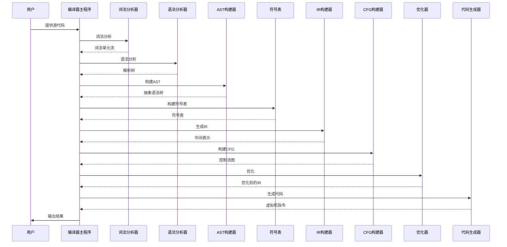
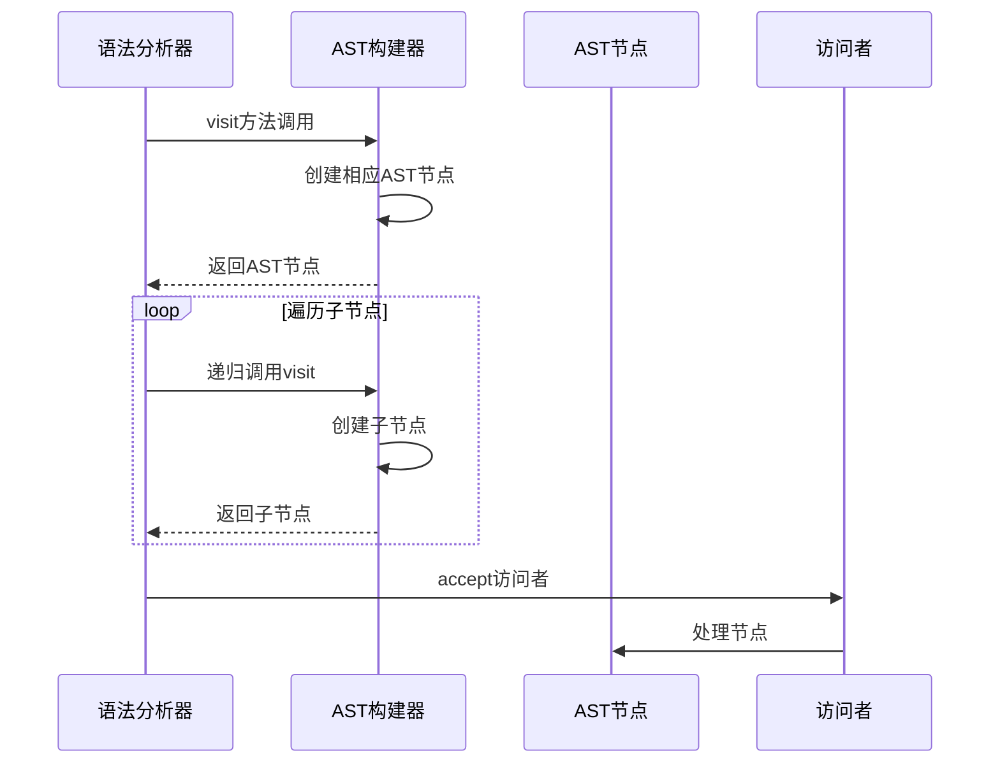
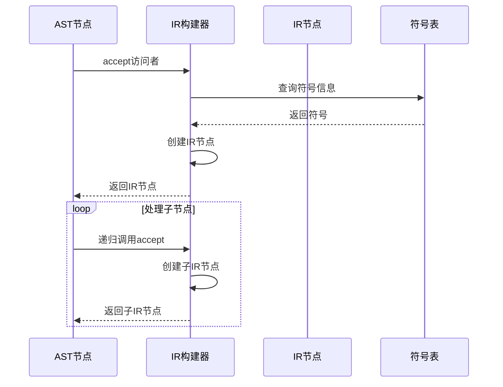
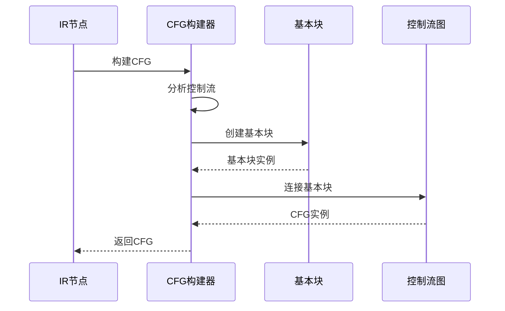
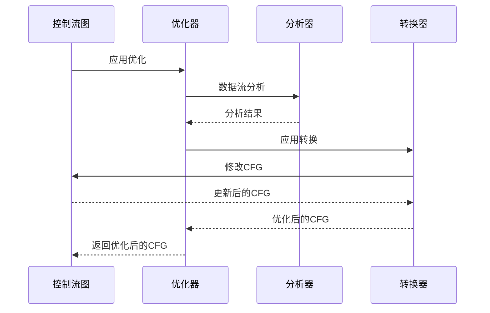

# EP20编译流程序列图

## 1. 整体编译流程



## 2. AST构建详细流程



## 3. IR生成详细流程



## 4. CFG构建详细流程



## 5. 优化详细流程



## 6. 代码生成详细流程

```mermaid
sequenceDiagram
    participant IRNode as IR节点
    participant Assembler as 代码生成器
    participant Emitter as 操作符发射器
    participant Buffer as 指令缓冲区

    IRNode->>Assembler: accept访问者
    Assembler->>Emitter: 查询指令
    Emitter-->>Assembler: 指令字符串
    Assembler->>Buffer: 添加指令
    Buffer-->>Assembler: 更新缓冲区
    loop 处理子节点
        IRNode->>Assembler: 递归调用accept
        Assembler->>Buffer: 添加指令
        Buffer-->>Assembler: 更新缓冲区
    end
    Assembler-->>IRNode: 返回汇编代码