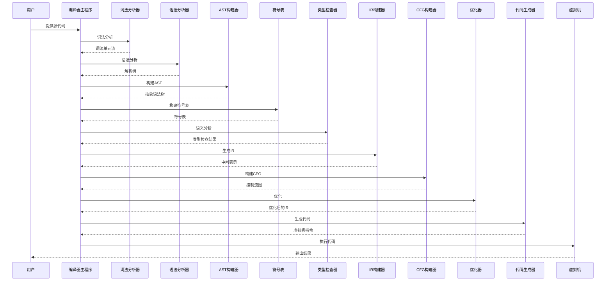
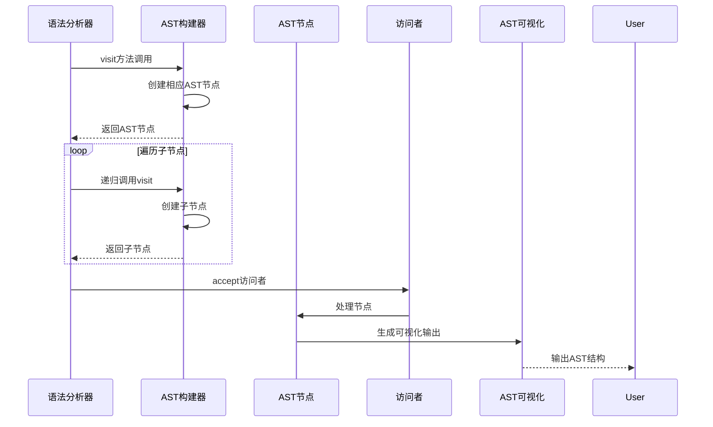
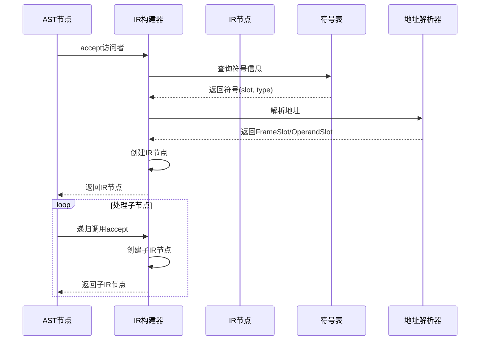
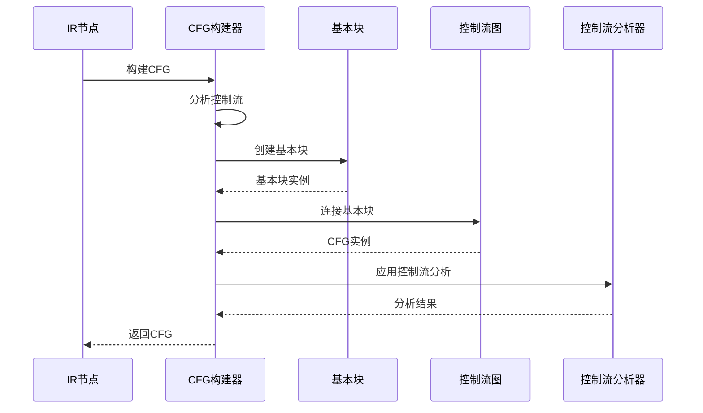
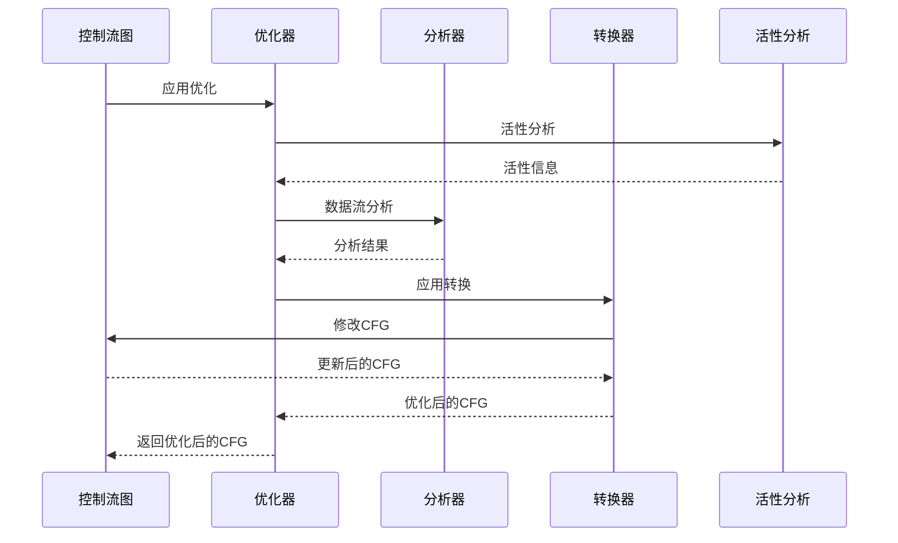
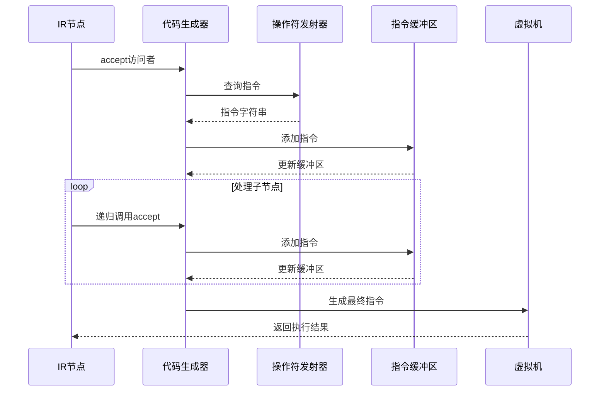
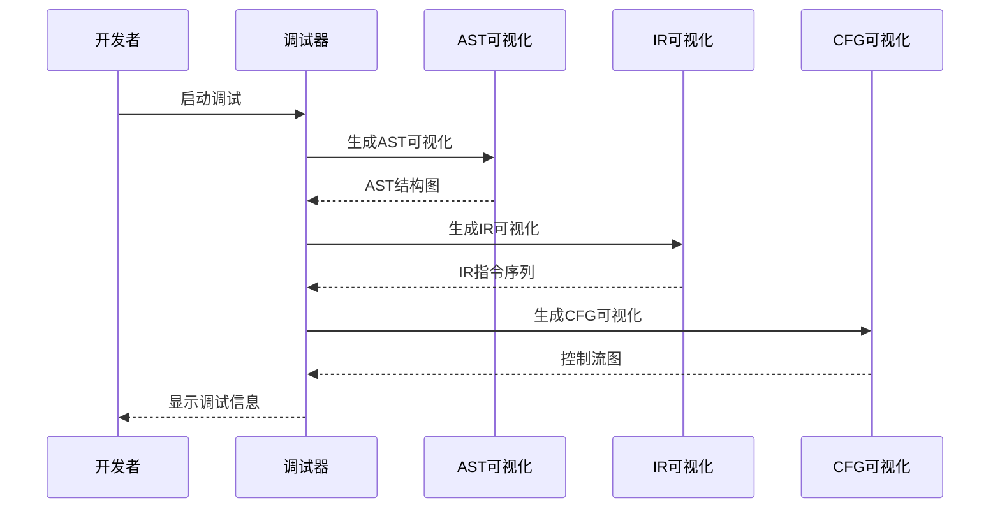
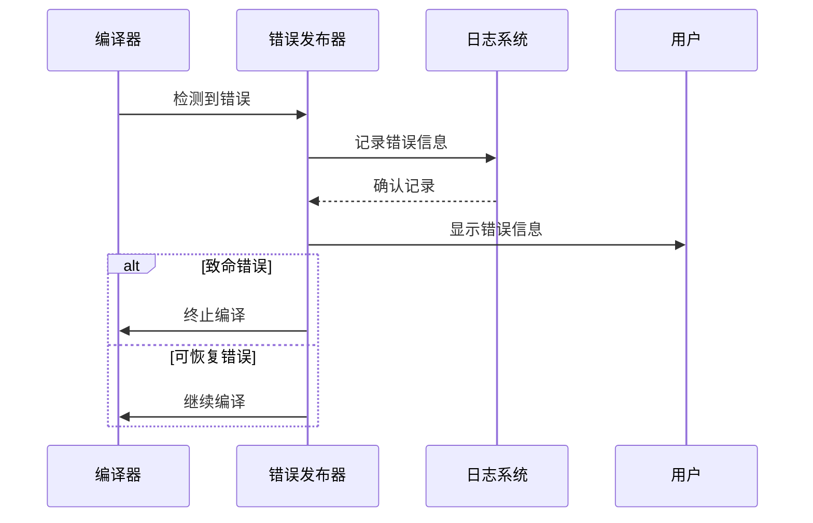
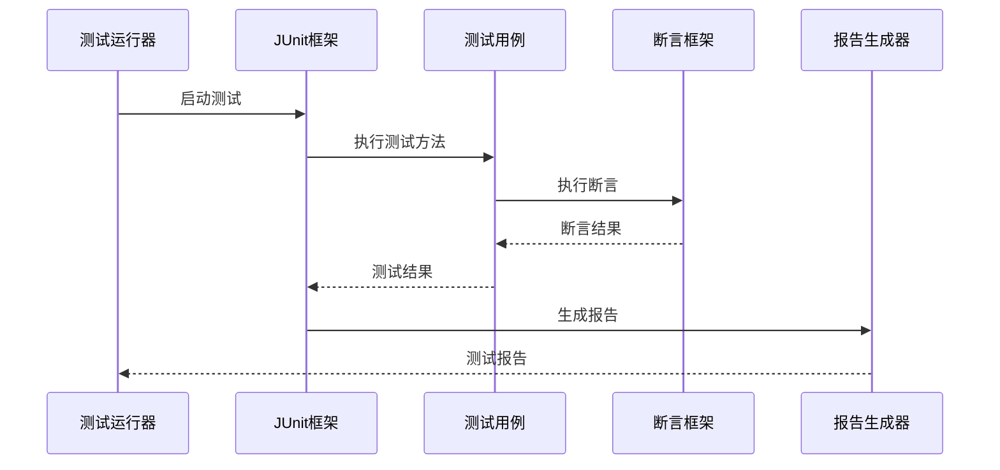

# EP20编译流程序列图

## 1. 整体编译流程



## 2. AST构建详细流程



## 3. IR生成详细流程



## 4. CFG构建详细流程



## 5. 优化详细流程



## 6. 代码生成详细流程



## 7. 调试支持流程



## 8. 错误处理流程



## 9. 测试执行流程



## 10. 持续集成流程

```mermaid
sequenceDiagram
    participant Git as Git仓库
    participant CI as CI系统
    participant Maven as Maven构建
    participant Test as 测试套件
    participant Coverage as 覆盖率检查
    participant Deploy as 部署系统

    Git->>CI: 代码推送
    CI->>Maven: 触发构建
    Maven->>Test: 运行测试
    Test-->>Maven: 测试结果
    Maven->>Coverage: 检查覆盖率
    Coverage-->>Maven: 覆盖率报告
    alt 测试通过且覆盖率达标
        Maven->>Deploy: 部署应用
    else 测试失败或覆盖率不足
        Maven->>CI: 构建失败
    end
    CI-->>Git: 更新状态