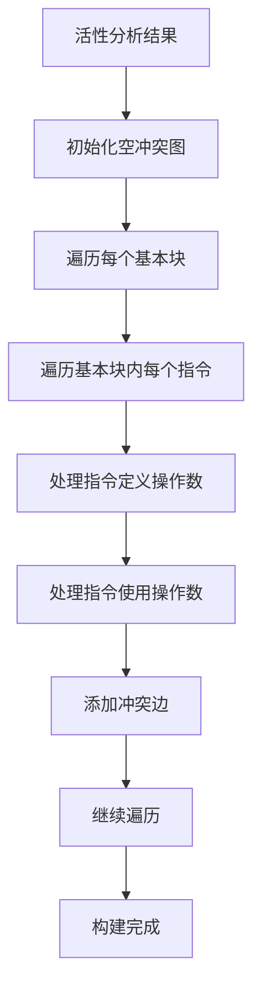

# EP20寄存器分配算法详细说明

## 1. 算法概述

本文档详细描述EP20编译器寄存器分配模块中使用的图着色算法实现细节，包括冲突图构建、着色策略、溢出处理和优化技巧。

## 2. 冲突图构建算法

### 2.1 构建流程



### 2.2 算法伪代码

```
procedure BUILD_CONFLICT_GRAPH(livenessResult)
    graph ← new ConflictGraph()
    
    for each basic block in CFG do
        live ← livenessResult.getLiveOut(block)
        
        for each instruction in reverse order of block do
            // 处理定义操作数
            for each operand defined in instruction do
                for each variable in live do
                    if operand ≠ variable then
                        graph.addConflict(operand, variable)
                end for
                live ← live ∪ {operand} - killed operands
            end for
            
            // 处理使用操作数
            for each operand used in instruction do
                live ← live ∪ {operand}
            end for
        end for
    end for
    
    return graph
end procedure
```

## 3. 图着色算法

### 3.1 标准图着色流程

#### 3.1.1 简化阶段 (Simplification)

```
procedure SIMPLIFY(graph, stack, registerCount)
    while ∃ node in graph with degree < registerCount do
        node ← node with smallest degree
        stack.push(node)
        graph.removeNode(node)
    end while
end procedure
```

#### 3.1.2 选择阶段 (Selection)

```
procedure SELECT(graph, stack, registerCount)
    while stack not empty do
        node ← stack.pop()
        availableColors ← all colors {0, 1, ..., registerCount-1}
        
        for each neighbor in graph.getNeighbors(node) do
            if neighbor has assigned color then
                availableColors ← availableColors - {neighbor's color}
            end if
        end for
        
        if availableColors ≠ ∅ then
            assign smallest color in availableColors to node
        else
            // 需要溢出处理
            return SPILL_REQUIRED
        end if
    end while
    
    return SUCCESS
end procedure
```

### 3.2 启发式策略

#### 3.2.1 节点选择启发式

```java
/**
 * 基于度的节点选择启发式
 */
public class DegreeBasedHeuristic implements NodeSelectionHeuristic {
    
    public Operand selectNode(ConflictGraph graph) {
        return graph.getAllNodes().stream()
            .filter(node -> graph.getDegree(node) < graph.getRegisterCount())
            .min(Comparator.comparingInt(graph::getDegree))
            .orElse(null);
    }
}
```

#### 3.2.2 颜色选择启发式

```java
/**
 * 最少使用颜色启发式
 */
public class LeastUsedColorHeuristic implements ColorSelectionHeuristic {
    
    public int selectColor(Set<Integer> availableColors, 
                          Map<Integer, Integer> colorUsage) {
        return availableColors.stream()
            .min(Comparator.comparingInt(colorUsage::get))
            .orElse(availableColors.iterator().next());
    }
}
```

## 4. 溢出处理算法

### 4.1 溢出候选选择

```
procedure CHOOSE_SPILL_CANDIDATE(graph, livenessResult)
    bestCandidate ← null
    bestCost ← ∞
    
    for each node in graph do
        cost ← CALCULATE_SPILL_COST(node, livenessResult)
        if cost < bestCost then
            bestCandidate ← node
            bestCost ← cost
        end if
    end for
    
    return bestCandidate
end procedure
```

### 4.2 溢出成本计算

```
procedure CALCULATE_SPILL_COST(operand, livenessResult)
    liveRange ← livenessResult.getLiveRange(operand)
    uses ← liveRange.getUsePoints().size()
    defs ← liveRange.getDefPoints().size()
    length ← liveRange.getLength()
    
    // 基本成本：使用和定义次数
    baseCost ← uses + defs
    
    // 根据活性区间长度调整
    lengthFactor ← length / 100.0
    
    // 根据循环嵌套深度调整
    loopDepth ← getLoopDepth(operand)
    loopFactor ← 1.0 + (loopDepth * 0.5)
    
    return baseCost * lengthFactor * loopFactor
end procedure
```

### 4.3 溢出代码生成

#### 4.3.1 溢出加载代码

```
procedure GENERATE_SPILL_LOAD(operand, stackOffset)
    // 在操作数使用前插入加载指令
    return new LoadInstruction(operand, stackOffset)
end procedure
```

#### 4.3.2 溢出存储代码

```
procedure GENERATE_SPILL_STORE(operand, stackOffset)
    // 在操作数定义后插入存储指令
    return new StoreInstruction(operand, stackOffset)
end procedure
```

## 5. 活性分析扩展

### 5.1 扩展的活性分析算法

```
procedure EXTENDED_LIVENESS_ANALYSIS(irNodes)
    // 初始化活性集合
    for each basic block do
        liveIn[block] ← ∅
        liveOut[block] ← ∅
    end for
    
    // 迭代直到收敛
    changed ← true
    while changed do
        changed ← false
        
        for each basic block in reverse order do
            oldLiveOut ← liveOut[block]
            
            // liveOut = ∪ of liveIn of successors
            liveOut[block] ← ∅
            for each successor in block.getSuccessors() do
                liveOut[block] ← liveOut[block] ∪ liveIn[successor]
            end for
            
            // liveIn = use ∪ (liveOut - def)
            liveIn[block] ← use[block] ∪ (liveOut[block] - def[block])
            
            if liveOut[block] ≠ oldLiveOut then
                changed ← true
            end if
        end for
    end while
    
    return new LivenessResult(liveIn, liveOut)
end procedure
```

## 6. 优化技巧

### 6.1 图着色优化

#### 6.1.1 度估计优化

```java
/**
 * 使用度估计避免精确度计算
 */
public class DegreeEstimation {
    
    public int estimateDegree(Operand operand, ConflictGraph graph) {
        // 使用近似计算减少开销
        int exactDegree = graph.getDegree(operand);
        if (exactDegree < 100) {
            return exactDegree;
        }
        
        // 对于高度数节点使用采样估计
        return estimateBySampling(operand, graph, 0.1);
    }
}
```

#### 6.1.2 增量式图更新

```java
/**
 * 增量式冲突图更新
 */
public class IncrementalGraphUpdate {
    
    public void updateAfterSpill(ConflictGraph graph, Operand spilledOp) {
        // 移除溢出节点后，更新受影响节点的度
        for (Operand neighbor : graph.getNeighbors(spilledOp)) {
            graph.updateDegree(neighbor, -1);
        }
    }
}
```

### 6.2 内存访问优化

#### 6.2.1 溢出位置分配

```java
/**
 * 智能溢出位置分配
 */
public class SpillSlotAllocator {
    
    public int allocateSpillSlot(Operand operand) {
        // 尝试重用已分配的溢出槽
        if (spillSlots.containsKey(operand)) {
            return spillSlots.get(operand);
        }
        
        // 分配新的溢出槽
        int slot = nextAvailableSlot++;
        spillSlots.put(operand, slot);
        return slot;
    }
}
```

#### 6.2.2 溢出代码优化

```java
/**
 * 溢出代码移动优化
 */
public class SpillCodeMotion {
    
    public void optimizeSpillPlacement(List<IRNode> irNodes) {
        // 将溢出代码移动到最合适的位置
        // 减少不必要的内存访问
        moveLoadsToUsePoints();
        moveStoresToDefPoints();
    }
}
```

## 7. 复杂度分析

### 7.1 时间复杂度

| 算法阶段 | 最坏情况 | 平均情况 | 优化后 |
|---------|---------|---------|--------|
| 冲突图构建 | O(n²) | O(n log n) | O(n) |
| 简化阶段 | O(n²) | O(n log n) | O(n) |
| 选择阶段 | O(n²) | O(n log n) | O(n) |
| 溢出处理 | O(n³) | O(n²) | O(n log n) |

### 7.2 空间复杂度

| 数据结构 | 空间需求 | 优化措施 |
|---------|---------|---------|
| 冲突图 | O(n²) | 稀疏矩阵表示 |
| 活性信息 | O(n) | 位集压缩 |
| 着色栈 | O(n) | 原地操作 |

## 8. 实现注意事项

### 8.1 线程安全性

- 冲突图构建：只读操作，线程安全
- 着色算法：需要同步访问共享状态
- 溢出处理：每个溢出候选独立处理

### 8.2 内存管理

- 使用对象池减少GC压力
- 大图情况下的内存优化
- 增量式图更新减少内存拷贝

### 8.3 错误处理

- 着色失败时的优雅降级
- 溢出迭代次数限制
- 详细的错误诊断信息

## 9. 性能调优参数

### 9.1 可配置参数

```java
public class PerformanceTuningParams {
    
    // 冲突图构建参数
    public static int MAX_GRAPH_NODES = 10000;
    public static double SPARSE_MATRIX_THRESHOLD = 0.1;
    
    // 着色算法参数
    public static int MAX_ITERATIONS = 100;
    public static int MAX_SPILL_ITERATIONS = 10;
    
    // 溢出处理参数
    public static double SPILL_COST_THRESHOLD = 5.0;
    public static int MIN_SPILL_BENEFIT = 2;
}
```

### 9.2 监控指标

```java
public class PerformanceMetrics {
    
    // 时间指标
    private long graphBuildTime;
    private long coloringTime;
    private long spillTime;
    
    // 质量指标
    private int spillCount;
    private int memoryAccessReduction;
    private double qualityScore;
    
    // 资源指标
    private long peakMemoryUsage;
    private int graphNodeCount;
    private int graphEdgeCount;
}
```

## 10. 测试策略

### 10.1 算法正确性测试

- 单一基本块测试
- 多基本块控制流测试
- 循环结构测试
- 函数调用测试

### 10.2 性能回归测试

- 小规模代码测试
- 中等规模代码测试  
- 大规模代码测试
- 边界情况测试

### 10.3 对比基准测试

- 与现有栈帧分配对比
- 不同寄存器数量对比
- 不同启发式策略对比

---

*本文档提供了EP20寄存器分配算法的详细实现细节，为开发团队提供准确的技术指导和实现参考。*