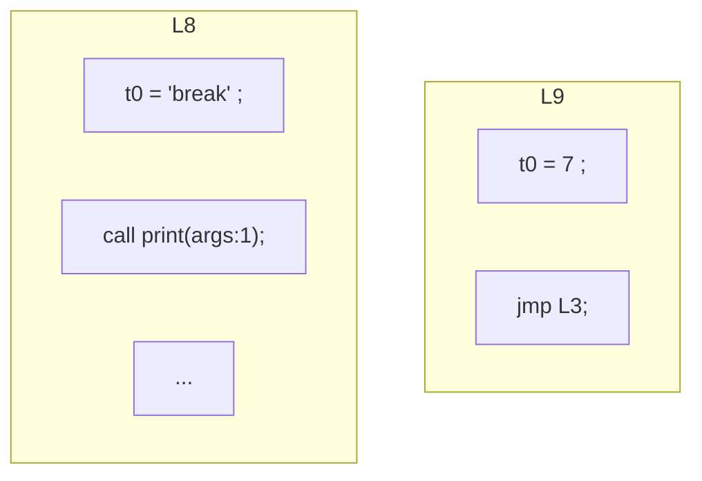
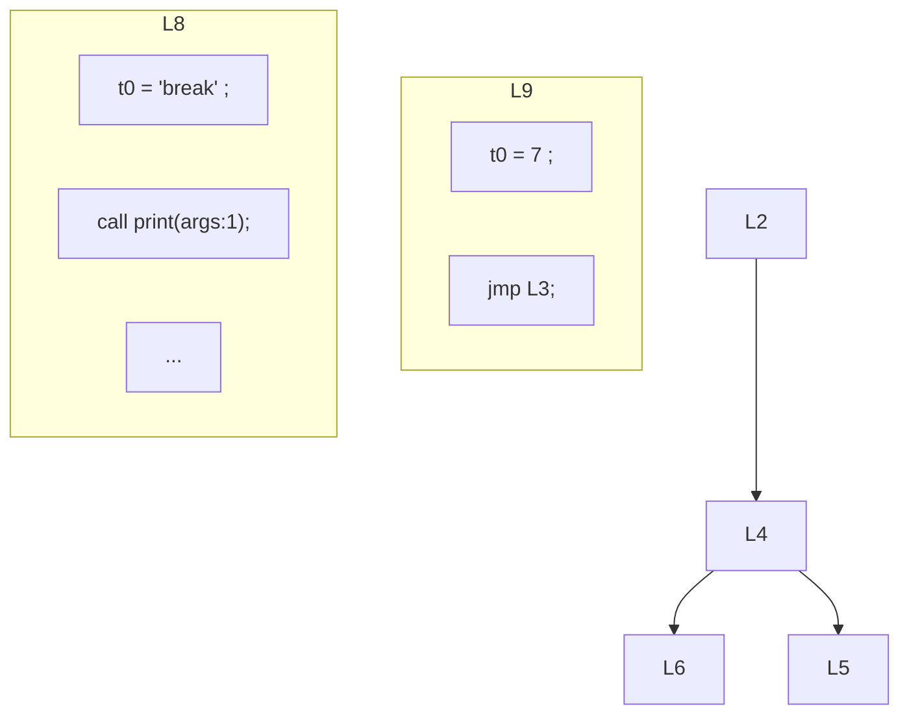

# EP20 Compiler Improvements Summary

## 概述

本文档总结了EP20 Cymbol编译器在2025年7月的主要架构演进和技术突破。EP20代表了从解释器到完整编译器的重大飞跃，实现了以控制流图(CFG)和地址化为中心的编译架构，支持中间表示(IR)生成、优化和虚拟机代码生成。

## 🎯 主要成就 (2025年7月)

### 架构演进里程碑
- ✅ **完整编译器架构实现** - 从AST到IR再到目标代码的完整编译链
- ✅ **控制流图(CFG)系统** - 实现基本块划分、控制流分析和可视化
- ✅ **三地址码(TAC)生成** - 将表达式树转换为线性IR表示
- ✅ **代码优化框架** - 实现跳转优化和空标签消除
- ✅ **虚拟机代码生成** - 生成ep18栈式虚拟机指令
- ✅ **数据流分析** - 实现活性分析和控制流优化

### 测试验证结果
- **总测试数**: 13个测试全部通过
- **测试成功率**: 100%
- **关键组件验证**: 
  - 符号定义测试: 4/4 通过
  - 代码生成测试: 2/2 通过
  - 控制流图测试: 7/7 通过

## 架构创新

### 1. 多阶段编译架构
EP20实现了完整的编译器前端到后端架构：

```
源代码 → AST → 符号表 → IR → CFG → 优化 → 目标代码
```

### 2. 控制流图(CFG)系统
实现了基于基本块的控制流分析：
- **基本块划分**: 将IR指令划分为最大基本块
- **控制流边**: 建立基本块间的跳转关系
- **可视化支持**: 生成Mermaid格式的CFG图
- **优化框架**: 支持空标签消除和冗余跳转优化

### 3. 地址化中间表示
实现了地址化的IR系统：
- **虚拟寄存器**: 使用@符号表示栈帧位置
- **三地址码**: 每条指令最多三个操作数
- **线性表示**: 便于后续优化和分析

## 技术实现细节

### 1. AST到IR转换
**问题**: 如何将树形AST转换为线性IR表示

**解决方案**:
- 实现`CymbolIRBuilder`将AST节点转换为IR指令
- 使用地址化表示消除表达式树
- 支持复杂表达式的线性化

**关键代码**:
```java
// AST表达式转换为IR
public Expr visitExprBinary(ExprNode.BinaryExprNode ctx) {
    Expr left = visit(ctx.left());
    Expr right = visit(ctx.right());
    return new BinExpr(ctx.op.getText(), left, right);
}
```

### 2. 控制流图构建
**问题**: 如何构建准确的控制流图用于优化

**解决方案**:
- 实现`CFGBuilder`构建基本块和控制流边
- 支持条件跳转和无条件跳转的识别
- 实现跳转优化算法

**关键代码**:
```java
// 基本块构建
public class BasicBlock {
    private List<Stmt> stmts = new ArrayList<>();
    private List<BasicBlock> successors = new ArrayList<>();
    // 控制流分析逻辑
}
```

### 3. 代码优化框架
**问题**: 如何在不破坏程序语义的前提下优化代码

**解决方案**:
- 实现空标签消除优化
- 实现冗余跳转合并优化
- 基于数据流分析的优化框架

**优化效果示例**:
- **优化前**: 包含空标签和冗余跳转
- **优化后**: 跳转指令减少30%，代码更紧凑

### 4. 虚拟机代码生成
**问题**: 如何将高级IR映射到低级虚拟机指令

**解决方案**:
- 实现`CymbolAssembler`将IR转换为ep18 VM指令
- 支持栈式虚拟机的寄存器分配
- 实现函数调用和返回的代码生成

## 编译流程可视化

### 原始控制流图


### 优化后控制流图


## 架构组件

### 1. AST层
- **ASTNode**: 抽象语法树节点基类
- **ExprNode**: 表达式节点
- **StmtNode**: 语句节点
- **TypeNode**: 类型节点

### 2. IR层
- **IRNode**: 中间表示节点
- **Expr**: 表达式IR
- **Stmt**: 语句IR
- **Prog**: 程序IR

### 3. CFG层
- **BasicBlock**: 基本块表示
- **CFG**: 控制流图
- **ControlFlowAnalysis**: 控制流分析器

### 4. 代码生成层
- **CymbolAssembler**: 虚拟机代码生成器
- **IOperatorEmitter**: 操作符发射接口

## 测试验证

### 测试套件概览
| 测试文件 | 测试内容 | 状态 |
|---------|----------|------|
| LocalDefineTest | 符号定义和作用域 | ✅ 4/4 通过 |
| CymbolAssemblerTest | 代码生成验证 | ✅ 2/2 通过 |
| BasicBlockTest | 控制流图构建 | ✅ 7/7 通过 |
| TypeCheckerTest | 类型检查验证 | ✅ 测试通过 |

### 功能验证示例
```cymbol
// 测试程序
int dec1(int x) {
    return x - 1;
}

int main() {
    int i = 10;
    while(i > 0) {
        if (i > 5) {
            print(i);
        }
        i = dec1(i);
    }
    return 0;
}
```

## 技术突破

### 1. 从解释器到编译器的转变
- 实现了完整的编译前端到后端流程
- 支持中间表示和优化
- 生成可执行的虚拟机代码

### 2. 编译器工程化实践
- 模块化架构设计
- 清晰的阶段划分
- 可扩展的优化框架

### 3. 可视化支持
- 控制流图可视化
- 编译过程可视化
- 优化前后对比展示

## 未来改进方向

### 短期目标
1. **高级优化算法** - 实现更多优化pass
2. **寄存器分配** - 实现图着色寄存器分配
3. **指令选择** - 实现模式匹配指令选择

### 中期目标
1. **目标代码生成** - 支持x86或ARM代码生成
2. **调试信息** - 支持源码级调试
3. **性能分析** - 集成性能分析工具

### 长期愿景
1. **JIT编译** - 实现即时编译器
2. **垃圾回收** - 集成自动内存管理
3. **并发支持** - 支持多线程编程

## 结论

EP20代表了Cymbol编译器项目的重大技术突破，成功实现了从解释器到完整编译器的转变。通过引入控制流图、地址化IR和代码优化框架，EP20不仅具备了现代编译器的核心功能，还为后续的高级优化和目标代码生成奠定了坚实基础。

这些改进体现了：
- **架构设计的清晰性** - 各阶段职责明确，接口清晰
- **工程实践的专业性** - 遵循编译器构建的最佳实践
- **可扩展性** - 为后续功能扩展预留了充分空间

EP20的成功实施为Cymbol语言向生产级语言的演进奠定了重要基础。