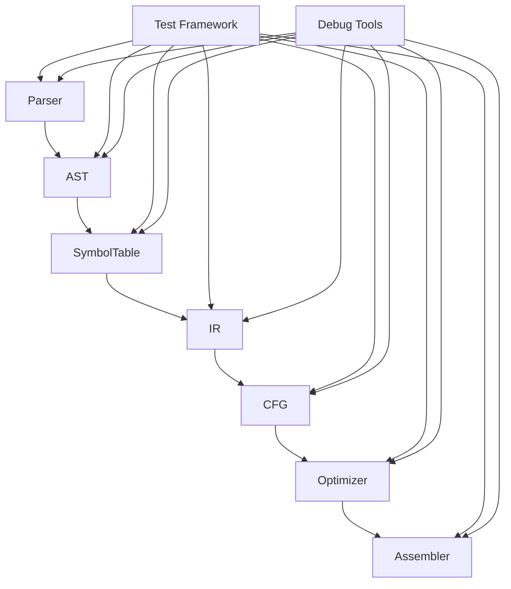
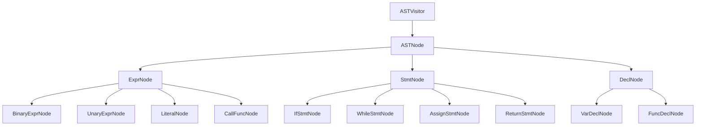
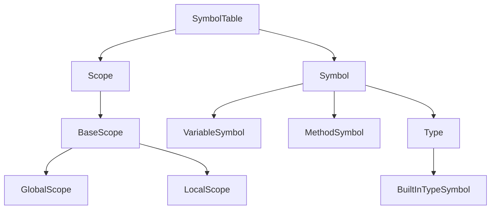
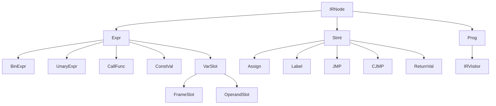
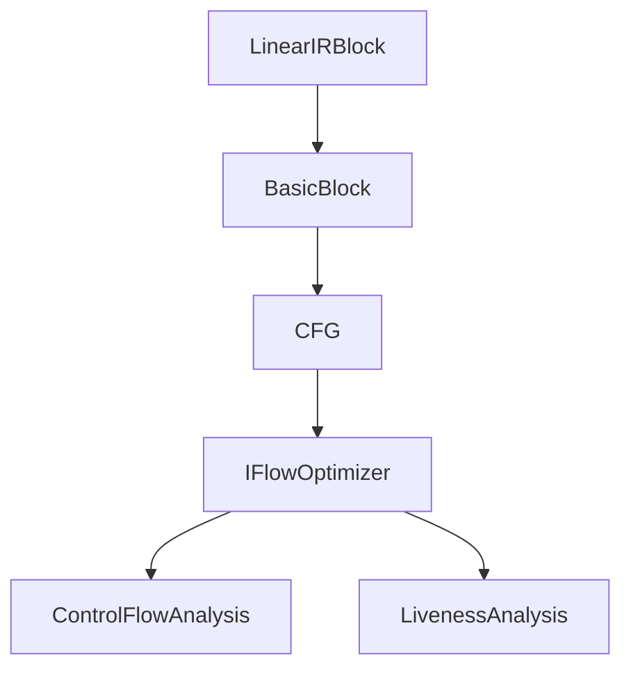
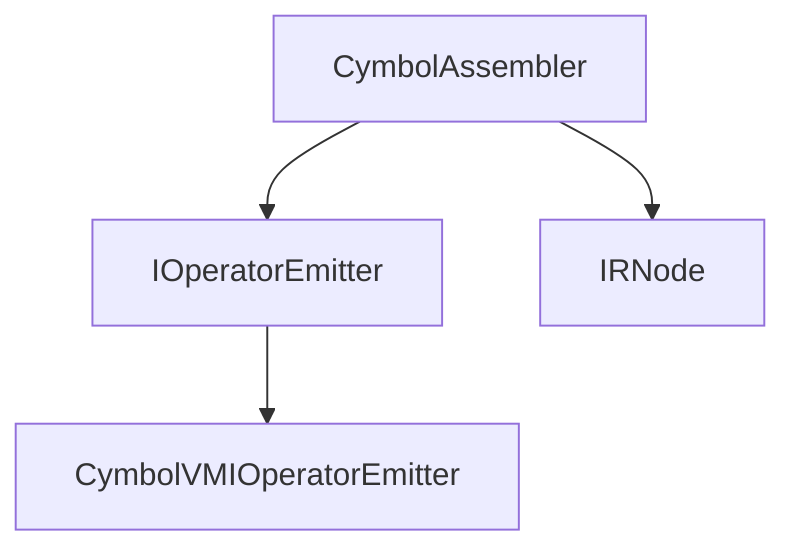

# EP20模块交互图

## 1. 核心模块依赖关系



## 2. AST模块内部交互



## 3. 符号表模块内部交互



## 4. IR模块内部交互



## 5. CFG模块内部交互



## 6. 代码生成模块内部交互



## 7. 测试模块与核心模块交互

```mermaid
graph TD
    A[Test Classes] --> B[AST Tests]
    A --> C[IR Tests]
    A --> D[CFG Tests]
    A --> E[Codegen Tests]
    
    B --> F[ASTNode]
    C --> G[IRNode]
    D --> H[BasicBlock]
    D --> I[CFG]
    E --> J[CymbolAssembler]
    
    K[Mockito] --> A
    L[JUnit] --> A
    M[AssertJ] --> A