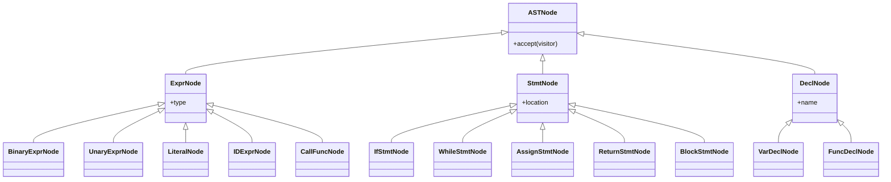
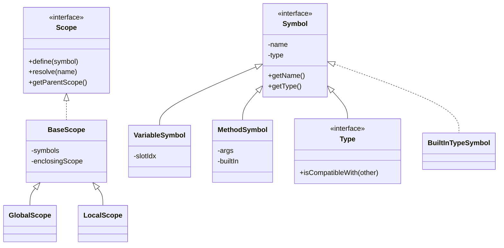
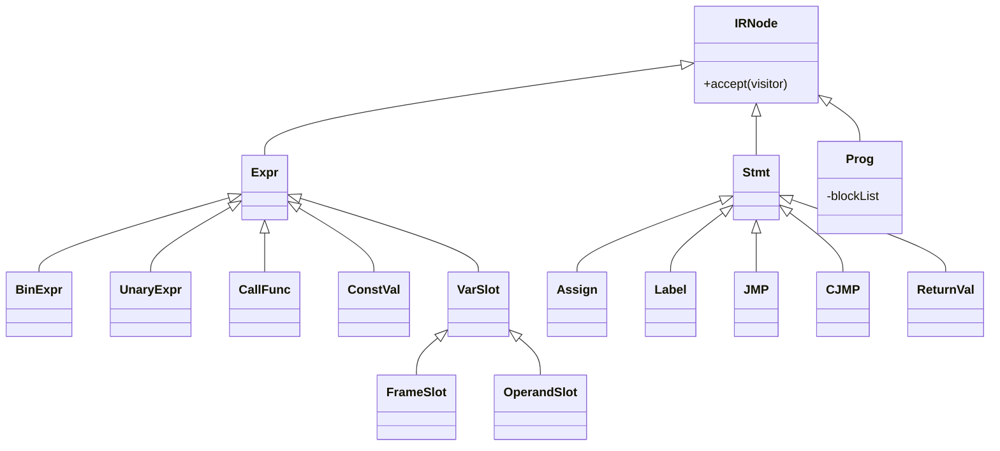
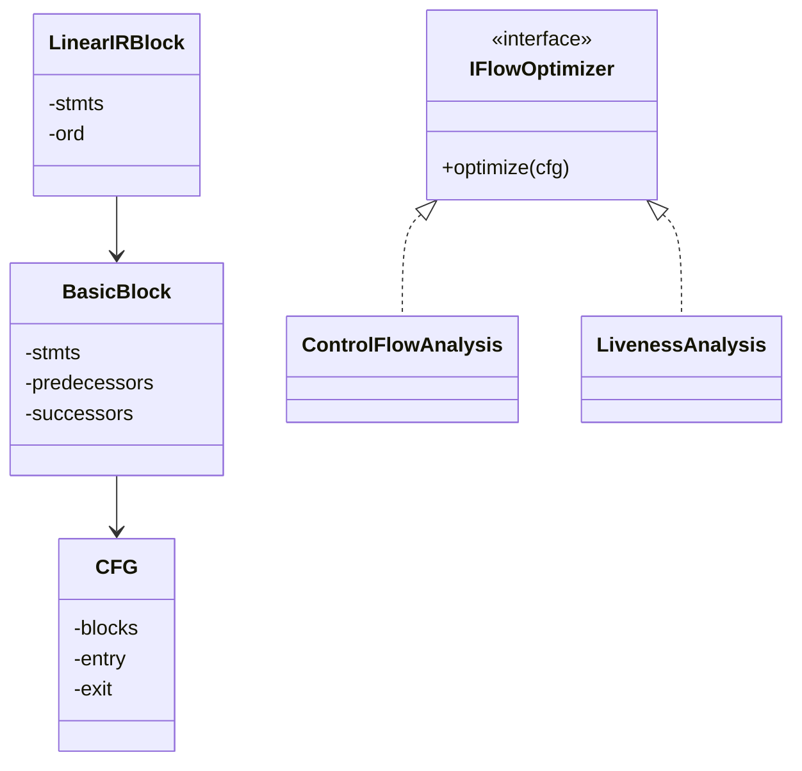
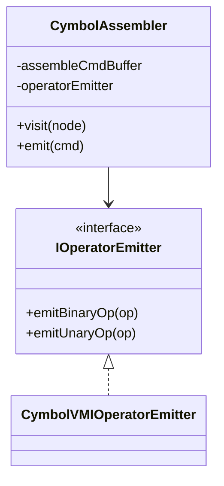
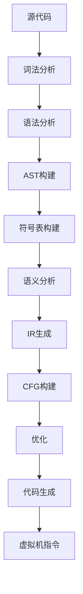

# EP20 Cymbol编译器项目架构文档

## 1. 项目概述

EP20 Cymbol编译器是一个基于ANTLR4的编译器项目，实现了从Cymbol语言源代码到虚拟机指令的完整编译流程。项目采用模块化设计，分为词法分析、语法分析、AST构建、语义分析、中间表示(IR)生成、控制流图(CFG)构建、优化和代码生成等阶段。

## 2. 项目结构

```
ep20/
├── src/
│   ├── main/
│   │   ├── java/
│   │   │   └── org/teachfx/antlr4/ep20/
│   │   │       ├── ast/                 # 抽象语法树节点
│   │   │       ├── ir/                  # 中间表示(IR)节点
│   │   │       ├── parser/              # ANTLR4生成的解析器
│   │   │       ├── pass/                # 编译器各阶段处理
│   │   │       ├── symtab/              # 符号表实现
│   │   │       └── utils/               # 工具类
│   │   └── resources/
│   └── test/
│       └── java/
│           └── org/teachfx/antlr4/ep20/
│               ├── ast/                 # AST节点测试
│               ├── ir/                  # IR节点测试
│               └── pass/                # 编译器各阶段测试
└── docs/                                # 文档
```

## 3. 核心模块设计

### 3.1 AST模块 (Abstract Syntax Tree)

#### 3.1.1 类结构图


#### 3.1.2 主要类说明
- `ASTNode`: 所有AST节点的基类，实现访问者模式
- `ExprNode`: 表达式节点基类
- `StmtNode`: 语句节点基类
- `DeclNode`: 声明节点基类

### 3.2 符号表模块 (Symbol Table)

#### 3.2.1 类结构图


### 3.3 中间表示模块 (Intermediate Representation)

#### 3.3.1 类结构图


### 3.4 控制流图模块 (Control Flow Graph)

#### 3.4.1 类结构图


### 3.5 代码生成模块 (Code Generation)

#### 3.5.1 类结构图


## 4. 编译流程

### 4.1 整体流程图


### 4.2 各阶段详细说明

#### 4.2.1 词法分析和语法分析
- 使用ANTLR4生成词法分析器和语法分析器
- 输入：Cymbol源代码
- 输出：解析树(Parse Tree)

#### 4.2.2 AST构建
- 类：`CymbolASTBuilder`
- 输入：解析树
- 输出：抽象语法树(AST)

#### 4.2.3 符号表构建
- 类：`LocalDefine`
- 输入：AST
- 输出：符号表

#### 4.2.4 语义分析
- 类：`TypeChecker`
- 输入：AST和符号表
- 输出：类型检查结果

#### 4.2.5 IR生成
- 类：`CymbolIRBuilder`
- 输入：AST
- 输出：中间表示(IR)

#### 4.2.6 CFG构建
- 类：`CFGBuilder`
- 输入：IR
- 输出：控制流图(CFG)

#### 4.2.7 优化
- 类：`ControlFlowAnalysis`, `LivenessAnalysis`
- 输入：CFG
- 输出：优化后的CFG

#### 4.2.8 代码生成
- 类：`CymbolAssembler`
- 输入：优化后的IR
- 输出：虚拟机指令

## 5. 设计模式应用

### 5.1 访问者模式
- 应用于AST、IR等节点的遍历处理
- 优点：解耦数据结构和操作

### 5.2 工厂模式
- 应用于IR节点的创建
- 优点：统一创建接口，便于扩展

### 5.3 策略模式
- 应用于操作符发射器
- 优点：支持不同的代码生成策略

## 6. 测试架构

### 6.1 测试层次
```
测试/
├── 单元测试/              # 类级别测试
├── 集成测试/              # 模块间交互测试
└── 端到端测试/            # 完整编译流程测试
```

### 6.2 测试策略
- 使用JUnit 5作为测试框架
- 使用Mockito进行模拟对象测试
- 使用AssertJ进行断言

## 7. 性能优化

### 7.1 内存优化
- 使用对象池减少对象创建开销
- 及时释放不需要的对象引用

### 7.2 算法优化
- 使用高效的图算法进行CFG构建和优化
- 使用增量更新减少重复计算

## 8. 扩展性设计

### 8.1 插件化架构
- 通过接口定义扩展点
- 支持自定义优化器和代码生成器

### 8.2 配置化
- 通过配置文件控制编译器行为
- 支持不同的目标平台

## 9. 错误处理

### 9.1 错误分类
- 词法错误
- 语法错误
- 语义错误
- 类型错误

### 9.2 错误报告
- 提供详细的错误位置信息
- 支持多错误同时报告

## 10. 调试支持

### 10.1 调试接口
- 提供AST、IR、CFG的可视化接口
- 支持中间结果的输出和检查

### 10.2 日志系统
- 使用Log4j进行日志记录
- 支持不同级别的日志输出