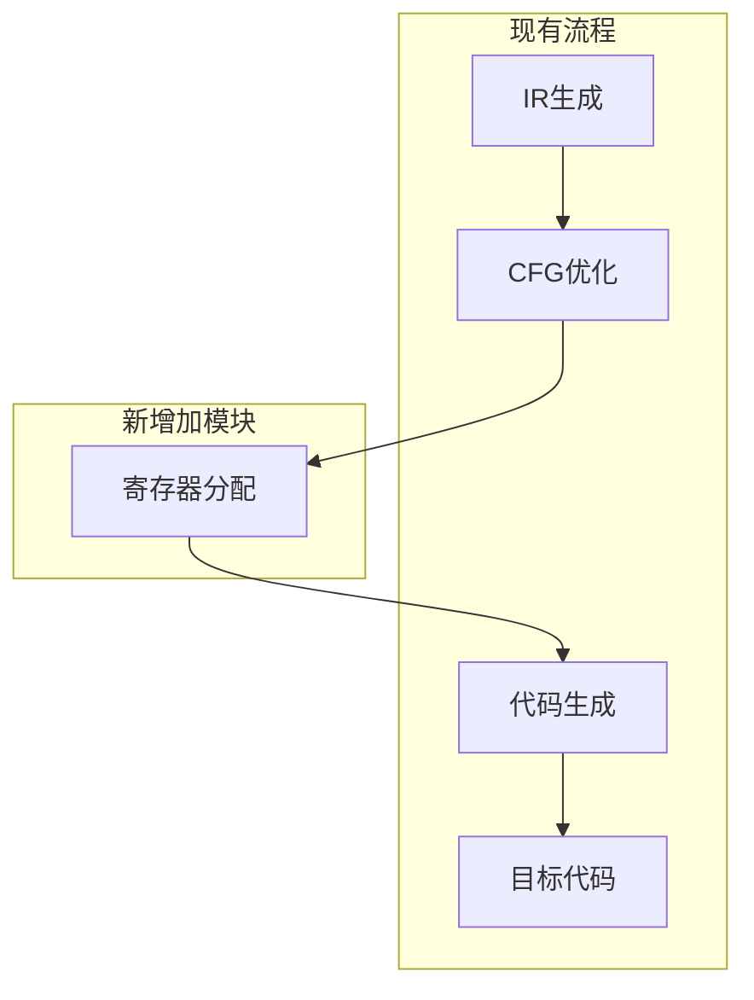

# EP20寄存器分配集成设计文档

## 1. 集成概述

本文档详细描述如何将寄存器分配模块集成到EP20编译器的现有架构中，包括流程集成、接口适配、配置管理和错误处理。

## 2. 编译流程集成

### 2.1 现有编译流程分析

当前EP20编译器的核心流程在[`Compiler.java`](ep20/src/main/java/org/teachfx/antlr4/ep20/Compiler.java:74)中：

```java
// 当前编译流程（简化）
astRoot.accept(irBuilder);
irBuilder.prog.optimizeBasicBlock();

Stream.of(StreamUtils.indexStream(irBuilder.prog.blockList.stream()
                .map(irBuilder::getCFG))
        .peek(cfgPair -> {
            var cfg = cfgPair.getRight();
            cfg.addOptimizer(new ControlFlowAnalysis<>());
            cfg.applyOptimizers();
        })
        .map(Pair::getRight)
        .map(CFG::getIRNodes)
        .reduce(new ArrayList<IRNode>(), (a, b) -> {
            a.addAll(b);
            return a;
        }))
.map(irNodeList -> {
    var assembler = new CymbolAssembler();
    assembler.visit(irNodeList);
    return assembler;
})
```

### 2.2 集成点设计

寄存器分配将在CFG优化之后、代码生成之前插入：



### 2.3 具体集成代码

```java
// 修改后的编译流程
Stream.of(StreamUtils.indexStream(irBuilder.prog.blockList.stream()
                .map(irBuilder::getCFG))
        .peek(cfgPair -> {
            var cfg = cfgPair.getRight();
            cfg.addOptimizer(new ControlFlowAnalysis<>());
            cfg.applyOptimizers();
        })
        .map(Pair::getRight)
        .map(CFG::getIRNodes)
        .reduce(new ArrayList<IRNode>(), (a, b) -> {
            a.addAll(b);
            return a;
        }))
.map(irNodeList -> {
    // 新增寄存器分配阶段
    RegisterAllocator allocator = createRegisterAllocator();
    List<IRNode> allocatedIR = allocator.allocate(irNodeList, 8);
    
    var assembler = new CymbolAssembler();
    assembler.visit(allocatedIR);
    return assembler;
})
```

## 3. 配置管理集成

### 3.1 配置选项设计

```java
/**
 * 寄存器分配配置类
 */
public class RegisterAllocationConfig {
    
    // 是否启用寄存器分配
    private boolean enabled = true;
    
    // 可用寄存器数量
    private int registerCount = 8;
    
    // 溢出处理策略
    private SpillStrategy spillStrategy = SpillStrategy.COST_BASED;
    
    // 调试选项
    private boolean enableDebugOutput = false;
    private DebugLevel debugLevel = DebugLevel.INFO;
    
    // 性能优化选项
    private boolean enableOptimizations = true;
    private int maxSpillIterations = 10;
    
    // Getter和Setter方法
    public boolean isEnabled() { return enabled; }
    public void setEnabled(boolean enabled) { this.enabled = enabled; }
    // ... 其他getter/setter
}
```

### 3.2 配置文件集成

在`application.properties`中添加配置选项：

```properties
# 寄存器分配配置
compiler.register-allocation.enabled=true
compiler.register-allocation.register-count=8
compiler.register-allocation.spill-strategy=COST_BASED
compiler.register-allocation.debug-enabled=false
compiler.register-allocation.max-spill-iterations=10
```

### 3.3 命令行参数集成

```java
// 在Compiler.java中添加命令行参数解析
@Option(names = {"--no-register-allocation"}, 
        description = "禁用寄存器分配优化")
private boolean disableRegisterAllocation = false;

@Option(names = {"--register-count"}, 
        description = "设置可用寄存器数量")
private int registerCount = 8;
```

## 4. 代码生成器适配

### 4.1 CymbolAssembler改造

当前[`CymbolAssembler`](ep20/src/main/java/org/teachfx/antlr4/ep20/pass/codegen/CymbolAssembler.java:132)使用FrameSlot：

```java
@Override
public Void visit(FrameSlot frameSlot) {
    emit("load %d".formatted(frameSlot.getSlotIdx()));
    return null;
}
```

需要改造为支持寄存器映射：

```java
@Override
public Void visit(FrameSlot frameSlot) {
    Integer register = registerMap.get(frameSlot);
    if (register != null) {
        // 使用寄存器访问
        emit("rload %d".formatted(register));
    } else {
        // 回退到内存访问
        emit("load %d".formatted(frameSlot.getSlotIdx()));
    }
    return null;
}
```

### 4.2 寄存器感知的指令生成

```java
/**
 * 寄存器感知的代码生成器
 */
public class RegisterAwareAssembler extends CymbolAssembler {
    
    private final Map<Operand, Integer> registerMap;
    
    public RegisterAwareAssembler(Map<Operand, Integer> registerMap) {
        this.registerMap = registerMap;
    }
    
    @Override
    public Void visit(Assign assign) {
        assign.getRhs().accept(this);
        
        if (assign.getLhs() instanceof FrameSlot frameSlot) {
            Integer register = registerMap.get(frameSlot);
            if (register != null) {
                emit("rstore %d".formatted(register));
            } else {
                emit("store %d".formatted(frameSlot.getSlotIdx()));
            }
        }
        return null;
    }
}
```

## 5. 错误处理集成

### 5.1 异常处理设计

```java
/**
 * 寄存器分配异常处理
 */
public class RegisterAllocationExceptionHandler {
    
    public static List<IRNode> handleAllocationFailure(
            RegisterAllocationException e,
            List<IRNode> originalIR) {
        
        logger.warn("寄存器分配失败，回退到栈帧模式: {}", e.getMessage());
        
        // 记录详细诊断信息
        if (e instanceof GraphColoringException gce) {
            logger.debug("冲突图信息: {}", gce.getConflictGraph().toGraphviz());
            logger.debug("可用寄存器数: {}", gce.getRegisterCount());
        }
        
        // 返回原始IR，使用栈帧模式
        return originalIR;
    }
}
```

### 5.2 集成到主流程

```java
.map(irNodeList -> {
    try {
        RegisterAllocator allocator = createRegisterAllocator();
        List<IRNode> allocatedIR = allocator.allocate(irNodeList, 8);
        
        var assembler = new RegisterAwareAssembler(
            allocator.getAllocationResult().getRegisterMap());
        assembler.visit(allocatedIR);
        return assembler;
    } catch (RegisterAllocationException e) {
        return RegisterAllocationExceptionHandler.handleAllocationFailure(
            e, irNodeList);
    }
})
```

## 6. 性能监控集成

### 6.1 监控指标收集

```java
/**
 * 寄存器分配性能监控
 */
public class AllocationPerformanceMonitor {
    
    private final Map<String, AllocationMetrics> metrics = new HashMap<>();
    
    public void recordAllocation(String functionName, 
                               AllocationResult result,
                               long duration) {
        AllocationMetrics metric = new AllocationMetrics();
        metric.functionName = functionName;
        metric.duration = duration;
        metric.spillCount = result.getSpilledOperands().size();
        metric.success = result.isSuccess();
        
        metrics.put(functionName, metric);
    }
    
    public void printSummary() {
        // 输出性能摘要
        logger.info("寄存器分配性能摘要:");
        metrics.values().forEach(metric -> {
            logger.info("函数 {}: 耗时 {}ms, 溢出变量 {}, 状态 {}",
                metric.functionName, metric.duration, 
                metric.spillCount, metric.success ? "成功" : "失败");
        });
    }
}
```

### 6.2 集成到分配流程

```java
public List<IRNode> allocate(List<IRNode> irNodes, int registerCount) {
    long startTime = System.currentTimeMillis();
    
    try {
        AllocationResult result = doAllocation(irNodes, registerCount);
        long endTime = System.currentTimeMillis();
        
        performanceMonitor.recordAllocation(
            getFunctionName(irNodes), result, endTime - startTime);
        
        return applyAllocation(irNodes, result);
    } catch (Exception e) {
        long endTime = System.currentTimeMillis();
        performanceMonitor.recordFailure(
            getFunctionName(irNodes), endTime - startTime, e);
        throw e;
    }
}
```

## 7. 可视化调试集成

### 7.1 冲突图可视化

```java
/**
 * 冲突图可视化输出
 */
public class ConflictGraphVisualizer {
    
    public static void visualize(ConflictGraph graph, String suffix) {
        if (!config.isEnableDebugOutput()) {
            return;
        }
        
        String graphviz = graph.toGraphviz();
        saveToEp20Res(graphviz, "conflict_graph_" + suffix);
    }
}
```

### 7.2 集成到分配流程

```java
public AllocationResult doAllocation(List<IRNode> irNodes, int registerCount) {
    // 构建冲突图
    ConflictGraph graph = buildConflictGraph(irNodes);
    ConflictGraphVisualizer.visualize(graph, "initial");
    
    // 执行图着色
    Map<Operand, Integer> coloring = colorGraph(graph, registerCount);
    
    // 可视化着色结果
    if (config.isEnableDebugOutput()) {
        visualizeColoring(graph, coloring, "final");
    }
    
    return new AllocationResult(coloring);
}
```

## 8. 向后兼容性保证

### 8.1 兼容模式设计

```java
/**
 * 兼容性模式处理器
 */
public class CompatibilityModeHandler {
    
    public static List<IRNode> ensureCompatibility(List<IRNode> irNodes) {
        // 检查IR节点是否包含寄存器分配相关指令
        if (containsRegisterInstructions(irNodes)) {
            // 如果包含，确保代码生成器支持
            return irNodes;
        } else {
            // 如果不包含，使用原始栈帧模式
            return convertToStackMode(irNodes);
        }
    }
    
    private static boolean containsRegisterInstructions(List<IRNode> irNodes) {
        return irNodes.stream()
            .anyMatch(node -> node.toString().contains("rload") ||
                             node.toString().contains("rstore"));
    }
}
```

### 8.2 配置驱动的兼容性

```java
public class RegisterAllocatorFactory {
    
    public static RegisterAllocator createAllocator() {
        if (!config.isEnabled()) {
            return new NoOpRegisterAllocator();
        }
        
        switch (config.getMode()) {
            case "AGGRESSIVE":
                return new AggressiveRegisterAllocator(config);
            case "CONSERVATIVE":
                return new ConservativeRegisterAllocator(config);
            case "COMPATIBILITY":
                return new CompatibilityRegisterAllocator(config);
            default:
                return new DefaultRegisterAllocator(config);
        }
    }
}
```

## 9. 部署和运维集成

### 9.1 健康检查集成

```java
/**
 * 寄存器分配健康检查
 */
public class RegisterAllocationHealthCheck implements HealthCheck {
    
    @Override
    public HealthCheckResult check() {
        try {
            // 执行简单的分配测试
            testAllocation();
            return HealthCheckResult.healthy();
        } catch (Exception e) {
            return HealthCheckResult.unhealthy(e);
        }
    }
    
    private void testAllocation() {
        // 简单的测试用例验证功能正常
        List<IRNode> testIR = createTestIR();
        RegisterAllocator allocator = createRegisterAllocator();
        allocator.allocate(testIR, 4);
    }
}
```

### 9.2 监控仪表板集成

```java
/**
 * 寄存器分配监控端点
 */
@RestController
@RequestMapping("/api/register-allocation")
public class RegisterAllocationMonitorController {
    
    @GetMapping("/metrics")
    public AllocationMetrics getMetrics() {
        return performanceMonitor.getMetrics();
    }
    
    @GetMapping("/config")
    public RegisterAllocationConfig getConfig() {
        return config;
    }
    
    @PostMapping("/config")
    public void updateConfig(@RequestBody RegisterAllocationConfig newConfig) {
        config.updateFrom(newConfig);
    }
}
```

## 10. 迁移和升级策略

### 10.1 渐进式启用策略

1. **阶段1**: 在测试环境中启用，收集性能数据
2. **阶段2**: 在开发环境中默认启用，监控稳定性
3. **阶段3**: 在生产环境中逐步启用，按函数粒度控制
4. **阶段4**: 全面启用，优化配置参数

### 10.2 回滚策略

- 保持原有栈帧分配代码完整
- 通过配置开关快速切换
- 提供详细的性能对比数据
- 确保零 downtime 回滚能力

## 11. 总结

本集成设计文档提供了将寄存器分配模块集成到EP20编译器的完整方案，包括流程集成、配置管理、错误处理、性能监控和运维支持。通过系统化的设计，确保新功能的稳定性、可维护性和可扩展性。

实施过程中建议采用渐进式部署策略，密切监控性能指标，确保平稳过渡。