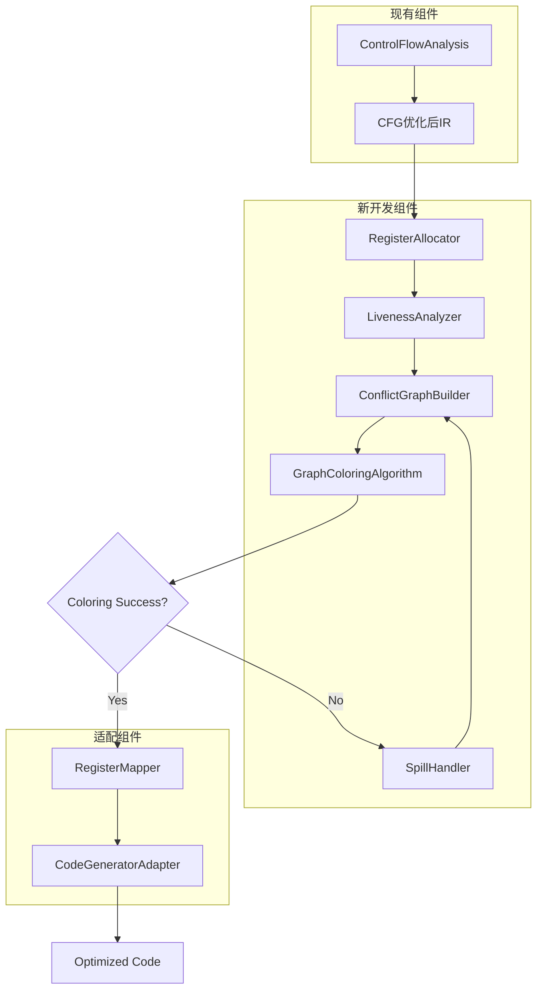

# EP20寄存器着色优化设计文档

## 1. 项目概述

本文档旨在为EP20 Cymbol编译器实现图着色寄存器分配优化提供详细的技术设计和实施计划。寄存器着色是编译器优化中的关键阶段，通过将虚拟寄存器映射到物理寄存器，减少内存访问，提升代码执行效率。

## 2. 当前架构分析

### 2.1 现有编译流程
```
源代码 → 词法分析 → 语法分析 → AST构建 → 符号表 → 类型检查 → IR生成 → CFG构建 → 优化 → 代码生成
```

### 2.2 当前寄存器管理
- 使用基于栈帧的虚拟寄存器（FrameSlot）
- 每个变量分配固定的栈帧位置
- 代码生成阶段使用`load`/`store`指令访问内存
- 缺乏物理寄存器分配和重用机制

### 2.3 技术债务
- 文档中提到的寄存器分配功能未实际实现
- 性能瓶颈：频繁的内存访问操作
- 扩展性限制：无法支持多寄存器架构

## 3. 技术需求

### 3.1 功能需求
- 实现图着色寄存器分配算法
- 支持活性分析和冲突图构建
- 处理寄存器溢出和重载
- 保持与现有架构的兼容性

### 3.2 性能需求
- 减少30%以上的内存访问指令
- 编译时间增加不超过20%
- 支持至少8个物理寄存器的分配

### 3.3 质量需求
- 100%测试覆盖率核心算法
- 支持可视化调试和性能监控
- 提供详细的错误处理和日志

## 4. 系统架构设计

### 4.1 整体架构图



### 4.2 组件详细设计

#### 4.2.1 RegisterAllocator (入口类)
- 职责：协调寄存器分配全过程
- 接口：
  ```java
  public class RegisterAllocator {
      public List<IRNode> allocate(List<IRNode> irNodes, int registerCount);
      public AllocationResult getAllocationResult();
      public void setSpillStrategy(SpillStrategy strategy);
  }
  ```

#### 4.2.2 LivenessAnalyzer (活性分析器)
- 扩展现有活性分析支持寄存器变量
- 实现跨基本块的活性分析
- 生成活性区间和use-def链

#### 4.2.3 ConflictGraphBuilder (冲突图构建器)
- 构建冲突图数据结构
- 节点：虚拟寄存器变量
- 边：变量间的冲突关系
- 支持动态图操作和可视化

#### 4.2.4 GraphColoringAlgorithm (图着色算法)
- 实现标准图着色算法
- 支持简化(Simplification)和选择(Selection)阶段
- 包含启发式着色策略

#### 4.2.5 SpillHandler (溢出处理器)
- 处理寄存器溢出情况
- 实现溢出变量选择算法
- 生成溢出代码和栈帧管理

#### 4.2.6 RegisterMapper (寄存器映射器)
- 管理虚拟到物理寄存器映射
- 处理调用约定和寄存器保存
- 提供寄存器分配查询接口

## 5. 数据结构设计

### 5.1 冲突图数据结构
```java
public class ConflictGraph {
    private Map<Operand, Set<Operand>> adjacencyList;
    private Map<Operand, Integer> degreeMap;
    private Set<Operand> precoloredNodes;
    
    public void addEdge(Operand op1, Operand op2);
    public void removeNode(Operand op);
    public int getDegree(Operand op);
    public Set<Operand> getNeighbors(Operand op);
}
```

### 5.2 寄存器分配结果
```java
public class AllocationResult {
    private Map<Operand, Integer> registerMap;
    private List<Operand> spilledOperands;
    private int spillCost;
    private boolean success;
    
    public int getRegister(Operand op);
    public boolean isSpilled(Operand op);
}
```

## 6. 算法实现细节

### 6.1 图着色算法流程
```
1. 构建冲突图
2. 简化阶段：移除低度节点
3. 选择阶段：分配寄存器颜色
4. 如果失败：选择溢出变量，重新开始
5. 成功：生成寄存器映射
```

### 6.2 溢出处理策略
- 基于启发式的溢出成本计算
- 优先溢出使用频率低的变量
- 考虑循环嵌套层次的权重

### 6.3 寄存器分配策略
- 通用寄存器：r0-r7（8个）
- 保留寄存器：r7（栈帧指针）
- 调用约定：调用者保存r0-r3，被调用者保存r4-r6

## 7. 集成点设计

### 7.1 编译器主流程修改
```java
// 在Compiler.java中插入寄存器分配阶段
CFG cfg = // 获取优化后的CFG
List<IRNode> irNodes = cfg.getIRNodes();

// 新增寄存器分配阶段
RegisterAllocator allocator = new RegisterAllocator(8); // 8个寄存器
List<IRNode> optimizedIR = allocator.allocate(irNodes);

// 继续代码生成
CymbolAssembler assembler = new CymbolAssembler();
assembler.visit(optimizedIR);
```

### 7.2 代码生成器适配
- 修改`CymbolAssembler`支持物理寄存器
- 更新`visit(FrameSlot)`方法使用寄存器映射
- 处理寄存器溢出时的内存访问

## 8. 测试策略

### 8.1 单元测试
- 冲突图构建和操作测试
- 图着色算法正确性测试
- 溢出处理逻辑测试

### 8.2 集成测试
- 端到端编译流程测试
- 性能对比测试（优化前后）
- 边界条件和大规模测试

### 8.3 性能测试
- 编译时间性能监控
- 生成代码执行效率测试
- 内存使用分析

## 9. 实施路线图

### 阶段1：核心算法实现（3天）
- 完成冲突图数据结构和图着色算法
- 实现基本的寄存器分配逻辑
- 编写单元测试框架

### 阶段2：集成与适配（2天）
- 集成到编译器主流程
- 适配代码生成器支持寄存器
- 实现基本的溢出处理

### 阶段3：优化与测试（3天）
- 优化算法性能和内存使用
- 完成全面测试覆盖
- 性能调优和基准测试

### 阶段4：文档与部署（2天）
- 编写用户文档和API文档
- 部署到生产环境
- 监控和维护计划

## 10. 风险与缓解

### 10.1 技术风险
- **风险**：图着色算法复杂度高
- **缓解**：采用渐进式实现，先实现基本功能再优化

### 10.2 集成风险
- **风险**：与现有代码兼容性问题
- **缓解**：保持接口兼容，逐步替换原有逻辑

### 10.3 性能风险
- **风险**：编译时间增加过多
- **缓解**：优化算法实现，添加性能监控

## 11. 结论

本设计文档为EP20编译器实现寄存器着色优化提供了完整的技术方案。通过系统化的架构设计和详细的实施计划，将显著提升编译器性能并为后续优化奠定基础。

实施过程中将采用测试驱动开发(TDD)方法，确保代码质量和功能正确性。