# EP20模块交互图

## 1. 核心模块依赖关系

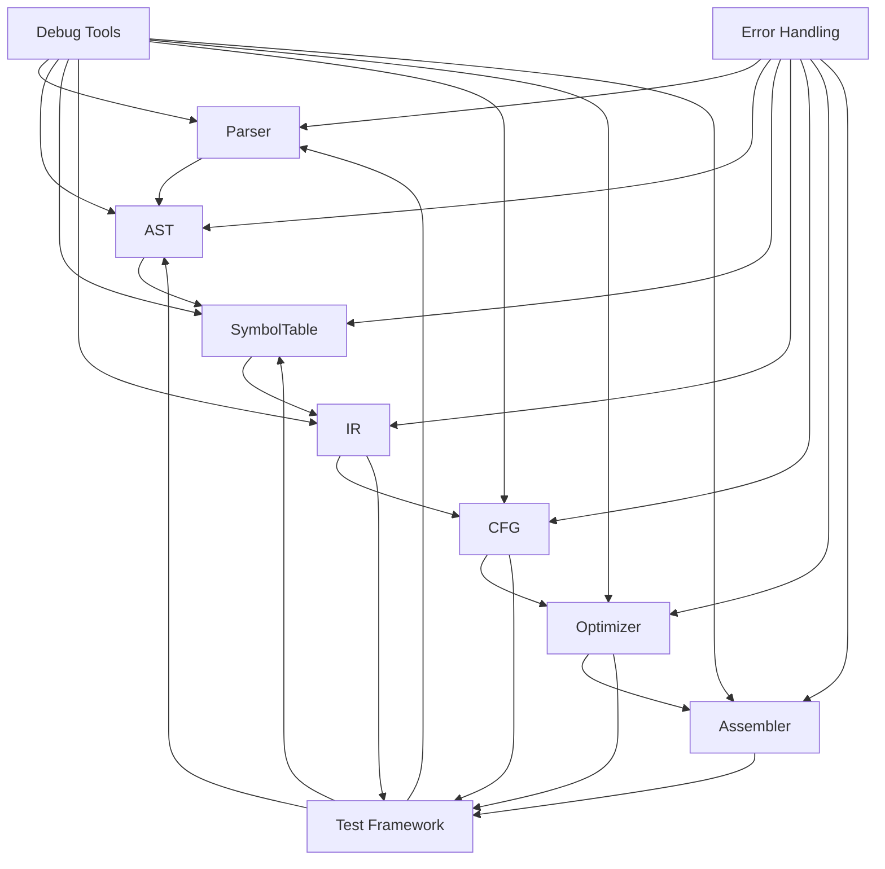

## 2. AST模块内部交互

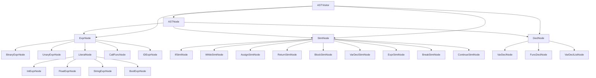

## 3. 符号表模块内部交互

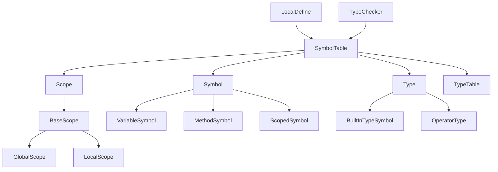

## 4. IR模块内部交互

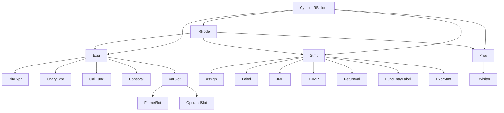

## 5. CFG模块内部交互

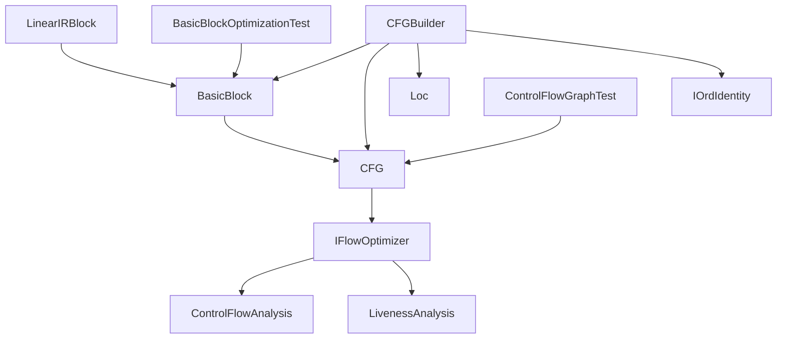

## 6. 代码生成模块内部交互

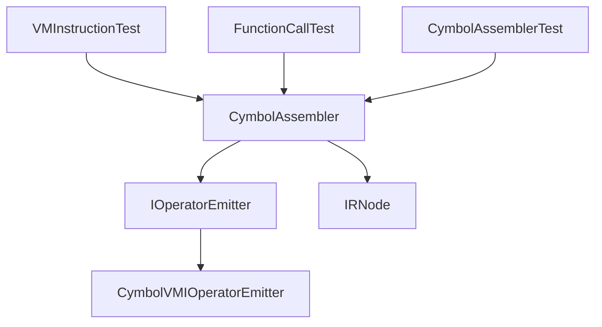

## 7. 测试模块与核心模块交互

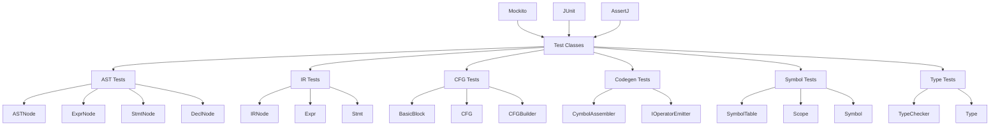

## 8. 调试模块与核心模块交互

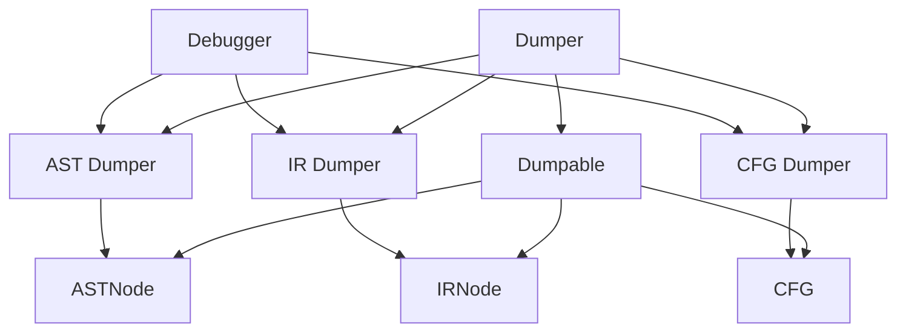

## 9. 错误处理模块交互

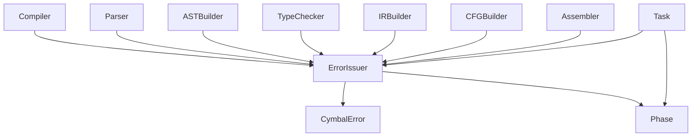

## 10. 驱动模块交互

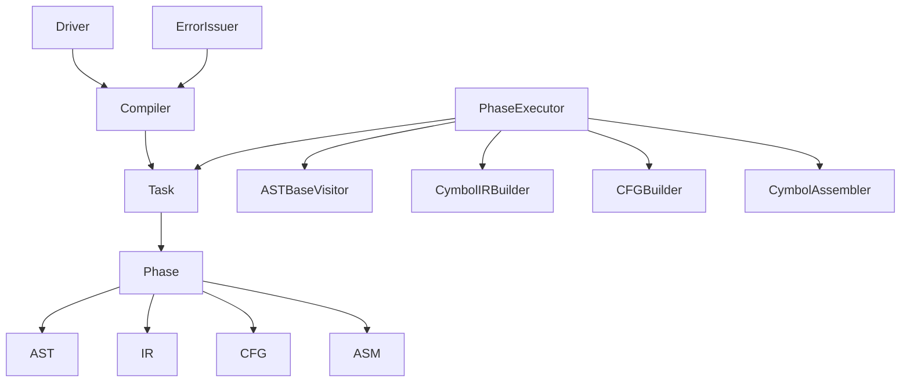

## 11. 工具模块交互

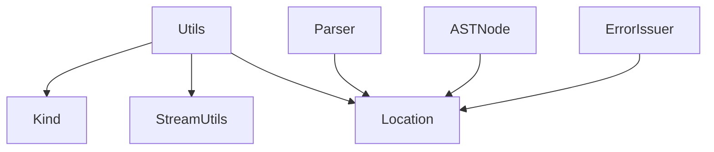

## 12. 类型系统模块交互

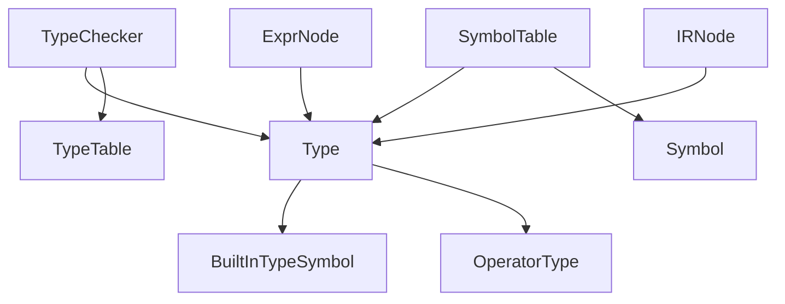

## 13. 数据流分析模块交互

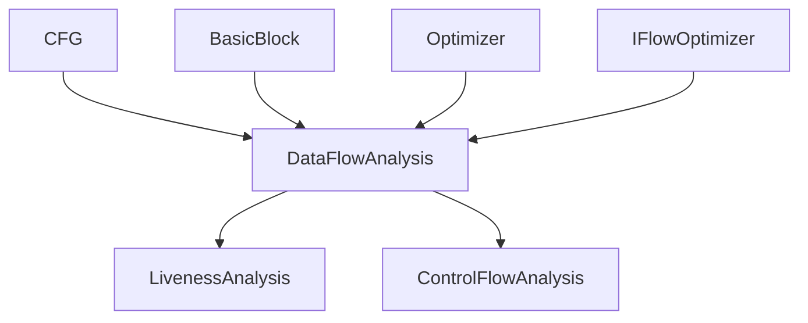

## 14. 完整编译流程模块交互

```mermaid
graph TD
    A[Source Code] --> B[Lexer]
    B --> C[Parser]
    C --> D[ASTBuilder]
    D --> E[LocalDefine]
    E --> F[TypeChecker]
    F --> G[CymbolIRBuilder]
    G --> H[CFGBuilder]
    H --> I[ControlFlowAnalysis]
    I --> J[LivenessAnalysis]
    J --> K[CymbolAssembler]
    K --> L[VM Instructions]
    
    M[Test Framework] --> C
    M --> D
    M --> E
    M --> F
    M --> G
    M --> H
    M --> I
    M --> J
    M --> K
    
    N[Debug Tools] --> D
    N --> G
    N --> H
    N --> K