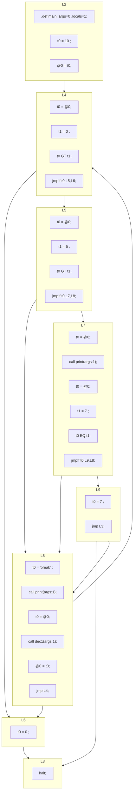

```mermaid
graph TD
subgraph L9
Q0["t0 =  7 ;"]
Q1["jmp L3;"]
end
subgraph L8
Q2["t0 =  'break' ;"]
Q3["call print(args:1);"]
Q4["t0 = @0;"]
Q5["call dec1(args:1);"]
Q6["@0 = t0;"]
Q7["jmp L4;"]
end
subgraph L7
Q8["t0 = @0;"]
Q9["call print(args:1);"]
Q10["t0 = @0;"]
Q11["t1 =  7 ;"]
Q12["t0 EQ t1;"]
Q13["jmpIf t0,L9,L8;"]
end
subgraph L6
Q14["t0 =  0 ;"]
end
subgraph L5
Q15["t0 = @0;"]
Q16["t1 =  5 ;"]
Q17["t0 GT t1;"]
Q18["jmpIf t0,L7,L8;"]
end
subgraph L4
Q19["t0 = @0;"]
Q20["t1 =  0 ;"]
Q21["t0 GT t1;"]
Q22["jmpIf t0,L5,L6;"]
end
subgraph L3
Q23["halt;"]
end
subgraph L2
Q24[".def main: args=0 ,locals=1;"]
Q25["t0 =  10 ;"]
Q26["@0 = t0;"]
end
L2 --> L4
L4 --> L6
L4 --> L5
L5 --> L8
L5 --> L7
L7 --> L8
L7 --> L9
L9 --> L3
L9 --> L8
L8 --> L4
L8 --> L6
L6 --> L3

```
