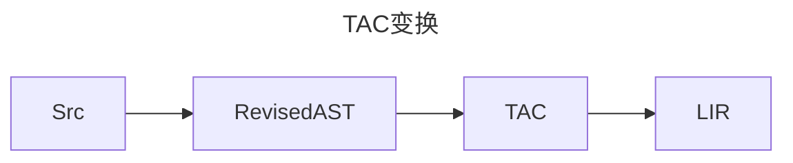

# 静态分析基础

## 编译目标变化
换成x86指令的寄存器机器，当然是化简的。

## TAC
本章重点是`三地址码`构造。

### TAC变换



## 控制流程图

```mermaid
graph TD
    subgraph 基本块1
    L1[标签 L1]
    JMP[跳转指令]
    end
    subgraph 基本块2
    CJMP[条件跳转]
    end
    L1 --> JMP
    JMP --> thenBlock
    CJMP -->|条件真| then
    CJMP -->|条件假| other
  ```

## 🆕 新增功能

### 1. MIR/LIR体系

EP21现在支持分层中间表示：
- **MIR (Medium-level Intermediate Representation)**: 中层IR，更接近源代码抽象
- **LIR (Low-level Intermediate Representation)**: 低层IR，更接近目标机器代码

#### 核心类
- `MIRNode`: MIR节点基类
- `LIRNode`: LIR节点基类  
- `MIRFunction`: MIR函数表示
- `LIRAssign`: LIR赋值指令
- `MIRStmt`: MIR语句基类
- `MIRExpr`: MIR表达式基类

#### 使用示例
```java
// 创建MIR函数
MIRFunction func = new MIRFunction("testFunc");

// 创建MIR赋值语句
MIRExpr source = new MIRExpr() {...}; // 实现具体表达式
MIRAssignStmt assign = new MIRAssignStmt("result", source);

// 创建LIR赋值指令
LIRAssign lirAssign = new LIRAssign(target, source, 
    LIRAssign.RegisterType.REGISTER);
```

### 2. CFG可视化增强

现在支持多种格式的控制流图输出：
- **Mermaid格式**: 适合在Markdown中直接显示
- **DOT格式**: 适合Graphviz等专业工具

#### 输出文件
- `graph_X_origin.md`: 原始控制流图(Mermaid格式)
- `graph_X_origin.dot`: 原始控制流图(DOT格式)  
- `graph_X_optimized.md`: 优化后控制流图(Mermaid格式)
- `graph_X_optimized.dot`: 优化后控制流图(DOT格式)

### 3. 数据流分析框架

基于`Loc`类实现了完整的数据流分析框架：

#### 核心类
- `DataFlowFramework`: 数据流分析框架基类
- `LiveVariableAnalyzer`: 活跃变量分析器

#### 功能特性
- 活跃变量分析
- 基本块的liveIn/liveOut集合计算
- 指令级别的活跃性分析

#### 使用示例
```java
// 创建活跃变量分析器
LiveVariableAnalyzer analyzer = new LiveVariableAnalyzer(cfg);

// 执行分析
analyzer.analyze();

// 查看分析结果
analyzer.printAnalysisResult();
```

### 4. 理想图生成

实现SSA(静态单赋值)形式的理想图生成：

#### 核心类
- `SSAGraph`: SSA图生成器

#### 主要功能
- Φ函数自动插入
- 变量重命名
- SSA图的可视化输出

#### 使用示例
```java
// 创建SSA图
SSAGraph ssaGraph = new SSAGraph(cfg);

// 构建SSA图
ssaGraph.buildSSA();

// 生成可视化输出
String mermaid = ssaGraph.toMermaid();
String dot = ssaGraph.toDOT();
```

### 5. 测试验证

提供了完整的测试套件：

#### 测试类
- `SimpleTest`: 简化版测试类（无需JUnit）

#### 运行测试
```bash
# 编译项目
mvn clean compile

# 运行测试
mvn exec:java -Dexec.mainClass="org.teachfx.antlr4.ep21.test.SimpleTest"
```

## 代码结构

### 新增目录
```
src/main/java/org/teachfx/antlr4/ep21/
├── ir/
│   ├── mir/           # MIR相关类
│   │   ├── MIRNode.java
│   │   ├── MIRFunction.java
│   │   ├── MIRStmt.java
│   │   └── MIRExpr.java
│   └── lir/           # LIR相关类
│       ├── LIRNode.java
│       └── LIRAssign.java
├── analysis/
│   ├── dataflow/      # 数据流分析
│   │   ├── DataFlowFramework.java
│   │   └── LiveVariableAnalyzer.java
│   └── ssa/           # SSA分析
│       └── SSAGraph.java
└── test/              # 测试代码
    └── SimpleTest.java
```

## 编译流程

完整的编译流程现在包括：

1. **语法分析** → 解析树
2. **AST构建** → 抽象语法树
3. **符号表分析** → 作用域和符号信息
4. **IR生成** → 三地址码(TAC)
5. **MIR/LIR转换** → 分层中间表示
6. **基本块优化** → 优化TAC
7. **CFG构建和分析** → 控制流程图
8. **数据流分析** → 活跃变量分析
9. **SSA转换** → 静态单赋值形式
10. **代码生成** → 目标汇编代码

## DONE

```mermaid
graph TD
subgraph L0
Q0["t0 = @0;"]
Q1["t1 =  1 ;"]
Q2["t0 SUB t1;"]
Q3["jmp L1;"]
end
subgraph L1
Q4["ret;"]
end
subgraph L2
Q5["t0 =  10 ;"]
Q6["@0 = t0;"]
Q7["jmp L4;"]
end
subgraph L4
Q8["t0 = @0;"]
Q9["t1 =  0 ;"]
Q10["t0 GT t1;"]
Q11["jmpIf t0,L5,L6;"]
end
subgraph L5
Q12["t0 = @0;"]
Q13["t1 =  5 ;"]
Q14["t0 GT t1;"]
Q15["jmpIf t0,L7,L8;"]
end
subgraph L7
Q16["t0 = @0;"]
Q17["call print(args:1);"]
Q18["t0 = @0;"]
Q19["t1 =  7 ;"]
Q20["t0 EQ t1;"]
Q21["jmpIf t0,L9,L10;"]
end
subgraph L9
Q22["t0 =  7 ;"]
Q23["jmp L3;"]
end
subgraph L10
end
subgraph L8
Q24["t0 =  'break' ;"]
Q25["call print(args:1);"]
Q26["t0 = @0;"]
Q27["call dec1(args:1);"]
Q28["@0 = t0;"]
Q29["jmp L4;"]
end
subgraph L6
Q30["t0 =  0 ;"]
Q31["jmp L3;"]
end
subgraph L3
Q32["halt;"]
end

L0 --> L1
L2 --> L4
L4 --> L5
L4 --> L6
L5 --> L7
L5 --> L8
L7 --> L9
L7 --> L10
L9 --> L3
L9 --> L10
L10 --> L8
L8 --> L4
L8 --> L6
L6 --> L3