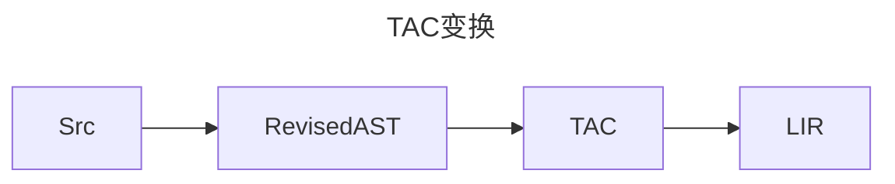

# 静态分析基础

## 编译目标变化
换成x86指令的寄存器机器，当然是化简的。

## TAC
本章重点是`三地址码`构造。

### TAC变换



## 控制流程图

```mermaid
graph TD
    subgraph 基本块1
    L1[标签 L1]
    JMP[跳转指令]
    end
    subgraph 基本块2
    CJMP[条件跳转]
    end
    L1 --> JMP
    JMP --> thenBlock
    CJMP -->|条件真| then
    CJMP -->|条件假| other
 ```


## DONE

```mermaid
graph TD
subgraph L0
Q0["t0 = @0;"]
Q1["t1 =  1 ;"]
Q2["t0 SUB t1;"]
Q3["jmp L1;"]
end
subgraph L1
Q4["ret;"]
end
subgraph L2
Q5["t0 =  10 ;"]
Q6["@0 = t0;"]
Q7["jmp L4;"]
end
subgraph L4
Q8["t0 = @0;"]
Q9["t1 =  0 ;"]
Q10["t0 GT t1;"]
Q11["jmpIf t0,L5,L6;"]
end
subgraph L5
Q12["t0 = @0;"]
Q13["t1 =  5 ;"]
Q14["t0 GT t1;"]
Q15["jmpIf t0,L7,L8;"]
end
subgraph L7
Q16["t0 = @0;"]
Q17["call print(args:1);"]
Q18["t0 = @0;"]
Q19["t1 =  7 ;"]
Q20["t0 EQ t1;"]
Q21["jmpIf t0,L9,L10;"]
end
subgraph L9
Q22["t0 =  7 ;"]
Q23["jmp L3;"]
end
subgraph L10
end
subgraph L8
Q24["t0 =  'break' ;"]
Q25["call print(args:1);"]
Q26["t0 = @0;"]
Q27["call dec1(args:1);"]
Q28["@0 = t0;"]
Q29["jmp L4;"]
end
subgraph L6
Q30["t0 =  0 ;"]
Q31["jmp L3;"]
end
subgraph L3
Q32["halt;"]
end

L0 --> L1
L2 --> L4
L4 --> L5
L4 --> L6
L5 --> L7
L5 --> L8
L7 --> L9
L7 --> L10
L9 --> L3
L9 --> L10
L10 --> L8
L8 --> L4
L8 --> L6
L6 --> L3
```
