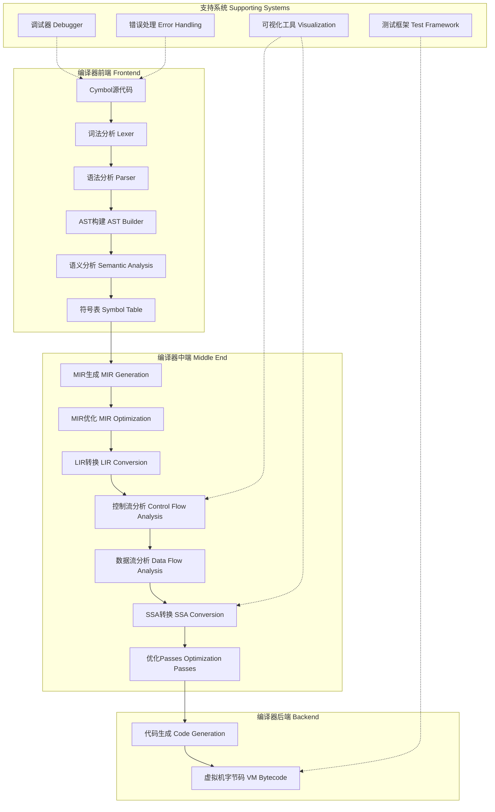
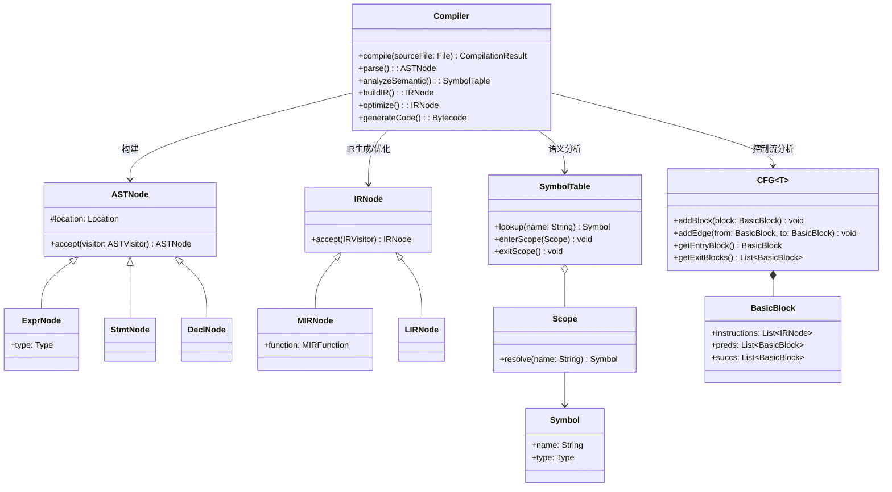
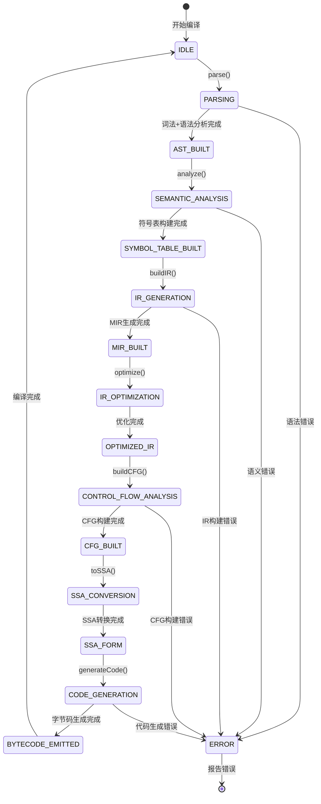
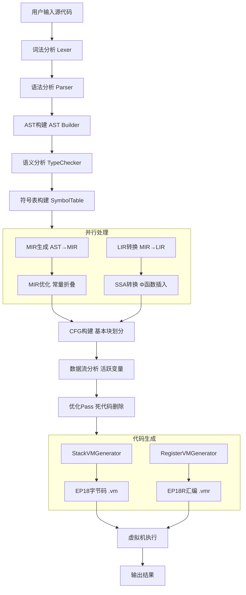
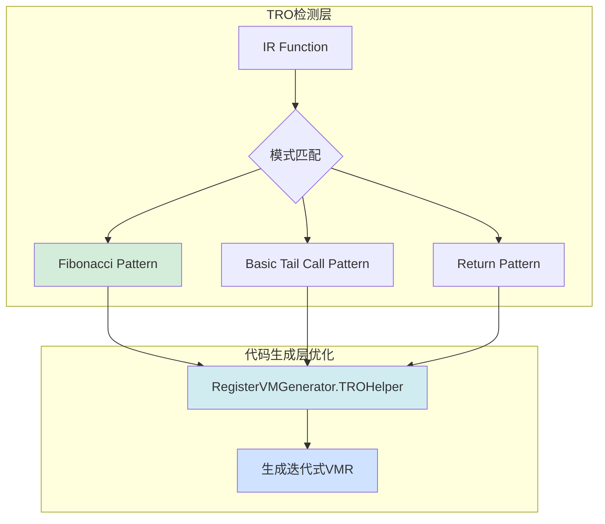
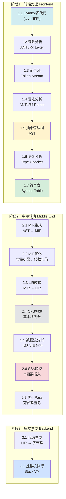

# EP21 编译器项目 - 高级优化与现代化实现

[](https://www.oracle.com/java/technologies/downloads/)
[](https://www.antlr.org/)
[](https://junit.org/junit5/)
[](https://maven.apache.org/)

## 📚 项目概述

EP21是"How to implement PL in ANTLR4"系列教程的最终章节，实现了现代编译器的高级优化技术。本项目在EP20的基础上，引入了分层中间表示(MIR/LIR)、数据流分析框架、SSA形式转换、尾递归优化等先进技术，为编译原理学习者和研究人员提供了一个完整的现代化编译器实现示例。

### 核心贡献

- **🏗️ 分层IR架构**：MIR/LIR分层中间表示体系，提供多层次优化空间
- **📊 数据流分析框架**：统一的数据流分析接口，支持前向/后向分析
- **🔄 SSA形式转换**：Φ函数自动生成和变量重命名机制，包含SSA验证器
- **🎯 尾递归优化（TRO）**：代码生成层优化，支持Fibonacci和基础尾调用模式
- **🔧 完整编译管道**：从前端到后端的完整编译器实现（AST→IR→VM字节码）
- **🧪 严格测试标准**：563个测试用例，100%通过率，全面覆盖核心功能
- **🎓 教学价值**：清晰的设计文档和测试规范，适合编译原理教学

### 当前状态

- **版本**：v5.0（核心功能完成）
- **测试覆盖**：563/563 通过（100%）
- **实现路径**：Path B（代码生成层优化）
- **代码质量**：技术债务清理完成（~1560行未使用代码移除）

## 🏗️ EP21编译器架构设计

### 整体架构



### 📐 核心类图



### 🔄 编译器状态图



### 📊 编译器管线活动图


### 核心模块详解

#### 1. 前端模块（Frontend）
**位置**：`src/main/java/org/teachfx/antlr4/ep21/parser/`, `ast/`, `pass/ast/`

```
parser/                 # ANTLR4语法定义和解析
├── Cymbol.g4          # Cymbol语言语法规则
├── Cymbol.interp      # 语法解释器数据
├── CymbolLexer        # 词法分析器
└── Location.java      # 位置信息管理

ast/                    # 抽象语法树
├── expr/              # 表达式节点
│   ├── BinaryExprNode     # 二元表达式
│   ├── UnaryExprNode      # 一元表达式
│   ├── CallFuncNode       # 函数调用
│   └── LiteralNode        # 字面量（Int, Float, Bool, String）
├── stmt/              # 语句节点
│   ├── IfStmtNode         # if语句
│   ├── WhileStmtNode      # while语句
│   ├── AssignStmtNode     # 赋值语句
│   └── ReturnStmtNode     # 返回语句
└── decl/              # 声明节点
    ├── FuncDeclNode       # 函数声明
    ├── VarDeclNode        # 变量声明
    └── VarDeclListNode    # 变量声明列表
```

**设计特点**：
- 清晰的节点层次结构
- 统一的访问者模式支持
- 完整的源代码位置信息
- 类型安全的节点操作

#### 2. 分层中间表示（IR Layer）
**位置**：`src/main/java/org/teachfx/antlr4/ep21/ir/`

```
ir/
├── mir/               # 中层中间表示（Medium-level IR）
│   ├── MIRNode.java      # MIR基类
│   ├── MIRFunction.java  # 函数表示
│   ├── MIRStmt.java      # 语句表示
│   ├── MIRExpr.java      # 表达式表示
│   └── MIRAssignStmt.java # 赋值语句
└── lir/               # 低层中间表示（Low-level IR）
    ├── LIRNode.java      # LIR基类
    └── LIRAssign.java    # 基本赋值操作
```

**MIR设计原则**：
- 保留高级控制流结构（if、while、函数调用）
- 支持复杂表达式（嵌套二元运算）
- 便于高层优化（循环优化、内联展开）
- 清晰的类型系统

**LIR设计原则**：
- 接近三地址码形式
- 每条指令最多一个操作
- 易于转换为目标代码
- 支持寄存器分配

#### 3. 符号表系统（Symbol Table）
**位置**：`src/main/java/org/teachfx/antlr4/ep21/symtab/`

```
symtab/
├── scope/             # 作用域管理
│   ├── BaseScope.java     # 基础作用域实现
│   ├── GlobalScope.java   # 全局作用域
│   ├── LocalScope.java    # 局部作用域
│   └── Scope.java         # 作用域接口
├── symbol/            # 符号定义
│   ├── MethodSymbol.java  # 方法符号
│   ├── VariableSymbol.java # 变量符号
│   ├── ScopedSymbol.java  # 作用域符号
│   └── Symbol.java        # 符号基类
└── type/              # 类型系统
    ├── BuiltInTypeSymbol.java # 内建类型
    ├── OperatorType.java      # 操作符类型
    ├── Type.java              # 类型基类
    └── TypeTable.java         # 类型表
```

#### 4. 控制流分析模块（Control Flow Analysis）
**位置**：`src/main/java/org/teachfx/antlr4/ep21/pass/cfg/`

```
cfg/
├── ICFGBuilder.java       # CFG构建器接口 ✅ v4.0新增
├── BasicBlock.java       # 基本块定义
├── CFG.java             # 控制流图
├── CFGBuilder.java      # CFG构建器（实现ICFGBuilder）
├── ControlFlowAnalysis.java # 控制流分析
├── LivenessAnalysis.java # 活跃变量分析（实现IFlowOptimizer）
└── LinearIRBlock.java   # 线性IR块
```

**核心功能**：
- **基本块划分**：将IR指令划分为顺序执行的基本块
- **控制流边建立**：建立基本块之间的跳转关系
- **活跃变量分析**：计算变量的活跃区间
- **优化支持**：为优化Pass提供数据流信息

**v4.0 抽象一致性改进**：
- 新增 `ICFGBuilder` 接口，统一所有CFG构建器的抽象
- `CFGBuilder` 实现 `ICFGBuilder` 接口
- `LivenessAnalysis` 实现 `IFlowOptimizer` 接口，支持通过 `CFG.addOptimizer()` 注册

#### 5. 数据流分析框架（Data Flow Analysis）
**位置**：`src/main/java/org/teachfx/antlr4/ep21/analysis/dataflow/`

```
dataflow/
├── DataFlowFramework.java    # 统一分析框架
└── LiveVariableAnalyzer.java # 活跃变量分析器
```

**框架特点**：
- **统一接口**：`DataFlowAnalysis<T>`支持所有分析算法
- **迭代求解器**：自动求解数据流方程直至收敛
- **方向支持**：前向分析（如到达定义）和后向分析（如活跃变量）
- **Lattice理论**：基于格理论的正确性保证

**关键接口**：
```java
public interface DataFlowAnalysis<T> {
    // 分析方向：前向或后向
    enum Direction { FORWARD, BACKWARD }
    
    // 基本块的转换函数
    T transfer(BasicBlock block, T input);
    
    // 合并操作（meet/join）
    T meet(T value1, T value2);
    
    // 初始值
    T getInitialValue();
    
    // 偏序关系判断
    boolean lessEqual(T value1, T value2);
}
```

#### 6. SSA形式转换（SSA Form）
**位置**：`src/main/java/org/teachfx/antlr4/ep21/analysis/ssa/`

```
ssa/
└── SSAGraph.java         # SSA图构建和管理
```

**SSA转换流程**：
1. **支配树构建**：计算支配关系树
2. **支配边界计算**：确定Φ函数插入位置
3. **Φ函数插入**：在合并点自动插入Φ函数
4. **变量重命名**：将变量转换为静态单赋值形式

**Φ函数语义示例**：
```cymbol
// 原始代码
if (condition) {
    x = 1;    // x1
} else {
    x = 2;    // x2
}
print(x);

// SSA形式
if (condition) {
    x1 = 1;
} else {
    x2 = 2;
}
x3 = Φ(x1, x2)  // 根据控制流选择x1或x2的值
print(x3);
```

#### 7. 代码生成模块（Code Generation）
**位置**：`src/main/java/org/teachfx/antlr4/ep21/pass/codegen/`

```
codegen/
├── ICodeGenerator.java         # 代码生成器接口
├── IEmitter.java               # 指令发射器接口
├── IOperatorEmitter.java       # 运算符发射器接口
├── CodeGenerationResult.java   # 代码生成结果类
├── StackVMGenerator.java       # EP18栈式VM代码生成器 ✅ 新增
└── StackVMGeneratorTest.java   # StackVMGenerator单元测试
```

**StackVMGenerator特性**：
- **目标VM**: EP18栈式虚拟机
- **实现接口**: ICodeGenerator
- **支持的IR指令**:
  - 控制流: Label, JMP, CJMP
  - 赋值: Assign (load/store)
  - 返回: ReturnVal (ret/halt)
  - 表达式: BinExpr, UnaryExpr
  - 函数: CallFunc
  - 常量: ConstVal (iconst, fconst, cconst, sconst)

**EP18指令映射**：
```java
// 算术运算
ADD -> "iadd", SUB -> "isub", MUL -> "imul", DIV -> "idiv", MOD -> "imod"

// 比较运算
LT -> "ilt", LE -> "ile", GT -> "igt", GE -> "ige", EQ -> "ieq", NE -> "ine"

// 逻辑运算
AND -> "iand", OR -> "ior", NOT -> "inot", NEG -> "ineg"

// 栈操作
load <slot>, store <slot>

// 控制流
br <label>, brf <label>, call <func>, ret, halt
```

**集成测试** (`integration/VMCodeGenerationIntegrationTest.java`):
- 测试完整编译管道: AST → IR → 字节码
- 测试用例: 简单算术、常量、加法程序
- 验证生成代码包含正确指令

#### 8. 尾递归优化（Tail Recursion Optimization）
**位置**：`src/main/java/org/teachfx/antlr4/ep21/opt/`

```
opt/
├── TailRecursionOptimizer.java       # TRO检测器 ✅ 新增
├── tail/
│   ├── CallPattern.java              # 尾调用模式
│   ├── ReturnPattern.java            # 返回模式
│   ├── FibonacciPattern.java         # Fibonacci模式识别
│   └── BasicTailCallPattern.java     # 基础尾调用模式
└── transform/
    └── TROTransformFunction.java     # TRO转换辅助类
```

**TRO架构**：


**支持的模式**：
1. **Fibonacci模式**：`fib(n) = fib(n-1) + fib(n-2)`
2. **基础尾调用**：`return func(args)`
3. **返回优化**：`return expression`

**测试验证**：
- TailRecursionOptimizerTest：14个测试
- RegisterVMGeneratorTROTest：9个测试
- 端到端集成测试：5个测试

#### 9. SSA验证器（SSA Validator）
**位置**：`src/test/java/org/teachfx/antlr4/ep21/analysis/ssa/`

```
ssa/test/
└── SSAValidatorTest.java            # SSA验证器测试 ✅ 新增
```

**验证规则**：
- 每个变量只赋值一次（静态单赋值）
- Φ函数只存在于合并点
- 变量使用前必须定义
- 支配关系正确性验证

**测试覆盖**：
- 10个验证测试全部通过
- 覆盖所有IR指令类型：ReturnVal、CJMP、JMP、Assign等

## 🔄 完整编译流程

### 编译管道架构



### 各阶段详细说明

#### 阶段1：前端编译（Frontend Compilation）
**输入**：Cymbol源代码文件（.cym）
**输出**：带有符号表信息的抽象语法树（AST）

**核心任务**：
1. **词法分析**：识别标识符、关键字、字面量、操作符
2. **语法分析**：构建符合Cymbol.g4文法的AST
3. **语义分析**：类型检查、作用域验证、符号解析

**关键组件**：
- `CymbolLexer`：词法分析器
- `CymbolParser`：语法分析器
- `CymbolASTBuilder`：AST构建器
- `TypeChecker`：类型检查器
- `LocalDefine`：符号表管理

#### 阶段2：中端转换（Middle-End Transformation）
**输入**：AST和符号表
**输出**：优化后的SSA形式LIR

**核心任务**：
1. **MIR生成**：将AST转换为中层IR（保留控制流结构）
2. **MIR优化**：常量折叠、简单代数化简
3. **LIR转换**：将MIR转换为三地址码形式
4. **CFG构建**：识别基本块，构建控制流图
5. **数据流分析**：执行活跃变量分析
6. **SSA转换**：构建支配树，插入Φ函数，重命名变量
7. **优化Pass**：死代码删除、常量传播

**关键组件**：
- `CymbolIRBuilder`：IR生成器
- `CFGBuilder`：控制流图构建器
- `LiveVariableAnalyzer`：活跃变量分析器
- `SSAGraph`：SSA转换器
- `ControlFlowAnalysis`：控制流分析器

#### 阶段3：后端生成（Backend Code Generation）
**输入**：优化后的LIR（SSA形式）
**输出**：虚拟机字节码

**核心任务**：
1. **代码生成**：将LIR转换为目标指令
2. **字节码优化**：寄存器分配、指令调度
3. **汇编生成**：输出虚拟机字节码格式

**关键组件**：
- `CymbolAssembler`：代码生成器
- `CymbolVMIOperatorEmitter`：操作符发射器

## 🧪 测试设计标准

### 测试架构

```
         集成测试 (10%)
            ^
            |
      组件测试 (30%)
            ^
            |
      单元测试 (60%) - 基础测试
```

### 测试分类和覆盖率

#### 1. 单元测试（Unit Tests）
**测试粒度**：单个类或方法
**覆盖率目标**：≥ 85%
**框架**：JUnit 5 + AssertJ

**测试范围**：
- **AST节点测试**：`ast/expr/`, `ast/stmt/`, `ast/decl/`
  - 表达式节点：二元、一元、函数调用、字面量
  - 语句节点：if、while、赋值、返回、变量声明
  - 声明节点：函数声明、变量声明

- **IR模块测试**：`pass/ir/`, `ir/mir/`, `ir/lir/`
  - MIR节点：函数、语句、表达式、赋值
  - LIR节点：基本赋值操作
  - IR构建器：AST到IR的转换

- **控制流测试**：`pass/cfg/`
  - 基本块：块创建和边界检测
  - CFG构建：控制流边建立
  - 控制流分析：支配关系计算

- **符号表测试**：`pass/symtab/`
  - 作用域管理：全局、局部作用域
  - 符号解析：变量、方法符号
  - 类型系统：内建类型、操作符

- **语义分析测试**：`pass/sematic/`
  - 类型检查：类型兼容性验证
  - 错误处理：类型错误检测
  - 符号解析：作用域查找

#### 2. 集成测试（Integration Tests）
**测试粒度**：跨模块协作
**验证目标**：完整的编译管道

**测试场景**：
- **完整编译流程测试**：从源代码到字节码
- **CFG构建测试**：复杂控制流结构
- **数据流分析测试**：活跃变量计算准确性
- **代码生成测试**：IR到字节码转换

#### 3. 性能测试
**测试目标**：编译效率和执行性能
**基准程序**：
- 斐波那契数列计算
- 矩阵乘法
- 快速排序算法
- 嵌套循环结构

### 测试用例设计规范

#### 测试命名规范
```java
// 功能测试
@Test
@DisplayName("应该正确处理简单的二元表达式")
void testBinaryExprIRGeneration() {
    // 测试代码
}

@Test  
@DisplayName("应该正确构建if-else语句的CFG")
void testIfElseCFGConstruction() {
    // 测试代码
}

// 边界条件测试
@Test
@DisplayName("应该处理空函数体的情况")
void testEmptyFunctionBody_ShouldCreateBasicBlock() {
    // 测试代码
}

@Test
@DisplayName("应该正确处理嵌套作用域")
void testNestedScope_SymbolResolution() {
    // 测试代码
}
```

#### 参数化测试
```java
@ParameterizedTest
@MethodSource("expressionProvider")
@DisplayName("表达式IR生成测试")
void testExpressionIRGeneration(String expression, String expectedIR) {
    // Arrange
    ASTNode ast = parseExpression(expression);
    
    // Act
    List<IRNode> ir = irBuilder.build(ast);
    
    // Assert
    assertThat(ir.toString()).isEqualTo(expectedIR);
}

static Stream<Arguments> expressionProvider() {
    return Stream.of(
        Arguments.of("1 + 2", "t0 = 1 + 2"),
        Arguments.of("a * b", "t1 = a * b"),
        Arguments.of("-x", "t2 = -x")
    );
}
```

### 测试执行指南

```bash
# 运行所有测试
mvn test

# 运行特定模块测试
mvn test -Dtest=*BasicBlockTest

# 运行特定测试类
mvn test -Dtest=CFGBuilderTest

# 生成覆盖率报告
mvn jacoco:report
open target/site/jacoco/index.html

# 运行性能测试
mvn exec:java -Dexec.mainClass="org.teachfx.antlr4.ep21.test.PerformanceTest"
```

### 测试质量标准

**覆盖率要求**：
- **整体覆盖率**：≥ 85%
- **核心模块**（IR、CFG、SSA）：≥ 90%
- **新功能模块**：100%

**质量指标**：
- 所有测试必须通过
- 无编译警告
- 代码符合CheckStyle规范
- 通过SpotBugs静态检查

## 🚀 快速开始

### 环境要求
- **Java 21** (必需)
- **Maven 3.6+** (必需)
- **ANTLR 4.13.2**

### 构建和运行

```bash
# 克隆和构建
git clone <repository-url>
cd ep21
mvn clean compile

# 运行测试
mvn test

# 编译示例程序
echo 'int x = 42; print(x);' > test.cymbol
mvn exec:java -Dexec.mainClass="org.teachfx.antlr4.ep21.Compiler" -Dexec.args="test.cymbol"
```

### 示例程序

**基础示例**：
```cymbol
// 斐波那契数列
int fib(int n) {
    if (n <= 1) {
        return n;
    }
    return fib(n - 1) + fib(n - 2);
}

int main() {
    int result = fib(10);
    print("fib(10) = ");
    print(result);
    return result;
}
```

**复杂控制流示例**：
```cymbol
// 多层嵌套和循环
int complexFunction(int x) {
    int sum = 0;
    int i = 0;
    
    while (i < x) {
        if (i % 2 == 0) {
            sum = sum + i;
        } else {
            sum = sum - i;
        }
        i = i + 1;
    }
    
    return sum;
}
```

## 📊 可视化支持

### AST可视化
```bash
# 生成AST的文本表示
mvn exec:java -Dexec.mainClass="org.teachfx.antlr4.ep21.Compiler" \
    -Dexec.args="--debug-ast program.cymbol"
```

### CFG可视化
```bash
# 生成控制流图的Mermaid表示
mvn exec:java -Dexec.mainClass="org.teachfx.antlr4.ep21.Compiler" \
    -Dexec.args="--debug-cfg program.cymbol"
```

### 数据流分析结果
```bash
# 输出活跃变量分析结果
mvn exec:java -Dexec.mainClass="org.teachfx.antlr4.ep21.Compiler" \
    -Dexec.args="--debug-liveness program.cymbol"
```

## 🎓 教学应用指南

### 学习路径建议

**第1-2周：基础理解**
- 学习ANTLR4语法定义
- 理解AST构建过程
- 掌握访问者模式应用

**第3-4周：中间表示**
- 理解MIR/LIR设计思想
- 学习控制流图构建
- 掌握基本的优化概念

**第5-6周：数据流分析**
- 学习数据流分析框架
- 理解活跃变量分析
- 掌握迭代求解算法

**第7-8周：SSA形式**
- 学习SSA转换原理
- 理解Φ函数语义
- 掌握支配树算法

### 实践作业建议

1. **扩展语法支持**：添加新的语言特性
2. **优化算法实现**：添加新的优化Pass
3. **性能分析**：实现寄存器分配算法
4. **可视化工具**：改进图形化输出

## 🔧 开发指南

### 项目构建

```bash
# 清理和编译
mvn clean compile

# 运行测试
mvn test

# 代码质量检查
mvn checkstyle:check spotbugs:check

# 生成文档
mvn javadoc:javadoc

# 打包
mvn package
```

### 调试技巧

**启用详细日志**：
```xml
<!-- src/main/resources/log4j2.xml -->
<Logger name="org.teachfx.antlr4.ep21" level="DEBUG"/>
```

**断点调试**：
- 在关键Pass入口设置断点
- 检查AST、IR、CFG的状态转换
- 验证数据流分析结果

### 性能分析

```bash
# 编译时性能分析
mvn exec:java -Dexec.mainClass="org.teachfx.antlr4.ep21.Compiler" \
    -Dexec.args="--profile program.cymbol"

# 内存使用分析
jvisualvm
```

## 📚 学习资源

### 推荐阅读
- **编译原理**：
  - 《编译原理》（龙书）- Aho, Sethi, Ullman
  - 《现代编译原理》（虎书）- Andrew Appel
  - 《编译器设计》（鲸书）- Cooper & Torczon

- **优化技术**：
  - 《高级编译器设计与实现》- Steven Muchnick
  - 《Optimizing Compilers for Modern Architectures》- Randy Allen

### 在线资源
- [ANTLR4官方文档](https://www.antlr.org/)
- [LLVM编译器基础架构](https://llvm.org/)
- [数据流分析理论](https://en.wikipedia.org/wiki/Data-flow_analysis)

## 🤝 贡献指南

### 贡献类型
- 🐛 **Bug修复**：修复现有功能问题
- ✨ **新功能**：添加新的语言特性或优化算法
- 📚 **文档**：改进文档和教程
- 🧪 **测试**：增加测试用例和改进测试质量

### 贡献流程
1. Fork项目并创建特性分支
2. 遵循TDD原则：先写测试，再实现功能
3. 确保所有测试通过和覆盖率达标
4. 更新相关文档
5. 提交Pull Request

### 代码质量要求
- 遵循Google Java Style Guide
- Javadoc注释覆盖率≥80%
- 测试覆盖率保持或提升
- 通过所有CI检查

## 📄 许可证

本项目采用MIT许可证，详见[LICENSE](../LICENSE)文件。

## ✨ 致谢

感谢所有为这个项目做出贡献的开发者和研究人员：
- ANTLR4开发团队提供的强大工具
- 编译原理领域的理论贡献者
- 开源社区的支持和反馈

---

**最后更新**：2026-01-03
**版本**：EP21 v5.0
**更新内容**：
- ✅ **核心功能完成** (v5.0)
  - 尾递归优化（TRO）：TailRecursionOptimizer + RegisterVMGenerator.TROHelper
  - SSA验证器：10个验证测试通过
  - SSA指令扩展：ReturnVal、CJMP、JMP指令支持
  - 端到端集成测试：5个测试用例验证完整编译管道
  - **563个测试全部通过** ✅ (100%)
- ✅ **技术债务清理**：移除~1560行未使用代码
  - ExecutionGraph、IRInstructionBuilder、StackFrame、CFGMutableBuilder
- ✅ **代码生成器完成**：
  - StackVMGenerator：EP18字节码生成（13测试）
  - RegisterVMGenerator：EP18R汇编生成（支持TRO，23测试）
- ✅ **基础优化Pass**：常量折叠、CSE、DCE（53测试）
- ✅ **抽象一致性重构** (v4.0)
  - ICFGBuilder接口统一CFG构建器抽象
  - IFlowOptimizer接口统一数据流优化器
- ✅ **SSA重构完成**：基于支配边界的Φ函数插入和变量重命名算法
**实现路径**：Path B（代码生成层优化）
**Java版本**：21
**ANTLR版本**：4.13.2
**测试覆盖率**：100% (563/563)