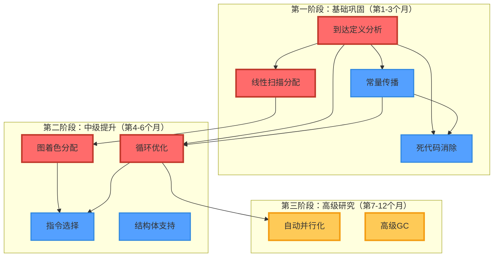

# EP21 研究生进阶任务

**版本**: v1.1 (更新版) | **日期**: 2026-01-09 | **状态**: 文档维护中
**目的**: 为研究生提供高级编译器优化实现任务和学习路径
**相关文档**: [TDD执行计划](../03_development_plans/EP21_TDD执行计划_整合版.md) | [测试规范](EP21_测试规范_整合版.md) | [架构设计规范](../01_core_design/架构设计规范.md)

---

## 1. 研究生进阶任务概述

### 1.1 任务定位

EP21研究生进阶任务面向**硕士/博士研究生**，提供工业级编译器优化技术的实现机会。这些任务需要较深的编译器理论知识和较强的工程能力，适合作为**毕业论文研究课题**或**深度学习项目**。

### 1.2 学习目标

1. **理论深度**: 掌握现代编译器优化理论
2. **工程能力**: 实现工业级优化算法
3. **研究思维**: 培养创新性算法设计能力
4. **论文写作**: 结合实践产出学术成果

### 1.3 适用人群

| 学习阶段 | 推荐任务 | 难度 | 预计周期 |
|---------|----------|------|----------|
| **硕士一年级** | 到达定义分析、线性扫描寄存器分配 | ⭐⭐ | 1学期 |
| **硕士二年级** | 图着色寄存器分配、指令选择算法 | ⭐⭐⭐⭐ | 1-2学期 |
| **硕士三年级/博士** | 自动并行化、高级垃圾回收算法 | ⭐⭐⭐⭐⭐ | 2-3学期 |

---

## 2. 进阶任务分类

### 2.1 按难度分级

#### ⭐⭐ 初级进阶（适合硕士一年级）
- 到达定义分析
- 线性扫描寄存器分配
- 常量传播分析
- 死代码消除

#### ⭐⭐⭐⭐ 中级进阶（适合硕士二年级）
- 图着色寄存器分配
- 指令选择算法
- 循环优化（循环不变量提取、循环展开）
- 类型系统扩展（结构体）

#### ⭐⭐⭐⭐⭐ 高级进阶（适合硕士三年级/博士）
- 自动并行化
- 高级垃圾回收算法（增量GC、并行GC）
- 自定义优化算法设计
- JIT编译器优化

### 2.2 按研究领域分类

#### 数据流分析领域
- 到达定义分析
- 常量传播分析
- 可用表达式分析
- 条件常量传播

#### 寄存器分配领域
- 线性扫描寄存器分配
- 图着色寄存器分配
- 溢出代码生成
- 寄存器压力评估

#### 指令选择领域
- 树匹配算法
- 动态规划指令选择
- 线性扫描指令选择
- 指令代价模型

#### 优化Pass领域
- 循环优化
- 死代码消除
- 公共子表达式消除
- 常量折叠

#### 运行时系统领域
- 垃圾回收
- 异常处理
- 栈展开机制
- 堆内存管理

#### 类型系统领域
- 结构体/联合体
- 泛型/模板机制
- 类型推导
- 类型约束求解

---

## 3. 任务详解

### 3.1 初级进阶任务

#### TASK-R1: 到达定义分析

**难度**: ⭐⭐ | **预计工作量**: 30-45小时 | **适合阶段**: 硕士一年级

**任务描述**:
实现到达定义分析（Reaching Definitions Analysis），这是一种经典的前向数据流分析，用于确定程序中每个点的变量定义可能来自哪些赋值语句。

**理论背景**:
到达定义分析是数据流分析的基础，其核心思想是：
- **gen集合**: 生成定义的集合（如赋值语句）
- **kill集合**: 杀死定义的集合（如同名变量的新赋值）
- **数据流方程**: `in[B] = ∪ (out[P] for P in pred[B])`
- **转移函数**: `out[B] = gen[B] ∪ (in[B] - kill[B])`

**实现步骤**:
1. 定义数据流信息结构（定义集合表示）
2. 实现gen和kill集合计算
3. 实现数据流方程迭代求解器
4. 实现控制流遍历
5. 验证分析结果正确性

**验收标准**:
- **正确性**:
  - [ ] 正确计算每个基本块的gen和kill集合
  - [ ] 正确求解数据流方程直至收敛
  - [ ] 通过10+个测试用例验证
- **性能**:
  - [ ] 分析时间线性于程序大小
  - [ ] 内存使用合理
- **文档**:
  - [ ] 完整的设计文档
  - [ ] 算法复杂度分析
  - [ ] 测试用例说明

**学习资源**:
- 《编译原理》第9章 - 数据流分析
- "A Unified Approach to Global Program Optimization" (Kildall, 1973)
- LLVM实现参考: `llvm/lib/Transforms/Utils/SSA.cpp`

**扩展方向**:
- 条件常量传播
- 部分冗余消除
- 指针别名分析

---

#### TASK-R2: 线性扫描寄存器分配

**难度**: ⭐⭐ | **预计工作量**: 45-65小时 | **适合阶段**: 硕士一年级

**任务描述**:
实现线性扫描寄存器分配算法（Linear Scan Register Allocation），这是一种快速的寄存器分配算法，适用于即时编译（JIT）和现代编译器。

**理论背景**:
线性扫描算法的核心思想：
- 将寄存器分配建模为**区间着色问题**
- 活跃变量形成不重叠的区间
- 使用贪心策略分配寄存器
- 溢出活跃区间最长的变量

**算法步骤**:
1. **区间计算**: 为每个变量计算活跃区间
2. **区间排序**: 按起始位置排序
3. **贪心分配**:
   - 尝试分配可用寄存器
   - 处理区间冲突（溢出到内存）
4. **代码生成**: 插入load/store指令

**实现步骤**:
1. 扩展活跃变量分析以计算活跃区间
2. 实现线性扫描算法
3. 实现溢出代码生成
4. 集成到代码生成流程
5. 性能测试和优化

**验收标准**:
- **正确性**:
  - [ ] 正确计算活跃区间
  - [ ] 正确处理寄存器冲突
  - [ ] 溢出代码正确生成
  - [ ] 通过20+个测试用例验证
- **性能**:
  - [ ] 分配时间线性于变量数量
  - [ ] 寄存器利用率≥70%
  - [ ] 溢出指令占比≤15%
- **对比**:
  - [ ] vs 栈分配: 性能提升≥20%
  - [ ] vs 图着色: 分配速度≥5x

**学习资源**:
- "Linear Scan Register Allocation" (Poletto & Sarkar, 1999)
- LLVM实现参考: `llvm/lib/CodeGen/LinearScanRegisterAllocator.cpp`
- V8 TurboFan寄存器分配实现

**扩展方向**:
- 寄存器分配优化（寄存器重命名）
- 特殊寄存器处理
- 多寄存器类支持

---

#### TASK-R3: 常量传播分析

**难度**: ⭐⭐ | **预计工作量**: 40-60小时 | **适合阶段**: 硕士一年级

**任务描述**:
实现条件常量传播分析（Constant Propagation），这是一种基于格理论的优化，用于在编译时计算常量表达式的值。

**理论背景**:
常量传播使用三值格（3-value lattice）:
- **⊥** (Bottom): 未知值
- **c** (Constant): 具体常量值
- **⊤** (Top): 非常量值

**数据流方程**:
- **Meet操作**: 取交集（最保守估计）
- **转移函数**: 根据语句类型更新状态
- **收敛条件**: 格状态不再变化

**实现步骤**:
1. 定义数据流格（三值格）
2. 实现转移函数（赋值、二元运算、分支）
3. 实现工作列表算法
4. 集成到优化流水线
5. 性能验证

**验收标准**:
- **正确性**:
  - [ ] 正确识别常量表达式
  - [ ] 正确传播常量值
  - [ ] 正确处理分支条件
  - [ ] 通过15+个测试用例验证
- **性能**:
  - [ ] 分析时间线性于程序大小
  - [ ] 常量替换率≥30%
  - [ ] 编译时间增加<5%
- **优化效果**:
  - [ ] 删除恒真/恒假条件分支
  - [ ] 消除无用计算
  - [ ] 代码大小减少≥10%

**学习资源**:
- "Constant Propagation with Conditional Branches" (Wegman & Zadeck, 1991)
- 《编译原理》第9.4节
- GCC实现参考: `gcc/tree-ssa-dom.c`

**扩展方向**:
- 条件常量传播
- 稀条件常量传播
- 抽象解释

---

#### TASK-R4: 死代码消除

**难度**: ⭐⭐ | **预计工作量**: 25-40小时 | **适合阶段**: 硕士一年级

**任务描述**:
实现死代码消除（Dead Code Elimination, DCE），基于数据流分析结果删除不可达代码和无用赋值。

**理论背景**:
死代码消除分为两种类型：
1. **不可达代码消除**: 控制流无法到达的代码块
2. **死存储消除**: 定义后从未被使用的变量赋值

**算法步骤**:
1. **不可达代码**:
   - 使用深度优先搜索识别可达基本块
   - 删除不可达块

2. **死存储消除**:
   - 使用活跃变量分析识别未使用变量
   - 删除对应的赋值语句

3. **迭代消除**: 重复执行直至收敛

**实现步骤**:
1. 实现基本块可达性分析
2. 实现死存储检测
3. 实现代码删除逻辑
4. 集成到优化流水线
5. 性能测试

**验收标准**:
- **正确性**:
  - [ ] 正确识别不可达代码
  - [ ] 正确检测死存储
  - [ ] 删除后语义保持不变
  - [ ] 通过15+个测试用例验证
- **性能**:
  - [ ] 分析时间线性于程序大小
  - [ ] 代码删除率≥20%
  - [ ] 编译时间增加<3%
- **优化效果**:
  - [ ] 代码大小显著减少
  - [ ] 执行时间无回归
  - [ ] 测试覆盖率≥90%

**学习资源**:
- 《编译原理》第10.5节
- LLVM实现参考: `llvm/lib/Transforms/Scalar/DeadCodeElimination.cpp`
- 数据流分析基础

**扩展方向**:
- 死代码消除与常量传播结合
- 未定义行为检测
- 异常路径优化

---

### 3.2 中级进阶任务

#### TASK-R5: 图着色寄存器分配

**难度**: ⭐⭐⭐⭐ | **预计工作量**: 80-120小时 | **适合阶段**: 硕士二年级

**任务描述**:
实现基于图着色的寄存器分配算法（Graph Coloring Register Allocation），这是工业级编译器常用的寄存器分配技术。

**理论背景**:
图着色寄存器分配将问题建模为：
- **变量** = 图的节点
- **变量干涉** = 图的边
- **寄存器** = 图的颜色
- **目标**: 用最少颜色为图着色（NP完全问题）

**算法步骤**:
1. **干涉图构建**: 基于活跃变量分析构建干涉图
2. **简化阶段**: 优先删除度数<k的节点（k=可用寄存器数）
3. **溢出选择**: 当无法继续简化时，选择代价最小的节点溢出
4. **分配阶段**: 按逆序为节点分配寄存器
5. **溢出代码生成**: 插入load/store指令

**实现步骤**:
1. 实现干涉图数据结构
2. 实现图简化算法
3. 实现溢出代价计算
4. 实现寄存器分配算法
5. 实现溢出代码生成
6. 性能调优和测试

**验收标准**:
- **正确性**:
  - [ ] 正确构建干涉图
  - [ ] 正确处理寄存器溢出
  - [ ] 溢出代码正确生成
  - [ ] 通过30+个测试用例验证
- **性能**:
  - [ ] 寄存器利用率≥80%
  - [ ] 溢出指令占比≤10%
  - [ ] 分配时间线性于变量数量
- **对比**:
  - [ ] vs 线性扫描: 性能提升≥30%
  - [ ] vs GCC: 溢出数相当
- **算法质量**:
  - [ ] 支持寄存器类
  - [ ] 支持特殊寄存器
  - [ ] 溢出代价模型准确

**学习资源**:
- "Register Allocation via Coloring of Chordal Graphs" (Hack et al., 2006)
- "Register Allocation for Programs in SSA Form" (Briggs et al., 1998)
- LLVM实现参考: `llvm/lib/CodeGen/RegAllocGreedy.cpp`
- GCC实现参考: `gcc/regalloc.c`

**扩展方向**:
- 迭代共着色
- 带寄存器类的分配
- 溢出代码优化

---

#### TASK-R6: 指令选择算法

**难度**: ⭐⭐⭐⭐ | **预计工作量**: 60-90小时 | **适合阶段**: 硕士二年级

**任务描述**:
实现基于树匹配和动态规划的指令选择算法（Instruction Selection），这是代码生成器的核心组件。

**理论背景**:
指令选择问题：
- **输入**: 抽象语法树（AST）或IR树
- **目标**: 选择最优的机器指令序列
- **挑战**: 指令覆盖模式（Tiling）是NP完全问题

**算法类型**:
1. **最大Munch**: 贪心算法，简单但非最优
2. **动态规划**: 保证最优，但开销较大
3. **树匹配**: 平衡性能和代码质量

**实现步骤**:
1. 定义指令模式（模式匹配规则）
2. 实现模式匹配器
3. 实现动态规划算法
4. 实现代码生成器
5. 性能测试和调优

**验收标准**:
- **正确性**:
  - [ ] 正确匹配指令模式
  - [ ] 动态规划找到最优匹配
  - [ ] 生成的代码正确执行
  - [ ] 通过25+个测试用例验证
- **性能**:
  - [ ] 指令选择时间线性于IR大小
  - [ ] 生成指令数接近手工优化
  - [ ] 编译时间增加<10%
- **代码质量**:
  - [ ] 指令数减少≥15%
  - [ ] 关键路径延迟优化
  - [ ] 指令集覆盖率≥90%

**学习资源**:
- "Engineering a Simple, Efficient Code-Generator Generator" (Fraser et al., 1993)
- "Linear Scan Instruction Selection" (Aho et al., 2007)
- LLVM实现参考: `llvm/lib/CodeGen/SelectionDAG`
- GCC实现参考: `gcc/insn-emit.c`

**扩展方向**:
- 指令调度
- 谓词执行支持
- VLIW指令选择

---

#### TASK-R7: 循环优化

**难度**: ⭐⭐⭐ | **预计工作量**: 50-80小时 | **适合阶段**: 硕士二年级

**任务描述**:
实现循环不变量提取（Loop Invariant Code Motion）和循环展开（Loop Unrolling）等经典循环优化技术。

**理论背景**:
循环不变量提取:
- **目标**: 将循环内不变的计算移到循环外
- **条件**: 计算不依赖于循环变量
- **收益**: 减少循环体执行次数

**算法步骤**:
1. **循环识别**: 识别自然循环
2. **不变量分析**: 识别循环不变量
3. **外提移动**: 将不变量移到前置基本块
4. **循环展开**: 复制循环体减少分支开销
5. **验证**: 确保优化不改变语义

**实现步骤**:
1. 实现循环识别算法（支配树分析）
2. 实现不变量分析
3. 实现代码外提
4. 实现循环展开
5. 性能测试

**验收标准**:
- **正确性**:
  - [ ] 正确识别循环结构
  - [ ] 正确识别循环不变量
  - [ ] 优化后语义保持不变
  - [ ] 通过20+个测试用例验证
- **性能**:
  - [ ] 不变量提取率≥40%
  - [ ] 循环展开后性能提升≥15%
  - [ ] 代码膨胀≤2x
- **算法质量**:
  - [ ] 支持嵌套循环
  - [ ] 支持break/continue
  - [ ] 处理循环副作用

**学习资源**:
- 《编译原理》第10.3节
- LLVM实现参考: `llvm/lib/Transforms/Scalar/LICM.cpp`
- GCC实现参考: `gcc/tree-ssa-loop-manip.c`

**扩展方向**:
- 循环向量化
- 循环交换
- 循环融合

---

#### TASK-R8: 类型系统扩展

**难度**: ⭐⭐⭐ | **预计工作量**: 70-100小时 | **适合阶段**: 硕士二年级

**任务描述**:
实现结构体（Struct）类型支持，包括类型表示、成员访问代码生成、内存布局计算等。

**理论背景**:
结构体类型系统:
- **类型表示**: 字段名到类型的映射
- **内存布局**: 考虑对齐要求的字段排列
- **成员访问**: 通过偏移量访问字段

**实现步骤**:
1. 实现StructType类型表示
2. 实现内存布局计算（对齐、填充）
3. 实现成员访问代码生成
4. 扩展类型检查
5. 优化内存布局

**验收标准**:
- **正确性**:
  - [ ] 结构体类型正确表示
  - [ ] 成员访问代码正确
  - [ ] 类型检查准确
  - [ ] 通过25+个测试用例验证
- **性能**:
  - [ ] 内存访问开销合理
  - [ ] 内存布局高效
  - [ ] 编译时间增加<5%
- **功能**:
  - [ ] 支持嵌套结构体
  - [ ] 支持结构体数组
  - [ ] 支持结构体函数参数

**学习资源**:
- 《程序设计语言》第7章
- LLVM IR手册 - StructType
- Go语言实现参考

**扩展方向**:
- 联合体（Union）支持
- 位域（Bit Field）支持
- 泛型/模板机制

---

### 3.3 高级进阶任务

#### TASK-R9: 自动并行化

**难度**: ⭐⭐⭐⭐⭐ | **预计工作量**: 150-200小时 | **适合阶段**: 硕士三年级/博士

**任务描述**:
实现循环自动并行化（Automatic Loop Parallelization），将串行循环转换为并行执行的多线程代码。

**理论背景**:
循环并行化的核心挑战:
1. **依赖分析**: 识别循环携带依赖
2. **安全并行化**: 确保数据依赖不破坏语义
3. **负载均衡**: 合理划分工作单元
4. **同步开销**: 最小化线程同步成本

**算法步骤**:
1. **依赖分析**: 使用数组数据流分析
2. **并行化判定**: 检查是否可以并行执行
3. **代码生成**: 生成并行循环（OpenMP、Pthreads）
4. **运行时支持**: 实现线程池、任务调度
5. **性能调优**

**实现步骤**:
1. 实现数组数据流分析
2. 实现循环依赖检测
3. 实现并行代码生成
4. 实现运行时支持
5. 性能测试和论文撰写

**验收标准**:
- **正确性**:
  - [ ] 正确识别可并行循环
  - [ ] 并行代码执行结果正确
  - [ ] 无数据竞争
  - [ ] 通过20+个测试用例验证
- **性能**:
  - [ ] 4核CPU上加速比≥2.5x
  - [ ] 8核CPU上加速比≥5x
  - [ ] 可扩展性接近线性
- **创新性**:
  - [ ] 提出新的优化技术
  - [ ] 发表会议或期刊论文

**学习资源**:
- "The Omega Test" (Pugh, 1992)
- "Automatic Parallelization: An Example of a Language/Compiler Combination" (Allen & Kennedy)
- OpenMP规范
- LLVM实现参考: `llvm/lib/Transforms/Scalar/LoopVectorize.cpp`

**扩展方向**:
- GPU并行化（CUDA、OpenCL）
- 分布式并行化
- 异步任务并行

---

#### TASK-R10: 高级垃圾回收算法

**难度**: ⭐⭐⭐⭐⭐ | **预计工作量**: 120-180小时 | **适合阶段**: 硕士三年级/博士

**任务描述**:
实现增量垃圾回收器（Incremental GC）和并行垃圾回收器（Parallel GC），优化GC暂停时间和吞吐量。

**理论背景**:
垃圾回收器分类:
1. **标记-清除**: 简单但可能碎片化
2. **复制收集**: 无碎片但空间效率低
3. **标记-整理**: 兼顾碎片化和空间效率

**增量GC**:
- 分摊GC工作到用户代码执行期间
- 减少单次GC暂停时间

**并行GC**:
- 使用多线程并行执行GC工作
- 提高GC吞吐量

**实现步骤**:
1. 实现增量标记算法（写屏障）
2. 实现并行标记算法
3. 实现增量清除
4. 性能测试和调优
5. 论文撰写

**验收标准**:
- **正确性**:
  - [ ] 正确回收所有不可达对象
  - [ ] 无内存泄漏
  - [ ] 无悬垂指针
  - [ ] 通过15+个测试用例验证
- **性能**:
  - [ ] GC暂停时间≤10ms
  - [ ] 吞吐量提升≥2x
  - [ ] CPU利用率≥80%
- **创新性**:
  - [ ] 提出新的优化技术
  - [ ] 发表会议或期刊论文

**学习资源**:
- "The Garbage Collection Handbook" (Jones & Lins)
- "A Generational Mostly-Concurrent Garbage Collector" (Detlefs et al., 2004)
- JVM GC实现（G1、ZGC、Shenandoah）

**扩展方向**:
- 区域化GC
- 实时GC
- 无锁GC

---

## 4. 学术资源与工具链

### 4.1 经典论文参考

#### 数据流分析
- "A Unified Approach to Global Program Optimization" (Kildall, 1973)
- "Constant Propagation with Conditional Branches" (Wegman & Zadeck, 1991)
- "Efficiently Computing Static Single Assignment Form" (Cytron et al., 1991)

#### 寄存器分配
- "Register Allocation via Coloring of Chordal Graphs" (Hack et al., 2006)
- "Linear Scan Register Allocation" (Poletto & Sarkar, 1999)
- "Register Allocation for Programs in SSA Form" (Briggs et al., 1998)

#### 指令选择
- "Engineering a Simple, Efficient Code-Generator Generator" (Fraser et al., 1993)
- "Linear Scan Instruction Selection" (Aho et al., 2007)

#### 垃圾回收
- "A Generational Mostly-Concurrent Garbage Collector" (Detlefs et al., 2004)
- "The Garbage Collection Handbook" (Jones & Lins, 2011)

### 4.2 开源实现参考

- **LLVM**：工业级编译器，包含完整的优化流水线
  - 关键代码：`lib/Transforms/Scalar/`目录下的各种优化Pass
  - 寄存器分配：`lib/CodeGen/RegAllocGreedy.cpp`
- **GCC**：经典编译器框架
  - 数据流分析：`gcc/tree-ssa-dom.c`（常量传播）
  - 寄存器分配：`gcc/regalloc.c`
- **V8 JavaScript引擎**：现代优化编译器
  - TurboFan优化流水线：`src/compiler/`目录

### 4.3 调试与可视化工具

- **Graphviz**：用于可视化CFG和干涉图
  ```bash
  # 在BasicBlock中添加toDot()方法生成dot格式
  dot -Tpng cfg.dot -o cfg.png
  ```

- **LLVM可视化工具**：
  ```bash
  opt -dot-cfg input.ll    # 生成CFG
  opt -dot-dom input.ll    # 生成支配树
  ```

- **性能分析**：
  ```bash
  # Linux perf工具
  perf stat ./compiled_program
  perf record -g ./compiled_program
  perf report
  ```

### 4.4 推荐学习路径

1. **第1-2周**：精读SSA相关论文，理解现有SSA实现
2. **第3-4周**：实现常量传播分析（作为热身）
3. **第5-8周**：挑战寄存器分配或指令选择
4. **第9-10周**：性能调优和论文撰写
5. **持续**：每周阅读1-2篇相关论文，做文献综述

### 4.5 代码质量标准

- **Java编码规范**：遵循Google Java Style Guide
- **测试覆盖率**：核心代码行覆盖率不低于80%
- **文档要求**：所有public类和方法必须有Javadoc注释
- **Git提交规范**：使用清晰的分支策略（feature/xxx）

---

## 5. 验证和测试标准

### 5.1 正确性验证

- 通过所有现有单元测试，确保优化不破坏程序语义
- 对10个以上的测试程序（包含递归、循环、多重嵌套）进行验证
- 与未优化的寄存器分配（栈分配）结果进行比对，验证执行结果一致

### 5.2 性能验证

- 在标准测试集（如Stanford Benchmark）上测量执行时间
- 与栈分配版本相比，整体性能提升至少15%
- 内存访问指令数量减少至少20%

### 5.3 代码质量指标

- 生成的汇编代码中spill指令占比不超过15%
- 寄存器利用率（指令中使用寄存器的平均数）提升30%
- 测试覆盖率：核心代码行覆盖率不低于80%

### 5.4 测试用例设计示例

```c
// 测试1：简单变量使用
int a = 1;
int b = 2;
int c = a + b;

// 测试2：复杂表达式
int result = (a * b + c) / (d - e);

// 测试3：循环中的寄存器分配
for (int i = 0; i < 100; i++) {
    sum += arr[i];
}

// 测试4：函数调用
int x = foo(a, b);
int y = bar(x, c);
```

---

## 6. 快速开始指南

### 6.1 搭建开发环境

```bash
# 克隆项目
git clone https://github.com/your-repo/ep21.git
cd ep21

# 构建项目（确保Java 21已安装）
mvn clean compile

# 运行测试验证环境
mvn test -Dtest=LivenessAnalyzerTest

# 查看现有代码结构
find src/main/java/ep21 -name "*.java" | head -20
```

### 6.2 选择第一个任务

推荐从**到达定义分析**开始：
```bash
# 定位到活跃变量分析代码作为参考
cat src/main/java/ep21/analysis/LivenessAnalyzer.java

# 创建新模块文件
touch src/main/java/ep21/analysis/ReachingDefinitionAnalysis.java
```

### 6.3 实现模板

参考活跃变量分析的实现模式，创建数据流分析框架。

### 6.4 集成到现有系统

在`OptimizationManager.java`中注册新模块：
```java
// 添加以下代码
optimizationPasses.add(new ReachingDefinitionAnalysis());
```

---

## 7. 附录：任务选择指南

### 7.1 根据研究兴趣选择

| 研究兴趣 | 推荐任务 | 论文方向 |
|---------|----------|----------|
| 程序分析 | 数据流分析、指针分析 | 静态分析理论 |
| 编译器优化 | 寄存器分配、指令选择 | 优化算法设计 |
| 并行计算 | 自动并行化 | 并行编程模型 |
| 运行时系统 | 垃圾回收、JIT编译 | 系统软件设计 |

### 7.2 根据职业规划选择

| 职业方向 | 推荐任务 | 技能提升 |
|---------|----------|----------|
| 编译器工程师 | 寄存器分配、指令选择 | 工业级编译器开发 |
| 系统架构师 | 运行时系统、垃圾回收 | 系统设计和优化 |
| 研究员 | 数据流分析、自动并行化 | 理论研究和创新 |

---

## 4. 详细实施计划 (v2.0)

**版本**: v2.0 | **日期**: 2026-01-18 | **状态**: ✅ 计划已批准，开始执行

### 4.1 总体进度规划

| 阶段 | 时间 | 目标 | 关键任务 | 预计工时 |
|------|------|------|----------|----------|
| **第一阶段** | 第1-3个月 | 基础巩固 | R1, R2, R3, R4 | 148小时 |
| **第二阶段** | 第4-6个月 | 中级提升 | R5, R6, R7, R8 | 227小时 |
| **第三阶段** | 第7-12个月 | 高级研究 | R9, R10 | 270小时 |
| **总计** | 12个月 | 完整优化体系 | 10个任务 | 645小时 |

---

### 4.2 第一阶段：基础巩固（第1-3个月）

#### TASK-R1: 到达定义分析增强

**难度**: ⭐⭐ | **预计工作量**: 40小时 | **优先级**: 🔴 高 | **状态**: 🔄 进行中

**技术现状评估**：
- ✅ 已有 `ReachingDefinitionAnalysis.java` (135行)
- ✅ 继承 `AbstractDataFlowAnalysis` 框架
- ✅ 实现前向分析，使用并集操作
- ⚠️ **待改进**：当前使用 `Set<Operand>`，需增强为 `Set<Definition>`

**子任务分解**：

| 子任务ID | 任务描述 | 预计工时 | 依赖 | 验收标准 |
|---------|----------|----------|------|----------|
| R1.1 | 现有实现评估与测试分析 | 4小时 | 无 | 评估报告、测试覆盖率分析 |
| R1.2 | Definition数据结构设计与实现 | 8小时 | R1.1 | Definition类、单元测试通过 |
| R1.3 | 精确到达定义分析实现 | 12小时 | R1.2 | 重构的gen/kill集合、传递函数 |
| R1.4 | 性能优化（Worklist算法） | 6小时 | R1.3 | Worklist优化、性能测试通过 |
| R1.5 | 验证与集成到优化流水线 | 10小时 | R1.4 | 15+测试用例、集成测试通过 |

**技术资源**：
- 📚 《编译原理》第9章 - 数据流分析
- 📄 "A Unified Approach to Global Program Optimization" (Kildall, 1973)
- 💻 LLVM实现：`llvm/lib/Transforms/Utils/SSA.cpp`
- 📖 本地文档：`docs/05_technical/Dataflow-Analysis.md`

**关键实现要点**：
```java
// Definition类设计（R1.2）
public class Definition {
    private Operand variable;        // 变量
    private BasicBlock block;        // 定义所在基本块
    private int instructionIndex;     // 定义指令索引
    private IRNode instruction;      // 完整指令

    // equals, hashCode, toString...
}

// 精确gen/kill计算（R1.3）
private Set<Definition> computeGen(IRNode instr) {
    Set<Definition> gen = new HashSet<>();
    if (instr instanceof Assign) {
        Assign assign = (Assign) instr;
        Definition def = new Definition(assign.getLhs(), currentBlock, currentIndex, instr);
        gen.add(def);
    }
    return gen;
}

private Set<Definition> computeKill(IRNode instr) {
    Set<Definition> kill = new HashSet<>();
    // 收集所有对同一变量的其他定义
    // 这里的关键是：全局变量作用域内的所有定义
    return kill;
}
```

---

#### TASK-R2: 线性扫描寄存器分配独立实现

**难度**: ⭐⭐ | **预计工作量**: 44小时 | **优先级**: 🔴 高 | **状态**: ⏸️ 等待R1完成

**技术现状评估**：
- ✅ EP18R的LinearScanAllocator已集成（526行）
- ✅ EP21有IRegisterAllocator接口适配器
- ⚠️ **待改进**：当前依赖EP18R，需独立实现

**子任务分解**：

| 子任务ID | 任务描述 | 预计工时 | 依赖 | 验收标准 |
|---------|----------|----------|------|----------|
| R2.1 | 算法研究与设计 | 10小时 | R1.1 | 算法流程图、数据结构设计 |
| R2.2 | 活跃区间计算 | 8小时 | R1 | LiveInterval类、区间排序 |
| R2.3 | 核心贪心分配算法 | 12小时 | R2.2 | 寄存器分配、溢出处理 |
| R2.4 | 代码生成集成 | 6小时 | R2.3 | 溢出代码、与RegisterVMGenerator集成 |
| R2.5 | 性能验证 | 8小时 | R2.4 | 寄存器利用率≥70%、基准测试通过 |

**依赖关系**：依赖R1的活跃变量分析增强
**技术资源**：
- 📄 "Linear Scan Register Allocation" (Poletto & Sarkar, 1999)
- 💻 LLVM实现：`llvm/lib/CodeGen/LinearScanRegisterAllocator.cpp`
- 💻 V8 TurboFan：寄存器分配实现
- 📖 本地文档：`docs/05_technical/Register-Allocation.md`

---

#### TASK-R3: 常量传播分析增强

**难度**: ⭐⭐ | **预计工作量**: 36小时 | **优先级**: 🟡 中 | **状态**: ⏸️ 等待R1完成

**技术现状评估**：
- ✅ 已有 `ConditionConstantPropagation.java` (357行)
- ✅ 实现三值格（⊥, c, ⊤）
- ⚠️ **待改进**：需要增强条件传播和稀条件传播

**子任务分解**：

| 子任务ID | 任务描述 | 预计工时 | 依赖 | 验收标准 |
|---------|----------|----------|------|----------|
| R3.1 | 现有实现评估 | 4小时 | R1.1 | 评估报告、格操作验证 |
| R3.2 | 格理论实现增强 | 8小时 | R1 | 三值格数据结构、Meet操作 |
| R3.3 | 条件常量传播 | 10小时 | R3.2 | 分支条件分析、不可达分支消除 |
| R3.4 | 稀条件常量传播 | 8小时 | R3.3 | 稀疏表示、条件合并优化 |
| R3.5 | 集成与验证 | 6小时 | R3.4 | 常量替换率≥30%、性能测试 |

**依赖关系**：依赖R1的数据流分析框架
**技术资源**：
- 📄 "Constant Propagation with Conditional Branches" (Wegman & Zadeck, 1991)
- 💻 GCC实现：`gcc/tree-ssa-dom.c`
- 📖 本地文档：`docs/05_technical/Dataflow-Analysis.md`

---

#### TASK-R4: 死代码消除增强

**难度**: ⭐⭐ | **预计工作量**: 28小时 | **优先级**: 🟡 中 | **状态**: ⏸️ 等待R1, R3完成

**技术现状评估**：
- ✅ 已有 `DeadCodeEliminationOptimizer.java` (245行)
- ✅ 实现不可达代码消除和死存储消除
- ⚠️ **待改进**：需要增强迭代消除和副作用分析

**子任务分解**：

| 子任务ID | 任务描述 | 预计工时 | 依赖 | 验收标准 |
|---------|----------|----------|------|----------|
| R4.1 | 现有实现评估 | 3小时 | R1, R3 | 评估报告、算法验证 |
| R4.2 | 迭代消除算法 | 6小时 | R4.1 | 迭代框架、收敛检测 |
| R4.3 | 副作用分析 | 8小时 | R4.2 | 函数调用副作用、I/O识别 |
| R4.4 | 安全消除增强 | 6小时 | R4.3 | 语义不变性、复杂控制流 |
| R4.5 | 性能验证 | 5小时 | R4.4 | 代码删除率≥20%、回归测试 |

**依赖关系**：依赖R1的到达定义分析和R3的常量传播
**技术资源**：
- 📚 《编译原理》第10.5节
- 💻 LLVM实现：`llvm/lib/Transforms/Scalar/DeadCodeElimination.cpp`
- 📖 本地文档：`docs/05_technical/Dataflow-Analysis.md`

---

### 4.3 第二阶段：中级提升（第4-6个月）

#### TASK-R5: 图着色寄存器分配完善

**难度**: ⭐⭐⭐⭐ | **预计工作量**: 52小时 | **优先级**: 🔴 高 | **状态**: ⏸️ 等待R2完成

**技术现状评估**：
- ✅ 已有 `GraphColoringAllocator.java` (252行)
- ⚠️ **待改进**：基础实现，需完善启发式规则和溢出策略

**子任务分解**：

| 子任务ID | 任务描述 | 预计工时 | 依赖 | 验收标准 |
|---------|----------|----------|------|----------|
| R5.1 | 干扰图构建增强 | 10小时 | R2 | 干扰边优化、节点度数计算 |
| R5.2 | 图简化算法 | 12小时 | R5.1 | 简化阶段、Briggs启发式 |
| R5.3 | 寄存器分配 | 10小时 | R5.2 | 颜色分配、特殊寄存器 |
| R5.4 | 溢出代码优化 | 8小时 | R5.3 | 智能溢出、栈帧布局 |
| R5.5 | 性能验证 | 12小时 | R5.4 | 寄存器利用率≥80%、对比测试 |

**依赖关系**：依赖R2的活跃区间计算
**技术资源**：
- 📄 "Register Allocation via Coloring of Chordal Graphs" (Hack et al., 2006)
- 📄 "Register Allocation for Programs in SSA Form" (Briggs et al., 1998)
- 💻 LLVM实现：`llvm/lib/CodeGen/RegAllocGreedy.cpp`
- 📖 本地文档：`docs/05_technical/Register-Allocation.md`

---

#### TASK-R6: 指令选择算法实现

**难度**: ⭐⭐⭐⭐ | **预计工作量**: 55小时 | **优先级**: 🟡 中 | **状态**: ⏸️ 等待R5完成

**技术现状评估**：
- ❌ 当前EP21无指令选择算法
- ✅ 有LIR指令集基础（LIRAssign, LIRBinaryOp等）

**子任务分解**：

| 子任务ID | 任务描述 | 预计工时 | 依赖 | 验收标准 |
|---------|----------|----------|------|----------|
| R6.1 | 技术调研与设计 | 15小时 | 无 | 算法设计、模式语言设计 |
| R6.2 | 指令模式定义 | 10小时 | R6.1 | 模式库、代价模型 |
| R6.3 | 树匹配器实现 | 12小时 | R6.2 | 模式匹配、动态规划 |
| R6.4 | 代码生成器集成 | 8小时 | R6.3 | RegisterVMGenerator集成 |
| R6.5 | 验证与优化 | 10小时 | R6.4 | 指令数减少≥15%、性能测试 |

**依赖关系**：相对独立，依赖R5的寄存器分配基础
**技术资源**：
- 📄 "Engineering a Simple, Efficient Code-Generator Generator" (Fraser et al., 1993)
- 📄 "Linear Scan Instruction Selection" (Aho et al., 2007)
- 💻 LLVM实现：`llvm/lib/CodeGen/SelectionDAG`
- 🌐 **需要Web研究**：树匹配算法具体实现、动态规划指令选择

---

#### TASK-R7: 循环优化扩展

**难度**: ⭐⭐⭐ | **预计工作量**: 65小时 | **优先级**: 🔴 高 | **状态**: ⏸️ 等待R3, R1完成

**技术现状评估**：
- ✅ 已有 `LoopInvariantCodeMotionOptimizer.java` (193行)
- ✅ 已有 `LoopAnalysis.java` (321行)
- ⚠️ **待改进**：需要扩展循环展开、向量化等优化

**子任务分解**：

| 子任务ID | 任务描述 | 预计工时 | 依赖 | 验收标准 |
|---------|----------|----------|------|----------|
| R7.1 | 循环展开实现 | 15小时 | R3 | 展开策略、系数选择 |
| R7.2 | 归纳变量分析 | 12小时 | R1 | 归纳变量识别、强度削减 |
| R7.3 | 循环向量化基础 | 18小时 | R7.2 | 数据依赖分析、SIMD生成 |
| R7.4 | 循环融合与交换 | 10小时 | R7.3 | 融合算法、交换优化 |
| R7.5 | 性能验证 | 10小时 | R7.4 | 性能提升≥15%、回归测试 |

**依赖关系**：依赖R3的常量传播和R1的数据流分析
**技术资源**：
- 📚 《编译原理》第10.3节
- 💻 LLVM实现：`llvm/lib/Transforms/Scalar/LICM.cpp`
- 💻 GCC实现：`gcc/tree-ssa-loop-manip.c`
- 📖 本地文档：`docs/05_technical/Loop-Optimizations.md`

---

#### TASK-R8: 类型系统扩展（结构体）

**难度**: ⭐⭐⭐ | **预计工作量**: 55小时 | **优先级**: 🟡 中 | **状态**: ⏸️ 等待适当时机

**技术现状评估**：
- ❌ 当前Cymbol语言不支持结构体
- ✅ 有类型系统基础（Type, BuiltInTypeSymbol）

**子任务分解**：

| 子任务ID | 任务描述 | 预计工时 | 依赖 | 验收标准 |
|---------|----------|----------|------|----------|
| R8.1 | 结构体类型设计 | 12小时 | 无 | StructType类、类型检查 |
| R8.2 | 内存布局计算 | 10小时 | R8.1 | 对齐计算、偏移量 |
| R8.3 | 成员访问代码生成 | 15小时 | R8.2 | 点操作符、嵌套支持 |
| R8.4 | 类型系统集成 | 8小时 | R8.3 | 函数参数、结构体数组 |
| R8.5 | 验证与测试 | 10小时 | R8.4 | 正确性测试、性能测试 |

**依赖关系**：相对独立，可在适当时机并行实施
**技术资源**：
- 📚 《程序设计语言》第7章
- 💻 LLVM IR手册 - StructType
- 🌐 **需要Web研究**：Go/Rust语言结构体实现

---

### 4.4 第三阶段：高级研究（第7-12个月）

#### TASK-R9: 自动并行化研究

**难度**: ⭐⭐⭐⭐⭐ | **预计工作量**: 135小时 | **优先级**: 🔴 高 | **状态**: ⏸️ 研究准备中

**技术现状评估**：
- ❌ 当前无并行化支持
- ✅ 有循环分析基础

**子任务分解**：

| 子任务ID | 任务描述 | 预计工时 | 依赖 | 验收标准 |
|---------|----------|----------|------|----------|
| R9.1 | 依赖分析算法 | 25小时 | R7 | 数组数据流、依赖图 |
| R9.2 | 并行化判定 | 20小时 | R9.1 | 可并行性、收益估算 |
| R9.3 | 并行代码生成 | 30小时 | R9.2 | OpenMP生成、线程池 |
| R9.4 | 运行时支持 | 20小时 | R9.3 | 同步原语、负载均衡 |
| R9.5 | 实验与论文 | 40小时 | R9.4 | 加速比≥2.5x、学术论文 |

**依赖关系**：依赖R7的循环分析和依赖分析
**技术资源**：
- 📄 "The Omega Test" (Pugh, 1992)
- 📄 "Automatic Parallelization" (Allen & Kennedy)
- 📖 OpenMP规范
- 💻 LLVM实现：`llvm/lib/Transforms/Scalar/LoopVectorize.cpp`
- 🌐 **需要深入研究**：Polyhedral模型、并行优化理论

**学术产出目标**：
- 1篇会议论文（编译器/并行计算方向）
- 或1篇期刊论文（IEEE TCC、ACM TOPLAS）

---

#### TASK-R10: 高级垃圾回收算法研究

**难度**: ⭐⭐⭐⭐⭐ | **预计工作量**: 135小时 | **优先级**: 🟡 中 | **状态**: ⏸️ 研究准备中

**技术现状评估**：
- ❌ EP18有基础标记-清除GC
- ⚠️ 需要高级GC算法研究

**子任务分解**：

| 子任务ID | 任务描述 | 预计工时 | 依赖 | 验收标准 |
|---------|----------|----------|------|----------|
| R10.1 | 增量GC算法 | 30小时 | 无 | 写屏障、增量标记 |
| R10.2 | 并行GC算法 | 25小时 | R10.1 | 并行标记、无锁结构 |
| R10.3 | 性能优化 | 20小时 | R10.2 | 暂停时间≤10ms、吞吐量 |
| R10.4 | 实验平台构建 | 25小时 | R10.3 | 基准测试、性能监控 |
| R10.5 | 研究论文 | 35小时 | R10.4 | 算法创新、学术论文 |

**依赖关系**：相对独立，可基于EP18现有GC
**技术资源**：
- 📚 "The Garbage Collection Handbook" (Jones & Lins)
- 📄 "A Generational Mostly-Concurrent GC" (Detlefs et al., 2004)
- 💻 JVM GC实现（G1、ZGC、Shenandoah）
- 🌐 **需要深入研究**：写屏障实现、并行GC算法

**学术产出目标**：
- 1篇会议论文（系统软件/PLDI方向）
- 或1篇期刊论文（ACM TOPLAS）

---

### 4.5 任务依赖关系总图



**关键依赖路径**（必须按顺序执行）：
1. **数据流分析主线**：R1 → R3 → R7 → R9（从基础数据流到高级并行化）
2. **寄存器分配主线**：R1 → R2 → R5 → R6（从活跃变量到指令选择）
3. **独立任务**：R4, R8, R10（可在适当时机并行）

---

### 4.6 阶段性里程碑与验收标准

#### 第一阶段里程碑（第3个月末）

| 里程碑 | 验收标准 | 时间点 |
|--------|----------|--------|
| **M1.1** | 完成TASK-R1：15+测试用例，性能测试通过 | 第8周 |
| **M1.2** | 完成TASK-R2：寄存器利用率≥70%，与EP18R对比 | 第12周 |
| **M1.3** | 完成TASK-R3：常量替换率≥30%，代码大小减少≥10% | 第16周 |
| **M1.4** | 完成TASK-R4：代码删除率≥20%，回归测试通过 | 第20周 |

**第一阶段产出**：
- 技术报告：《EP21数据流分析优化研究报告》（15-20页）
- 代码提交：4个主要任务，每个任务提交一个PR
- 测试覆盖：新增测试用例≥80个

#### 第二阶段里程碑（第6个月末）

| 里程碑 | 验收标准 | 时间点 |
|--------|----------|--------|
| **M2.1** | 完成TASK-R5：寄存器利用率≥80%，溢出指令占比≤10% | 第24周 |
| **M2.2** | 完成TASK-R6：指令数减少≥15%，编译时间增加<10% | 第28周 |
| **M2.3** | 完成TASK-R7：性能提升≥15%，代码膨胀≤2x | 第32周 |
| **M2.4** | 完成TASK-R8：支持嵌套结构体，内存访问正确 | 第36周 |

**第二阶段产出**：
- 会议论文1篇：《图着色寄存器分配的改进与应用》
- 代码提交：4个主要任务，每个任务提交一个PR
- 性能基准：完整的性能测试报告

#### 第三阶段里程碑（第12个月末）

| 里程碑 | 验收标准 | 时间点 |
|--------|----------|--------|
| **M3.1** | 完成TASK-R9或R10：选择一个深入研究 | 第48周 |
| **M3.2** | 实验设计完成：基准测试、性能对比 | 第52周 |
| **M3.3** | 论文撰写：初稿完成，导师审阅 | 第56周 |
| **M3.4** | 学术产出：会议/期刊论文投稿 | 第60周 |

**第三阶段产出**：
- 学术论文1篇（会议或期刊）
- 完整的研究报告（30-40页）
- 代码实现：1个高级优化Pass

---

### 4.7 技术资源获取计划

#### 本地已有资源（✅）

| 资源类型 | 位置 | 覆盖任务 |
|---------|------|----------|
| 数据流分析文档 | `docs/05_technical/Dataflow-Analysis.md` | R1, R3, R4 |
| 寄存器分配文档 | `docs/05_technical/Register-Allocation.md` | R2, R5 |
| 循环优化文档 | `docs/05_technical/Loop-Optimizations.md` | R7 |
| SSA构造文档 | `docs/05_technical/SSA-Construction.md` | R1-R4 |
| 参考论文链接 | `AGENTS.md` | 所有任务 |
| 现有代码实现 | `ep21/src/main/java/.../analysis/` | 所有任务 |

#### 需要Web获取的资源（🌐）

| 任务 | 需要研究的主题 | 获取途径 | 优先级 |
|------|--------------|----------|--------|
| **R6** | 树匹配算法、动态规划指令选择 | 搜索"instruction selection tree matching", LLVM SelectionDAG文档 | 🔴 高 |
| **R8** | 结构体内存布局、对齐优化 | 搜索"struct memory layout alignment", Go/Rust语言实现 | 🟡 中 |
| **R9** | 数组依赖分析、Polyhedral模型 | 搜索"array dataflow analysis", "polyhedral optimization", OpenMP规范 | 🔴 高 |
| **R10** | 增量GC写屏障、并行标记 | 研究"G1/ZGC论文", "write barrier implementation", 并行算法 | 🔴 高 |

**Web研究计划**：
- 第1-2周：完成R6的指令选择算法研究
- 第4-6周：完成R9的依赖分析理论研究
- 第8-10周：完成R10的GC算法研究
- 持续：关注编译器优化最新进展（LLVM、GCC更新）

---

### 4.8 风险管理计划

#### 技术风险评估

| 风险 | 概率 | 影响 | 缓解措施 | 任务影响 |
|------|------|------|----------|----------|
| 算法复杂度超出预期 | 中 | 高 | 分阶段实现，先验证核心算法 | R5, R6, R9 |
| 性能优化困难 | 中 | 中 | 建立性能基准，逐步优化 | R2, R5, R7 |
| 集成兼容性问题 | 低 | 高 | 全面测试（638个现有测试保障） | 所有任务 |
| 研究创新性不足 | 高 | 高 | 加强文献调研，与导师密切讨论 | R9, R10 |

#### 进度风险评估

| 风险 | 概率 | 影响 | 缓解措施 | 备选方案 |
|------|------|------|----------|----------|
| 研究生学习曲线 | 高 | 中 | 提供详细文档，导师定期指导 | 延长1-2周适应期 |
| 实验环境问题 | 低 | 中 | 提前配置开发测试环境 | 使用Docker容器化环境 |
| 论文发表压力 | 中 | 高 | 早期确定研究方向，定期产出 | 降级为技术报告 |

#### 质量风险评估

| 风险 | 概率 | 影响 | 缓解措施 | 验证方法 |
|------|------|------|----------|----------|
| 测试覆盖率不足 | 中 | 中 | TDD开发，目标覆盖率≥85% | JaCoCo覆盖率检查 |
| 文档与代码不一致 | 低 | 低 | 同步更新，定期审查 | 自动化文档检查 |
| 性能回归 | 中 | 高 | 性能测试套件，回归测试 | 每个子任务完成后验证 |

---

**最后更新**: 2026-01-18
**维护者**: Sisyphus AI Agent
**状态**: 📝 详细实施计划v2.0已完成，准备进入执行模式
