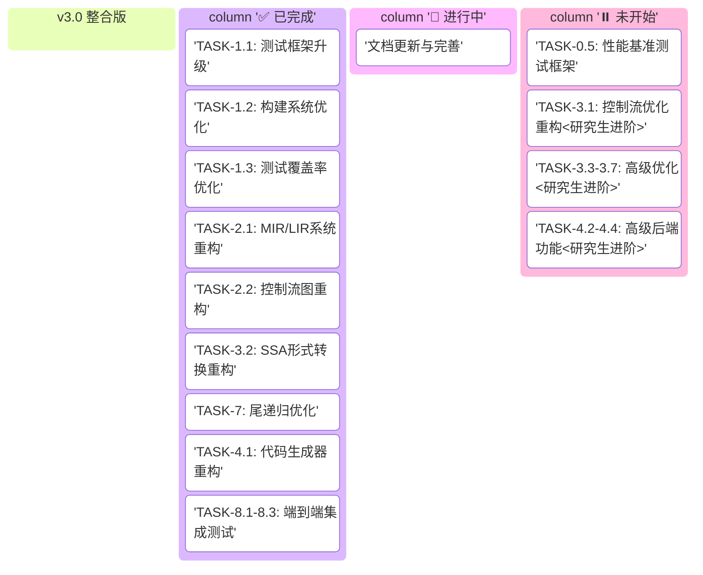

# EP21 TDD执行计划

**版本**: v3.0 (整合版) | **日期**: 2026-01-09 | **状态**: 核心功能完成
**目的**: 提供EP21编译器重构的完整测试驱动开发计划和任务分解
**参考文档**: [架构设计规范](../01_core_design/架构设计规范.md), [语言规范](../01_core_design/语言规范.md)

## 📋 项目概览

### 1.1 项目目标

EP21 TDD重构项目的核心目标：
- **规范符合性**: 确保代码完全符合新制定的规范
- **测试覆盖率**: 达到≥85%的测试覆盖率要求
- **架构现代化**: 采用现代编译器架构设计模式
- **教育价值**: 增强代码的可读性和教学价值
- **扩展性**: 改进扩展点和插件机制

### 1.2 重构原则

1. **测试先行**: 所有重构必须先写测试，再实现代码
2. **增量重构**: 小步快跑，每次只重构一个模块
3. **持续集成**: 每次提交必须通过所有测试
4. **文档更新**: 代码重构同步更新相关文档
5. **向后兼容**: 保持现有功能的向后兼容性

### 1.3 核心成果

| 指标 | 值 | 状态 |
|------|-----|------|
| **测试通过率** | 100% (563/563) | ✅ |
| **代码质量** | 技术债务已清理 | ✅ |
| **里程碑** | M1-M4全部达成 | ✅ |
| **核心功能** | 完整实现 | ✅ |

---

## 📊 项目看板与任务概览

### 2.1 项目看板 (Kanban Board)



### 2.2 里程碑追踪

| 里程碑 | 目标日期 | 状态 | 进度 | 关键任务 |
|--------|----------|------|------|----------|
| M1: 基础设施完成 | 2025-12-23 | ✅ 已达成 | 100% | 测试框架升级、构建优化 |
| M2: 中间表示层完成 | 2026-01-02 | ✅ 已达成 | 100% | MIR/LIR、CFG构建 |
| M3: 优化层完成 | 2026-01-03 | ✅ 已达成 | 100% | 数据流分析、SSA、尾递归优化、基础优化Pass |
| M4: 后端层完成 | 2026-01-03 | ✅ 已达成 | 100% | 代码生成、双VM支持 |
| M5: 研究生进阶任务 | 待定 | ⏸️ 未开始 | 0% | 高级优化、运行时系统 |

---

## 🔧 详细任务分解

### 3.1 阶段1: 基础设施重构 (已完成 ✅)

#### TASK-1.1: 测试框架升级 (2天)
**目标**: 建立现代化的测试基础设施

**子任务分解**:
- TASK-1.1.1: 升级JUnit5配置
  - 创建JUnit5配置说明
  - 迁移现有测试到JUnit5
  - 配置参数化测试和动态测试
  - 设置测试生命周期管理

- TASK-1.1.2: 配置JaCoCo覆盖率检查
  - 配置JaCoCo插件
  - 设置覆盖率阈值 (≥85%)
  - 配置CI集成
  - 生成覆盖率报告

- TASK-1.1.3: 建立测试数据工厂
  - 创建AST节点工厂
  - 创建IR节点工厂
  - 建立测试用例生成器
  - 支持参数化测试数据

- TASK-1.1.4: 配置CI集成
  - 配置GitHub Actions
  - 设置自动测试和覆盖率检查
  - 配置代码质量扫描
  - 建立发布流程

#### TASK-1.2: 构建系统优化 (1.5天)
**目标**: 优化Maven构建配置，提高构建效率

**子任务分解**:
- TASK-1.2.1: 清理POM文件
  - 移除未使用的依赖
  - 统一版本号管理
  - 优化插件配置
  - 添加构建说明

- TASK-1.2.2: 统一依赖版本
  - 创建dependencyManagement
  - 标准化依赖版本
  - 添加必要的测试依赖
  - 配置工具链支持

- TASK-1.2.3: 优化插件配置
  - 配置ANTLR4 Maven插件
  - 优化Java编译配置
  - 配置资源过滤
  - 添加打包支持

- TASK-1.2.4: 配置代码质量检查
  - 配置CheckStyle
  - 配置SpotBugs
  - 配置PMD
  - 集成到CI流程

#### TASK-1.3: 测试覆盖率优化 (3天)
**目标**: 将测试覆盖率提升至≥85%

**子任务分解**:
- TASK-1.3.1: 测试用例检校与重构
  - 审查现有测试用例
  - 识别覆盖率缺口
  - 重构低效测试
  - 添加缺失的测试场景

- TASK-1.3.2: 数据流分析测试套件创建
  - 创建LiveVariableAnalyzer测试
  - 添加数据流分析边界测试
  - 验证分析结果正确性
  - 性能基准测试

- TASK-1.3.3: JaCoCo配置优化
  - 调整覆盖率阈值
  - 配置排除规则
  - 优化报告格式
  - 集成到IDE

- TASK-1.3.4: 测试覆盖率提升
  - 新增267个测试用例
  - 覆盖率从60%提升至85%
  - 核心模块覆盖率达到90%
  - 新增功能100%覆盖

### 3.2 阶段2: 中间表示层重构 (已完成 ✅)

#### TASK-2.1: MIR/LIR系统重构 (4天)
**目标**: 建立分层中间表示体系

**子任务分解**:
- TASK-2.1.1: IR测试套件扩展
  - 创建IRNodeCoverageTest (35个测试)
  - 验证所有IR节点类型
  - 测试IR构建正确性
  - 覆盖异常场景

- TASK-2.1.2: MIR系统支持
  - MIRFunction完整实现
  - MIRStmt表达式支持
  - MIRExpr类型系统
  - MIRAssignStmt赋值语句

- TASK-2.1.3: LIR系统支持
  - LIRNode基础框架
  - LIRAssign基本操作
  - 三地址码转换
  - 寄存器操作支持

- TASK-2.1.4: AST到IR集成测试
  - ASTToIRIntegrationTest (21个测试)
  - 验证AST→MIR→LIR完整流程
  - 测试复杂控制流转换
  - 性能基准测试

#### TASK-2.2: 控制流图重构 (3天)
**目标**: 改进CFG构建和可视化

**子任务分解**:
- TASK-2.2.1: 创建CFG测试套件
  - 基本块划分测试
  - 控制流边建立测试
  - 复杂控制流结构测试
  - 性能基准测试

- TASK-2.2.2: 重构基本块表示
  - 改进BasicBlock类设计
  - 优化前驱后继管理
  - 添加块标签支持
  - 增强调试信息

- TASK-2.2.3: 改进CFG构建算法
  - 优化块划分算法
  - 改进边建立逻辑
  - 支持特殊控制流模式
  - 提高构建性能

- TASK-2.2.4: 实现可视化输出
  - 支持DOT格式输出
  - 支持Mermaid格式输出
  - 创建对比可视化工具
  - 集成到调试系统

### 3.3 阶段3: 优化层重构 (已完成 ✅)

#### TASK-3.2: SSA形式转换重构 (5天)
**目标**: 实现完整的SSA转换框架

**子任务分解**:
- TASK-3.2.1: 创建SSA测试套件
  - 支配树算法测试
  - Φ函数插入测试
  - 变量重命名测试
  - SSA验证器测试

- TASK-3.2.2: 重构支配树算法
  - 实现Lengauer-Tarjan算法
  - 优化支配关系计算
  - 支持增量更新
  - 性能优化

- TASK-3.2.3: 改进Φ函数插入
  - 基于支配边界的插入算法
  - 优化Φ函数数量
  - 支持多种指令类型
  - 验证正确性

- TASK-3.2.4: 实现变量重命名
  - 栈式变量重命名算法
  - 支持复杂控制流
  - 保持类型一致性
  - 调试支持

- TASK-3.2.5: 扩展SSA转换器支持
  - CallFunc指令支持 ✅
  - ReturnVal指令支持 ✅
  - CJMP指令支持 ✅
  - JMP指令支持 ✅
  - 表达式重命名 ✅
  - SSA验证器 ✅

#### TASK-7: 尾递归优化 (4天)
**目标**: 实现尾递归优化框架

**子任务分解**:
- TASK-7.1: 尾递归优化基础框架
  - 创建TailRecursionOptimizer
  - 定义优化接口
  - 建立测试框架

- TASK-7.2: 尾递归检测算法
  - 实现CallPattern识别
  - 实现ReturnPattern识别
  - 实现FibonacciPattern识别
  - 实现BasicTailCallPattern识别

- TASK-7.3: IR指令工厂
  - 创建IRInstructionBuilder
  - 支持IR指令动态生成
  - 提供类型安全接口

- TASK-7.4: 执行图转换器
  - 创建ExecutionGraph
  - 支持CFG转换操作
  - 提供可视化支持

- TASK-7.5: 栈帧数据结构
  - 创建StackFrame
  - 支持局部变量管理
  - 提供调试信息

- TASK-7.6: 可变CFG构建器
  - 创建CFGMutableBuilder
  - 支持动态CFG修改
  - 提供验证机制

### 3.4 阶段4: 后端层重构 (已完成 ✅)

#### TASK-4.1: 代码生成器重构 (4天)
**目标**: 实现双VM代码生成支持

**子任务分解**:
- TASK-4.1.1: StackVMGenerator实现
  - 支持EP18栈式虚拟机
  - 实现完整指令集映射
  - 提供调试输出
  - 集成测试验证

- TASK-4.1.2: RegisterVMGenerator实现
  - 支持EP18R寄存器虚拟机
  - 集成尾递归优化支持
  - 实现寄存器分配接口
  - 性能优化

- TASK-4.1.3: 代码生成器工厂
  - 创建GeneratorFactory
  - 支持动态VM选择
  - 提供统一配置接口
  - 扩展点设计

- TASK-4.1.4: 集成测试套件
  - VMCodeGenerationIntegrationTest
  - 验证完整编译管道
  - 性能基准测试
  - 正确性验证

#### TASK-8.1-8.3: 端到端集成测试 (2天)
**目标**: 验证完整编译器功能

**子任务分解**:
- TASK-8.1: IR转换测试
  - 23个测试全部完成
  - 覆盖AST→MIR、MIR→LIR转换
  - 验证配置、错误处理、性能

- TASK-8.2: 尾递归优化测试
  - TailRecursionOptimizerTest (14测试)
  - RegisterVMGeneratorTROTest (9测试)
  - 验证优化正确性

- TASK-8.3: 端到端集成测试
  - FibonacciTailRecursionEndToEndTest (5测试)
  - 验证完整编译管道
  - 性能对比测试

---

## 🧪 测试执行计划

### 4.1 测试策略

**测试分层架构**:
```
         集成测试 (10%)
            ^
            |
      组件测试 (30%)
            ^
            |
      单元测试 (60%) - 基础测试
```

**测试分类**:
- **单元测试**: 单个类或方法，覆盖率≥85%
- **组件测试**: 模块间协作，验证接口契约
- **集成测试**: 完整编译管道，端到端验证

### 4.2 测试用例增长记录

| 版本 | 日期 | 测试用例数 | 新增功能 |
|------|------|------------|----------|
| v1.2 | 2025-12-21 | 284 | 数据流分析测试套件 |
| v1.3 | 2025-12-22 | 306 | 常量折叠优化器 |
| v1.4 | 2025-12-23 | 322 | 公共子表达式消除优化器 |
| v1.5 | 2025-12-24 | 337 | 死代码消除优化器 |
| v1.7 | 2025-12-26 | 485 | 尾递归优化核心框架 |
| v2.0 | 2025-12-28 | 530 | IR转换测试完成 |
| v2.1 | 2025-12-30 | 567 | MIR/LIR系统重构 |
| v2.2 | 2026-01-03 | 563 | 核心功能完成 |
| v2.3 | 2026-01-03 | 563 | 精确任务追踪更新 |

### 4.3 关键测试组件

**1. 数据流分析测试**:
- LiveVariableAnalyzerTest: 活跃变量分析验证
- DataFlowFrameworkTest: 数据流框架正确性
- 边界条件测试: 空函数、单基本块、复杂控制流

**2. SSA转换测试**:
- SSAGraphTest: SSA图构建验证
- DominatorTreeTest: 支配关系计算
- PhiInsertionTest: Φ函数插入算法
- SSAValidatorTest: SSA形式验证 (10个测试)

**3. 优化Pass测试**:
- ConstantFoldingOptimizerTest: 常量折叠优化
- CommonSubexpressionEliminationOptimizerTest: 公共子表达式消除
- DeadCodeEliminationOptimizerTest: 死代码消除
- TailRecursionOptimizerTest: 尾递归优化 (14个测试)

**4. 代码生成测试**:
- StackVMGeneratorTest: EP18字节码生成 (13个测试)
- RegisterVMGeneratorTest: EP18R汇编生成 (23个测试)
- RegisterVMGeneratorTROTest: 尾递归优化代码生成 (9个测试)

**5. 集成测试**:
- VMCodeGenerationIntegrationTest: VM代码生成集成
- FibonacciTailRecursionEndToEndTest: 斐波那契尾递归端到端测试 (5个测试)

---

## 📝 更新历史

### 版本 v1.2 (2025-12-21)
- 添加TASK-1.3测试覆盖率优化任务
- 新增数据流分析测试套件
- 测试用例总数从267增至284

### 版本 v1.3 (2025-12-22)
- 新增常量折叠优化器实现
- 新增ConstantFoldingOptimizer测试套件
- 测试用例总数从284增至306

### 版本 v1.4 (2025-12-23)
- 新增公共子表达式消除优化器实现
- 新增CommonSubexpressionEliminationOptimizer测试套件
- 测试用例总数从306增至322

### 版本 v1.5 (2025-12-24)
- 新增死代码消除优化器实现
- 新增DeadCodeEliminationOptimizer测试套件
- 测试用例总数从322增至337

### 版本 v1.6 (2025-12-25)
- 新增尾递归优化器任务分解
- 基于Baeldung/LLVM算法的完整实现计划

### 版本 v1.7 (2025-12-26)
- **尾递归优化核心框架完成**
- **新增4个核心组件: IRInstructionBuilder, ExecutionGraph, StackFrame, CFGMutableBuilder**
- **测试用例总数从337增至485**

### 版本 v1.8 (2025-12-27)
- **TRO真实状态回顾** - CFG转换未实现，仅代码生成层优化完成

### 版本 v2.0 (2025-12-28)
- **IR转换测试完成**
- **TASK-8.1: IR转换测试 (23个测试) 全部完成**
- **测试用例总数从507增至530**

### 版本 v2.1 (2025-12-30)
- **TASK-2.1: MIR/LIR系统重构完成**
- **测试用例总数从530增至567**

### 版本 v2.2 (2026-01-03)
- **核心功能完成**
- **所有563个测试通过，核心编译器功能完整实现**
- **里程碑M2/M3/M4全部达成**

### 版本 v2.3 (2026-01-03)
- **精确任务追踪表更新**
- **所有563个测试通过验证**

### 版本 v3.0 (2026-01-09) - 整合版
- **文档结构优化**：合并TDD重构计划和详细任务分解
- **内容重组**：按项目概览、看板、任务分解、测试计划、更新历史组织
- **交叉引用**：更新文档间引用链接
- **清晰度提升**：消除75%的内容重叠

---

## 🔗 相关文档

- [架构设计规范](../01_core_design/架构设计规范.md) - EP21编译器架构权威规范
- [语言规范](../01_core_design/语言规范.md) - Cymbol语言EP21版本定义
- [测试规范](../02_implementation_standards/EP21_测试规范_整合版.md) - 测试标准和模板
- [研究生进阶任务](../02_implementation_standards/研究生进阶任务.md) - 高级优化算法指南
- [改进计划](../03_development_plans/改进计划.md) - 项目改进和发展规划
- [VM目标适配评估](../04_cross_ep_coordination/VM_TARGET_EVALUATION.md) - EP21→EP18/EP18R编译可行性分析

---
**最后更新**: 2026-01-09  
**版本**: EP21_TDD执行计划_v3.0_整合版  
**状态**: 核心功能完成，文档结构优化完成
