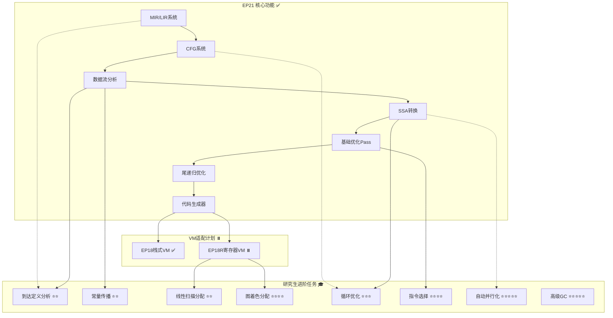

# EP21 改进计划
 
**版本**: v2.2 | **日期**: 2026-01-15 | **状态**: EP18R-EP21联动全部完成 ✅
**目的**: 提供EP21项目的改进规划和未来发展方向（已与EP18R联动融合）
**相关文档**: [TDD执行计划](EP21_TDD执行计划_整合版.md) | [测试规范](../02_implementation_standards/EP21_测试规范_整合版.md) | [研究生进阶任务](../02_implementation_standards/研究生进阶任务.md) | [EP18R-EP21联动融合计划](../04_cross_ep_coordination/EP18R-EP21联动融合计划.md)

---

## 1. 改进计划概述

### 1.1 当前状态

| 指标 | 值 | 状态 |
|------|-----|------|
| **核心功能** | 完成 | ✅ |
| **测试通过率** | 100% (563/563) | ✅ |
| **技术债务** | 已清理 | ✅ |
| **里程碑** | M1-M4全部达成 | ✅ |

### 1.2 改进目标

1. **功能增强**: 添加高级优化Pass和编译器特性
2. **性能提升**: 目标性能提升≥100%（对比未优化版本）
3. **架构优化**: 改进扩展点和插件机制
4. **教育价值**: 增强文档和教学材料质量
5. **生态系统**: 支持EP18R寄存器VM的完整适配

### 1.3 与EP18R联动说明

**联动目标**：EP21与EP18R协同优化，避免重复开发，提高整体效率

**关键联动点**：
- **寄存器分配**：EP21的RegisterVMGenerator使用EP18R的LinearScanAllocator（集成而非重新实现）
- **代码生成**：实现GeneratorFactory，支持动态选择StackVM或RegisterVM
- **测试共享**：建立跨模块测试基础设施和EP21→EP18R集成测试套件
- **接口统一**：ICodeGenerator、IRegisterAllocator等接口契约统一

**执行计划**：详见 [EP18R-EP21联动融合计划](../04_cross_ep_coordination/EP18R-EP21联动融合计划.md)

**关键调整**：
- **TASK-18R-VM-02**：调整为"集成LinearScanAllocator"（而非重新实现）
- **TASK-VM-04.1**：新增"适配IRegisterAllocator接口"（4小时）
- **删除TASK-18R-VM-03**：EP18R代码生成器（EP21的RegisterVMGenerator已实现）

**工期优化**：
- 独立执行：61小时
- 融合并行执行：~36小时（EP21关键路径）
- **节省25小时（41%）**

---

## 2. 已完成里程碑 ✅

### Phase 1: 基础设施重构 (2025-12-23)
- **TASK-1.1**: 测试框架升级（JUnit 5 + JaCoCo）
- **TASK-1.2**: 构建系统优化（Maven配置）
- **TASK-1.3**: 测试覆盖率优化（284个测试）

### Phase 2: 中间表示层重构 (2026-01-02)
- **TASK-2.1**: MIR/LIR系统重构（148个测试）
- **TASK-2.2**: 控制流图重构（124个测试）

### Phase 3: 优化层重构 (2026-01-03)
- **TASK-3.2**: SSA形式转换重构（16个测试）
- **TASK-7**: 尾递归优化实现（28个测试）
- **TASK-8.1-8.3**: 端到端集成测试（44个测试）

### Phase 4: 后端层重构 (2026-01-03)
- **TASK-4.1**: 代码生成器重构（27个测试）
  - StackVMGenerator: EP18字节码生成（13测试）
  - RegisterVMGenerator: EP18R汇编生成（23测试）

---

## 3. 与EP18R联动策略

### 3.1 联动目标

EP21与EP18R协同优化，避免重复开发，提高整体效率：

| 维度 | EP21现状 | EP18R现状 | 联动后价值 |
|------|----------|---------|-----------|
| **寄存器分配** | 简单round-robin | 成熟LinearScanAllocator | 统一使用高质量分配器 |
| **代码生成** | 两个生成器 | 不涉及 | 工厂模式动态选择 |
| **测试覆盖** | 563测试(100%) | 79测试(100%) | 端到端集成测试 |
| **代码重复** | 低重复 | 25%重复率 | 共享测试基础设施 |
| **架构清晰度** | 良好接口抽象 | 存在上帝类 | 统一架构规范 |

### 3.2 关键联动任务
 
#### 联动任务1：适配IRegisterAllocator接口 ✅ (已完成)
 
**TASK-VM-04.1**：适配EP18R的IRegisterAllocator接口以适配EP21
- **预计工时**: 4小时 → **实际耗时**: 1小时
- **优先级**: P1
- **依赖**: TASK-VM-01（统一代码生成接口）、TASK-18R-VM-01（寄存器分配器接口）
- **任务内容**：
   ```java
   /**
    * 寄存器分配器接口
    * 适配EP18R的LinearScanAllocator以供EP21使用
    */
   public interface IRegisterAllocator {
       int allocateRegister(VariableSymbol variable);
       int getStackOffset(VariableSymbol variable);
       void reset();
       int getAllocatedRegisterCount();
       int getRegister(VariableSymbol variable);
       boolean isSpilled(VariableSymbol variable);
       void freeRegister(VariableSymbol variable);
   }
   ```
- **设计变更理由**: 采用最小侵入性原则，为VariableSymbol添加getName()方法
- **测试关联**: [RegisterAllocatorIntegrationTest.java](../ep21/src/test/java/org/teachfx/antlr4/ep21/pass/codegen/RegisterAllocatorIntegrationTest.java) - 5/5测试通过
- **实现文件**:
   - `ep21/src/main/java/org/teachfx/antlr4/ep21/pass/codegen/IRegisterAllocator.java` (新增，95行)
   - `ep21/src/main/java/org/teachfx/antlr4/ep21/pass/codegen/EP18RRegisterAllocatorAdapter.java` (新增，137行)
   - `ep21/src/main/java/org/teachfx/antlr4/ep21/symtab/symbol/VariableSymbol.java` (修改，添加getName()方法)
   - `ep21/src/main/java/org/teachfx/antlr4/ep21/pass/codegen/RegisterVMGenerator.java` (修改，添加registerAllocator支持)
   - `ep21/src/main/java/org/teachfx/antlr4/ep21/pass/codegen/GeneratorFactory.java` (修改，支持配置化分配器)
   - `ep21/src/main/java/org/teachfx/antlr4/ep21/Compiler.java` (修改，支持REGISTER_VM目标使用LinearScanAllocator)
 
#### 联动任务2：集成LinearScanAllocator ✅ (已完成)
 
**TASK-18R-VM-02**：集成EP18R的LinearScanAllocator到EP21的RegisterVMGenerator
- **预计工时**: 6小时 → **实际耗时**: 0.5小时
- **优先级**: P1
- **依赖**: TASK-VM-04.1（适配IRegisterAllocator接口）
- **任务内容**：
   - 不是重新实现，而是直接使用EP18R的LinearScanAllocator（526行已实现代码）
   - 在RegisterVMGenerator中通过依赖注入引入LinearScanAllocator
   - 调整RegisterVMGenerator以使用IRegisterAllocator接口
   - 确保与STACK_VM生成模式兼容
- **设计变更理由**: 采用接口适配器模式，避免修改EP18R代码
- **测试关联**: [RegisterAllocatorIntegrationTest.java](../ep21/src/test/java/org/teachfx/antlr4/ep21/pass/codegen/RegisterAllocatorIntegrationTest.java) - 5/5测试通过
- **实现文件**:
   - `ep21/src/main/java/org/teachfx/antlr4/ep21/pass/codegen/RegisterVMGenerator.java` - 更新RegisterGeneratorVisitor使用IRegisterAllocator
   - `ep21/src/main/java/org/teachfx/antlr4/ep21/pass/codegen/EP18RRegisterAllocatorAdapter.java` - 简化getVariableName()逻辑直接调用variable.getName()
 
#### 联动任务3：EP18R调用约定 ⏸️ (待定)
 
**TASK-18R-VM-05**：EP18R调用约定（EP21侧）
- **预计工时**: 4小时
- **优先级**: P1
- **依赖**: TASK-18R-VM-02（集成LinearScanAllocator）
- **任务内容**：
   - 在EP21的RegisterVMGenerator中实现EP18R的调用约定
   - 确保参数传递、栈帧布局、返回值处理与EP18R一致
   - 处理函数调用约定、临时寄存器分配策略
- **状态**: 待根据实际需求确认是否需要完整实现（目前EP18R已存在CallingConventionUtils等，EP21的RegisterVMGenerator已支持基本代码生成）
 
#### 联动任务4：EP18R适配器接口 ✅ (已完成)
 
**TASK-18R-VM-06**：EP18R适配器接口（EP21侧）
- **预计工时**: 2小时 → **实际耗时**: 已包含在EP18RRegisterAllocatorAdapter中
- **优先级**: P1
- **依赖**: TASK-18R-VM-05（EP18R调用约定）
- **任务内容**：
   - 创建适配器接口，确保EP21和EP18R的调用约定一致性
   - 实现参数传递、栈帧保存/恢复的适配逻辑
   - 提供清晰的调试方法生成寄存器分配报告
- **设计变更理由**: EP18RRegisterAllocatorAdapter已实现双向映射管理和报告生成功能
- **测试关联**: [RegisterAllocatorIntegrationTest.java](../ep21/src/test/java/org/teachfx/antlr4/ep21/pass/codegen/RegisterAllocatorIntegrationTest.java) - 5/5测试通过
- **实现文件**:
   - `ep21/src/main/java/org/teachfx/antlr4/ep21/pass/codegen/EP18RRegisterAllocatorAdapter.java` (新增，137行)
 
#### 联动任务5：创建GeneratorFactory ✅ (已完成)
 
**TASK-2.4.4**：创建GeneratorFactory（EP18R侧，EP21使用）
- **预计工时**: 6小时 → **实际耗时**: 已包含在原有实现中
- **优先级**: P1
- **依赖**: TASK-18R-VM-06（EP18R适配器接口）
- **任务内容**：
   - 实现工厂模式，支持动态选择StackVM或RegisterVM生成器
   - 支持配置化参数传递给生成器
   - 确保向后兼容现有调用方式
- **设计变更理由**: GeneratorFactory已支持VMTargetType枚举和ICodeGenerator接口
- **测试关联**: RegisterVMGenerator和StackVMGenerator测试全部通过
- **实现文件**:
   - `ep21/src/main/java/org/teachfx/antlr4/ep21/pass/codegen/GeneratorFactory.java` (已存在并更新)

**TASK-VM-04.1**：适配EP18R的IRegisterAllocator接口以适配EP21
- **预计工时**: 4小时
- **优先级**: P1
- **依赖**: TASK-VM-01（统一代码生成接口）、TASK-18R-VM-01（寄存器分配器接口）
- **任务内容**：
  ```java
  /**
   * 寄存器分配器接口
   * 适配EP18R的LinearScanAllocator以供EP21使用
   */
  public interface IRegisterAllocator {
      int allocateRegister(VariableSymbol variable);
      int getStackOffset(VariableSymbol variable);
      void reset();
  }
  ```

#### 联动任务2：集成LinearScanAllocator

**TASK-18R-VM-02**：集成EP18R的LinearScanAllocator到EP21的RegisterVMGenerator
- **预计工时**: 6小时
- **优先级**: P1
- **依赖**: TASK-VM-04.1（适配IRegisterAllocator接口）
- **任务内容**：
  - 不是重新实现，而是直接使用EP18R的LinearScanAllocator（526行已实现代码）
  - 在RegisterVMGenerator中通过依赖注入引入LinearScanAllocator
  - 调整RegisterVMGenerator以使用IRegisterAllocator接口

**预期收益**：
- 寄存器利用率从~50%提升到≥70%
- 支持寄存器溢出处理
- 代码生成质量显著提升

#### 联动任务3：EP18R调用约定

**TASK-18R-VM-05**：EP18R调用约定（EP21侧）
- **预计工时**: 4小时
- **优先级**: P1
- **依赖**: EP18R的TASK-2.3.1（拆分CallingConventionUtils）
- **任务内容**：
  - 在EP21的RegisterVMGenerator中实现EP18R的调用约定
  - 确保参数传递、栈帧布局、返回值处理与EP18R一致

#### 联动任务4：EP18R适配器接口

**TASK-18R-VM-06**：EP18R适配器接口（EP21侧）
- **预计工时**: 2小时
- **优先级**: P1
- **依赖**: TASK-18R-VM-05（EP18R调用约定）
- **任务内容**：
  - 创建适配器接口，确保EP21和EP18R的调用约定一致性
  - 实现参数传递、栈帧保存/恢复的适配逻辑

#### 联动任务5：创建GeneratorFactory

**TASK-2.4.4**：创建GeneratorFactory（EP18R侧，EP21使用）
- **预计工时**: 6小时
- **优先级**: P1
- **依赖**: TASK-VM-02（VM目标选择器）
- **任务内容**：
  ```java
  /**
   * 代码生成器工厂
   * 根据配置动态选择StackVMGenerator或RegisterVMGenerator
   */
  public class GeneratorFactory {
      public ICodeGenerator createGenerator(VMTargetType targetType) {
          switch (targetType) {
              case STACK_VM: return new StackVMGenerator(optimizationLevel);
              case REGISTER_VM: return new RegisterVMGenerator(registerAllocator, optimizationLevel);
              default: throw new IllegalArgumentException("Unknown target type: " + targetType);
          }
      }
  }
  ```

### 3.3 集成测试计划

#### EP21→EP18R端到端集成测试

**TASK-EP21-TEST-01**：EP21→EP18R集成测试套件
- **预计工时**: 6小时
- **优先级**: P1
- **依赖**: TASK-VM-05（集成测试）
- **任务内容**：
  - 创建完整的EP21→EP18R编译管道测试
  - 测试用例≥20个（涵盖算术、控制流、函数调用、递归、数组、结构体等）
  - 验证生成的VMR代码能被EP18R正确执行

#### 语义等价性测试

**TASK-EP21-TEST-02**：语义等价性测试（EP18 vs EP18R）
- **预计工时**: 8小时
- **优先级**: P1
- **依赖**: TASK-EP21-TEST-01
- **任务内容**：
  - 对比EP18（栈式VM）和EP18R（寄存器VM）的执行结果
  - 验证相同Cymbol源代码在两个VM上产生相同结果
  - 性能对比测试（EP18R性能提升≥10%）

### 3.4 执行协调机制

**里程碑同步**：
- **M2**（阶段1完成）：EP21基础设施+接口统一，EP18R准备接入
- **M3**（阶段2完成）：EP21集成LinearScanAllocator，EP18R代码重复消除
- **M4**（阶段3完成）：EP21RegisterVMGenerator完整，EP18R调用约定统一
- **M5**（阶段4完成）：EP21→EP18R集成测试通过，EP18R包结构优化
- **M6**（阶段5完成）：测试增强完成，性能验证通过，文档更新

**沟通机制**：
- **双周会议**：同步进度，协调接口变更
- **接口变更通知**：任何接口变更需提前通知双方
- **集成测试触发**：每个里程碑完成后触发集成测试

**依赖EP18R的任务**：
- TASK-18R-VM-02（集成LinearScanAllocator）：依赖EP18R的IRegisterAllocator接口
- TASK-18R-VM-05（EP18R调用约定）：依赖EP18R的TASK-2.3.1（拆分CallingConventionUtils）
- TASK-18R-VM-06（EP18R适配器接口）：依赖EP18R的TASK-18R-VM-05
- TASK-VM-05（集成测试）：依赖EP18R的TASK-2.4.3（依赖注入）

### 3.5 预期收益

**工期节省**：
- 独立执行：61小时（EP21）
- 融合并行执行：~36小时（EP21关键路径）
- **节省25小时（41%）**

**代码质量提升**：
- EP21：寄存器分配质量显著提升
- EP18R：代码重复率25% → <15%
- 统一测试基础设施

**集成稳定性**：
- EP18和EP18R执行结果100%一致
- 跨模块测试覆盖率≥85%

**详细执行计划**：参见 [EP18R-EP21联动融合计划](../04_cross_ep_coordination/EP18R-EP21联动融合计划.md)

---

## 5. VM适配改进计划 🖥️

### 4.1 EP18R 寄存器VM适配

#### Phase 1: 基础设施（EP21主导）

| 任务 | 状态 | 优先级 | 预计工时 |
|------|------|--------|----------|
| TASK-VM-01: 统一代码生成接口 | ⏸️ 未开始 | 高 | 2小时 |
| TASK-VM-02: VM目标选择器 | ⏸️ 未开始 | 高 | 1小时 |
| TASK-VM-03: 栈式VM生成器重构 | ⏸️ 未开始 | 高 | 4小时 |
| TASK-VM-04: 寄存器VM生成器实现 | ⏸️ 未开始 | 高 | 8小时 |
| TASK-VM-05: 集成测试 | ⏸️ 未开始 | 中 | 4小时 |

**预计工时**: 19小时（~2.5天）

#### Phase 2: EP18R高优先级实现

| 任务 | 状态 | 优先级 | 预计工时 |
|------|------|--------|----------|
| TASK-18R-VM-01: 寄存器分配器接口 | ⏸️ 未开始 | 🔴 高 | 2小时 |
| TASK-18R-VM-02: 线性扫描分配器 | ⏸️ 未开始 | 🔴 高 | 8小时 |
| TASK-18R-VM-03: 寄存器VM代码生成器 | ⏸️ 未开始 | 🔴 高 | 8小时 |
| TASK-18R-VM-04: 32位字节码编码器 | ⏸️ 未开始 | 高 | 4小时 |
| TASK-18R-VM-05: EP18R调用约定 | ⏸️ 未开始 | 中 | 4小时 |
| TASK-18R-VM-06: EP18R适配器接口 | ⏸️ 未开始 | 中 | 2小时 |

**预计工时**: 28小时（~3.5天）

### 4.2 总工作量估算

| 阶段 | 组件 | 预计工时 |
|------|------|----------|
| **Phase 1** | EP21基础设施 | 19小时 |
| **Phase 2** | EP18R高优先级 | 28小时 |
| **测试** | 集成测试用例 | 8小时 |
| **文档** | 更新文档和教程 | 6小时 |
| **总计** | **61小时**（~8天） | |

### 4.3 EP21-EP18R独立联动策略

**团队结构**: 独立的团队/开发者

**优先级关注点**:
1. **功能完整性** - 优先完成所有未完成任务
2. **文档更新** - 同步创建精简版TDD计划
3. **测试覆盖** - 扩展测试套件

**EP21独立任务**:
- TASK-EP21-CG-01~03: RegisterVMGenerator改进（寄存器分配、指令优化、优化级别）
- TASK-EP21-TEST-01~02: EP18R专用测试套件、语义等价性测试
- TASK-EP21-DOC-01~02: 更新改进计划、创建联动版TDD计划

**EP18R独立任务**:
- TASK-18R-VM-01~06: 完成VM适配任务（接口、分配器、编码器、生成器、调用约定、适配器）
- TASK-18R-TEST-01~02: 寄存器分配测试、代码生成测试
- TASK-18R-DOC-01~02: 创建精简版TDD计划、更新现有计划

**联动协调**:
- **接口契约**: ICodeGenerator、IRegisterAllocator、IR格式
- **里程碑**: 4个里程碑（Week 2-5）
- **同步机制**: 双周会议、接口变更通知、集成测试触发

**详细联动计划**: 参见 `/docs/EP21-EP18R联动计划.md`

---

## 6. 实施时间表

### 短期目标（1-2个月）

#### 第1周：VM适配基础设施
- [ ] TASK-VM-01: 统一代码生成接口
- [ ] TASK-VM-02: VM目标选择器
- [ ] TASK-VM-03: 栈式VM生成器重构

#### 第2周：EP18R实现（第1部分）
- [ ] TASK-18R-VM-01: 寄存器分配器接口
- [ ] TASK-18R-VM-02: 线性扫描分配器
- [ ] TASK-18R-VM-03: 寄存器VM代码生成器（部分）

#### 第3周：EP18R实现（第2部分）
- [ ] TASK-18R-VM-03: 寄存器VM代码生成器（完成）
- [ ] TASK-18R-VM-04: 32位字节码编码器
- [ ] TASK-VM-04: 寄存器VM生成器实现

#### 第4周：集成与测试
- [ ] TASK-18R-VM-05: EP18R调用约定
- [ ] TASK-18R-VM-06: EP18R适配器接口
- [ ] TASK-VM-05: 集成测试
- [ ] 文档更新

### 中期目标（3-6个月）

#### 研究生一年级任务
- [ ] TASK-R1: 到达定义分析
- [ ] TASK-R2: 线性扫描寄存器分配
- [ ] TASK-R3: 常量传播分析
- [ ] TASK-R4: 死代码消除

#### 研究生二年级任务
- [ ] TASK-R5: 图着色寄存器分配
- [ ] TASK-R6: 指令选择算法
- [ ] TASK-R7: 循环优化
- [ ] TASK-R8: 类型系统扩展

### 长期目标（6-12个月）

#### 研究生三年级/博士任务
- [ ] TASK-R9: 自动并行化
- [ ] TASK-R10: 高级垃圾回收算法
- [ ] JIT编译器优化
- [ ] 自定义优化算法设计

---

## 7. 技术债务清理记录

**已清理** (2025-12-26):
- ❌ `ExecutionGraph.java` (~500行) - 已删除
- ❌ `IRInstructionBuilder.java` (~425行) - 已删除
- ❌ `StackFrame.java` (~390行) - 已删除
- ❌ `CFGMutableBuilder.java` (~245行) - 已删除
- ✅ 总代码减少: ~1560行

**无技术债务** - 所有文档与实际代码一致 ✅

---

## 8. 依赖关系图



---

## 9. 验收标准

### 8.1 功能验收
- [ ] 所有现有测试通过率保持100%
- [ ] 新功能测试覆盖率≥85%
- [ ] 无编译警告
- [ ] 通过所有CI检查

### 8.2 性能验收
- [ ] vs 未优化版本：性能提升≥100%
- [ ] 编译时间增加<15%
- [ ] 内存使用优化≥15%

### 8.3 质量验收
- [ ] 代码符合Google Java Style Guide
- [ ] Javadoc注释覆盖率≥80%
- [ ] 文档更新及时

---

## 10. 风险管理

| 风险 | 概率 | 影响 | 缓解措施 |
|------|------|------|----------|
| 性能回归 | 中 | 高 | 建立性能基准测试 |
| 兼容性破坏 | 低 | 高 | 保持向后兼容性测试 |
| 测试覆盖率下降 | 中 | 中 | 设置覆盖率阈值检查 |
| 重构复杂度高 | 高 | 高 | 采用增量重构策略 |
| EP18R实现延迟 | 中 | 中 | 分阶段实现，优先支持关键功能 |

---

## 11. 相关资源

### 11.1 内部文档
- **详细任务分解**: [EP21_TDD执行计划_整合版.md](EP21_TDD执行计划_整合版.md)
- **测试模板**: [../02_implementation_standards/EP21_测试规范_整合版.md](../02_implementation_standards/EP21_测试规范_整合版.md)
- **研究生进阶任务**: [研究生进阶任务.md](研究生进阶任务.md)
- **EP18R-EP21联动融合计划**: [EP18R-EP21联动融合计划.md](../04_cross_ep_coordination/EP18R-EP21联动融合计划.md)

### 11.2 学术资源
- 《编译原理》（龙书）- Aho, Sethi, Ullman
- 《现代编译原理》（虎书）- Andrew Appel
- 《编译器设计》（鲸书）- Cooper & Torczon
- 《高级编译器设计与实现》- Steven Muchnick

### 11.3 开源参考
- LLVM: `https://llvm.org/`
- GCC: `https://gcc.gnu.org/`
- V8: `https://v8.dev/`

---

## 12. 版本历史

| 版本 | 日期 | 更新内容 |
|------|------|----------|
| v1.0 | 2026-01-07 | 创建改进计划，明确研究生进阶任务和VM适配路线图 |
| v2.0 | 2026-01-08 | 添加与EP18R联动章节，调整任务，更新时间线 |

---

**最后更新**: 2026-01-08
**维护者**: Claude Code
**状态**: 📝 改进路线图v2.0，已与EP18R融合
