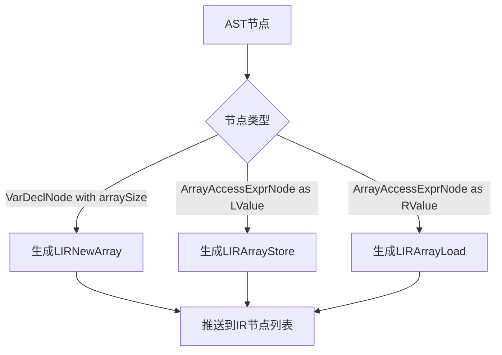

# EP21 数组处理规范文档

## 1. 概述

本文档规范EP21编译器中数组处理的完整实现，包括语法定义、语义、中间表示（IR）设计和代码生成策略。

## 2. C标准数组语法定义

### 2.1 数组类型声明

```c
// 基本数组类型
int[5] arr;
float[10] vec;
bool[2] flags;

// 多维数组（未来支持）
int[3][4] matrix;
```

### 2.2 数组变量声明

```c
// 无初始化
int[10] arr;

// 带初始化（未来支持）
int[5] arr = {1, 2, 3, 4, 5};
```

### 2.3 数组访问

```c
// 读取元素
int x = arr[3];

// 写入元素
arr[0] = 10;
```

## 3. 语义规范

### 3.1 数组分配语义

- **数组大小**：必须是编译时常量表达式（ConstVal）
- **分配时机**：在函数开始时分配所有数组
- **存储位置**：存储在栈帧的FrameSlot中
- **默认值**：元素初始化为0（由虚拟机负责）

### 3.2 数组访问语义

- **索引类型**：必须是整数类型
- **边界检查**：由虚拟机负责运行时检查
- **左值/右值**：
  - `arr[i] = x` - 左值赋值（LIRArrayStore）
  - `x = arr[i]` - 右值读取（LIRArrayLoad）

## 4. 中间表示（IR）设计

### 4.1 IR节点层次结构

```
IRNode (基类)
├── Stmt (语句接口)
│   └── LIRNode (LIR语句基类)
│       ├── LIRNewArray (数组分配)
│       ├── LIRArrayLoad (数组读取)
│       └── LIRArrayStore (数组写入)
├── Expr (表达式接口)
│   └── ArrayAccess (数组访问表达式)
└── Label (标签)
```

### 4.2 数组相关IR节点定义

#### 4.2.1 LIRNewArray

```java
// 数组分配指令
public class LIRNewArray extends LIRNode {
    private final Expr size;              // 数组大小表达式（必须为ConstVal）
    private final VarSlot resultSlot;      // 数组引用存储位置
    private final String elementTypeName;  // 元素类型名称

    // 示例：int[5] arr 生成 LIRNewArray(size=ConstVal(5), resultSlot=arr@0, elementTypeName="int")
}
```

**语义**：
1. 评估size表达式（推送到表达式栈）
2. 调用虚拟机的NEWARRAY指令
3. 将返回的数组引用存储到resultSlot

**代码生成**：
- 栈虚拟机：`push 5; newarray; store @0`
- 寄存器虚拟机：`iconst 5; newarray; store r0`

#### 4.2.2 LIRArrayLoad

```java
// 数组元素读取指令
public class LIRArrayLoad extends LIRNode {
    private final FrameSlot baseSlot;      // 数组引用槽位
    private final Expr index;              // 索引表达式
    private final VarSlot resultSlot;      // 结果存储位置

    // 示例：x = arr[i] 生成 LIRArrayLoad(baseSlot=arr@0, index=i@1, resultSlot=x@2)
}
```

**语义**：
1. 加载数组引用（baseSlot）
2. 评估索引表达式（index）
3. 调用虚拟机的LOAD指令（带偏移）
4. 将读取的值存储到resultSlot

**代码生成**：
- 栈虚拟机：`load @0; load @1; load; store @2`
- 寄存器虚拟机：`load r0, @0; load r1, @1; load r2, r0, r1; store r2, @2`

#### 4.2.3 LIRArrayStore

```java
// 数组元素写入指令
public class LIRArrayStore extends LIRNode {
    private final FrameSlot baseSlot;      // 数组引用槽位
    private final Expr index;              // 索引表达式
    private final Expr value;              // 要写入的值

    // 示例：arr[i] = 10 生成 LIRArrayStore(baseSlot=arr@0, index=i@1, value=ConstVal(10))
}
```

**语义**：
1. 加载数组引用（baseSlot）
2. 评估索引表达式（index）
3. 评估值表达式（value）
4. 调用虚拟机的STORE指令（带偏移）

**代码生成**：
- 栈虚拟机：`load @0; load @1; load @2; store;`
- 寄存器虚拟机：`load r0, @0; load r1, @1; load r2, @2; store r2, r0, r1;`

#### 4.2.4 ArrayAccess

```java
// 数组访问表达式（仅用于AST到IR转换）
public class ArrayAccess extends Expr {
    private final FrameSlot baseSlot;
    private final Expr index;

    // 示例：arr[i] 转换为 ArrayAccess(baseSlot=arr@0, index=i@1)
    // 后续会被转换为LIRArrayLoad或LIRArrayStore
}
```

### 4.3 IR生成流程



## 5. AST节点设计

### 5.1 VarDeclNode（数组声明节点）

```java
public class VarDeclNode extends DeclNode {
    private Expr arraySizeExpr;    // 数组大小表达式（null表示非数组）
    private Expr assignExprNode;   // 初始化表达式（可选）

    public boolean hasArraySize() {
        return arraySizeExpr != null;
    }
}
```

### 5.2 ArrayAccessExprNode（数组访问节点）

```java
public class ArrayAccessExprNode extends ExprNode {
    private ExprNode arrayExpr;    // 数组表达式（通常是IDExprNode）
    private ExprNode indexExpr;    // 索引表达式

    private boolean isLValue = false;  // 左值标记

    public boolean isLValue() { return isLValue; }
    public void setLValue(boolean val) { this.isLValue = val; }
}
```

## 6. IR生成器实现规范

### 6.1 CymbolIRBuilder中的数组处理

#### 6.1.1 访问VarDeclNode

```java
@Override
public Void visit(VarDeclNode varDeclNode) {
    // 处理数组声明
    if (varDeclNode.hasArraySize()) {
        // 1. 创建FrameSlot
        FrameSlot lhs = FrameSlot.get((VariableSymbol) varDeclNode.getIdExprNode().getRefSymbol());

        // 2. 评估大小表达式（推送到表达式栈）
        varDeclNode.getArraySizeExpr().accept(this);

        // 3. 从栈弹出大小表达式
        Expr sizeExpr = peekEvalOperand();
        popEvalOperand();

        // 4. 创建LIRNewArray指令
        LIRNewArray newArrayInstr = new LIRNewArray(sizeExpr, lhs, elementTypeName);

        // 5. 添加到当前基本块
        addInstr(newArrayInstr);
    }

    // 处理初始化（如果有）
    if (varDeclNode.hasInitializer() && !(varDeclNode.getAssignExprNode() instanceof ArrayInitializerExprNode)) {
        // 普通变量初始化处理
        // ...
    }

    return null;
}
```

#### 6.1.2 访问ArrayAccessExprNode

```java
@Override
public VarSlot visit(ArrayAccessExprNode arrayAccessExprNode) {
    // 1. 评估数组表达式（获取FrameSlot）
    arrayAccessExprNode.getArrayExpr().accept(this);
    FrameSlot baseSlot = (FrameSlot) peekEvalOperand();
    popEvalOperand();

    // 2. 评估索引表达式
    arrayAccessExprNode.getIndexExpr().accept(this);
    Expr indexExpr = peekEvalOperand();
    popEvalOperand();

    // 3. 根据上下文生成不同的IR指令
    if (arrayAccessExprNode.isLValue()) {
        // 左值：需要LIRArrayStore（在赋值语句中处理）
        // 创建临时的ArrayAccess节点，延迟处理
        ArrayAccess arrayAccess = new ArrayAccess(baseSlot, indexExpr);
        pushEvalOperand(arrayAccess);
    } else {
        // 右值：直接生成LIRArrayLoad
        VarSlot resultSlot = OperandSlot.genTemp();
        LIRArrayLoad arrayLoadInstr = new LIRArrayLoad(baseSlot, indexExpr, resultSlot);
        addInstr(arrayLoadInstr);
        pushEvalOperand(resultSlot);
    }

    return null;
}
```

#### 6.1.3 处理赋值语句

```java
// 在Assign中处理LIRArrayStore
@Override
public Void visit(Assign assign) {
    // 1. 评估RHS
    assign.rhs.accept(this);
    Expr rhsExpr = peekEvalOperand();

    // 2. 检查LHS是否为数组访问
    if (assign.lhs instanceof ArrayAccess arrayAccess) {
        // 3. 生成LIRArrayStore
        LIRArrayStore arrayStoreInstr = new LIRArrayStore(
            arrayAccess.getBaseSlot(),
            arrayAccess.getIndex(),
            rhsExpr
        );
        addInstr(arrayStoreInstr);
        popEvalOperand();  // 弹出rhsExpr
    } else if (assign.lhs instanceof FrameSlot frameSlot) {
        // 普通变量赋值
        addInstr(Assign.with(frameSlot, rhsExpr));
        popEvalOperand();
    }

    return null;
}
```

## 7. 代码生成器实现规范

### 7.1 RegisterVMGenerator中的LIR处理

#### 7.1.1 修复类型检查问题

**问题**：RegisterVMGenerator.generateInstructions()只检查Stmt和Expr类型，忽略了LIRNode。

**解决方案**：修改代码生成逻辑，直接使用visitor的多态方法。

```java
private int generateInstructions(List<IRNode> instructions, List<String> errors) {
    List<List<IRNode>> functionGroups = splitByFunction(instructions);
    int totalInstructions = 0;

    for (List<IRNode> functionInstructions : functionGroups) {
        RegisterGeneratorVisitor visitor = new RegisterGeneratorVisitor(emitter, operatorEmitter, registerAllocator, errors);

        for (IRNode node : functionInstructions) {
            // 直接使用visitor的多态方法，不需要类型检查
            try {
                node.accept(visitor);
            } catch (Exception e) {
                errors.add("Failed to process IR node " + node.getClass().getSimpleName() + ": " + e.getMessage());
            }
        }

        totalInstructions += visitor.getInstructionCount();
    }

    return totalInstructions;
}
```

#### 7.1.2 RegisterGeneratorVisitor必须实现所有IR节点类型的visit方法

```java
private class RegisterGeneratorVisitor implements IRVisitor<Void, Void> {
    // ... 实现所有IR节点类型的visit方法 ...

    @Override
    public Void visit(LIRNewArray lirNewArray) {
        // 实现数组分配的寄存器代码生成
        Expr sizeExpr = lirNewArray.getSize();
        VarSlot resultSlot = lirNewArray.getResultSlot();

        // 加载数组大小
        if (sizeExpr instanceof ConstVal constVal) {
            Object value = constVal.getVal();
            if (value instanceof Integer intValue) {
                emitter.emit("iconst " + intValue);
            }
        }

        // 执行newarray
        emitter.emit("newarray");

        // 存储结果
        if (resultSlot instanceof FrameSlot frameSlot) {
            emitter.emit("store " + frameSlot.getSlotIdx());
        }

        return null;
    }

    @Override
    public Void visit(LIRArrayLoad lirArrayLoad) {
        // 实现数组读取的寄存器代码生成
        FrameSlot baseSlot = lirArrayLoad.getBaseSlot();
        Expr indexExpr = lirArrayLoad.getIndex();
        VarSlot resultSlot = lirArrayLoad.getResultSlot();

        // 加载数组引用
        int baseReg = loadToRegister(baseSlot);

        // 加载索引
        int indexReg = loadToRegister(indexExpr);

        // 读取元素
        int resultReg = allocateTemp();
        emitter.emit("load r" + resultReg + ", r" + baseReg + ", r" + indexReg);

        // 存储结果
        if (resultSlot instanceof FrameSlot frameSlot) {
            emitter.emit("store r" + resultReg + ", " + frameSlot.getSlotIdx());
        }

        freeTemp(baseReg);
        freeTemp(indexReg);
        freeTemp(resultReg);

        return null;
    }

    @Override
    public Void visit(LIRArrayStore lirArrayStore) {
        // 实现数组写入的寄存器代码生成
        FrameSlot baseSlot = lirArrayStore.getBaseSlot();
        Expr indexExpr = lirArrayStore.getIndex();
        Expr valueExpr = lirArrayStore.getValue();

        // 加载数组引用
        int baseReg = loadToRegister(baseSlot);

        // 加载索引
        int indexReg = loadToRegister(indexExpr);

        // 加载值
        int valueReg = loadToRegister(valueExpr);

        // 写入元素
        emitter.emit("store r" + valueReg + ", r" + baseReg + ", r" + indexReg);

        freeTemp(baseReg);
        freeTemp(indexReg);
        freeTemp(valueReg);

        return null;
    }
}
```

## 8. 表达式栈管理规范

### 8.1 栈操作原则

1. **pushEvalOperand()**：评估表达式后推送结果到栈
2. **popEvalOperand()**：从栈弹出并丢弃值（当值已被使用时）
3. **peekEvalOperand()**：查看栈顶值（不弹出）

### 8.2 数组处理中的栈操作

```java
// 正确的数组大小评估流程
varDeclNode.getArraySizeExpr().accept(this);  // 评估大小表达式
Expr sizeExpr = peekEvalOperand();             // 查看栈顶
popEvalOperand();                             // 弹出并移除
LIRNewArray instr = new LIRNewArray(sizeExpr, ...);  // 使用弹出的值
```

### 8.3 EmptyStackException预防

```java
protected VarSlot peekEvalOperand() {
    if (evalExprStack.isEmpty()) {
        throw new IllegalStateException(
            "Expression evaluation stack is empty when trying to peek. " +
            "This indicates that a previous expression evaluation did not push a value to the stack. " +
            "Current node: " + (curNode != null ? curNode.toString() : "null")
        );
    }
    return evalExprStack.peek();
}
```

## 9. IDExprNode处理规范

### 9.1 IDExprNode的LValue/RValue语义

```java
@Override
public VarSlot visit(IDExprNode idExprNode) {
    if (idExprNode.getRefSymbol() instanceof VariableSymbol) {
        FrameSlot varSlot = FrameSlot.get((VariableSymbol) idExprNode.getRefSymbol());

        // **关键修复**：总是推送到栈
        // 原因：
        // 1. 在表达式上下文（RValue）中，需要读取值
        // 2. 在赋值语句（LValue）中，赋值逻辑会特殊处理
        pushEvalOperand(varSlot);
    }
    return null;
}
```

**说明**：
- 原实现：只有当`!isLValue()`时才推送
- 问题：导致在表达式上下文中使用变量时，栈为空
- 修复：总是推送，由Assign语句的visit方法区分LValue/RValue

## 10. 测试策略

### 10.1 单元测试覆盖

```java
// CymbolIRBuilder测试
@Test
void testArrayDeclaration() {
    String source = "int main() { int[5] arr; return 0; }";
    // 验证生成了LIRNewArray指令
}

@Test
void testArrayAccessLoad() {
    String source = "int main() { int[5] arr; int x = arr[3]; return x; }";
    // 验证生成了LIRArrayLoad指令
}

@Test
void testArrayAccessStore() {
    String source = "int main() { int[5] arr; arr[0] = 10; return 0; }";
    // 验证生成了LIRArrayStore指令
}
```

### 10.2 集成测试覆盖

```java
// 端到端测试
@Test
void testArrayEndToEnd() {
    String source = """
        int sum(int[5] arr) {
            int total = 0;
            int i = 0;
            while (i < 5) {
                total = total + arr[i];
                i = i + 1;
            }
            return total;
        }

        int main() {
            int[5] arr;
            arr[0] = 1;
            arr[1] = 2;
            arr[2] = 3;
            arr[3] = 4;
            arr[4] = 5;
            return sum(arr);
        }
        """;
    // 编译并验证输出
}
```

## 11. 已知限制和未来扩展

### 11.1 当前限制

1. **数组初始化器不支持**：`int[5] arr = {1, 2, 3, 4, 5};`
2. **全局数组不支持**：全局变量的数组声明被跳过
3. **多维数组不支持**：`int[3][4] matrix;`
4. **动态数组大小不支持**：`int[n] arr;`（n必须是常量）

### 11.2 未来扩展

1. 支持数组初始化器
2. 支持全局数组
3. 支持多维数组
4. 支持动态数组大小（堆分配）
5. 数组边界检查优化

## 12. 实现清单

### 12.1 必须修复的问题

- [ ] 修复RegisterVMGenerator.generateInstructions()中的类型检查问题
- [ ] 修复IDExprNode.visit()中的栈操作问题
- [ ] 确保所有LIR节点类型都有对应的visit方法实现
- [ ] 添加EmptyStackException的预防措施

### 12.2 必须完成的实现

- [ ] 实现CymbolIRBuilder.visit(ArrayAccessExprNode)的完整逻辑
- [ ] 实现Assign语句对ArrayAccess的LIRArrayStore处理
- [ ] 完善StackVMGenerator和RegisterVMGenerator的LIR节点处理

### 12.3 测试完善

- [ ] 添加数组声明的单元测试
- [ ] 添加数组访问（读/写）的单元测试
- [ ] 添加端到端的集成测试

---

**文档版本**: 1.0
**创建日期**: 2026-01-21
**作者**: Sisyphus (AI Agent)
**状态**: 规范完成，待实施
