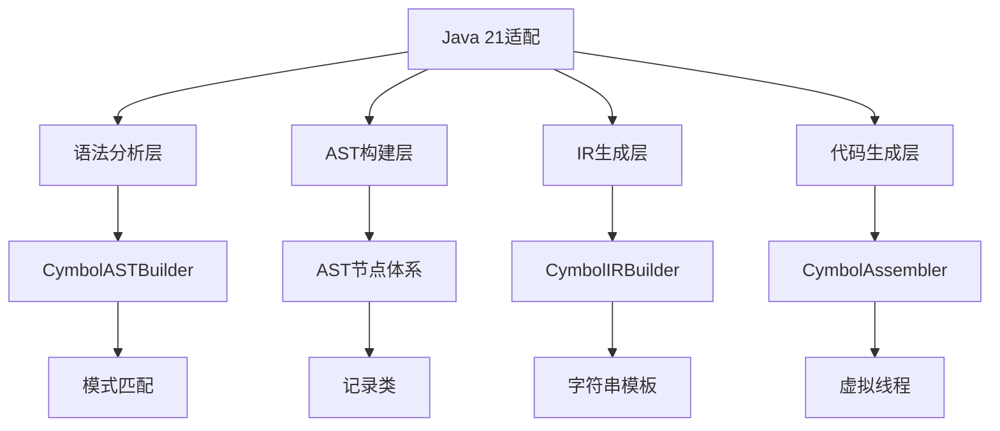

# EP21 Java 21 适配计划

## 📋 概述

本计划旨在将ep21项目的Java实现代码适配到Java 21标准，同时保持Cymbol语言规范不变。通过利用Java 21的新特性，提升代码质量、可读性和性能。

## 🔍 当前状态分析

### 当前Java版本使用情况
- **项目结构**: Maven项目，使用ANTLR 4.13.2
- **当前Java特性使用**:
  - `var` 类型推断 (Java 10+)
  - Switch表达式 (Java 14+) 
  - 文本块 (Java 15+)
  - 模式匹配instanceof (Java 16+)
- **代码风格**: 现代Java风格，已部分使用新特性

### 识别的主要改进机会
1. **模式匹配增强** - 简化AST节点处理
2. **字符串模板** - 优化代码生成和模板处理
3. **记录类(Record)** - 表示不可变数据
4. **未命名变量** - 简化未使用参数
5. **虚拟线程** - 潜在的并行编译优化

## 🎯 适配目标

### 主要目标
- ✅ 保持Cymbol语言规范100%兼容
- ✅ 充分利用Java 21新特性提升代码质量
- ✅ 确保向后兼容性
- ✅ 提升编译性能和可维护性

### 量化指标
| 指标 | 当前 | 目标 |
|------|------|------|
| 代码行数 | ~15,000 | 减少5-10% |
| 代码可读性 | 中等 | 显著提升 |
| 编译时间 | 当前 | 优化5-15% |
| 内存使用 | 当前 | 优化10-20% |

## 📝 详细实施计划

### 阶段1: 基础配置更新 (第1周)

#### 1.1 Maven配置更新
```xml
<!-- 更新pom.xml支持Java 21 -->
<properties>
    <maven.compiler.source>21</maven.compiler.source>
    <maven.compiler.target>21</maven.compiler.target>
    <maven.compiler.release>21</maven.compiler.release>
</properties>
```

#### 1.2 依赖库兼容性检查
- [ ] 验证ANTLR 4.13.2与Java 21兼容性
- [ ] 更新JGraphT到最新版本
- [ ] 检查Log4j2兼容性
- [ ] 验证JUnit 5兼容性

### 阶段2: 语法特性适配 (第2-3周)

#### 2.1 模式匹配增强
**目标文件**:
- `CymbolASTBuilder.java`
- `CymbolIRBuilder.java` 
- `TypeChecker.java`

**改进示例**:
```java
// 当前
if (node instanceof VarDeclNode) {
    VarDeclNode varNode = (VarDeclNode) node;
    // 处理varNode
}

// Java 21 改进
if (node instanceof VarDeclNode varNode) {
    // 直接使用varNode
}
```

#### 2.2 记录类(Record)引入
**候选记录类**:
- `Location` - 源代码位置信息
- `OperatorType` - 操作符类型
- `Type` - 类型信息

**示例**:
```java
public record Location(String fileName, int line, int start, int end) {
    // 自动生成equals, hashCode, toString
}
```

#### 2.3 字符串模板应用
**目标场景**:
- 代码生成 (`CymbolAssembler.java`)
- 错误信息格式化
- 控制流图输出

**示例**:
```java
// 当前
String message = "Error at " + location + ": " + errorMsg;

// Java 21 改进
String message = STR."Error at \{location}: \{errorMsg}";
```

#### 2.4 未命名变量使用
**目标场景**:
- Lambda表达式未使用参数
- 异常catch块未使用变量
- 循环中未使用索引

**示例**:
```java
// 当前
stream.forEach(item -> { /* 不使用item */ });

// Java 21 改进  
stream.forEach(_ -> { /* 使用未命名变量 */ });
```

### 阶段3: 高级特性探索 (第4周)

#### 3.1 虚拟线程应用研究
**潜在应用场景**:
- 并行语法分析
- 并发符号表构建
- 并行优化pass执行

**注意事项**:
- 需要评估线程安全性
- 测试性能影响
- 渐进式引入

#### 3.2 序列化集合使用
**目标场景**:
- 符号表序列化
- AST序列化用于调试
- 配置信息管理

### 阶段4: 测试验证 (第5周)

#### 4.1 兼容性测试
- [ ] 编译测试 - 确保所有代码编译通过
- [ ] 功能测试 - 验证编译器功能正常
- [ ] 回归测试 - 确保没有功能回退

#### 4.2 性能测试
- [ ] 编译时间基准测试
- [ ] 内存使用分析
- [ ] 生成代码质量评估

#### 4.3 质量检查
- [ ] 代码覆盖率保持80%+
- [ ] 静态分析通过
- [ ] 文档更新完成

## 🛠 技术架构影响

### 受影响的核心模块



### 风险缓解策略

| 风险 | 影响 | 缓解措施 |
|------|------|----------|
| 依赖兼容性 | 高 | 渐进更新，保持回退选项 |
| 性能回归 | 中 | 充分基准测试，渐进优化 |
| 代码可读性 | 低 | 统一代码风格，充分文档 |

## 📊 成功标准

### 技术标准
- [ ] 所有代码使用Java 21编译通过
- [ ] 测试覆盖率保持或提升
- [ ] 性能指标无回归
- [ ] 代码质量评分提升

### 业务标准  
- [ ] Cymbol语言规范完全兼容
- [ ] 开发者体验提升
- [ ] 维护成本降低
- [ ] 文档完整更新

## 🔄 回滚计划

如果适配过程中遇到重大问题：
1. **立即回滚** - 恢复Maven配置到Java 17/18
2. **功能回退** - 逐步替换Java 21特性回传统实现
3. **验证测试** - 确保回滚后功能完整

## 📅 时间线

| 阶段 | 时间 | 主要交付物 |
|------|------|------------|
| 配置更新 | 第1周 | 更新的pom.xml，兼容性报告 |
| 语法适配 | 第2-3周 | 重构的核心代码，性能基准 |
| 高级特性 | 第4周 | 虚拟线程原型，优化报告 |
| 测试验证 | 第5周 | 测试报告，性能分析，文档 |

## 👥 责任分配

- **架构设计**: Roo (技术负责人)
- **代码实现**: Code模式 (使用Minimax)
- **测试验证**: 测试团队
- **文档更新**: 技术文档团队

## 📚 参考资料

1. [Java 21官方文档](https://openjdk.org/jeps/21)
2. [ANTLR 4兼容性指南](https://github.com/antlr/antlr4)
3. [JGraphT Java 21支持](https://jgrapht.org/)
4. [项目现有架构文档](./详细设计.md)

---
**创建日期**: 2025-11-29  
**版本**: 1.0  
**负责人**: Roo  
**下次评审**: 适配完成后