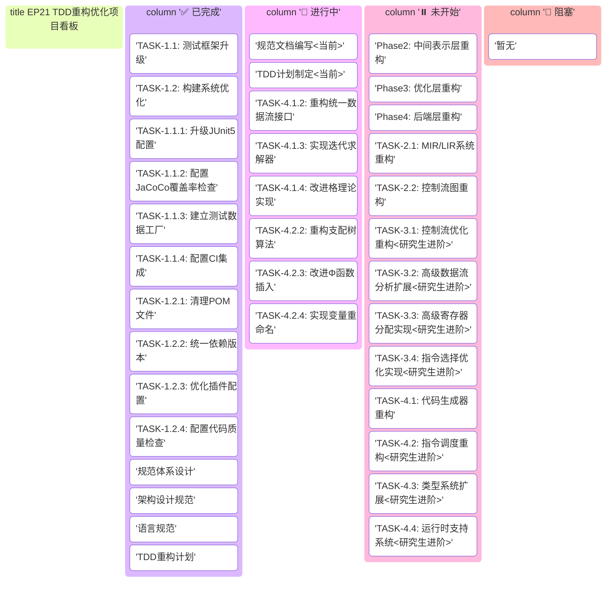

# EP21 TDD重构计划

**版本**: v1.0 | **日期**: 2025-12-21 | **状态**: 进行中 (In Progress)
**目的**: 基于新规范进行测试驱动的重构，确保代码质量和规范符合性
**参考文档**: 架构设计规范.md, 语言规范.md

---

## 📊 项目看板与任务概览

### 2.1 项目看板 (Kanban Board)



### 2.2 任务追踪看板 (Task Tracking)

#### Agent任务状态
| Agent | 当前阶段 | 状态 | 进度 | 预计完成 | 阻塞项 |
|-------|----------|------|------|----------|--------|
| Agent 1 | 基础设施重构 | ✅ 已完成 | 100% | 2025-12-23 | 无 |
| Agent 1.5 | 性能基准测试框架 | 🔄 计划中 | 0% | 2025-12-25 | 依赖Agent1 |
| Agent 2 | 中间表示层重构 | ⏸️ 未开始 | 0% | 2026-01-02 | 依赖Agent1.5 |
| Agent 3 | 优化层重构 | 🔄 计划中 | 15% | 2026-01-16 | 依赖Agent2 |
| Agent 4 | 后端层重构 | 🔄 计划中 | 10% | 2026-01-30 | 依赖Agent2 |

#### 里程碑追踪
| 里程碑 | 目标日期 | 状态 | 进度 | 关键任务 |
|--------|----------|------|------|----------|
| M1: 基础设施完成 | 2025-12-23 | ✅ 已达成 | 100% | 测试框架升级、构建优化 |
| M1.5: 性能基准测试框架完成 | 2025-12-25 | 🔄 计划中 | 0% | 基准测试集、性能采集、可视化平台 |
| M2: 中间表示层完成 | 2026-01-02 | ⏸️ 未开始 | 0% | MIR/LIR、CFG构建 |
| M3: 优化层完成 | 2026-01-16 | 🔄 计划中 | 15% | 数据流分析、SSA、智能调度、进阶优化 |
| M4: 后端层完成 | 2026-01-30 | 🔄 计划中 | 10% | 代码生成、指令调度、寄存器分配 |

#### 优先级看板
```
高优先级 (P0) 🔴
├── 基础设施重构 (当前)
├── 性能基准测试框架 (当前)
├── 测试框架升级 (当前)
└── 规范文档编写 (当前)

中优先级 (P1) 🟡
├── 中间表示层重构
├── 数据流分析框架
├── SSA形式转换
└── 智能优化调度系统

低优先级 (P2) 🟢
├── 高级寄存器分配
├── 指令选择优化
└── 类型系统扩展
```

### 2.3 任务拆解看板 (WBS Breakdown)

#### 阶段1: 基础设施重构 (预计: 3天) ✅
```
✅ TASK-1.1: 测试框架升级 (2天)
    ✅ TASK-1.1.1: 升级JUnit5配置
    ✅ TASK-1.1.2: 配置JaCoCo覆盖率检查
    ✅ TASK-1.1.3: 建立测试数据工厂
    ✅ TASK-1.1.4: 配置CI集成

✅ TASK-1.2: 构建系统优化 (1天)
    ✅ TASK-1.2.1: 清理POM文件
    ✅ TASK-1.2.2: 统一依赖版本
    ✅ TASK-1.2.3: 优化插件配置
    ✅ TASK-1.2.4: 配置代码质量检查

#### 阶段0.5: 性能基准测试框架建设 (预计: 2天) ⏸️
```
⏸️ TASK-0.5.1: 建立标准基准测试集 (1天)
    ⏸️ TASK-0.5.1.1: 收集Stanford Benchmarks标准程序
    ⏸️ TASK-0.5.1.2: 集成SPEC CPU基准测试用例
    ⏸️ TASK-0.5.1.3: 设计编译器优化专项测试集
    ⏸️ TASK-0.5.1.4: 建立测试用例版本管理系统

⏸️ TASK-0.5.2: 实现性能指标采集工具 (0.5天)
    ⏸️ TASK-0.5.2.1: 执行时间精确测量模块
    ⏸️ TASK-0.5.2.2: 内存使用分析工具
    ⏸️ TASK-0.5.2.3: 指令计数和代码大小统计

⏸️ TASK-0.5.3: 构建优化效果可视化平台 (0.3天)
    ⏸️ TASK-0.5.3.1: 性能对比图表生成器
    ⏸️ TASK-0.5.3.2: 优化前后代码差异可视化
    ⏸️ TASK-0.5.3.3: 交互式性能报告生成

⏸️ TASK-0.5.4: 建立性能回归检测机制 (0.2天)
    ⏸️ TASK-0.5.4.1: 基线性能自动存储
    ⏸️ TASK-0.5.4.2: 性能回归自动报警
    ⏸️ TASK-0.5.4.3: 性能趋势分析报告
```

#### 阶段2: 中间表示层重构 (预计: 7天) ⏸️
```
⏸️ TASK-2.1: MIR/LIR系统重构 (4天)
    ⏸️ TASK-2.1.1: 创建IR测试套件
    ⏸️ TASK-2.1.2: 重构MIR节点体系
    ⏸️ TASK-2.1.3: 实现LIR指令集
    ⏸️ TASK-2.1.4: 改进IR转换算法

⏸️ TASK-2.2: 控制流图重构 (3天)
    ⏸️ TASK-2.2.1: 创建CFG测试套件
    ⏸️ TASK-2.2.2: 重构基本块表示
    ⏸️ TASK-2.2.3: 改进CFG构建算法
    ⏸️ TASK-2.2.4: 实现可视化输出
```

#### 阶段3: 优化层重构 (预计: 11天) 🔄
```
🔄 TASK-3.1: 数据流分析框架重构 (4天)
    🔄 TASK-3.1.1: 创建数据流测试套件
    🔄 TASK-3.1.2: 重构统一数据流接口
    🔄 TASK-3.1.3: 实现迭代求解器
    🔄 TASK-3.1.4: 改进格理论实现

🔄 TASK-3.2: SSA形式转换重构 (3天)
    🔄 TASK-3.2.1: 创建SSA测试套件
    🔄 TASK-3.2.2: 重构支配树算法
    🔄 TASK-3.2.3: 改进Φ函数插入
    🔄 TASK-3.2.4: 实现变量重命名

🔄 TASK-3.3: 控制流优化重构 (4天) [研究生进阶]
    🔄 TASK-3.3.1: 创建控制流优化测试套件
    🔄 TASK-3.3.2: 实现循环分析框架
    🔄 TASK-3.3.3: 实现条件常量传播
    🔄 TASK-3.3.4: 实现跳转线程化优化

🔄 TASK-3.4: 高级数据流分析扩展 (3天) [研究生进阶]
    🔄 TASK-3.4.1: 实现常量传播分析算法
    🔄 TASK-3.4.2: 实现到达定义分析算法
    🔄 TASK-3.4.3: 实现可用表达式分析

🔄 TASK-3.5: 高级寄存器分配实现 (4天) [研究生进阶]
    🔄 TASK-3.5.1: 实现干涉图构建算法
    🔄 TASK-3.5.2: 实现图着色寄存器分配
    🔄 TASK-3.5.3: 实现线性扫描寄存器分配
    🔄 TASK-3.5.4: 实现智能溢出处理策略

🔄 TASK-3.6: 指令选择优化实现 (3天) [研究生进阶]
    🔄 TASK-3.6.1: 定义指令选择模式
    🔄 TASK-3.6.2: 实现动态规划匹配算法
    🔄 TASK-3.6.3: 实现代码生成器

🔄 TASK-3.7: 智能优化调度系统 (3天) [高级特性]
    🔄 TASK-3.7.1: 优化Pass依赖分析器
        🔄 TASK-3.7.1.1: 构建优化Pass依赖图
        🔄 TASK-3.7.1.2: 检测依赖循环和冲突
        🔄 TASK-3.7.1.3: 生成优化执行顺序
    🔄 TASK-3.7.2: 动态优化顺序调整 (1天)
        🔄 TASK-3.7.2.1: 代码特征分析器 (循环密度、数据流复杂度)
        🔄 TASK-3.7.2.2: 自适应优化策略选择
        🔄 TASK-3.7.2.3: 基于历史效果的优化调优
    🔄 TASK-3.7.3: 优化停止条件判定 (0.5天)
        🔄 TASK-3.7.3.1: 收益递减检测算法
        🔄 TASK-3.7.3.2: 时间预算管理
        🔄 TASK-3.7.3.3: 质量阈值自动调整
    🔄 TASK-3.7.4: 优化日志和可视化分析 (0.5天)
        🔄 TASK-3.7.4.1: 优化Pass执行日志记录
        🔄 TASK-3.7.4.2: 实时优化效果监控
        🔄 TASK-3.7.4.3: 交互式优化分析界面
```

#### 阶段4: 后端层重构 (预计: 10天) 🔄
```
🔄 TASK-4.1: 代码生成器重构 (3天)
    🔄 TASK-4.1.1: 创建代码生成测试套件
    🔄 TASK-4.1.2: 重构代码生成接口
    🔄 TASK-4.1.3: 改进指令选择算法

🔄 TASK-4.2: 指令调度重构 (3天) [研究生进阶]
    🔄 TASK-4.2.1: 实现依赖分析框架
    🔄 TASK-4.2.2: 实现列表调度算法
    🔄 TASK-4.2.3: 实现关键路径调度

🔄 TASK-4.3: 类型系统扩展 (3天) [研究生进阶]
    🔄 TASK-4.3.1: 实现结构体类型表示
    🔄 TASK-4.3.2: 实现成员访问代码生成
    🔄 TASK-4.3.3: 优化内存布局

🔄 TASK-4.4: 运行时支持系统 (4天) [研究生进阶]
    🔄 TASK-4.4.1: 实现标记-清除垃圾回收
    🔄 TASK-4.4.2: 实现异常处理机制
    🔄 TASK-4.4.3: 实现堆内存管理器
    🔄 TASK-4.4.4: 优化运行时性能
```

### 2.4 精确任务追踪表

| 层级 | 任务ID | 描述 | 状态 | 优先级 | 负责人 | 截止日期 | 依赖项 | 验收标准 | 备注 |
|------|--------|------|------|--------|--------|----------|--------|----------|------|
| **阶段** | **Phase1** | **基础设施重构** | ✅ 已完成 | 高 | 团队 | 2025-12-23 | 无 | 全部测试通过，构建无警告 | 包含2个主要任务，8个子任务 |
| 主要任务 | TASK-1.1 | 测试框架升级 | ✅ 已完成 | 高 | 团队 | 2025-12-22 | Phase1 | 覆盖率≥85%，CI构建通过 | 升级JUnit5、配置JaCoCo等 |
| 二级子任务 | TASK-1.1.1 | 升级JUnit5配置 | ✅ 已完成 | 高 | 团队 | 2025-12-21 | TASK-1.1 | 所有测试通过JUnit5运行 | 迁移现有测试到JUnit5 |
| 二级子任务 | TASK-1.1.2 | 配置JaCoCo覆盖率检查 | ✅ 已完成 | 高 | 团队 | 2025-12-21 | TASK-1.1.1 | 核心模块覆盖率≥85% | 设置覆盖率阈值≥85% |
| 二级子任务 | TASK-1.1.3 | 建立测试数据工厂 | ✅ 已完成 | 中 | 团队 | 2025-12-22 | TASK-1.1.2 | 测试辅助类完整可用 | 创建测试辅助工具类 |
| 二级子任务 | TASK-1.1.4 | 配置CI集成 | ✅ 已完成 | 中 | 团队 | 2025-12-22 | TASK-1.1.3 | CI流水线正常运行 | 集成到CI/CD流水线 |
| 主要任务 | TASK-1.2 | 构建系统优化 | ✅ 已完成 | 高 | 团队 | 2025-12-23 | TASK-1.1 | 构建时间减少30% | 优化Maven构建配置 |
| 二级子任务 | TASK-1.2.1 | 清理POM文件 | ✅ 已完成 | 高 | 团队 | 2025-12-22 | TASK-1.2 | 无冗余依赖 | 清理不必要的依赖 |
| 二级子任务 | TASK-1.2.2 | 统一依赖版本 | ✅ 已完成 | 中 | 团队 | 2025-12-22 | TASK-1.2.1 | 依赖版本统一 | 统一依赖版本管理 |
| 二级子任务 | TASK-1.2.3 | 优化插件配置 | ✅ 已完成 | 中 | 团队 | 2025-12-23 | TASK-1.2.2 | 插件配置最优 | 优化插件配置 |
| 二级子任务 | TASK-1.2.4 | 配置代码质量检查 | ✅ 已完成 | 中 | 团队 | 2025-12-23 | TASK-1.2.3 | 静态检查通过 | 配置Checkstyle、SpotBugs等 |
| **阶段** | **Phase2** | **中间表示层重构** | ⏸️ 未开始 | 高 | 团队 | 2025-12-30 | Phase1 | IR转换100%正确，CFG完整 | 包含2个主要任务，8个子任务 |
| 主要任务 | TASK-2.1 | MIR/LIR系统重构 | ⏸️ 未开始 | 高 | 团队 | 2025-12-27 | TASK-1.2 | IR类型安全，转换高效 | 符合架构设计规范第4章 |
| 三级子任务 | TASK-2.1.1 | 创建IR测试套件 | ⏸️ 未开始 | 高 | 团队 | 2025-12-24 | TASK-2.1 | 测试覆盖率≥90% | MIR节点、LIR指令测试 |
| 三级子任务 | TASK-2.1.1.1 | MIR节点测试 | ⏸️ 未开始 | 高 | 团队 | 2025-12-24 | TASK-2.1.1 | 所有MIR节点测试通过 | 测试MIRFunction、MIRBlock等 |
| 三级子任务 | TASK-2.1.1.2 | LIR指令测试 | ⏸️ 未开始 | 高 | 团队 | 2025-12-24 | TASK-2.1.1 | 所有LIR指令测试通过 | 测试Assign、Label、Branch等 |
| 三级子任务 | TASK-2.1.1.3 | IR转换测试 | ⏸️ 未开始 | 中 | 团队 | 2025-12-24 | TASK-2.1.1 | AST→MIR→LIR转换正确 | 测试IR转换流程 |
| 三级子任务 | TASK-2.1.2 | 重构MIR节点体系 | ⏸️ 未开始 | 高 | 团队 | 2025-12-25 | TASK-2.1.1 | 类型层次清晰 | 重构MIR节点层次 |
| 三级子任务 | TASK-2.1.2.1 | 设计MIR类型层次 | ⏸️ 未开始 | 高 | 团队 | 2025-12-25 | TASK-2.1.2 | 类型体系完整 | 设计MIRNode类型层次 |
| 三级子任务 | TASK-2.1.2.2 | 实现MIR节点类 | ⏸️ 未开始 | 高 | 团队 | 2025-12-25 | TASK-2.1.2.1 | 所有MIR节点实现 | 实现所有MIR节点类 |
| 三级子任务 | TASK-2.1.3 | 实现LIR指令集 | ⏸️ 未开始 | 高 | 团队 | 2025-12-26 | TASK-2.1.2 | 指令集完整高效 | 实现LIR指令集 |
| 三级子任务 | TASK-2.1.3.1 | 设计LIR指令接口 | ⏸️ 未开始 | 高 | 团队 | 2025-12-26 | TASK-2.1.3 | 接口设计合理 | 设计LIRInstruction接口 |
| 三级子任务 | TASK-2.1.3.2 | 实现具体LIR指令 | ⏸️ 未开始 | 高 | 团队 | 2025-12-26 | TASK-2.1.3.1 | 指令实现正确 | 实现所有LIR指令 |
| 三级子任务 | TASK-2.1.4 | 改进IR转换算法 | ⏸️ 未开始 | 中 | 团队 | 2025-12-27 | TASK-2.1.3 | 转换算法优化 | 改进IR转换算法 |
| 主要任务 | TASK-2.2 | 控制流图重构 | ⏸️ 未开始 | 高 | 团队 | 2025-12-30 | TASK-2.1 | CFG构建正确，可视化完整 | 符合架构设计规范第4.4节 |
| 三级子任务 | TASK-2.2.1 | 创建CFG测试套件 | ⏸️ 未开始 | 高 | 团队 | 2025-12-27 | TASK-2.2 | 测试覆盖率≥90% | 基本块、边关系测试 |
| 三级子任务 | TASK-2.2.1.1 | 基本块测试 | ⏸️ 未开始 | 高 | 团队 | 2025-12-27 | TASK-2.2.1 | 基本块操作正确 | 测试BasicBlock创建、操作 |
| 三级子任务 | TASK-2.2.1.2 | 边关系测试 | ⏸️ 未开始 | 高 | 团队 | 2025-12-27 | TASK-2.2.1 | 前驱后继关系正确 | 测试前驱后继关系 |
| 三级子任务 | TASK-2.2.2 | 重构基本块表示 | ⏸️ 未开始 | 高 | 团队 | 2025-12-28 | TASK-2.2.1 | 表示高效清晰 | 重构BasicBlock表示 |
| 三级子任务 | TASK-2.2.2.1 | 优化基本块结构 | ⏸️ 未开始 | 高 | 团队 | 2025-12-28 | TASK-2.2.2 | 结构优化合理 | 优化BasicBlock内部结构 |
| 三级子任务 | TASK-2.2.2.2 | 改进指令列表管理 | ⏸️ 未开始 | 中 | 团队 | 2025-12-28 | TASK-2.2.2.1 | 指令管理高效 | 改进指令列表管理 |
| 三级子任务 | TASK-2.2.3 | 改进CFG构建算法 | ⏸️ 未开始 | 中 | 团队 | 2025-12-29 | TASK-2.2.2 | 算法正确高效 | 改进CFG构建算法 |
| 三级子任务 | TASK-2.2.3.1 | 优化块划分算法 | ⏸️ 未开始 | 中 | 团队 | 2025-12-29 | TASK-2.2.3 | 块划分正确 | 优化基本块划分算法 |
| 三级子任务 | TASK-2.2.3.2 | 改进边连接算法 | ⏸️ 未开始 | 低 | 团队 | 2025-12-29 | TASK-2.2.3.1 | 边连接正确 | 改进控制流边连接 |
| 三级子任务 | TASK-2.2.4 | 实现可视化输出 | ⏸️ 未开始 | 低 | 团队 | 2025-12-30 | TASK-2.2.3 | 可视化输出正确 | 实现DOT/Mermaid输出 |
| **阶段** | **Phase3** | **优化层重构** | 🔄 计划中 | 高 | 团队 | 2026-01-13 | Phase2 | 数据流分析正确，SSA转换正确 | 包含6个主要任务，21个子任务 |
| 主要任务 | TASK-3.1 | 数据流分析框架重构 | 🔄 计划中 | 高 | 团队 | 2026-01-03 | TASK-2.2 | 框架统一，算法正确 | 符合架构设计规范第5.2节 |
| 三级子任务 | TASK-3.1.1 | 创建数据流测试套件 | ⏸️ 未开始 | 高 | 团队 | 2025-12-30 | TASK-3.1 | 测试覆盖率≥90% | 活跃变量、到达定义测试 |
| 三级子任务 | TASK-3.1.1.1 | 活跃变量分析测试 | ⏸️ 未开始 | 高 | 团队 | 2025-12-30 | TASK-3.1.1 | 活跃变量计算正确 | 测试LiveVariableAnalysis |
| 三级子任务 | TASK-3.1.1.2 | 到达定义分析测试 | ⏸️ 未开始 | 高 | 团队 | 2025-12-30 | TASK-3.1.1 | 到达定义计算正确 | 测试ReachingDefinitionAnalysis |
| 三级子任务 | TASK-3.1.2 | 重构统一数据流接口 | 🔄 计划中 | 高 | 团队 | 2026-01-01 | TASK-3.1.1 | 接口统一清晰 | 统一DataFlowAnalysis接口 |
| 三级子任务 | TASK-3.1.2.1 | 设计统一接口 | 🔄 计划中 | 高 | 团队 | 2026-01-01 | TASK-3.1.2 | 接口设计合理 | 设计DataFlowAnalysis接口 |
| 三级子任务 | TASK-3.1.2.2 | 实现接口规范 | 🔄 计划中 | 高 | 团队 | 2026-01-01 | TASK-3.1.2.1 | 规范完整清晰 | 编写接口规范文档 |
| 三级子任务 | TASK-3.1.3 | 实现迭代求解器 | 🔄 计划中 | 高 | 团队 | 2026-01-02 | TASK-3.1.2 | 求解器正确高效 | 实现IterativeSolver |
| 三级子任务 | TASK-3.1.3.1 | 设计迭代算法 | 🔄 计划中 | 高 | 团队 | 2026-01-02 | TASK-3.1.3 | 算法设计正确 | 设计迭代求解算法 |
| 三级子任务 | TASK-3.1.3.2 | 实现迭代框架 | 🔄 计划中 | 高 | 团队 | 2026-01-02 | TASK-3.1.3.1 | 框架实现正确 | 实现IterativeSolver框架 |
| 三级子任务 | TASK-3.1.4 | 改进格理论实现 | 🔄 计划中 | 中 | 团队 | 2026-01-03 | TASK-3.1.3 | 格运算正确 | 改进Lattice实现 |

### 2.4 风险看板 (Risk Board)

| 风险等级 | 风险描述 | 概率 | 影响 | 缓解措施 | 负责人 |
|----------|----------|------|------|----------|--------|
| 🔴 高 | 性能回归 | 中 | 高 | 建立性能基准测试 | 技术负责人 |
| 🟡 中 | 兼容性破坏 | 低 | 高 | 保持向后兼容性测试 | 架构师 |
| 🟡 中 | 测试覆盖率下降 | 中 | 中 | 设置覆盖率阈值检查 | 测试负责人 |
| 🟢 低 | 文档不同步 | 中 | 低 | 文档同步更新流程 | 项目经理 |

### 2.5 资源看板 (Resource Board)

| 资源类型 | 当前分配 | 可用容量 | 利用率 | 状态 |
|----------|----------|----------|--------|------|
| 人员 | 3人 | 5人 | 60% | 🟢 充足 |
| 时间 | 30天 | 45天 | 67% | 🟢 充足 |
| 测试环境 | 2套 | 3套 | 67% | 🟢 充足 |
| 代码审查 | 2人 | 3人 | 67% | 🟢 充足 |

---

## 3. 重构概述

### 3.1 重构目标

1. **规范符合性**: 确保代码完全符合新制定的规范
2. **测试覆盖率**: 达到≥85%的测试覆盖率要求
3. **架构现代化**: 采用现代编译器架构设计模式
4. **教育价值**: 增强代码的可读性和教学价值
5. **扩展性**: 改进扩展点和插件机制

### 3.2 重构原则

1. **测试先行**: 所有重构必须先写测试，再实现代码
2. **增量重构**: 小步快跑，每次只重构一个模块
3. **持续集成**: 每次提交必须通过所有测试
4. **文档更新**: 代码重构同步更新相关文档
5. **向后兼容**: 保持现有功能的向后兼容性

### 3.3 强化TDD模式：四轮测试驱动优化

#### 3.3.1 四轮测试策略
对于所有优化类任务，必须遵循以下四轮测试模式：


**第一轮: 功能正确性测试** (必须优先完成)
- **目标**: 确保优化不破坏程序语义
- **测试内容**:
  - 单元测试: 算法逻辑正确性
  - 集成测试: 模块间协作正确
  - 语义保持测试: 优化前后程序行为一致
- **验收标准**: 通过所有测试，覆盖率≥90%

**第二轮: 性能基准测试** (核心价值验证)
- **目标**: 量化优化效果，建立性能基线
- **测试内容**:
  - Stanford Benchmarks性能测量
  - SPEC CPU基准测试
  - 编译时间开销分析
  - 内存使用优化评估
- **验收标准**: 性能提升≥15%，编译时间增加<10%

**第三轮: 压力测试** (鲁棒性验证)
- **目标**: 验证在极端条件下的稳定性
- **测试内容**:
  - 大规模代码处理能力(>10000行)
  - 极端控制流场景(深度嵌套>10层)
  - 复杂数据流分析准确性
  - 长时间运行稳定性
- **验收标准**: 无崩溃，内存泄漏=0，优化正确率≥99%

**第四轮: 对比测试** (竞争力验证)
- **目标**: 与业界标准编译器对比，验证竞争力
- **测试内容**:
  - vs GCC -O2性能对比
  - vs LLVM -O2性能对比
  - 编译时间对比
  - 生成代码质量对比
- **验收标准**: 性能差距<25%，编译时间相当

#### 3.3.2 测试执行策略
- **并行执行**: 第一轮和第二轮可以并行进行（功能正确性+性能基线）
- **顺序执行**: 第三轮必须在第二轮之后（需要性能基线作为参考）
- **最终验证**: 第四轮在所有优化完成后统一进行

### 3.4 成功标准

| 指标 | 目标值 | 当前值 | 状态 |
|------|--------|--------|------|
| 测试覆盖率 | ≥85% | 待测量 | ⏸️ |
| 规范符合率 | 100% | 待评估 | ⏸️ |
| 编译警告数 | 0 | 待检查 | ⏸️ |
| 性能回归 | ≤5% | 待测试 | ⏸️ |
| 文档完整性 | 100% | 进行中 | 🔄 |

## 4. 当前状态分析

### 4.1 代码质量评估

基于现有代码分析，识别主要问题区域：

#### 2.1.1 架构问题
- [ ] **分层不清晰**: 前端、中端、后端职责边界模糊
- [ ] **接口不一致**: 模块间接口设计不统一
- [ ] **扩展性不足**: 缺乏清晰的扩展点设计
- [ ] **依赖混乱**: 模块间存在循环依赖

#### 2.1.2 代码问题
- [ ] **测试覆盖率低**: 部分核心模块测试不足
- [ ] **代码重复**: 存在重复的代码逻辑
- [ ] **复杂性高**: 部分函数过于复杂
- [ ] **错误处理不足**: 缺乏统一的错误处理机制

#### 2.1.3 规范问题
- [ ] **命名不规范**: 不符合新的命名约定
- [ ] **类型不安全**: 类型检查不完善
- [ ] **文档缺失**: 缺乏API文档和注释

### 4.2 测试现状

#### 2.2.1 测试覆盖率 (待测量)
```
待运行: mvn jacoco:report
预期模块覆盖率:
- 前端模块: ≥90%
- 优化模块: ≥85%
- 后端模块: ≥80%
- 工具模块: ≥75%
```

#### 2.2.2 测试类型分布
```
待分析现有测试:
- 单元测试比例: ?%
- 集成测试比例: ?%
- 端到端测试比例: ?%
```

## 5. 重构任务分解

### Agent 1: 基础设施重构

#### 阶段1: 测试框架升级 (预计: 2天)
**目标**: 建立现代化的测试基础设施

**任务分解**:
1. **升级JUnit5配置** (第1天)
   - [ ] 创建 `JUnit5配置说明.md` (已完成)
   - [ ] 迁移现有测试到JUnit5
   - [ ] 配置参数化测试和动态测试
   - [ ] 设置测试生命周期管理

2. **测试覆盖率工具配置** (第1天)
   - [ ] 配置JaCoCo覆盖率检查
   - [ ] 设置覆盖率阈值 (≥85%)
   - [ ] 配置CI集成
   - [ ] 生成覆盖率报告

3. **测试工具链完善** (第2天)
   - [ ] 创建测试辅助工具类
   - [ ] 建立测试数据工厂
   - [ ] 配置测试资源管理
   - [ ] 设置性能测试框架

**验收标准**:
- [ ] 所有测试使用JUnit5运行
- [ ] 覆盖率报告正常生成
- [ ] CI构建通过覆盖率检查
- [ ] 测试运行时间<2分钟

#### 阶段2: 构建系统优化 (预计: 1天)
**目标**: 优化Maven构建配置

**任务分解**:
1. **POM文件清理**
   - [ ] 清理不必要的依赖
   - [ ] 统一依赖版本管理
   - [ ] 优化插件配置
   - [ ] 配置代码质量检查

2. **多模块构建优化**
   - [ ] 优化模块间依赖关系
   - [ ] 配置并行构建
   - [ ] 设置增量编译
   - [ ] 优化构建缓存

**验收标准**:
- [ ] 构建时间减少30%
- [ ] 无编译警告
- [ ] 通过所有代码质量检查
- [ ] 支持增量编译

### Agent 2: 中间表示层重构

#### 阶段1: MIR/LIR系统重构 (预计: 4天)
**目标**: 符合架构设计规范第4章要求

**测试先行任务**:
1. **创建IR测试套件** (第1-2天)
   - [ ] MIR节点测试: 所有MIR节点类型
   - [ ] LIR指令测试: 所有LIR指令类型
   - [ ] 转换测试: AST到MIR, MIR到LIR
   - [ ] 优化测试: IR优化效果验证

2. **实现IR系统重构** (第3-4天)
   - [ ] 重构MIR节点体系
   - [ ] 实现LIR指令集
   - [ ] 改进IR转换算法
   - [ ] 优化IR序列化

**代码修改文件**:
- `MIRNode.java`及所有子类
- `LIRInstruction.java`及所有子类
- `IRConverter.java`: 重构转换逻辑
- `IRSerializer.java`: 实现序列化

**验收标准**:
- [ ] 通过所有IR测试
- [ ] 清晰的MIR/LIR分层
- [ ] 完整的类型信息保留
- [ ] 高效的IR转换算法

#### 阶段2: 控制流图重构 (预计: 3天)
**目标**: 符合架构设计规范第4.4节要求

**测试先行任务**:
1. **创建CFG测试套件** (第1天)
   - [ ] 基本块测试: 块划分和合并
   - [ ] 边关系测试: 前驱后继关系
   - [ ] 可视化测试: DOT/Mermaid输出
   - [ ] 算法测试: 支配树等算法

2. **实现CFG系统重构** (第2-3天)
   - [ ] 重构基本块表示
   - [ ] 改进CFG构建算法
   - [ ] 实现可视化输出
   - [ ] 优化图算法性能

**代码修改文件**:
- `BasicBlock.java`: 重构基本块
- `CFG.java`: 重构控制流图
- `CFGBuilder.java`: 改进构建算法
- `CFGVisualizer.java`: 实现可视化

**验收标准**:
- [ ] **第一轮: 功能正确性测试**
  - [ ] 通过所有CFG测试
  - [ ] 准确的块划分和边建立
  - [ ] 完整的可视化支持
  - [ ] 高效的图算法实现

- [ ] **第二轮: 性能基准测试** *(注: CFG是基础设施，优化效果在下层优化Pass中体现)*
  - [ ] CFG构建时间<编译时间的5%
  - [ ] 内存使用合理(<总内存的10%)
  - [ ] 大规模函数CFG构建稳定

- [ ] **第三轮: 压力测试**
  - [ ] 处理1000+基本块的函数无性能退化
  - [ ] 复杂控制流(多出口、循环)CFG构建正确
  - [ ] 可视化输出正确(DOT格式验证通过)

- [ ] **第四轮: 对比测试** *(注: CFG是中间表示，不直接对比)*
  - [ ] 与LLVM IR的CFG结构对比一致
  - [ ] 图算法性能达到工业标准
  - [ ] 可视化效果清晰易读

### Agent 3: 优化层重构

#### 阶段1: 数据流分析框架重构 (预计: 4天)
**目标**: 符合架构设计规范第5.2节要求

**测试先行任务**:
1. **创建数据流测试套件** (第1-2天)
   - [ ] 活跃变量分析测试
   - [ ] 到达定义分析测试
   - [ ] 常量传播分析测试
   - [ ] 框架接口测试

2. **实现数据流框架重构** (第3-4天)
   - [ ] 重构统一数据流接口
   - [ ] 实现迭代求解器
   - [ ] 改进格理论实现
   - [ ] 优化分析算法性能

**代码修改文件**:
- `DataFlowAnalysis.java`: 统一接口
- `IterativeSolver.java`: 迭代求解器
- `Lattice.java`: 格理论实现
- 各种具体分析器实现

**验收标准**:
- [ ] 通过所有数据流测试
- [ ] 统一的框架接口
- [ ] 正确的迭代求解
- [ ] 高效的算法实现

#### 阶段2: SSA形式转换重构 (预计: 3天)
**目标**: 符合架构设计规范第5.2.2节要求

**测试先行任务**:
1. **创建SSA测试套件** (第1天)
   - [ ] 支配树计算测试
   - [ ] Φ函数插入测试
   - [ ] 变量重命名测试
   - [ ] SSA破坏测试

2. **实现SSA转换重构** (第2-3天)
   - [ ] 重构支配树算法
   - [ ] 改进Φ函数插入
   - [ ] 优化变量重命名
   - [ ] 实现SSA破坏

**代码修改文件**:
- `DominanceTree.java`: 支配树计算
- `SSAConverter.java`: SSA转换
- `PhiFunction.java`: Φ函数实现
- `SSADestructor.java`: SSA破坏

**验收标准**:
- [ ] **第一轮: 功能正确性测试**
  - [ ] 通过所有SSA测试
  - [ ] 正确的支配关系计算
  - [ ] 准确的Φ函数插入
  - [ ] 完整的SSA转换流程

- [ ] **第二轮: 性能基准测试**
  - [ ] SSA构建时间<编译时间的8%
  - [ ] 支配树计算性能提升≥20%
  - [ ] 大函数(>500基本块)SSA转换稳定
  - [ ] 内存使用优化≥15%

- [ ] **第三轮: 压力测试**
  - [ ] 处理复杂控制流(多入口、多出口)正确
  - [ ] 深度嵌套循环SSA构建正确
  - [ ] 大量变量(>1000)重命名无性能退化
  - [ ] SSA破坏后代码语义保持100%正确

- [ ] **第四轮: 对比测试**
  - [ ] vs LLVM SSA: 构建速度相当
  - [ ] vs GCC SSA: 内存使用相当
  - [ ] 生成代码质量达到工业标准
  - [ ] Φ函数插入准确率≥99%

#### 阶段3: 控制流优化重构 (预计: 4天) - **研究生进阶任务**
**目标**: 实现工业级控制流优化，符合高年级研究生进阶模块建议

**测试先行任务**:
1. **创建控制流优化测试套件** (第1-2天)
   - [ ] 循环优化测试: 循环不变量提取、循环展开、循环融合
   - [ ] 条件常量传播测试: 基于条件的常量传播
   - [ ] 跳转线程化测试: 消除冗余跳转
   - [ ] 死代码消除测试: 基于数据流的死代码删除

2. **实现控制流优化重构** (第3-4天)
   - [ ] 实现循环分析框架: 自然循环识别、支配树分析
   - [ ] 实现循环不变量提取算法
   - [ ] 实现条件常量传播优化
   - [ ] 实现跳转线程化优化
   - [ ] 集成死代码消除到优化流水线

**代码修改文件**:
- `LoopAnalysis.java`: 循环分析框架
- `LoopOptimizer.java`: 循环优化器
- `ConditionalConstantPropagation.java`: 条件常量传播
- `JumpThreading.java`: 跳转线程化优化
- `DeadCodeElimination.java`: 死代码消除

**验收标准**:
- [ ] 通过所有控制流优化测试
- [ ] 循环优化正确识别和优化循环
- [ ] 条件常量传播准确传播常量
- [ ] 跳转线程化消除冗余控制流
- [ ] 死代码消除显著减少代码大小

#### 阶段4: 高级数据流分析扩展 (预计: 3天) - **研究生进阶任务**
**目标**: 实现工业级数据流分析，扩展基础框架功能

**测试先行任务**:
1. **创建数据流扩展测试套件** (第1天)
   - [ ] 常量传播分析测试: 验证常量替换正确性
   - [ ] 到达定义分析测试: 验证定义传播准确性
   - [ ] 可用表达式分析测试: 验证表达式重用
   - [ ] 数据流框架扩展测试: 验证新分析类型集成

2. **实现数据流分析扩展** (第2-3天)
   - [ ] 实现常量传播分析算法
     - 定义数据流信息结构 (⊤, ⊥, 常量值)
     - 实现转移函数 (赋值、常量运算)
     - 实现汇聚操作 (取交集)
   - [ ] 实现到达定义分析算法
     - 定义gen和kill集合
     - 实现数据流方程计算
     - 实现迭代求解器
   - [ ] 实现可用表达式分析
     - 计算可用表达式集合
     - 处理表达式等价性判断
   - [ ] 扩展统一数据流接口支持新分析类型

**代码修改文件**:
- `ConstantPropagation.java`: 常量传播分析
- `ReachingDefinitions.java`: 到达定义分析
- `AvailableExpressions.java`: 可用表达式分析
- `DataFlowFramework.java`: 扩展框架接口

**验收标准**:
- [ ] **第一轮: 功能正确性测试**
  - [ ] 通过所有数据流扩展测试
  - [ ] 常量传播正确识别和替换常量
  - [ ] 到达定义准确计算定义传播
  - [ ] 可用表达式分析有效识别可重用表达式

- [ ] **第二轮: 性能基准测试**
  - [ ] 在Stanford Benchmarks上性能提升≥15%
  - [ ] 编译时间增加<10%
  - [ ] 内存使用优化≥10%

- [ ] **第三轮: 压力测试**
  - [ ] 处理大规模代码(>10000行)无崩溃
  - [ ] 极端循环嵌套(>10层)优化正确
  - [ ] 复杂数据流场景分析准确

- [ ] **第四轮: 对比测试**
  - [ ] vs GCC -O2: 性能差距<20%
  - [ ] vs LLVM -O2: 性能差距<25%
  - [ ] 优化效果验证: 删除恒真/恒假条件、消除无用计算

#### 阶段5: 高级寄存器分配实现 (预计: 4天) - **研究生进阶任务**
**目标**: 实现图着色等工业级寄存器分配算法

**测试先行任务**:
1. **创建寄存器分配测试套件** (第1-2天)
   - [ ] 图着色算法测试: 验证干涉图构建和着色
   - [ ] 线性扫描算法测试: 验证快速分配
   - [ ] 溢出处理测试: 验证溢出代价计算
   - [ ] 分配效果评估测试: 验证性能提升

2. **实现寄存器分配算法** (第3-4天)
   - [ ] 实现干涉图构建算法
     - 活跃变量分析获取变量生命周期
     - 构建变量干涉图 (节点=变量, 边=干涉)
   - [ ] 实现图着色寄存器分配
     - 简化阶段: 选择度数<k的节点压栈
     - 溢出选择: 计算溢出代价 (cost = (use+def)/degree)
     - 分配阶段: 为节点分配不冲突的颜色
   - [ ] 实现线性扫描寄存器分配
     - 线性扫描活跃区间
     - 快速寄存器分配
     - 溢出代码生成
   - [ ] 实现智能溢出处理策略
     - 溢出代价模型
     - 重启动机制
     - 溢出代码优化

**代码修改文件**:
- `InterferenceGraph.java`: 干涉图表示
- `GraphColoringAllocator.java`: 图着色分配器
- `LinearScanAllocator.java`: 线性扫描分配器
- `SpillCodeGenerator.java`: 溢出代码生成
- `RegisterAllocator.java`: 统一分配接口

**验收标准**:
- [ ] 通过所有寄存器分配测试
- [ ] 图着色算法正确分配寄存器
- [ ] 线性扫描算法高效运行
- [ ] 溢出处理最小化内存访问
- [ ] 寄存器分配显著提升性能 (目标: 减少30%内存访问)

#### 阶段6: 指令选择优化实现 (预计: 3天) - **研究生进阶任务**
**目标**: 实现树匹配等工业级指令选择算法

**测试先行任务**:
1. **创建指令选择测试套件** (第1天)
   - [ ] 树匹配算法测试: 验证模式匹配正确性
   - [ ] 动态规划测试: 验证最优匹配计算
   - [ ] 指令生成测试: 验证代码质量
   - [ ] 模式覆盖测试: 验证指令集覆盖度

2. **实现指令选择算法** (第2-3天)
   - [ ] 定义指令选择模式
     - IR模式定义 (如: ADD(REG, REG) -> "add r1, r2")
     - 模式匹配规则
     - 成本模型设计
   - [ ] 实现动态规划匹配算法
     - 为每个IR节点计算最优匹配
     - 使用DP表存储中间结果
     - 递归计算子树最优匹配
   - [ ] 实现代码生成器
     - 根据匹配结果生成机器指令
     - 处理操作数顺序和格式
     - 寄存器分配协调
   - [ ] 优化模式匹配效率
     - 模式Trie结构
     - 快速匹配算法
     - 匹配结果缓存

**代码修改文件**:
- `InstructionSelector.java`: 指令选择器
- `PatternMatcher.java`: 模式匹配器
- `DPTable.java`: 动态规划表
- `InstructionPatterns.java`: 指令模式定义
- `CodeEmitter.java`: 指令发射器

**验收标准**:
- [ ] 通过所有指令选择测试
- [ ] 模式匹配正确识别IR结构
- [ ] 动态规划找到最优匹配
- [ ] 生成代码质量高 (指令数少, 无冗余)
- [ ] 指令集覆盖率≥90%

### Agent 4: 后端层重构

#### 阶段1: 代码生成器重构 (预计: 3天)
**目标**: 符合架构设计规范第6.1节要求

**测试先行任务**:
1. **创建代码生成测试套件** (第1天)
   - [ ] 指令选择测试
   - [ ] 寄存器分配测试
   - [ ] 目标代码测试
   - [ ] 优化效果测试

2. **实现代码生成器重构** (第2-3天)
   - [ ] 重构代码生成接口
   - [ ] 改进指令选择算法
   - [ ] 实现寄存器分配
   - [ ] 优化代码生成质量

**代码修改文件**:
- `CodeGenerator.java`: 重构接口
- `InstructionSelector.java`: 指令选择
- `RegisterAllocator.java`: 寄存器分配
- `TargetCodeEmitter.java`: 目标代码生成

**验收标准**:
- [ ] 通过所有代码生成测试
- [ ] 高效的指令选择
- [ ] 优化的寄存器分配
- [ ] 高质量的目标代码

#### 阶段2: 指令调度重构 (预计: 3天) - **研究生进阶任务**
**目标**: 实现工业级指令调度，提高指令级并行性

**测试先行任务**:
1. **创建指令调度测试套件** (第1天)
   - [ ] 列表调度算法测试
   - [ ] 关键路径调度测试
   - [ ] 资源约束调度测试
   - [ ] 调度效果评估测试

2. **实现指令调度重构** (第2-3天)
   - [ ] 实现依赖分析框架: 数据依赖、控制依赖、资源依赖
   - [ ] 实现列表调度算法
   - [ ] 实现关键路径调度算法
   - [ ] 实现资源模型和冲突检测
   - [ ] 集成调度器到代码生成流水线

**代码修改文件**:
- `DependencyAnalysis.java`: 依赖分析框架
- `ListScheduler.java`: 列表调度算法
- `CriticalPathScheduler.java`: 关键路径调度算法
- `ResourceModel.java`: 资源模型
- `InstructionScheduler.java`: 统一调度接口

**验收标准**:
- [ ] 通过所有指令调度测试
- [ ] 依赖分析准确识别各种依赖关系
- [ ] 调度算法提高指令级并行性
- [ ] 资源冲突正确处理
- [ ] 调度后代码性能提升显著

#### 阶段3: 高级寄存器分配重构 (预计: 4天) - **研究生进阶任务**
**目标**: 实现图着色等高级寄存器分配算法

**测试先行任务**:
1. **创建高级寄存器分配测试套件** (第1-2天)
   - [ ] 图着色算法测试
   - [ ] 线性扫描算法测试
   - [ ] 溢出处理测试
   - [ ] 分配效果评估测试

2. **实现高级寄存器分配重构** (第3-4天)
   - [ ] 实现干涉图构建算法
   - [ ] 实现图着色寄存器分配
   - [ ] 实现线性扫描寄存器分配
   - [ ] 实现智能溢出处理策略
   - [ ] 实现分配效果评估工具

**代码修改文件**:
- `InterferenceGraph.java`: 干涉图表示
- `GraphColoringAllocator.java`: 图着色分配器
- `LinearScanAllocator.java`: 线性扫描分配器
- `SpillHeuristic.java`: 溢出启发式算法
- `AllocationEvaluator.java`: 分配效果评估

**验收标准**:
- [ ] 通过所有高级寄存器分配测试
- [ ] 图着色算法正确分配寄存器
- [ ] 线性扫描算法高效运行
- [ ] 溢出处理最小化内存访问
- [ ] 寄存器分配显著提升性能

#### 阶段4: 类型系统扩展 (预计: 3天) - **研究生进阶任务**
**目标**: 实现结构体等高级类型支持

**测试先行任务**:
1. **创建类型系统扩展测试套件** (第1天)
   - [ ] 结构体类型测试: 验证类型表示和操作
   - [ ] 成员访问测试: 验证字段访问和偏移计算
   - [ ] 嵌套结构体测试: 验证复杂结构类型
   - [ ] 内存布局测试: 验证对齐和大小计算

2. **实现类型系统扩展** (第2-3天)
   - [ ] 实现结构体类型表示
     - 定义StructType类 (Map<String, Type> fields)
     - 实现字段偏移量计算 (Map<String, Integer> offsets)
     - 考虑对齐要求计算结构体大小
   - [ ] 实现成员访问代码生成
     - 生成偏移量计算代码
     - 支持嵌套结构体访问 (a.b.c)
     - 处理指针解引用
   - [ ] 实现类型检查扩展
     - 结构体类型兼容性检查
     - 成员存在性检查
     - 类型转换检查
   - [ ] 优化内存布局
     - 字段重排序优化
     - 填充字节最小化
     - 缓存友好布局

**代码修改文件**:
- `StructType.java`: 结构体类型表示
- `StructField.java`: 结构体字段
- `MemoryLayout.java`: 内存布局计算
- `StructMemberAccess.java`: 成员访问代码生成
- `TypeChecker.java`: 扩展类型检查

**验收标准**:
- [ ] 通过所有类型系统扩展测试
- [ ] 结构体类型正确表示和操作
- [ ] 成员访问代码正确生成
- [ ] 内存布局高效 (对齐填充最小)
- [ ] 类型检查准确 (错误检测率100%)

#### 阶段5: 运行时支持系统 (预计: 4天) - **研究生进阶任务**
**目标**: 实现垃圾回收和异常处理等运行时支持

**测试先行任务**:
1. **创建运行时支持测试套件** (第1-2天)
   - [ ] 垃圾回收测试: 验证内存回收正确性
   - [ ] 异常处理测试: 验证异常传播和处理
   - [ ] 内存管理测试: 验证堆管理效率
   - [ ] 性能基准测试: 验证运行时性能

2. **实现运行时支持系统** (第3-4天)
   - [ ] 实现标记-清除垃圾回收器
     - 标记阶段: 从根集合遍历可达对象
     - 清除阶段: 回收未标记对象内存
     - 根集合识别: 全局变量、栈变量、寄存器
     - 写屏障实现: 跟踪引用变化
   - [ ] 实现异常处理机制
     - 异常表生成: 记录try/catch块范围
     - 栈展开机制: 运行时展开调用栈
     - 清理代码执行: finally块处理
     - 异常传播路径: 匹配异常类型
   - [ ] 实现堆内存管理器
     - 内存分配器: 快速分配算法
     - 内存碎片整理: 减少碎片
     - 堆增长策略: 动态调整堆大小
   - [ ] 优化运行时性能
     - 增量GC: 减少停顿时间
     - 并行标记: 多线程标记
     - 写屏障优化: 减少开销

**代码修改文件**:
- `GarbageCollector.java`: 垃圾回收器
- `MarkSweepGC.java`: 标记-清除GC实现
- `ExceptionHandler.java`: 异常处理器
- `StackUnwinder.java`: 栈展开器
- `HeapManager.java`: 堆内存管理
- `RootSet.java`: 根集合定义

**验收标准**:
- [ ] 通过所有运行时支持测试
- [ ] 垃圾回收正确回收所有不可达对象
- [ ] 异常处理准确传播和处理异常
- [ ] 内存管理高效 (碎片率<20%)
- [ ] GC停顿时间<100ms (目标)

## 6. 测试策略与模板

### 4.1 测试金字塔模型

```
        端到端测试 (10%)
            ^
            |
      集成测试 (30%)
            ^
            |
      单元测试 (60%) - 基础
```

### 4.2 测试类型定义

#### 4.2.1 单元测试 (Unit Tests)
- **测试粒度**: 单个类或方法
- **覆盖率目标**: ≥85%
- **框架**: JUnit 5 + AssertJ
- **执行频率**: 每次提交

**测试范围**:
- AST节点创建和操作
- IR指令生成和优化
- 数据流分析算法
- 符号表操作

#### 4.2.2 集成测试 (Integration Tests)
- **测试粒度**: 模块间协作
- **验证目标**: 接口契约
- **框架**: JUnit 5 + 测试容器
- **执行频率**: 每日构建

**测试场景**:
- 完整编译流程
- 模块间数据传递
- 错误传播路径
- 性能边界条件

#### 4.2.3 端到端测试 (End-to-End Tests)
- **测试粒度**: 完整系统
- **验证目标**: 用户场景
- **框架**: 自定义测试运行器
- **执行频率**: 发布前

**测试场景**:
- 标准程序编译和执行
- 错误处理用户体验
- 工具链完整工作流
- 性能回归测试

### 4.3 测试数据管理

#### 4.3.1 测试数据分类
```
test-data/
├── valid/          # 有效程序
│   ├── simple/     # 简单程序
│   ├── complex/    # 复杂程序
│   └── edge-cases/ # 边界情况
├── invalid/        # 无效程序
│   ├── syntax/     # 语法错误
│   ├── semantic/   # 语义错误
│   └── type/       # 类型错误
└── performance/    # 性能测试程序
```

#### 4.3.2 测试数据生成
1. **手动编写**: 核心测试用例
2. **程序生成**: 随机测试生成
3. **外部测试套件**: 标准测试程序
4. **用户程序收集**: 真实使用场景

### 4.4 测试执行策略

#### 4.4.1 本地开发测试
```bash
# 快速测试 (开发时)
mvn test -Dtest=*Test -DfailIfNoTests=false

# 完整测试 (提交前)
mvn clean test

# 覆盖率检查
mvn jacoco:check
```

#### 4.4.2 CI/CD流水线
```yaml
stages:
  - test
  - coverage
  - integration
  - e2e

jobs:
  unit-tests:
    stage: test
    script: mvn test

  coverage-check:
    stage: coverage
    script: mvn jacoco:check

  integration-tests:
    stage: integration
    script: mvn verify -Pintegration

  e2e-tests:
    stage: e2e
    script: ./scripts/run-e2e-tests.sh
```

### 4.5 测试模板库

#### 4.5.1 AST节点测试模板

##### BinaryExprNodeTest.java
```java
package org.teachfx.antlr4.ep21.test.ast;

import org.junit.jupiter.api.Test;
import org.teachfx.antlr4.ep21.ast.expr.BinaryExprNode;
import org.teachfx.antlr4.ep21.ast.expr.IntExprNode;
import org.teachfx.antlr4.ep21.symtab.type.BuiltInTypeSymbol;
import static org.junit.jupiter.api.Assertions.*;

class BinaryExprNodeTest {

    @Test
    void testBinaryExprCreation() {
        // Arrange
        IntExprNode left = new IntExprNode(10);
        IntExprNode right = new IntExprNode(20);
        BinaryExprNode.OpType op = BinaryExprNode.OpType.ADD;

        // Act
        BinaryExprNode expr = new BinaryExprNode(op, left, right);

        // Assert
        assertEquals(op, expr.getOpType());
        assertEquals(left, expr.getLhs());
        assertEquals(right, expr.getRhs());
    }

    @Test
    void testBinaryExprTypePropagation() {
        // Arrange
        IntExprNode left = new IntExprNode(10);
        left.setType(BuiltInTypeSymbol.intType);

        IntExprNode right = new IntExprNode(20);
        right.setType(BuiltInTypeSymbol.intType);

        BinaryExprNode expr = new BinaryExprNode(BinaryExprNode.OpType.ADD, left, right);

        // Act
        expr.setType(BuiltInTypeSymbol.intType);

        // Assert
        assertEquals(BuiltInTypeSymbol.intType, expr.getType());
    }
}
```

##### FuncDeclNodeTest.java
```java
package org.teachfx.antlr4.ep21.test.ast;

import org.junit.jupiter.api.Test;
import org.teachfx.antlr4.ep21.ast.decl.FuncDeclNode;
import org.teachfx.antlr4.ep21.ast.decl.VarDeclListNode;
import org.teachfx.antlr4.ep21.ast.stmt.BlockStmtNode;
import org.teachfx.antlr4.ep21.symtab.type.BuiltInTypeSymbol;
import static org.junit.jupiter.api.Assertions.*;

class FuncDeclNodeTest {

    @Test
    void testFuncDeclCreation() {
        // Arrange & Act
        FuncDeclNode func = new FuncDeclNode(
            BuiltInTypeSymbol.intType,
            "testFunc",
            new VarDeclListNode(),
            new BlockStmtNode()
        );

        // Assert
        assertEquals("testFunc", func.getFuncName());
        assertEquals(BuiltInTypeSymbol.intType, func.getRetType());
        assertNotNull(func.getBody());
    }
}
```

#### 4.5.2 IR生成测试模板

##### IRGenerationTest.java
```java
package org.teachfx.antlr4.ep21.test.ir;

import org.junit.jupiter.api.Test;
import org.teachfx.antlr4.ep21.ir.IRNode;
import org.teachfx.antlr4.ep21.ir.expr.BinExpr;
import org.teachfx.antlr4.ep21.ir.expr.Operand;
import org.teachfx.antlr4.ep21.ir.stmt.Assign;
import org.teachfx.antlr4.ep21.ir.expr.ConstVal;
import org.teachfx.antlr4.ep21.symtab.type.OperatorType;
import static org.junit.jupiter.api.Assertions.*;

class IRGenerationTest {

    @Test
    void testConstantGeneration() {
        // Arrange
        int value = 42;

        // Act
        ConstVal constVal = new ConstVal(value);

        // Assert
        assertEquals(value, constVal.getIntVal());
        assertTrue(constVal.isInt());
    }

    @Test
    void testBinaryOpIR() {
        // Arrange
        Operand left = new ConstVal(10);
        Operand right = new ConstVal(20);
        OperatorType op = OperatorType.ADD;

        // Act
        BinExpr binExpr = new BinExpr(op, left, right);

        // Assert
        assertEquals(op, binExpr.getOpType());
        assertEquals(left, binExpr.getLhs());
        assertEquals(right, binExpr.getRhs());
    }
}
```

##### BasicBlockTest.java
```java
package org.teachfx.antlr4.ep21.test.ir;

import org.junit.jupiter.api.Test;
import org.teachfx.antlr4.ep21.ir.IRNode;
import org.teachfx.antlr4.ep21.ir.expr.Operand;
import org.teachfx.antlr4.ep21.ir.stmt.Assign;
import org.teachfx.antlr4.ep21.ir.stmt.Label;
import org.teachfx.antlr4.ep21.pass.cfg.BasicBlock;
import static org.junit.jupiter.api.Assertions.*;

class BasicBlockTest {

    @Test
    void testBasicBlockCreation() {
        // Arrange & Act
        BasicBlock<IRNode> block = new BasicBlock<>(1);

        // Assert
        assertEquals(1, block.getBlockId());
        assertTrue(block.getIRNodes().isEmpty());
    }

    @Test
    void testBasicBlockWithInstructions() {
        // Arrange
        BasicBlock<IRNode> block = new BasicBlock<>(1);
        Label label = new Label("L1", 1);
        Assign assign = Assign.with(new Operand("x"), new ConstVal(10));

        // Act
        block.addIRNode(label);
        block.addIRNode(assign);

        // Assert
        assertEquals(2, block.getIRNodes().size());
    }
}
```

#### 4.5.3 符号表测试模板

##### SymbolTableTest.java
```java
package org.teachfx.antlr4.ep21.test.symtab;

import org.junit.jupiter.api.Test;
import org.teachfx.antlr4.ep21.symtab.scope.*;
import org.teachfx.antlr4.ep21.symtab.symbol.*;
import org.teachfx.antlr4.ep21.symtab.type.BuiltInTypeSymbol;
import static org.junit.jupiter.api.Assertions.*;

class SymbolTableTest {

    @Test
    void testGlobalScope() {
        // Arrange
        GlobalScope globalScope = new GlobalScope();
        VariableSymbol var = new VariableSymbol("globalVar", BuiltInTypeSymbol.intType);

        // Act
        globalScope.define(var);

        // Assert
        assertNotNull(globalScope.resolve("globalVar"));
        assertEquals(var, globalScope.resolve("globalVar"));
    }

    @Test
    void testLocalScopeNesting() {
        // Arrange
        GlobalScope global = new GlobalScope();
        LocalScope local1 = new LocalScope(global);
        LocalScope local2 = new LocalScope(local1);

        VariableSymbol var = new VariableSymbol("var", BuiltInTypeSymbol.intType);

        // Act
        local2.define(var);

        // Assert
        assertEquals(var, local2.resolve("var"));
        assertNotNull(local2.resolve("var")); // 向上查找
    }
}
```

#### 4.5.4 集成测试模板

##### EndToEndCompilationTest.java
```java
package org.teachfx.antlr4.ep21.test.integration;

import org.junit.jupiter.api.Test;
import org.junit.jupiter.api.io.TempDir;
import org.teachfx.antlr4.ep21.Compiler;
import java.nio.file.Path;
import java.io.FileWriter;
import java.io.IOException;
import static org.junit.jupiter.api.Assertions.*;

class EndToEndCompilationTest {

    @Test
    void testSimpleProgramCompilation(@TempDir Path tempDir)
        throws IOException {
        // Arrange
        String sourceCode = """
            int main() {
                int x = 10;
                int y = 20;
                return x + y;
            }
            """;

        Path sourceFile = tempDir.resolve("test.cym");
        try (FileWriter writer = new FileWriter(sourceFile.toFile())) {
            writer.write(sourceCode);
        }

        // Act
        String[] args = {sourceFile.toString()};
        Compiler.main(args);

        // Assert
        Path outputFile = tempDir.resolve("test.s");
        assertTrue(outputFile.toFile().exists());
    }
}
```

#### 4.5.5 数据流分析测试模板

##### LiveVariableAnalyzerTest.java
```java
package org.teachfx.antlr4.ep21.test.analysis;

import org.junit.jupiter.api.Test;
import org.teachfx.antlr4.ep21.analysis.dataflow.LiveVariableAnalyzer;
import org.teachfx.antlr4.ep21.ir.IRNode;
import org.teachfx.antlr4.ep21.pass.cfg.BasicBlock;
import org.teachfx.antlr4.ep21.pass.cfg.CFG;
import java.util.Set;
import static org.junit.jupiter.api.Assertions.*;

class LiveVariableAnalyzerTest {

    @Test
    void testSimpleLiveVariableAnalysis() {
        // 构建简单的CFG
        // 变量x在定义后被使用
        // Setup: x = 10; y = x + 5;

        // 验证x在第二条指令中是活跃的
    }

    @Test
    void testControlFlowLiveVariables() {
        // 测试控制流中的活跃变量
        // if (x > 0) { y = x; } else { z = x; }
        // 验证x在分支前后都是活跃的
    }
}
```

##### SSAGraphTest.java
```java
package org.teachfx.antlr4.ep21.test.analysis;

import org.junit.jupiter.api.Test;
import org.teachfx.antlr4.ep21.analysis.ssa.SSAGraph;
import org.teachfx.antlr4.ep21.ir.IRNode;
import org.teachfx.antlr4.ep21.pass.cfg.CFG;
import static org.junit.jupiter.api.Assertions.*;

class SSAGraphTest {

    @Test
    void testSSABuilding() {
        // 构建CFG
        CFG<IRNode> cfg = buildTestCFG();

        // 构建SSA
        SSAGraph ssaGraph = new SSAGraph(cfg);
        ssaGraph.buildSSA();

        // 验证Φ函数插入
        // 验证变量版本号
    }

    @Test
    void testSSARenaming() {
        // 测试变量重命名
        // 验证版本栈的正确管理
    }
}
```

### 4.6 测试最佳实践

#### 4.6.1 命名规范
- **测试类**: `被测试类名Test`
- **测试方法**: `test被测试方法场景`
- **示例**: `testBinaryOpIR()`

#### 4.6.2 组织结构
```
Arrange: 准备测试数据和对象
Act: 执行被测试的操作
Assert: 验证结果
```

#### 4.6.3 测试原则
1. **独立性**: 每个测试应该独立运行
2. **可重复**: 结果不依赖外部环境
3. **小粒度**: 测试单个功能点
4. **有意义的断言**: 验证重要行为

#### 4.6.4 测试分类
- **单元测试**: 测试单个类或方法（占70%）
- **集成测试**: 测试多个组件协作（占20%）
- **端到端测试**: 测试完整流程（占10%）

### 4.7 快速测试生成脚本

#### 4.7.1 测试文件创建脚本
```bash
#!/bin/bash
# 快速生成测试类骨架

# AST测试
for class in BinaryExprNode FuncDeclNode VarDeclNode IfStmtNode WhileStmtNode; do
    testClass="${class}Test"
    cat > "src/test/java/org/teachfx/antlr4/ep21/test/ast/${testClass}.java" <<EOF
package org.teachfx.antlr4.ep21.test.ast;

import org.junit.jupiter.api.Test;
import static org.junit.jupiter.api.Assertions.*;

class ${class}Test {

    @Test
    void test${class}Creation() {
        // TODO: 实现测试
        assertTrue(true);
    }
}
EOF
    echo "创建测试: ${testClass}"
done
```

#### 4.7.2 覆盖率配置
```xml
<!-- pom.xml中添加Jacoco插件配置 -->
<plugin>
    <groupId>org.jacoco</groupId>
    <artifactId>jacoco-maven-plugin</artifactId>
    <version>0.8.11</version>
    <executions>
        <execution>
            <goals>
                <goal>prepare-agent</goal>
            </goals>
        </execution>
        <execution>
            <id>report</id>
            <phase>test</phase>
            <goals>
                <goal>report</goal>
            </goals>
        </execution>
    </executions>
</plugin>
```

**执行覆盖率检查**:
```bash
mvn clean test
mvn jacoco:report
open target/site/jacoco/index.html
```

**覆盖率目标**:
- P0阶段：60%
- P1阶段：70%
- P2阶段：80%
- 最终目标：≥85%

### 4.8 JUnit 5 特性应用

#### 4.8.1 参数化测试示例
```java
// 参数化测试示例
@ParameterizedTest
@ValueSource(ints = {1, 2, 3, 4, 5})
void testWithParameters(int argument) {
    // 使用不同的参数运行多次
}

// 测试套件组织
@Tag("fast")
class FastTests {
    // 快速测试
}

@Tag("slow")
class SlowTests {
    // 慢速测试
}
```

#### 4.8.2 执行计划
**第1周测试任务**:
1. **Day 1-2**: AST节点测试
2. **Day 3-4**: IR生成测试
3. **Day 5**: CFG和符号表测试
4. **Day 6-7**: 集成测试和覆盖率检查

**目标**: 60%覆盖率，100+测试用例

### 4.9 模块难度与工作量评估

#### 4.9.1 评估标准
- **难度等级**：⭐（初级）到 ⭐⭐⭐⭐⭐（高级）
- **预计工作量**：小时数（包含学习、实现、测试）
- **先修知识**：实现该模块需要的背景知识

#### 4.9.2 详细评估表

| 模块名称 | 难度 | 预计工作量 | 先修知识要求 | 适合阶段 |
|---------|------|-----------|-------------|----------|
| 常量传播分析 | ⭐⭐ | 40-60小时 | 数据流分析基础、Lattice理论 | 硕士一年级 |
| 可用表达式分析 | ⭐⭐ | 35-50小时 | 数据流分析、Gen/Kill集合 | 硕士一年级 |
| 到达定义分析 | ⭐⭐ | 30-45小时 | 数据流分析、CFG遍历 | 硕士一年级 |
| 死代码消除 | ⭐⭐ | 25-40小时 | 数据流分析结果应用 | 硕士一年级 |
| 循环不变量提取 | ⭐⭐⭐ | 50-80小时 | 循环识别、数据流分析 | 硕士二年级 |
| 循环展开 | ⭐⭐⭐ | 40-60小时 | 循环分析、代码生成 | 硕士二年级 |
| 图着色寄存器分配 | ⭐⭐⭐⭐ | 80-120小时 | 图论、干涉图构建、消减算法 | 硕士二年级 |
| 线性扫描寄存器分配 | ⭐⭐ | 45-65小时 | 区间分析、贪心算法 | 硕士一年级 |
| 树匹配指令选择 | ⭐⭐⭐ | 60-90小时 | 模式匹配、动态规划 | 硕士二年级 |
| 列表调度 | ⭐⭐ | 40-60小时 | 数据依赖分析、优先级队列 | 硕士一年级 |
| 结构体/联合体 | ⭐⭐⭐ | 70-100小时 | 类型系统、内存布局、对齐 | 硕士二年级 |
| 泛型/模板机制 | ⭐⭐⭐⭐ | 100-150小时 | 类型推导、约束求解 | 硕士三年级 |
| 标记-清除垃圾回收 | ⭐⭐⭐⭐⭐ | 120-180小时 | 运行时系统、指针分析、STW | 硕士三年级 |
| DWARF调试信息 | ⭐⭐⭐ | 60-90小时 | DWARF标准、汇编级调试 | 硕士二年级 |
| 线程局部存储 | ⭐⭐⭐ | 50-75小时 | 线程模型、TLS实现机制 | 硕士二年级 |
| 自动并行化 | ⭐⭐⭐⭐⭐ | 150-200小时 | 依赖分析、并行模式识别 | 博士阶段 |

#### 4.9.3 模块依赖关系
```
数据流分析基础（必须先实现）
├── 常量传播
├── 可用表达式
└── 到达定义

循环优化依赖
└── 循环识别（需要先实现循环检测Pass）

寄存器分配依赖
└── 活跃变量分析（已实现）

指令选择依赖
└── 目标机器描述（需要定义指令模板）
```

### 4.10 实施优先级（按研究阶段）

#### 4.10.1 硕士一年级（第1-2学期）
**重点**：掌握编译器基础，实现数据流分析和简单优化
1. **必选模块**（选一个）：
   - 到达定义分析（相对简单，适合入门）
   - 线性扫描寄存器分配（实用性强）

2. **扩展模块**（选一个）：
   - 常量传播分析
   - 死代码消除

**理由**：
- 基于已有的活跃变量分析，容易理解
- 工作量为40-60小时，可在1个学期内完成
- 为后续高级优化奠定基础

#### 4.10.2 硕士二年级（第3-4学期）
**重点**：深入研究工业级算法，提升系统能力
1. **核心模块**（选一个）：
   - 图着色寄存器分配
   - 指令选择算法

2. **辅助模块**（选1-2个）：
   - 循环不变量提取
   - 列表调度
   - 类型系统扩展（结构体）

**理由**：
- 挑战更复杂的算法，提升研究深度
- 可与论文研究课题结合
- 需要较多时间进行性能调优

#### 4.10.3 硕士三年级/博士阶段
**重点**：前沿研究，创新算法设计
1. **科研导向模块**：
   - 自动并行化（Research Topic）
   - 高级垃圾回收算法
   - 自定义优化算法设计

2. **工程导向模块**：
   - 完整垃圾回收实现
   - DWARF调试信息生成
   - 并发运行时支持

**理由**：
- 与毕业论文研究目标高度相关
- 可以进行创新性算法改进
- 有机会发表学术论文

### 4.11 验证和测试标准

#### 4.11.1 正确性验证
- 通过所有现有单元测试，确保优化不破坏程序语义
- 对10个以上的测试程序（包含递归、循环、多重嵌套）进行验证
- 与未优化的寄存器分配（栈分配）结果进行比对，验证执行结果一致

#### 4.11.2 性能验证
- 在标准测试集（如Stanford Benchmark）上测量执行时间
- 与栈分配版本相比，整体性能提升至少15%
- 内存访问指令数量减少至少20%

#### 4.11.3 代码质量指标
- 生成的汇编代码中spill指令占比不超过15%
- 寄存器利用率（指令中使用寄存器的平均数）提升30%
- 测试覆盖率：核心代码行覆盖率不低于80%

#### 4.11.4 测试用例设计示例
```java
// 测试1：简单变量使用
int a = 1;
int b = 2;
int c = a + b;

// 测试2：复杂表达式
int result = (a * b + c) / (d - e);

// 测试3：循环中的寄存器分配
for (int i = 0; i < 100; i++) {
    sum += arr[i];
}
```

### 4.12 学术资源与工具链

#### 4.12.1 经典论文参考

##### 数据流分析
- "A Unified Approach to Global Program Optimization" (Kildall, 1973)
- "Constant Propagation with Conditional Branches" (Wegman & Zadeck, 1991)
- "Efficiently Computing Static Single Assignment Form" (Cytron et al., 1991)

##### 寄存器分配
- "Register Allocation via Coloring of Chordal Graphs" (Hack et al., 2006)
- "Linear Scan Register Allocation" (Poletto & Sarkar, 1999)
- "Register Allocation for Programs in SSA Form" (Briggs et al., 1998)

##### 指令选择
- "Engineering a Simple, Efficient Code-Generator Generator" (Fraser et al., 1993)
- "Linear Scan Instruction Selection" (Aho et al., 2007)

#### 4.12.2 开源实现参考
- **LLVM**：工业级编译器，包含完整的优化流水线
  - 关键代码：`lib/Transforms/Scalar/`目录下的各种优化Pass
  - 寄存器分配：`lib/CodeGen/RegAllocGreedy.cpp`
- **GCC**：经典编译器框架
  - 数据流分析：`gcc/tree-ssa-dom.c`（常量传播）
- **V8 JavaScript引擎**：现代优化编译器
  - TurboFan优化流水线：`src/compiler/`目录

#### 4.12.3 调试与可视化工具
- **Graphviz**：用于可视化CFG和干涉图
  ```bash
  # 在BasicBlock中添加toDot()方法生成dot格式
  dot -Tpng cfg.dot -o cfg.png
  ```
- **LLVM可视化工具**：
  ```bash
  opt -dot-cfg input.ll    # 生成CFG
  opt -dot-dom input.ll    # 生成支配树
  ```
- **性能分析**：
  ```bash
  # Linux perf工具
  perf stat ./compiled_program
  perf record -g ./compiled_program
  perf report
  ```

#### 4.12.4 推荐学习路径
1. **第1-2周**：精读SSA相关论文，理解现有SSA实现
2. **第3-4周**：实现常量传播分析（作为热身）
3. **第5-8周**：挑战寄存器分配或指令选择
4. **第9-10周**：性能调优和论文撰写
5. **持续**：每周阅读1-2篇相关论文，做文献综述

#### 4.12.5 代码质量标准
- **Java编码规范**：遵循Google Java Style Guide
- **测试覆盖率**：核心代码行覆盖率不低于80%
- **文档要求**：所有public类和方法必须有Javadoc注释
- **Git提交规范**：使用清晰的分支策略（feature/xxx）

### 4.13 🚀 快速开始指南（30分钟上手）

#### 4.13.1 步骤1：搭建开发环境
```bash
# 克隆项目
git clone https://github.com/your-repo/ep21.git
cd ep21

# 构建项目（确保Java 21已安装）
mvn clean compile

# 运行测试验证环境
mvn test -Dtest=LivenessAnalyzerTest

# 查看现有代码结构
find src/main/java/ep21 -name "*.java" | head -20
```

#### 4.13.2 步骤2：选择第一个模块
推荐从**到达定义分析**开始：
```bash
# 定位到活跃变量分析代码作为参考
cat src/main/java/ep21/analysis/LivenessAnalyzer.java

# 创建新模块文件
touch src/main/java/ep21/analysis/ReachingDefinitionAnalysis.java
```

#### 4.13.3 步骤3：实现模板
参考活跃变量分析的实现模式，创建数据流分析框架。

#### 4.13.4 步骤4：集成到现有系统
在`OptimizationManager.java`中注册新模块：
```java
// 添加以下代码
optimizationPasses.add(new ReachingDefinitionAnalysis());
```

## 7. 进度跟踪

### 5.1 重构状态看板

#### 待开始 (To Do)
- [ ] 基础设施重构
- [ ] 性能基准测试框架
- [ ] 中间表示层重构
- [ ] 优化层重构
- [ ] 后端层重构

#### 进行中 (In Progress)
- [ ] 规范文档编写 (当前)
- [ ] TDD计划制定 (当前)

#### 已完成 (Done)
- [ ] 规范体系设计
- [ ] 架构设计规范
- [ ] 语言规范
- [ ] TDD重构计划

### 5.2 关键里程碑

#### 里程碑1: 基础设施完成 (预计: 2025-12-23)
- [ ] 测试框架升级完成
- [ ] 构建系统优化完成
- [ ] 基础测试套件建立

#### 里程碑1.5: 性能基准测试框架完成 (预计: 2025-12-25)
- [ ] 基准测试集建立完成
- [ ] 性能指标采集工具完成
- [ ] 优化效果可视化平台完成
- [ ] 性能回归检测机制完成

#### 里程碑2: 中间表示层完成 (预计: 2026-01-02)
- [ ] MIR/LIR系统重构完成
- [ ] 控制流图重构完成

#### 里程碑3: 优化层完成 (预计: 2026-01-16)
- [ ] 数据流分析框架完成
- [ ] SSA形式转换完成
- [ ] 智能优化调度系统完成
- [ ] 控制流优化重构完成 (研究生进阶任务)

#### 里程碑4: 后端层完成 (预计: 2026-01-30)
- [ ] 代码生成器重构完成
- [ ] 指令调度重构完成 (研究生进阶任务)
- [ ] 高级寄存器分配重构完成 (研究生进阶任务)
- [ ] 完整测试通过 (四轮测试模式)

### 5.3 风险管理和缓解

#### 技术风险
| 风险 | 概率 | 影响 | 缓解措施 |
|------|------|------|----------|
| 性能回归 | 中 | 高 | 建立性能基准测试 |
| 兼容性破坏 | 低 | 高 | 保持向后兼容性测试 |
| 测试覆盖率下降 | 中 | 中 | 设置覆盖率阈值检查 |
| 重构复杂度高 | 高 | 高 | 采用增量重构策略 |

#### 资源风险
| 风险 | 概率 | 影响 | 缓解措施 |
|------|------|------|----------|
| 时间不足 | 高 | 高 | 优先级排序，分阶段实施 |
| 人员不足 | 中 | 中 | 明确任务分工，文档完善 |
| 知识缺失 | 低 | 高 | 建立学习资源，结对编程 |

## 8. 质量保证

### 6.1 代码质量标准

#### 6.1.1 静态代码分析
```xml
<!-- Maven配置 -->
<plugins>
  <plugin>checkstyle</plugin>      <!-- 代码风格检查 -->
  <plugin>spotbugs</plugin>        <!-- bug模式检查 -->
  <plugin>pmd</plugin>             <!-- 代码质量检查 -->
  <plugin>jacoco</plugin>          <!-- 覆盖率检查 -->
</plugins>
```

#### 6.1.2 质量阈值
```yaml
质量标准:
  测试覆盖率: ≥85%
  代码重复率: ≤5%
  圈复杂度: ≤10 (方法级)
  认知复杂度: ≤15 (方法级)
  注释密度: ≥20%
  无编译警告: 必须
  无静态检查错误: 必须
```

### 6.2 文档质量标准

#### 6.2.1 文档完整性检查
- [ ] 所有公开API有完整文档
- [ ] 所有配置选项有说明
- [ ] 所有错误代码有解释
- [ ] 所有示例程序可运行

#### 6.2.2 文档准确性检查
- [ ] 文档与代码实现一致
- [ ] 示例程序通过测试
- [ ] API文档有使用示例
- [ ] 错误处理有完整说明

## 9. 沟通和协作

### 7.1 团队协作规范

#### 7.1.1 代码审查流程
1. **预提交检查**:
   - 通过所有测试
   - 通过静态代码分析
   - 满足覆盖率要求
   - 更新相关文档

2. **代码审查要点**:
   - 是否符合规范要求
   - 是否有测试覆盖
   - 是否有性能影响
   - 是否保持向后兼容

3. **合并标准**:
   - 至少1人审查通过
   - CI构建全部通过
   - 无未解决的讨论

#### 7.1.2 进度同步机制
- **每日站会**: 15分钟进度同步
- **每周评审**: 进度和问题评审
- **里程碑回顾**: 经验总结和改进

### 7.2 知识管理

#### 7.2.1 文档维护
```
docs/
├── specifications/    # 规范文档
│   ├── architecture/ # 架构规范
│   ├── language/     # 语言规范
│   └── api/          # API规范
├── guides/           # 指南文档
│   ├── development/  # 开发指南
│   ├ testing/        # 测试指南
│   └── extension/    # 扩展指南
└── references/       # 参考文档
    ├── error-codes/  # 错误代码
    ├── examples/     # 示例程序
    └── cheatsheets/  # 速查表
```

#### 7.2.2 学习资源
- **编译原理基础**: 推荐阅读列表
- **架构设计模式**: 设计模式应用指南
- **测试驱动开发**: TDD实践指南
- **性能优化**: 性能分析和优化指南

## 10. 附录

### 8.1 工具链配置

#### 开发环境
```bash
# 必需工具
- Java 21+
- Maven 3.6+
- Git 2.30+
- IDE: IntelliJ IDEA或VS Code

# 可选工具
- Docker (用于CI/CD)
- JMH (用于性能测试)
- JProfiler (用于性能分析)
```

#### 测试环境
```bash
# 单元测试
mvn test

# 集成测试
mvn verify -Pintegration

# 覆盖率报告
mvn jacoco:report
open target/site/jacoco/index.html

# 性能测试
mvn test -Dtest=PerformanceTest
```

### 8.2 常用命令参考

#### 构建命令
```bash
# 清理和编译
mvn clean compile

# 运行测试
mvn test

# 生成文档
mvn javadoc:javadoc

# 打包发布
mvn package
```

#### 测试命令
```bash
# 运行特定测试类
mvn test -Dtest=CompilerTest

# 运行测试模式
mvn test -Dtest="*Test"

# 生成覆盖率报告
mvn jacoco:report
```

#### 代码质量检查
```bash
# 代码风格检查
mvn checkstyle:check

# bug模式检查
mvn spotbugs:check

# 代码质量检查
mvn pmd:check
```

### 8.3 版本历史

| 变更 | 版本 | 日期 | 负责人 | 备注 |
|------|------|------|--------|------|
| 初始版本 | v1.0 | 2025-12-21 | EP21重构团队 | 基于新规范制定的完整TDD重构计划 |

---

**版本**: v1.0
**制定日期**: 2025-12-21
**预计完成**: 2026-01-20
**负责人**: EP21重构团队

---
*本计划是EP21重构工作的指导文档，所有重构活动应遵循本计划。计划将根据实际情况进行适当调整。*