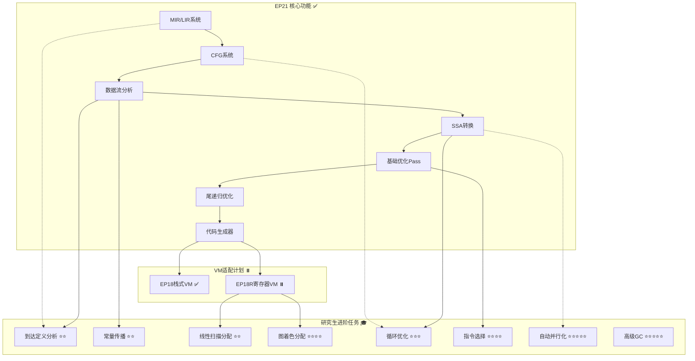

# EP21 改进计划

**版本**: v1.0 | **日期**: 2026-01-07 | **状态**: 改进路线图完成
**目的**: 提供EP21项目的改进规划和未来发展方向
**相关文档**: [详细任务分解](详细任务分解.md) | [测试模板](测试模板.md) | [研究生进阶任务](研究生进阶任务.md) | [EP21→EP18R关联优化计划](EP21到EP18R关联优化计划.md)

---

## 1. 改进计划概述

### 1.1 当前状态

| 指标 | 值 | 状态 |
|------|-----|------|
| **核心功能** | 完成 | ✅ |
| **测试通过率** | 100% (563/563) | ✅ |
| **技术债务** | 已清理 | ✅ |
| **里程碑** | M1-M4全部达成 | ✅ |

### 1.2 改进目标

1. **功能增强**: 添加高级优化Pass和编译器特性
2. **性能提升**: 目标性能提升≥100%（对比未优化版本）
3. **架构优化**: 改进扩展点和插件机制
4. **教育价值**: 增强文档和教学材料质量
5. **生态系统**: 支持EP18R寄存器VM的完整适配

---

## 2. 已完成里程碑 ✅

### Phase 1: 基础设施重构 (2025-12-23)
- **TASK-1.1**: 测试框架升级（JUnit 5 + JaCoCo）
- **TASK-1.2**: 构建系统优化（Maven配置）
- **TASK-1.3**: 测试覆盖率优化（284个测试）

### Phase 2: 中间表示层重构 (2026-01-02)
- **TASK-2.1**: MIR/LIR系统重构（148个测试）
- **TASK-2.2**: 控制流图重构（124个测试）

### Phase 3: 优化层重构 (2026-01-03)
- **TASK-3.2**: SSA形式转换重构（16个测试）
- **TASK-7**: 尾递归优化实现（28个测试）
- **TASK-8.1-8.3**: 端到端集成测试（44个测试）

### Phase 4: 后端层重构 (2026-01-03)
- **TASK-4.1**: 代码生成器重构（27个测试）
  - StackVMGenerator: EP18字节码生成（13测试）
  - RegisterVMGenerator: EP18R汇编生成（23测试）

---

## 3. 研究生进阶任务 🎓

### 3.1 初级进阶任务（⭐⭐）

#### TASK-R1: 到达定义分析
- **难度**: ⭐⭐
- **预计工作量**: 30-45小时
- **适合阶段**: 硕士一年级
- **理论背景**: gen/kill集合，数据流方程
- **验收标准**:
  - 正确计算每个基本块的gen和kill集合
  - 正确求解数据流方程直至收敛
  - 通过10+个测试用例验证

#### TASK-R2: 线性扫描寄存器分配
- **难度**: ⭐⭐
- **预计工作量**: 45-65小时
- **适合阶段**: 硕士一年级
- **理论背景**: 区间着色问题，贪心策略
- **验收标准**:
  - 正确计算活跃区间
  - 分配时间线性于变量数量
  - 寄存器利用率≥70%
  - 溢出指令占比≤15%

#### TASK-R3: 常量传播分析
- **难度**: ⭐⭐
- **预计工作量**: 40-60小时
- **适合阶段**: 硕士一年级
- **理论背景**: 三值格（⊥, ⊤, 常量值）
- **验收标准**:
  - 正确识别常量表达式
  - 常量替换率≥30%
  - 编译时间增加<5%

#### TASK-R4: 死代码消除
- **难度**: ⭐⭐
- **预计工作量**: 25-40小时
- **适合阶段**: 硕士一年级
- **验收标准**:
  - 代码删除率≥20%
  - 编译时间增加<3%
  - 测试覆盖率≥90%

### 3.2 中级进阶任务（⭐⭐⭐⭐）

#### TASK-R5: 图着色寄存器分配
- **难度**: ⭐⭐⭐⭐
- **预计工作量**: 80-120小时
- **适合阶段**: 硕士二年级
- **理论背景**: 干涉图构建，图着色算法
- **验收标准**:
  - 寄存器利用率≥80%
  - 溢出指令占比≤10%
  - vs 线性扫描: 性能提升≥30%

#### TASK-R6: 指令选择算法
- **难度**: ⭐⭐⭐⭐
- **预计工作量**: 60-90小时
- **适合阶段**: 硕士二年级
- **理论背景**: 树匹配，动态规划
- **验收标准**:
  - 指令数减少≥15%
  - 指令集覆盖率≥90%
  - 代码生成时间线性于IR大小

#### TASK-R7: 循环优化
- **难度**: ⭐⭐⭐
- **预计工作量**: 50-80小时
- **适合阶段**: 硕士二年级
- **验收标准**:
  - 不变量提取率≥40%
  - 循环展开后性能提升≥15%
  - 代码膨胀≤2x

#### TASK-R8: 类型系统扩展
- **难度**: ⭐⭐⭐
- **预计工作量**: 70-100小时
- **适合阶段**: 硕士二年级
- **验收标准**:
  - 结构体类型正确表示
  - 成员访问代码正确
  - 内存布局高效
  - 类型检查准确（错误检测率100%）

### 3.3 高级进阶任务（⭐⭐⭐⭐⭐）

#### TASK-R9: 自动并行化
- **难度**: ⭐⭐⭐⭐⭐
- **预计工作量**: 150-200小时
- **适合阶段**: 硕士三年级/博士
- **验收标准**:
  - 4核CPU上加速比≥2.5x
  - 8核CPU上加速比≥5x
  - 可扩展性接近线性
  - **创新性**: 提出新优化技术，发表论文

#### TASK-R10: 高级垃圾回收算法
- **难度**: ⭐⭐⭐⭐⭐
- **预计工作量**: 120-180小时
- **适合阶段**: 硕士三年级/博士
- **验收标准**:
  - GC暂停时间≤10ms
  - 吞吐量提升≥2x
  - CPU利用率≥80%
  - **创新性**: 提出新优化技术，发表论文

---

## 4. VM适配改进计划 🖥️

### 4.1 EP18R 寄存器VM适配

#### Phase 1: 基础设施（EP21主导）

| 任务 | 状态 | 优先级 | 预计工时 |
|------|------|--------|----------|
| TASK-VM-01: 统一代码生成接口 | ⏸️ 未开始 | 高 | 2小时 |
| TASK-VM-02: VM目标选择器 | ⏸️ 未开始 | 高 | 1小时 |
| TASK-VM-03: 栈式VM生成器重构 | ⏸️ 未开始 | 高 | 4小时 |
| TASK-VM-04: 寄存器VM生成器实现 | ⏸️ 未开始 | 高 | 8小时 |
| TASK-VM-05: 集成测试 | ⏸️ 未开始 | 中 | 4小时 |

**预计工时**: 19小时（~2.5天）

#### Phase 2: EP18R高优先级实现

| 任务 | 状态 | 优先级 | 预计工时 |
|------|------|--------|----------|
| TASK-18R-VM-01: 寄存器分配器接口 | ⏸️ 未开始 | 🔴 高 | 2小时 |
| TASK-18R-VM-02: 线性扫描分配器 | ⏸️ 未开始 | 🔴 高 | 8小时 |
| TASK-18R-VM-03: 寄存器VM代码生成器 | ⏸️ 未开始 | 🔴 高 | 8小时 |
| TASK-18R-VM-04: 32位字节码编码器 | ⏸️ 未开始 | 高 | 4小时 |
| TASK-18R-VM-05: EP18R调用约定 | ⏸️ 未开始 | 中 | 4小时 |
| TASK-18R-VM-06: EP18R适配器接口 | ⏸️ 未开始 | 中 | 2小时 |

**预计工时**: 28小时（~3.5天）

### 4.2 总工作量估算

| 阶段 | 组件 | 预计工时 |
|------|------|----------|
| **Phase 1** | EP21基础设施 | 19小时 |
| **Phase 2** | EP18R高优先级 | 28小时 |
| **测试** | 集成测试用例 | 8小时 |
| **文档** | 更新文档和教程 | 6小时 |
| **总计** | **61小时**（~8天） | |

### 4.3 EP21-EP18R独立联动策略

**团队结构**: 独立的团队/开发者

**优先级关注点**:
1. **功能完整性** - 优先完成所有未完成任务
2. **文档更新** - 同步创建精简版TDD计划
3. **测试覆盖** - 扩展测试套件

**EP21独立任务**:
- TASK-EP21-CG-01~03: RegisterVMGenerator改进（寄存器分配、指令优化、优化级别）
- TASK-EP21-TEST-01~02: EP18R专用测试套件、语义等价性测试
- TASK-EP21-DOC-01~02: 更新改进计划、创建联动版TDD计划

**EP18R独立任务**:
- TASK-18R-VM-01~06: 完成VM适配任务（接口、分配器、编码器、生成器、调用约定、适配器）
- TASK-18R-TEST-01~02: 寄存器分配测试、代码生成测试
- TASK-18R-DOC-01~02: 创建精简版TDD计划、更新现有计划

**联动协调**:
- **接口契约**: ICodeGenerator、IRegisterAllocator、IR格式
- **里程碑**: 4个里程碑（Week 2-5）
- **同步机制**: 双周会议、接口变更通知、集成测试触发

**详细联动计划**: 参见 `/docs/EP21-EP18R联动计划.md`

---

## 5. 实施时间表

### 短期目标（1-2个月）

#### 第1周：VM适配基础设施
- [ ] TASK-VM-01: 统一代码生成接口
- [ ] TASK-VM-02: VM目标选择器
- [ ] TASK-VM-03: 栈式VM生成器重构

#### 第2周：EP18R实现（第1部分）
- [ ] TASK-18R-VM-01: 寄存器分配器接口
- [ ] TASK-18R-VM-02: 线性扫描分配器
- [ ] TASK-18R-VM-03: 寄存器VM代码生成器（部分）

#### 第3周：EP18R实现（第2部分）
- [ ] TASK-18R-VM-03: 寄存器VM代码生成器（完成）
- [ ] TASK-18R-VM-04: 32位字节码编码器
- [ ] TASK-VM-04: 寄存器VM生成器实现

#### 第4周：集成与测试
- [ ] TASK-18R-VM-05: EP18R调用约定
- [ ] TASK-18R-VM-06: EP18R适配器接口
- [ ] TASK-VM-05: 集成测试
- [ ] 文档更新

### 中期目标（3-6个月）

#### 研究生一年级任务
- [ ] TASK-R1: 到达定义分析
- [ ] TASK-R2: 线性扫描寄存器分配
- [ ] TASK-R3: 常量传播分析
- [ ] TASK-R4: 死代码消除

#### 研究生二年级任务
- [ ] TASK-R5: 图着色寄存器分配
- [ ] TASK-R6: 指令选择算法
- [ ] TASK-R7: 循环优化
- [ ] TASK-R8: 类型系统扩展

### 长期目标（6-12个月）

#### 研究生三年级/博士任务
- [ ] TASK-R9: 自动并行化
- [ ] TASK-R10: 高级垃圾回收算法
- [ ] JIT编译器优化
- [ ] 自定义优化算法设计

---

## 6. 技术债务清理记录

**已清理** (2025-12-26):
- ❌ `ExecutionGraph.java` (~500行) - 已删除
- ❌ `IRInstructionBuilder.java` (~425行) - 已删除
- ❌ `StackFrame.java` (~390行) - 已删除
- ❌ `CFGMutableBuilder.java` (~245行) - 已删除
- ✅ 总代码减少: ~1560行

**无技术债务** - 所有文档与实际代码一致 ✅

---

## 7. 依赖关系图

---

## 8. 验收标准

### 8.1 功能验收
- [ ] 所有现有测试通过率保持100%
- [ ] 新功能测试覆盖率≥85%
- [ ] 无编译警告
- [ ] 通过所有CI检查

### 8.2 性能验收
- [ ] vs 未优化版本：性能提升≥100%
- [ ] 编译时间增加<15%
- [ ] 内存使用优化≥15%

### 8.3 质量验收
- [ ] 代码符合Google Java Style Guide
- [ ] Javadoc注释覆盖率≥80%
- [ ] 文档更新及时

---

## 9. 风险管理

| 风险 | 概率 | 影响 | 缓解措施 |
|------|------|------|----------|
| 性能回归 | 中 | 高 | 建立性能基准测试 |
| 兼容性破坏 | 低 | 高 | 保持向后兼容性测试 |
| 测试覆盖率下降 | 中 | 中 | 设置覆盖率阈值检查 |
| 重构复杂度高 | 高 | 高 | 采用增量重构策略 |
| EP18R实现延迟 | 中 | 中 | 分阶段实现，优先支持关键功能 |

---

## 10. 相关资源

### 10.1 内部文档
- **详细任务分解**: [详细任务分解.md](详细任务分解.md)
- **测试模板**: [测试模板.md](测试模板.md)
- **研究生进阶任务**: [研究生进阶任务.md](研究生进阶任务.md)
- **EP21→EP18R关联优化计划**: [EP21到EP18R关联优化计划.md](EP21到EP18R关联优化计划.md)

### 10.2 学术资源
- 《编译原理》（龙书）- Aho, Sethi, Ullman
- 《现代编译原理》（虎书）- Andrew Appel
- 《编译器设计》（鲸书）- Cooper & Torczon
- 《高级编译器设计与实现》- Steven Muchnick

### 10.3 开源参考
- LLVM: `https://llvm.org/`
- GCC: `https://gcc.gnu.org/`
- V8: `https://v8.dev/`

---

## 11. 版本历史

| 版本 | 日期 | 更新内容 |
|------|------|----------|
| v1.0 | 2026-01-07 | 创建改进计划，明确研究生进阶任务和VM适配路线图 |

---

**最后更新**: 2026-01-07
**维护者**: Claude Code
**状态**: 📝 改进路线图完成
