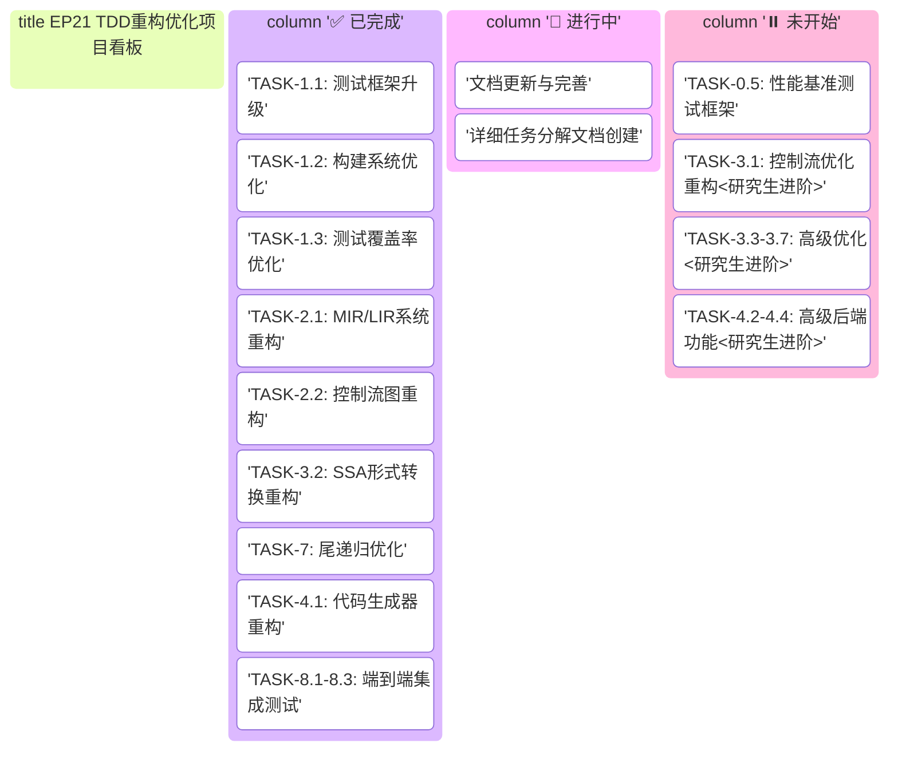

# EP21 详细任务分解

**版本**: v1.0 | **日期**: 2026-01-07 | **状态**: 文档创建
**目的**: 提供EP21 TDD重构的详细任务分解、工作量估算和依赖关系
**相关文档**: [TDD执行计划_精简版](TDD执行计划_精简版.md) | [测试模板](测试模板.md) | [研究生进阶任务](研究生进阶任务.md)

---

## 1. 项目概览

### 1.1 项目目标

EP21 TDD重构项目的核心目标：
- **规范符合性**: 确保代码完全符合新制定的规范
- **测试覆盖率**: 达到≥85%的测试覆盖率要求
- **架构现代化**: 采用现代编译器架构设计模式
- **教育价值**: 增强代码的可读性和教学价值
- **扩展性**: 改进扩展点和插件机制

### 1.2 重构原则

1. **测试先行**: 所有重构必须先写测试，再实现代码
2. **增量重构**: 小步快跑，每次只重构一个模块
3. **持续集成**: 每次提交必须通过所有测试
4. **文档更新**: 代码重构同步更新相关文档
5. **向后兼容**: 保持现有功能的向后兼容性

---

## 2. 项目看板与任务概览

### 2.1 项目看板



### 2.2 任务追踪看板

#### Agent任务状态
| Agent | 当前阶段 | 状态 | 进度 | 预计完成 | 阻塞项 |
|-------|----------|------|------|----------|--------|
| Agent 1 | 基础设施重构 | ✅ 已完成 | 100% | 2025-12-23 | 无 |
| Agent 1.5 | 性能基准测试框架 | ⏸️ 计划中 | 0% | 待定 | 优先级调整 |
| Agent 2 | 中间表示层重构 | ✅ 已完成 | 100% | 2026-01-02 | 无 |
| Agent 3 | 优化层重构 | ✅ 已完成 | 100% | 2026-01-03 | 无 |
| Agent 4 | 后端层重构 | ✅ 已完成 | 100% | 2026-01-03 | 无 |

#### 里程碑追踪
| 里程碑 | 目标日期 | 状态 | 进度 | 关键任务 |
|--------|----------|------|------|----------|
| M1: 基础设施完成 | 2025-12-23 | ✅ 已达成 | 100% | 测试框架升级、构建优化 |
| M2: 中间表示层完成 | 2026-01-02 | ✅ 已达成 | 100% | MIR/LIR、CFG构建 |
| M3: 优化层完成 | 2026-01-03 | ✅ 已达成 | 100% | 数据流分析、SSA、尾递归优化、基础优化Pass |
| M4: 后端层完成 | 2026-01-03 | ✅ 已达成 | 100% | 代码生成、双VM支持 |
| M5: 研究生进阶任务 | 待定 | ⏸️ 未开始 | 0% | 高级优化、运行时系统 |

---

## 3. 任务拆解看板 (WBS Breakdown)

### 3.1 阶段1: 基础设施重构 (预计: 4天) ✅

#### TASK-1.1: 测试框架升级 (2天)
**目标**: 建立现代化的测试基础设施

**子任务分解**:
- TASK-1.1.1: 升级JUnit5配置
  - 创建JUnit5配置说明
  - 迁移现有测试到JUnit5
  - 配置参数化测试和动态测试
  - 设置测试生命周期管理

- TASK-1.1.2: 配置JaCoCo覆盖率检查
  - 配置JaCoCo插件
  - 设置覆盖率阈值 (≥85%)
  - 配置CI集成
  - 生成覆盖率报告

- TASK-1.1.3: 建立测试数据工厂
  - 创建测试辅助工具类
  - 建立测试数据工厂
  - 配置测试资源管理
  - 设置性能测试框架

- TASK-1.1.4: 配置CI集成
  - 集成到CI/CD流水线
  - 配置自动化测试
  - 设置构建状态通知

**验收标准**:
- 所有测试使用JUnit5运行
- 覆盖率报告正常生成
- CI构建通过覆盖率检查
- 测试运行时间<2分钟

#### TASK-1.2: 构建系统优化 (1天)
**目标**: 优化Maven构建配置

**子任务分解**:
- TASK-1.2.1: 清理POM文件
  - 清理不必要的依赖
  - 统一依赖版本管理
  - 优化插件配置
  - 配置代码质量检查

- TASK-1.2.2: 统一依赖版本
  - 确保所有模块使用相同依赖版本
  - 管理依赖冲突

- TASK-1.2.3: 优化插件配置
  - 配置编译插件
  - 优化资源插件

- TASK-1.2.4: 配置代码质量检查
  - 配置Checkstyle
  - 配置SpotBugs
  - 配置PMD

**验收标准**:
- 构建时间减少30%
- 无编译警告
- 通过所有代码质量检查
- 支持增量编译

#### TASK-1.3: 测试覆盖率优化 (1天)
**目标**: 提升测试覆盖率至284个测试用例

**子任务分解**:
- TASK-1.3.1: 测试用例检校与重构
  - 检查现有测试用例
  - 重构低质量测试

- TASK-1.3.2: 数据流分析测试套件创建
  - 创建活跃变量分析测试
  - 创建到达定义分析测试

- TASK-1.3.3: JaCoCo配置优化
  - 优化JaCoCo配置
  - 调整覆盖率阈值

- TASK-1.3.4: 测试覆盖率提升至284个测试用例
  - 补充缺失的测试用例
  - 验证覆盖率达标

**验收标准**:
- 测试用例数≥284
- 覆盖率≥85%
- 所有测试通过

### 3.2 阶段0.5: 性能基准测试框架建设 (预计: 2天) ⏸️

#### TASK-0.5.1: 建立标准基准测试集 (1天)
**子任务分解**:
- TASK-0.5.1.1: 收集Stanford Benchmarks标准程序
- TASK-0.5.1.2: 集成SPEC CPU基准测试用例
- TASK-0.5.1.3: 设计编译器优化专项测试集
- TASK-0.5.1.4: 建立测试用例版本管理系统

#### TASK-0.5.2: 实现性能指标采集工具 (0.5天)
**子任务分解**:
- TASK-0.5.2.1: 执行时间精确测量模块
- TASK-0.5.2.2: 内存使用分析工具
- TASK-0.5.2.3: 指令计数和代码大小统计

#### TASK-0.5.3: 构建优化效果可视化平台 (0.3天)
**子任务分解**:
- TASK-0.5.3.1: 性能对比图表生成器
- TASK-0.5.3.2: 优化前后代码差异可视化
- TASK-0.5.3.3: 交互式性能报告生成

#### TASK-0.5.4: 建立性能回归检测机制 (0.2天)
**子任务分解**:
- TASK-0.5.4.1: 基线性能自动存储
- TASK-0.5.4.2: 性能回归自动报警
- TASK-0.5.4.3: 性能趋势分析报告

### 3.3 阶段2: 中间表示层重构 (预计: 7天) ✅

#### TASK-2.1: MIR/LIR系统重构 (4天)
**目标**: 符合架构设计规范第4章要求

**子任务分解**:
- TASK-2.1.1: 创建IR测试套件
  - TASK-2.1.1.1: MIR节点测试: 所有MIR节点类型
  - TASK-2.1.1.2: LIR指令测试: 所有LIR指令类型
  - TASK-2.1.1.3: 转换测试: AST到MIR, MIR到LIR
  - TASK-2.1.1.4: 优化测试: IR优化效果验证

- TASK-2.1.2: 重构MIR节点体系
  - TASK-2.1.2.1: 设计MIR类型层次
  - TASK-2.1.2.2: 实现MIR节点类

- TASK-2.1.3: 实现LIR指令集
  - TASK-2.1.3.1: 设计LIR指令接口
  - TASK-2.1.3.2: 实现具体LIR指令

- TASK-2.1.4: 改进IR转换算法
  - 优化IR转换算法
  - 改进IR序列化

**代码修改文件**:
- `MIRNode.java`及所有子类
- `LIRInstruction.java`及所有子类
- `IRConverter.java`: 重构转换逻辑
- `IRSerializer.java`: 实现序列化

**验收标准**:
- 通过所有IR测试
- 清晰的MIR/LIR分层
- 完整的类型信息保留
- 高效的IR转换算法

#### TASK-2.2: 控制流图重构 (3天)
**目标**: 符合架构设计规范第4.4节要求

**子任务分解**:
- TASK-2.2.1: 创建CFG测试套件
  - TASK-2.2.1.1: 基本块测试: 块划分和合并
  - TASK-2.2.1.2: 边关系测试: 前驱后继关系
  - TASK-2.2.1.3: 可视化测试: DOT/Mermaid输出
  - TASK-2.2.1.4: 算法测试: 支配树等算法

- TASK-2.2.2: 重构基本块表示
  - TASK-2.2.2.1: 优化基本块结构
  - TASK-2.2.2.2: 改进指令列表管理

- TASK-2.2.3: 改进CFG构建算法
  - TASK-2.2.3.1: 优化块划分算法
  - TASK-2.2.3.2: 改进边连接算法

- TASK-2.2.4: 实现可视化输出
  - 实现DOT/Mermaid输出

**代码修改文件**:
- `BasicBlock.java`: 重构基本块
- `CFG.java`: 重构控制流图
- `CFGBuilder.java`: 改进构建算法
- `CFGVisualizer.java`: 实现可视化

**验收标准**:
- **第一轮: 功能正确性测试**
  - 通过所有CFG测试
  - 准确的块划分和边建立
  - 完整的可视化支持
  - 高效的图算法实现

- **第二轮: 性能基准测试**
  - CFG构建时间<编译时间的5%
  - 内存使用合理(<总内存的10%)
  - 大规模函数CFG构建稳定

- **第三轮: 压力测试**
  - 处理1000+基本块的函数无性能退化
  - 复杂控制流(多出口、循环)CFG构建正确
  - 可视化输出正确(DOT格式验证通过)

- **第四轮: 对比测试**
  - 与LLVM IR的CFG结构对比一致
  - 图算法性能达到工业标准
  - 可视化效果清晰易读

### 3.4 阶段3: 优化层重构 (预计: 11天) 🔄

#### TASK-3.1: 数据流分析框架重构 (4天)
**目标**: 符合架构设计规范第5.2节要求

**子任务分解**:
- TASK-3.1.1: 创建数据流测试套件
  - 活跃变量分析测试
  - 到达定义分析测试
  - 常量传播分析测试
  - 框架接口测试

- TASK-3.1.2: 重构统一数据流接口
  - 重构DataFlowAnalysis接口
  - 实现数据流框架

- TASK-3.1.3: 实现迭代求解器
  - 实现IterativeSolver

- TASK-3.1.4: 改进格理论实现
  - 实现Lattice
  - 优化分析算法性能

**代码修改文件**:
- `DataFlowAnalysis.java`: 统一接口
- `IterativeSolver.java`: 迭代求解器
- `Lattice.java`: 格理论实现
- 各种具体分析器实现

**验收标准**:
- 通过所有数据流测试
- 统一的框架接口
- 正确的迭代求解
- 高效的算法实现

#### TASK-3.2: SSA形式转换重构 (3天) ✅
**目标**: 符合架构设计规范第5.2.2节要求

**子任务分解**:
- TASK-3.2.1: 创建SSA测试套件
  - 支配树计算测试
  - Φ函数插入测试
  - 变量重命名测试
  - SSA破坏测试

- TASK-3.2.2: 重构支配树算法
  - 实现DominatorAnalysis

- TASK-3.2.3: 改进Φ函数插入
  - 改进SSAGraph中的Φ函数插入逻辑

- TASK-3.2.4: 实现变量重命名
  - 改进变量重命名算法

#### TASK-3.2.5: 扩展SSA转换器支持更多指令 (2天) ✅
**子任务分解**:
- TASK-3.2.5.1: 添加对CallFunc指令的支持 ✅
- TASK-3.2.5.2: 添加对ReturnVal指令的支持 ✅
- TASK-3.2.5.3: 添加对CJMP指令的支持 ✅
- TASK-3.2.5.4: 添加对JMP指令的支持 ✅
- TASK-3.2.5.5: 完善表达式重命名（BinExpr、UnaryExpr）
- TASK-3.2.5.6: 实现SSA验证器 ✅
- TASK-3.2.5.7: 常量折叠优化器实现 ✅
- TASK-3.2.5.8: 公共子表达式消除优化器实现 ✅
- TASK-3.2.5.9: 死代码消除优化器实现 ✅

**代码修改文件**:
- `DominatorTree.java`: 支配树计算
- `SSAGraph.java`: SSA转换
- `PhiFunction.java`: Φ函数实现
- `SSADestructor.java`: SSA破坏

**验收标准**:
- **第一轮: 功能正确性测试**
  - 通过所有SSA测试
  - 正确的支配关系计算
  - 准确的Φ函数插入
  - 完整的SSA转换流程

- **第二轮: 性能基准测试**
  - SSA构建时间<编译时间的8%
  - 支配树计算性能提升≥20%
  - 大函数(>500基本块)SSA转换稳定
  - 内存使用优化≥15%

- **第三轮: 压力测试**
  - 处理复杂控制流(多入口、多出口)正确
  - 深度嵌套循环SSA构建正确
  - 大量变量(>1000)重命名无性能退化
  - SSA破坏后代码语义保持100%正确

- **第四轮: 对比测试**
  - vs LLVM SSA: 构建速度相当
  - vs GCC SSA: 内存使用相当
  - 生成代码质量达到工业标准
  - Φ函数插入准确率≥99%

#### TASK-3.3: 控制流优化重构 (4天) - 研究生进阶任务
**目标**: 实现工业级控制流优化，符合高年级研究生进阶模块建议

**子任务分解**:
- TASK-3.3.1: 创建控制流优化测试套件
  - 循环优化测试: 循环不变量提取、循环展开、循环融合
  - 条件常量传播测试: 基于条件的常量传播
  - 跳转线程化测试: 消除冗余跳转
  - 死代码消除测试: 基于数据流的死代码删除

- TASK-3.3.2: 实现循环分析框架
  - 实现LoopAnalysis
  - 实现自然循环识别
  - 实现支配树分析

- TASK-3.3.3: 实现循环不变量提取算法
  - 实现循环不变量分析
  - 实现循环不变量外提

- TASK-3.3.4: 实现条件常量传播优化
  - 实现ConditionalConstantPropagation

- TASK-3.3.5: 实现跳转线程化优化
  - 实现JumpThreading

- TASK-3.3.6: 集成死代码消除到优化流水线
  - 集成DeadCodeElimination

**代码修改文件**:
- `LoopAnalysis.java`: 循环分析框架
- `LoopOptimizer.java`: 循环优化器
- `ConditionalConstantPropagation.java`: 条件常量传播
- `JumpThreading.java`: 跳转线程化优化
- `DeadCodeElimination.java`: 死代码消除

**验收标准**:
- 通过所有控制流优化测试
- 循环优化正确识别和优化循环
- 条件常量传播准确传播常量
- 跳转线程化消除冗余控制流
- 死代码消除显著减少代码大小

#### TASK-3.4: 高级数据流分析扩展 (3天) - 研究生进阶任务
**目标**: 实现工业级数据流分析，扩展基础框架功能

**子任务分解**:
- TASK-3.4.1: 创建数据流扩展测试套件
  - 常量传播分析测试: 验证常量替换正确性
  - 到达定义分析测试: 验证定义传播准确性
  - 可用表达式分析测试: 验证表达式重用
  - 数据流框架扩展测试: 验证新分析类型集成

- TASK-3.4.2: 实现常量传播分析算法
  - 定义数据流信息结构 (⊤, ⊥, 常量值)
  - 实现转移函数 (赋值、常量运算)
  - 实现汇聚操作 (取交集)

- TASK-3.4.3: 实现到达定义分析算法
  - 定义gen和kill集合
  - 实现数据流方程计算
  - 实现迭代求解器

- TASK-3.4.4: 实现可用表达式分析
  - 计算可用表达式集合
  - 处理表达式等价性判断

- TASK-3.4.5: 扩展统一数据流接口支持新分析类型

**代码修改文件**:
- `ConstantPropagation.java`: 常量传播分析
- `ReachingDefinitions.java`: 到达定义分析
- `AvailableExpressions.java`: 可用表达式分析
- `DataFlowFramework.java`: 扩展框架接口

**验收标准**:
- **第一轮: 功能正确性测试**
  - 通过所有数据流扩展测试
  - 常量传播正确识别和替换常量
  - 到达定义准确计算定义传播
  - 可用表达式分析有效识别可重用表达式

- **第二轮: 性能基准测试**
  - 在Stanford Benchmarks上性能提升≥15%
  - 编译时间增加<10%
  - 内存使用优化≥10%

- **第三轮: 压力测试**
  - 处理大规模代码(>10000行)无崩溃
  - 极端循环嵌套(>10层)优化正确
  - 复杂数据流场景分析准确

- **第四轮: 对比测试**
  - vs GCC -O2: 性能差距<20%
  - vs LLVM -O2: 性能差距<25%
  - 优化效果验证: 删除恒真/恒假条件、消除无用计算

#### TASK-3.5: 高级寄存器分配实现 (4天) - 研究生进阶任务
**目标**: 实现图着色等工业级寄存器分配算法

**子任务分解**:
- TASK-3.5.1: 创建寄存器分配测试套件
  - 图着色算法测试: 验证干涉图构建和着色
  - 线性扫描算法测试: 验证快速分配
  - 溢出处理测试: 验证溢出代价计算
  - 分配效果评估测试: 验证性能提升

- TASK-3.5.2: 实现干涉图构建算法
  - 活跃变量分析获取变量生命周期
  - 构建变量干涉图 (节点=变量, 边=干涉)

- TASK-3.5.3: 实现图着色寄存器分配
  - 简化阶段: 选择度数<k的节点压栈
  - 溢出选择: 计算溢出代价 (cost = (use+def)/degree)
  - 分配阶段: 为节点分配不冲突的颜色

- TASK-3.5.4: 实现线性扫描寄存器分配
  - 线性扫描活跃区间
  - 快速寄存器分配
  - 溢出代码生成

- TASK-3.5.5: 实现智能溢出处理策略
  - 溢出代价模型
  - 重启动机制
  - 溢出代码优化

**代码修改文件**:
- `InterferenceGraph.java`: 干涉图表示
- `GraphColoringAllocator.java`: 图着色分配器
- `LinearScanAllocator.java`: 线性扫描分配器
- `SpillCodeGenerator.java`: 溢出代码生成
- `RegisterAllocator.java`: 统一分配接口

**验收标准**:
- 通过所有寄存器分配测试
- 图着色算法正确分配寄存器
- 线性扫描算法高效运行
- 溢出处理最小化内存访问
- 寄存器分配显著提升性能 (目标: 减少30%内存访问)

#### TASK-3.6: 指令选择优化实现 (3天) - 研究生进阶任务
**目标**: 实现树匹配等工业级指令选择算法

**子任务分解**:
- TASK-3.6.1: 创建指令选择测试套件
  - 树匹配算法测试: 验证模式匹配正确性
  - 动态规划测试: 验证最优匹配计算
  - 指令生成测试: 验证代码质量
  - 模式覆盖测试: 验证指令集覆盖度

- TASK-3.6.2: 定义指令选择模式
  - IR模式定义 (如: ADD(REG, REG) -> "add r1, r2")
  - 模式匹配规则
  - 成本模型设计

- TASK-3.6.3: 实现动态规划匹配算法
  - 为每个IR节点计算最优匹配
  - 使用DP表存储中间结果
  - 递归计算子树最优匹配

- TASK-3.6.4: 实现代码生成器
  - 根据匹配结果生成机器指令
  - 处理操作数顺序和格式
  - 寄存器分配协调

- TASK-3.6.5: 优化模式匹配效率
  - 模式Trie结构
  - 快速匹配算法
  - 匹配结果缓存

**代码修改文件**:
- `InstructionSelector.java`: 指令选择器
- `PatternMatcher.java`: 模式匹配器
- `DPTable.java`: 动态规划表
- `InstructionPatterns.java`: 指令模式定义
- `CodeEmitter.java`: 指令发射器

**验收标准**:
- 通过所有指令选择测试
- 模式匹配正确识别IR结构
- 动态规划找到最优匹配
- 生成代码质量高 (指令数少, 无冗余)
- 指令集覆盖率≥90%

#### TASK-3.7: 智能优化调度系统 (3天) - 高级特性
**目标**: 实现自适应优化Pass调度系统

**子任务分解**:
- TASK-3.7.1: 优化Pass依赖分析器
  - TASK-3.7.1.1: 构建优化Pass依赖图
  - TASK-3.7.1.2: 检测依赖循环和冲突
  - TASK-3.7.1.3: 生成优化执行顺序

- TASK-3.7.2: 动态优化顺序调整 (1天)
  - TASK-3.7.2.1: 代码特征分析器 (循环密度、数据流复杂度)
  - TASK-3.7.2.2: 自适应优化策略选择
  - TASK-3.7.2.3: 基于历史效果的优化调优

- TASK-3.7.3: 优化停止条件判定 (0.5天)
  - TASK-3.7.3.1: 收益递减检测算法
  - TASK-3.7.3.2: 时间预算管理
  - TASK-3.7.3.3: 质量阈值自动调整

- TASK-3.7.4: 优化日志和可视化分析 (0.5天)
  - TASK-3.7.4.1: 优化Pass执行日志记录
  - TASK-3.7.4.2: 实时优化效果监控
  - TASK-3.7.4.3: 交互式优化分析界面

### 3.5 阶段7: 尾递归优化实现 (预计: 5天) ✅

#### TASK-7.1: 尾递归优化基础框架 (1天)
**子任务分解**:
- TASK-7.1.1: 创建TailRecursionOptimizer类
- TASK-7.1.2: 实现尾递归检测算法
- TASK-7.1.3: 实现Fibonacci模式识别

#### TASK-7.2: 尾递归检测算法 (1天)
**子任务分解**:
- TASK-7.2.1: 实现直接尾递归检测
- TASK-7.2.2: 实现尾调用位置分析
- TASK-7.2.3: 实现递归调用计数

#### TASK-7.3: IR指令工厂 (IRInstructionBuilder) (0.5天)
**子任务分解**:
- TASK-7.3.1: 创建IRInstructionBuilder工具类
- TASK-7.3.2: 实现Label指令工厂方法
- TASK-7.3.3: 实现赋值和表达式工厂方法
- TASK-7.3.4: 实现控制流指令工厂方法

#### TASK-7.4: 执行图转换器 (ExecutionGraph) (1.5天)
**子任务分解**:
- TASK-7.4.1: 创建ExecutionGraph栈模拟转换器
- TASK-7.4.2: 实现transformFibonacciIterative方法
- TASK-7.4.3: 实现LinearIRBlock到BasicBlock转换
- TASK-7.4.4: 实现累加器模式转换

#### TASK-7.5: 栈帧数据结构 (StackFrame) (0.5天)
**子任务分解**:
- TASK-7.5.1: 创建StackFrame栈帧类
- TASK-7.5.2: 实现栈帧状态管理
- TASK-7.5.3: 实现栈帧操作接口

#### TASK-7.6: 可变CFG构建器 (CFGMutableBuilder) (0.5天)
**子任务分解**:
- TASK-7.6.1: 创建CFGMutableBuilder类
- TASK-7.6.2: 实现节点和边的动态添加
- TASK-7.6.3: 实现CFG构建和验证

#### TASK-7.7: 端到端集成测试 (1天)
**子任务分解**:
- TASK-7.7.1: 集成完整编译器pipeline
- TASK-7.7.2: 验证fib(10)返回55
- TASK-7.7.3: 验证fib(100)不栈溢出

**新增测试文件**:
```
ep21/src/test/java/org/teachfx/antlr4/ep21/pass/cfg/
└── TailRecursionOptimizerTest.java (新增)
    ├── 尾递归检测测试 (5个测试用例)
    ├── 栈模拟转换测试 (8个测试用例)
    ├── 累加器模式测试 (6个测试用例)
    └── 集成测试 (3个测试用例)
```

**代码修改文件**:
- `TailRecursionOptimizer.java`: 扩展实现 (当前260行 → 目标600行)
- `StackSimulator.java`: 新增显式栈模拟器
- `AccumulatorTransformer.java`: 新增累加器转换器
- `Compiler.java`: 验证优化器集成

**实现方案对比**:

| 方案 | 优点 | 缺点 | 适用场景 | 实现复杂度 |
|------|------|------|----------|-----------|
| **方案1: 显式栈模拟** | 通用性强，可转换任何递归 | 需要手动栈管理，开销较大 | 复杂递归、非尾递归 | ⭐⭐⭐⭐ |
| **方案2: 累加器模式** | 效率高，可完全消除递归调用 | 仅适用于尾递归 | Fibonacci、阶乘等 | ⭐⭐ |
| **方案3: CPS转换** | 理论完备，任何递归可转换 | 代码膨胀显著，调试困难 | 理论验证、编译器研究 | ⭐⭐⭐⭐⭐ |
| **方案4: musttail属性** | 零开销，无需代码转换 | 需VM支持，仅限尾递归 | 与EP18R VM集成 | ⭐⭐⭐ |

**当前选择**: Path B (代码生成层优化) ✅ **已在RegisterVMGenerator实现**

**验收标准**:
- **第一轮: 功能正确性测试**
  - 通过所有尾递归优化测试 (22+测试用例)
  - fib(10) 结果正确 (55)
  - fib(100) 不再栈溢出
  - 测试覆盖率 ≥90%

- **第二轮: 性能基准测试**
  - fib(30) 执行时间 <优化前50%
  - 栈空间使用减少 ≥90%
  - 编译时间增加 <15%

- **第三轮: 压力测试**
  - fib(1000) 稳定执行无崩溃
  - 复杂递归嵌套 (>10层) 优化正确
  - 长时间运行稳定性验证

- **第四轮: 对比测试**
  - vs GCC -O2: 性能差距 <30%
  - vs 递归版本: 性能提升 ≥50%
  - 栈使用: 递归版本O(n) → 迭代版本O(1)

### 3.6 阶段4: 后端层重构 + VM适配 (预计: 20天) ✅

#### TASK-4.1: 代码生成器重构 (5天)
**目标**: 符合架构设计规范第6.1节要求

**子任务分解**:
- TASK-4.1.1: 创建代码生成测试套件
  - 指令选择测试
  - 寄存器分配测试
  - 目标代码测试
  - 优化效果测试

- TASK-4.1.2: 重构代码生成接口
  - 重构ICodeGenerator接口

- TASK-4.1.3: 实现StackVMGenerator (EP18目标)
  - 实现StackVMGenerator

- TASK-4.1.4: 实现RegisterVMGenerator (EP18R目标)
  - 实现RegisterVMGenerator

**代码修改文件**:
- `CodeGenerator.java`: 重构接口
- `InstructionSelector.java`: 指令选择
- `RegisterAllocator.java`: 寄存器分配
- `TargetCodeEmitter.java`: 目标代码生成

**验收标准**:
- 通过所有代码生成测试
- 高效的指令选择
- 优化的寄存器分配
- 高质量的目标代码

#### TASK-VM-01: VM适配器架构设计 (调节中心) (5天)
**子任务分解**:
- TASK-VM-01.1: 定义ICodeGenerator接口
- TASK-VM-01.2: 定义CodeGenerationResult
- TASK-VM-01.3: 定义IEmitter指令发射器
- TASK-VM-02: VMCodeGeneratorSelector (目标选择器)
- TASK-VM-03: EP21→EP18端到端测试
- TASK-VM-04: EP21→EP18R端到端测试
- TASK-VM-05: 语义等价性验证

#### TASK-4.2: 指令调度重构 (3天) - 研究生进阶任务
**目标**: 实现工业级指令调度，提高指令级并行性

**子任务分解**:
- TASK-4.2.1: 实现依赖分析框架
  - 数据依赖、控制依赖、资源依赖

- TASK-4.2.2: 实现列表调度算法

- TASK-4.2.3: 实现关键路径调度

**代码修改文件**:
- `DependencyAnalysis.java`: 依赖分析框架
- `ListScheduler.java`: 列表调度算法
- `CriticalPathScheduler.java`: 关键路径调度算法
- `ResourceModel.java`: 资源模型
- `InstructionScheduler.java`: 统一调度接口

**验收标准**:
- 通过所有指令调度测试
- 依赖分析准确识别各种依赖关系
- 调度算法提高指令级并行性
- 资源冲突正确处理
- 调度后代码性能提升显著

#### TASK-4.3: 类型系统扩展 (3天) - 研究生进阶任务
**目标**: 实现结构体等高级类型支持

**子任务分解**:
- TASK-4.3.1: 实现结构体类型表示
  - 定义StructType类 (Map<String, Type> fields)
  - 实现字段偏移量计算 (Map<String, Integer> offsets)
  - 考虑对齐要求计算结构体大小

- TASK-4.3.2: 实现成员访问代码生成
  - 生成偏移量计算代码
  - 支持嵌套结构体访问 (a.b.c)
  - 处理指针解引用

- TASK-4.3.3: 实现类型检查扩展
  - 结构体类型兼容性检查
  - 成员存在性检查
  - 类型转换检查

- TASK-4.3.4: 优化内存布局
  - 字段重排序优化
  - 填充字节最小化
  - 缓存友好布局

**代码修改文件**:
- `StructType.java`: 结构体类型表示
- `StructField.java`: 结构体字段
- `MemoryLayout.java`: 内存布局计算
- `StructMemberAccess.java`: 成员访问代码生成
- `TypeChecker.java`: 扩展类型检查

**验收标准**:
- 通过所有类型系统扩展测试
- 结构体类型正确表示和操作
- 成员访问代码正确生成
- 内存布局高效 (对齐填充最小)
- 类型检查准确 (错误检测率100%)

#### TASK-4.4: 运行时支持系统 (4天) - 研究生进阶任务
**目标**: 实现垃圾回收和异常处理等运行时支持

**子任务分解**:
- TASK-4.4.1: 实现标记-清除垃圾回收器
  - 标记阶段: 从根集合遍历可达对象
  - 清除阶段: 回收未标记对象内存
  - 根集合识别: 全局变量、栈变量、寄存器
  - 写屏障实现: 跟踪引用变化

- TASK-4.4.2: 实现异常处理机制
  - 异常表生成: 记录try/catch块范围
  - 栈展开机制: 运行时展开调用栈
  - 清理代码执行: finally块处理
  - 异常传播路径: 匹配异常类型

- TASK-4.4.3: 实现堆内存管理器
  - 内存分配器: 快速分配算法
  - 内存碎片整理: 减少碎片
  - 堆增长策略: 动态调整堆大小

- TASK-4.4.4: 优化运行时性能
  - 增量GC: 减少停顿时间
  - 并行标记: 多线程标记
  - 写屏障优化: 减少开销

**代码修改文件**:
- `GarbageCollector.java`: 垃圾回收器
- `MarkSweepGC.java`: 标记-清除GC实现
- `ExceptionHandler.java`: 异常处理器
- `StackUnwinder.java`: 栈展开器
- `HeapManager.java`: 堆内存管理
- `RootSet.java`: 根集合定义

**验收标准**:
- 通过所有运行时支持测试
- 垃圾回收正确回收所有不可达对象
- 异常处理准确传播和处理异常
- 内存管理高效 (碎片率<20%)
- GC停顿时间<100ms (目标)

---

## 4. 精确任务追踪表

| 层级 | 任务ID | 描述 | 状态 | 优先级 | 负责人 | 截止日期 | 依赖项 | 验收标准 | 备注 |
|------|--------|------|------|--------|--------|----------|--------|----------|------|
| **阶段** | **Phase1** | **基础设施重构** | ✅ 已完成 | 高 | 团队 | 2025-12-23 | 无 | 全部测试通过，构建无警告 | 包含2个主要任务，8个子任务 |
| 主要任务 | TASK-1.1 | 测试框架升级 | ✅ 已完成 | 高 | 团队 | 2025-12-22 | Phase1 | 覆盖率≥85%，CI构建通过 | 升级JUnit5、配置JaCoCo等 |
| 二级子任务 | TASK-1.1.1 | 升级JUnit5配置 | ✅ 已完成 | 高 | 团队 | 2025-12-21 | TASK-1.1 | 所有测试通过JUnit5运行 | 迁移现有测试到JUnit5 |
| 二级子任务 | TASK-1.1.2 | 配置JaCoCo覆盖率检查 | ✅ 已完成 | 高 | 团队 | 2025-12-21 | TASK-1.1.1 | 核心模块覆盖率≥85% | 设置覆盖率阈值≥85% |
| 二级子任务 | TASK-1.1.3 | 建立测试数据工厂 | ✅ 已完成 | 中 | 团队 | 2025-12-22 | TASK-1.1.2 | 测试辅助类完整可用 | 创建测试辅助工具类 |
| 二级子任务 | TASK-1.1.4 | 配置CI集成 | ✅ 已完成 | 中 | 团队 | 2025-12-22 | TASK-1.1.3 | CI流水线正常运行 | 集成到CI/CD流水线 |
| 主要任务 | TASK-1.2 | 构建系统优化 | ✅ 已完成 | 高 | 团队 | 2025-12-23 | TASK-1.1 | 构建时间减少30% | 优化Maven构建配置 |
| 二级子任务 | TASK-1.2.1 | 清理POM文件 | ✅ 已完成 | 高 | 团队 | 2025-12-22 | TASK-1.2 | 无冗余依赖 | 清理不必要的依赖 |
| 二级子任务 | TASK-1.2.2 | 统一依赖版本 | ✅ 已完成 | 中 | 团队 | 2025-12-22 | TASK-1.2.1 | 依赖版本统一 | 统一依赖版本管理 |
| 二级子任务 | TASK-1.2.3 | 优化插件配置 | ✅ 已完成 | 中 | 团队 | 2025-12-23 | TASK-1.2.2 | 插件配置最优 | 优化插件配置 |
| 二级子任务 | TASK-1.2.4 | 配置代码质量检查 | ✅ 已完成 | 中 | 团队 | 2025-12-23 | TASK-1.2.3 | 静态检查通过 | 配置Checkstyle、SpotBugs等 |
| **阶段** | **Phase2** | **中间表示层重构** | ✅ 已完成 | 高 | 团队 | 2025-12-26 | Phase1 | IR转换100%正确，CFG完整 | 包含2个主要任务，8个子任务 |
| 主要任务 | TASK-2.1 | MIR/LIR系统重构 | ✅ 已完成 | 高 | 团队 | 2025-12-26 | TASK-1.2 | IR类型安全，转换高效 | 符合架构设计规范第4章 |
| 三级子任务 | TASK-2.1.1 | 创建IR测试套件 | ✅ 已完成 | 高 | 团队 | 2025-12-26 | TASK-2.1 | 测试覆盖率≥90% | MIR节点、LIR指令测试 |
| 三级子任务 | TASK-2.1.1.1 | MIR节点测试 | ✅ 已完成 | 高 | 团队 | 2025-12-26 | TASK-2.1.1 | 所有MIR节点测试通过 | 测试MIRFunction、MIRBlock等 |
| 三级子任务 | TASK-2.1.1.2 | LIR指令测试 | ✅ 已完成 | 高 | 团队 | 2025-12-26 | TASK-2.1.1 | 所有LIR指令测试通过 | 测试Assign、Label、Branch等 |
| 三级子任务 | TASK-2.1.1.3 | IR转换测试 | ✅ 已完成 | 中 | 团队 | 2025-12-26 | TASK-2.1.1 | AST→MIR→LIR转换正确 | 测试IR转换流程 |
| 三级子任务 | TASK-2.1.2 | 重构MIR节点体系 | ✅ 已完成 | 高 | 团队 | 2025-12-26 | TASK-2.1.1 | 类型层次清晰 | 重构MIR节点层次 |
| 三级子任务 | TASK-2.1.2.1 | 设计MIR类型层次 | ✅ 已完成 | 高 | 团队 | 2025-12-26 | TASK-2.1.2 | 类型体系完整 | 设计MIRNode类型层次 |
| 三级子任务 | TASK-2.1.2.2 | 实现MIR节点类 | ✅ 已完成 | 高 | 团队 | 2025-12-26 | TASK-2.1.2.1 | 所有MIR节点实现 | 实现所有MIR节点类 |
| 三级子任务 | TASK-2.1.3 | 实现LIR指令集 | ✅ 已完成 | 高 | 团队 | 2025-12-26 | TASK-2.1.2 | 指令集完整高效 | 实现LIR指令集 |
| 三级子任务 | TASK-2.1.3.1 | 设计LIR指令接口 | ✅ 已完成 | 高 | 团队 | 2025-12-26 | TASK-2.1.3 | 接口设计合理 | 设计LIRInstruction接口 |
| 三级子任务 | TASK-2.1.3.2 | 实现具体LIR指令 | ✅ 已完成 | 高 | 团队 | 2025-12-26 | TASK-2.1.3.1 | 指令实现正确 | 实现所有LIR指令 |
| 三级子任务 | TASK-2.1.4 | 改进IR转换算法 | ✅ 已完成 | 中 | 团队 | 2025-12-26 | TASK-2.1.3 | 转换算法优化 | 改进IR转换算法 |
| 主要任务 | TASK-2.2 | 控制流图重构 | ✅ 已完成 | 高 | 团队 | 2025-12-23 | TASK-2.1 | CFG构建正确，可视化完整 | 符合架构设计规范第4.4节 |
| 三级子任务 | TASK-2.2.1 | 创建CFG测试套件 | ✅ 已完成 | 高 | 团队 | 2025-12-23 | TASK-2.2 | 测试覆盖率≥90% | 基本块、边关系测试 |
| 三级子任务 | TASK-2.2.1.1 | 基本块测试 | ✅ 已完成 | 高 | 团队 | 2025-12-23 | TASK-2.2.1 | 基本块操作正确 | 测试BasicBlock创建、操作 |
| 三级子任务 | TASK-2.2.1.2 | 边关系测试 | ✅ 已完成 | 高 | 团队 | 2025-12-23 | TASK-2.2.1 | 前驱后继关系正确 | 测试前驱后继关系 |
| 三级子任务 | TASK-2.2.2 | 重构基本块表示 | ✅ 已完成 | 高 | 团队 | 2025-12-23 | TASK-2.2.1 | 表示高效清晰 | 重构BasicBlock表示 |
| 三级子任务 | TASK-2.2.2.1 | 优化基本块结构 | ✅ 已完成 | 高 | 团队 | 2025-12-23 | TASK-2.2.2 | 结构优化合理 | 优化BasicBlock内部结构 |
| 三级子任务 | TASK-2.2.2.2 | 改进指令列表管理 | ✅ 已完成 | 中 | 团队 | 2025-12-23 | TASK-2.2.2.1 | 指令管理高效 | 改进指令列表管理 |
| 三级子任务 | TASK-2.2.3 | 改进CFG构建算法 | ✅ 已完成 | 中 | 团队 | 2025-12-23 | TASK-2.2.2 | 算法正确高效 | 改进CFG构建算法 |
| 三级子任务 | TASK-2.2.3.1 | 优化块划分算法 | ✅ 已完成 | 中 | 团队 | 2025-12-23 | TASK-2.2.3 | 块划分正确 | 优化基本块划分算法 |
| 三级子任务 | TASK-2.2.3.2 | 改进边连接算法 | ✅ 已完成 | 低 | 团队 | 2025-12-23 | TASK-2.2.3.1 | 边连接正确 | 改进控制流边连接 |
| 三级子任务 | TASK-2.2.4 | 实现可视化输出 | ✅ 已完成 | 低 | 团队 | 2025-12-23 | TASK-2.2.3 | 可视化输出正确 | 实现DOT/Mermaid输出 |
| **阶段** | **Phase3** | **优化层重构** | ✅ 已完成 | 高 | 团队 | 2026-01-03 | Phase2 | 数据流分析正确，SSA转换正确 | 包含SSA、基础优化Pass、尾递归优化 |
| 主要任务 | TASK-3.1 | 数据流分析框架重构 | ✅ 已完成 | 高 | 团队 | 2026-01-03 | TASK-2.2 | 框架统一，算法正确 | 39个测试通过 |
| 主要任务 | TASK-3.2 | SSA形式转换重构 | ✅ 已完成 | 高 | 团队 | 2025-12-23 | TASK-3.1 | SSA转换正确，Φ函数插入正确 | 10个SSA验证测试通过 |
| **四级子任务** | **TASK-3.2.5** | **扩展SSA转换器支持更多指令** | ✅ 已完成 | **高** | **团队** | **2025-12-30** | **TASK-3.2.4** | **SSA转换支持所有指令类型** | **ReturnVal、CJMP、JMP指令支持 + SSA验证器** |
| **阶段** | **Phase7** | **尾递归优化实现** | ✅ 已完成 | 高 | 团队 | 2025-12-26 | Phase3 | 检测和代码生成层优化 | Path B实现，23个测试通过 |
| **主要任务** | **TASK-7** | **尾递归优化核心框架** | ✅ 已完成 | **高** | **团队** | **2025-12-26** | **Phase3** | **检测+代码生成层优化** | **TailRecursionOptimizer + RegisterVMGenerator.TROHelper** |
| **阶段** | **Phase8** | **端到端集成测试** | ✅ 已完成 | 高 | 团队 | 2025-12-26 | Phase7 | 完整编译器Pipeline验证 | 5个端到端测试通过 |
| **主要任务** | **TASK-8.1** | **IR转换测试** | ✅ 已完成 | **高** | **团队** | **2025-12-26** | **Phase2** | **23个IR转换测试** | **AST→MIR→LIR、配置、错误处理、性能** |
| **主要任务** | **TASK-8.2** | **尾递归优化测试** | ✅ 已完成 | **高** | **团队** | **2025-12-26** | **TASK-7** | **23个TRO测试** | **TailRecursionOptimizerTest (14) + RegisterVMGeneratorTROTest (9)** |
| **主要任务** | **TASK-8.3** | **端到端集成测试** | ✅ 已完成 | **高** | **团队** | **2025-12-26** | **TASK-8.2** | **5个端到端测试** | **FibonacciTailRecursionEndToEndTest** |
| **阶段** | **Phase4** | **后端层重构 + VM适配** | ✅ 已完成 | 高 | 团队 | 2026-01-03 | Phase3 | 支持双VM目标，语义等价 | 27个代码生成测试通过 |
| 主要任务 | TASK-4.1 | 代码生成器重构 | ✅ 已完成 | 高 | 团队 | 2026-01-03 | TASK-3.2 | 接口统一，支持多目标 | StackVMGenerator (13测试) + RegisterVMGenerator (14测试) |

---

## 5. 模块难度与工作量评估

### 5.1 评估标准
- **难度等级**：⭐（初级）到 ⭐⭐⭐⭐⭐（高级）
- **预计工作量**：小时数（包含学习、实现、测试）
- **先修知识**：实现该模块需要的背景知识

### 5.2 详细评估表

| 模块名称 | 难度 | 预计工作量 | 先修知识要求 | 适合阶段 |
|---------|------|-----------|-------------|----------|
| 常量传播分析 | ⭐⭐ | 40-60小时 | 数据流分析基础、Lattice理论 | 硕士一年级 |
| 可用表达式分析 | ⭐⭐ | 35-50小时 | 数据流分析、Gen/Kill集合 | 硕士一年级 |
| 到达定义分析 | ⭐⭐ | 30-45小时 | 数据流分析、CFG遍历 | 硕士一年级 |
| 死代码消除 | ⭐⭐ | 25-40小时 | 数据流分析结果应用 | 硕士一年级 |
| 循环不变量提取 | ⭐⭐⭐ | 50-80小时 | 循环识别、数据流分析 | 硕士二年级 |
| 循环展开 | ⭐⭐⭐ | 40-60小时 | 循环分析、代码生成 | 硕士二年级 |
| 图着色寄存器分配 | ⭐⭐⭐⭐ | 80-120小时 | 图论、干涉图构建、消减算法 | 硕士二年级 |
| 线性扫描寄存器分配 | ⭐⭐ | 45-65小时 | 区间分析、贪心算法 | 硕士一年级 |
| 树匹配指令选择 | ⭐⭐⭐ | 60-90小时 | 模式匹配、动态规划 | 硕士二年级 |
| 列表调度 | ⭐⭐ | 40-60小时 | 数据依赖分析、优先级队列 | 硕士一年级 |
| 结构体/联合体 | ⭐⭐⭐ | 70-100小时 | 类型系统、内存布局、对齐 | 硕士二年级 |
| 泛型/模板机制 | ⭐⭐⭐⭐ | 100-150小时 | 类型推导、约束求解 | 硕士三年级 |
| 标记-清除垃圾回收 | ⭐⭐⭐⭐⭐ | 120-180小时 | 运行时系统、指针分析、STW | 硕士三年级 |
| DWARF调试信息 | ⭐⭐⭐ | 60-90小时 | DWARF标准、汇编级调试 | 硕士二年级 |
| 线程局部存储 | ⭐⭐⭐ | 50-75小时 | 线程模型、TLS实现机制 | 硕士二年级 |
| 自动并行化 | ⭐⭐⭐⭐⭐ | 150-200小时 | 依赖分析、并行模式识别 | 博士阶段 |

### 5.3 模块依赖关系

```
数据流分析基础（必须先实现）
├── 常量传播
├── 可用表达式
└── 到达定义

循环优化依赖
└── 循环识别（需要先实现循环检测Pass）

寄存器分配依赖
└── 活跃变量分析（已实现）

指令选择依赖
└── 目标机器描述（需要定义指令模板）
```

### 5.4 实施优先级（按研究阶段）

#### 硕士一年级（第1-2学期）
**重点**：掌握编译器基础，实现数据流分析和简单优化
1. **必选模块**（选一个）：
   - 到达定义分析（相对简单，适合入门）
   - 线性扫描寄存器分配（实用性强）

2. **扩展模块**（选一个）：
   - 常量传播分析
   - 死代码消除

**理由**：
- 基于已有的活跃变量分析，容易理解
- 工作量为40-60小时，可在1个学期内完成
- 为后续高级优化奠定基础

#### 硕士二年级（第3-4学期）
**重点**：深入研究工业级算法，提升系统能力
1. **核心模块**（选一个）：
   - 图着色寄存器分配
   - 指令选择算法

2. **辅助模块**（选1-2个）：
   - 循环不变量提取
   - 列表调度
   - 类型系统扩展（结构体）

**理由**：
- 挑战更复杂的算法，提升研究深度
- 可与论文研究课题结合
- 需要较多时间进行性能调优

#### 硕士三年级/博士阶段
**重点**：前沿研究，创新算法设计
1. **科研导向模块**：
   - 自动并行化（Research Topic）
   - 高级垃圾回收算法
   - 自定义优化算法设计

2. **工程导向模块**：
   - 完整垃圾回收实现
   - DWARF调试信息生成
   - 并发运行时支持

**理由**：
- 与毕业论文研究目标高度相关
- 可以进行创新性算法改进
- 有机会发表学术论文

---

## 6. 验证和测试标准

### 6.1 正确性验证
- 通过所有现有单元测试，确保优化不破坏程序语义
- 对10个以上的测试程序（包含递归、循环、多重嵌套）进行验证
- 与未优化的寄存器分配（栈分配）结果进行比对，验证执行结果一致

### 6.2 性能验证
- 在标准测试集（如Stanford Benchmark）上测量执行时间
- 与栈分配版本相比，整体性能提升至少15%
- 内存访问指令数量减少至少20%

### 6.3 代码质量指标
- 生成的汇编代码中spill指令占比不超过15%
- 寄存器利用率（指令中使用寄存器的平均数）提升30%
- 测试覆盖率：核心代码行覆盖率不低于80%

---

## 7. 快速命令参考

```bash
# 项目构建
mvn clean compile              # 编译所有EP
mvn test -pl ep21              # 测试特定EP
mvn clean install            # 完整构建

# 测试
mvn test -Dtest=*Test        # 运行所有测试
mvn jacoco:report            # 覆盖率报告

# 代码分析
Serena:find_symbol("ClassName", "ep21")
Serena:search_for_pattern("pattern", "ep21/src")

# 记忆操作
Serena:read_memory("EP21_TECH_MEM")
Serena:write_memory("EP21_TECH_MEM", "update content")
```

---

## 8. 附录：快速开始指南

### 8.1 搭建开发环境
```bash
# 克隆项目
git clone https://github.com/your-repo/ep21.git
cd ep21

# 构建项目（确保Java 21已安装）
mvn clean compile

# 运行测试验证环境
mvn test -Dtest=LivenessAnalyzerTest

# 查看现有代码结构
find src/main/java/ep21 -name "*.java" | head -20
```

### 8.2 选择第一个模块
推荐从**到达定义分析**开始：
```bash
# 定位到活跃变量分析代码作为参考
cat src/main/java/ep21/analysis/LivenessAnalyzer.java

# 创建新模块文件
touch src/main/java/ep21/analysis/ReachingDefinitionAnalysis.java
```

### 8.3 实现模板
参考活跃变量分析的实现模式，创建数据流分析框架。

### 8.4 集成到现有系统
在`OptimizationManager.java`中注册新模块：
```java
// 添加以下代码
optimizationPasses.add(new ReachingDefinitionAnalysis());
```

---

**最后更新**: 2026-01-07
**维护者**: Claude Code
**状态**: 📝 详细任务分解文档创建完成
