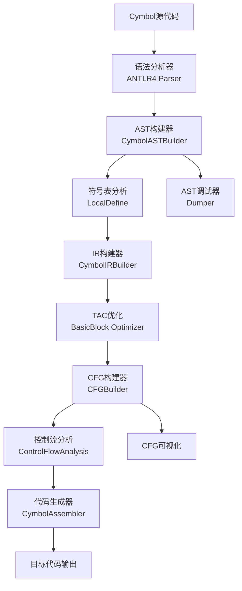

# EP21 详细设计文档

## 1. 项目概述

EP21是一个基于ANTLR4的静态分析编译器实现，专注于三地址码(TAC)构造和基础静态分析技术。该项目从源代码构建抽象语法树(AST)，生成中间表示(IR)，构建控制流程图(CFG)，并生成可执行的汇编代码。

### 1.1 设计目标
- 构建完整的编译器前端和部分后端
- 实现三地址码中间表示
- 建立控制流程图用于静态分析
- 支持基本的代码优化框架
- 生成可运行的汇编代码

### 1.2 技术栈
- ANTLR4: 语法分析器生成器
- Java 17+: 主要开发语言
- Log4j2: 日志记录
- Apache Commons Lang: 工具库

## 2. 系统架构

### 2.1 整体架构图



### 2.2 核心组件分层

1. **词法/语法分析层**: 使用ANTLR4定义Cymbol语法，生成解析树
2. **AST构建层**: 将解析树转换为抽象语法树
3. **符号表层**: 维护作用域和符号信息
4. **IR生成层**: 从AST生成三地址码
5. **CFG分析层**: 构建控制流程图
6. **代码生成层**: 生成目标汇编代码

## 3. 详细组件设计

### 3.1 语法分析器 (Cymbol.g4)

**文件位置**: `src/main/antlr4/Cymbol.g4`

**设计特点**:
- 支持完整的C语言风格语法
- 支持函数定义、变量声明、控制结构
- 包含算术、关系、逻辑运算符
- 支持6种基本数据类型：int、float、bool、string、void、object

**关键语法规则**:
```antlr
file : (functionDecl | varDecl)+ ;
functionDecl : primaryType ID '(' params? ')' block ;
statement : varDecl | 'return' expr? ';' | 'if' '(' expr ')' statement ('else' statement)?
         | 'while' '(' expr ')' statement | 'break' ';' | 'continue' ';' 
         | expr '=' expr ';' | expr ';' | block ;
expr : callFunc | unaryOp expr | expr ('*'|'/'|'+'|'-'|cmpOp) expr | primary | '(' expr ')' ;
```

### 3.2 AST节点层次结构

**基类设计**:
- `ASTNode`: 所有AST节点的基类，提供位置信息、调试输出接口
- `ASTVisitor`: 访问者模式接口，支持遍历操作

**节点分类**:
1. **编译单元** (`CompileUnit`): 根节点，包含所有函数和变量声明
2. **声明节点** (`DeclNode`):
   - `FuncDeclNode`: 函数声明
   - `VarDeclNode`: 变量声明
   - `VarDeclListNode`: 参数列表
3. **语句节点** (`StmtNode`):
   - `BlockStmtNode`: 语句块
   - `AssignStmtNode`: 赋值语句
   - `IfStmtNode`: 条件语句
   - `WhileStmtNode`: 循环语句
   - `ReturnStmtNode`: 返回语句
   - `BreakStmtNode`: 中断语句
   - `ContinueStmtNode`: 继续语句
4. **表达式节点** (`ExprNode`):
   - `BinaryExprNode`: 二元表达式
   - `UnaryExprNode`: 一元表达式
   - `CallFuncNode`: 函数调用
   - `IDExprNode`: 标识符引用
   - `LiteralNode`: 字面量(子类型包括IntExprNode、FloatExprNode、BoolExprNode、StringExprNode)

### 3.3 IR(三地址码)设计

**基类设计**:
- `IRNode`: 所有IR节点的基类
- `IRVisitor`: IR访问者模式接口

**IR分类**:
1. **程序结构**:
   - `Prog`: 程序根节点，管理所有线性IR块

2. **操作数**:
   - `Operand`: 操作数基类
   - `ConstVal`: 常量值
   - `VarSlot`: 变量槽位
   - `FrameSlot`: 栈帧槽位
   - `OperandSlot`: 临时操作数槽位

3. **表达式IR**:
   - `CallFunc`: 函数调用
   - `BinExpr`: 二元算术表达式
   - `UnaryExpr`: 一元表达式

4. **语句IR**:
   - `Label`: 标签
   - `FuncEntryLabel`: 函数入口标签
   - `Assign`: 赋值语句
   - `JMP`: 无条件跳转
   - `CJMP`: 条件跳转
   - `ReturnVal`: 返回值
   - `ExprStmt`: 表达式语句

### 3.4 控制流程图 (CFG) 设计

**核心类**:
- `LinearIRBlock`: 线性IR块，表示代码的基本连续片段
- `BasicBlock<I>`: 基本块，包含IR节点序列和跳转信息
- `CFG<T>`: 控制流程图，管理基本块和边关系
- `CFGBuilder`: CFG构建器，从线性IR构建控制流程图

**基本块特点**:
- 单一入口，单一出口
- 包含标签和指令序列
- 支持前驱和后继关系
- 用于数据流分析和优化

### 3.5 符号表设计

**作用域管理**:
- `Scope`: 作用域基类
- `GlobalScope`: 全局作用域
- `LocalScope`: 局部作用域
- `BaseScope`: 基础作用域实现

**符号定义**:
- `Symbol`: 符号基类
- `VariableSymbol`: 变量符号
- `MethodSymbol`: 方法符号
- `ScopedSymbol`: 带作用域的符号

**类型系统**:
- `Type`: 类型基类
- `BuiltInTypeSymbol`: 内置类型符号
- `OperatorType`: 运算符类型
- `TypeTable`: 类型表管理

### 3.6 编译器前端流程

**Compiler.java 主流程**:
1. **输入处理**: 支持文件输入和标准输入
2. **词法分析**: ANTLR4词法分析器
3. **语法分析**: 生成解析树
4. **AST构建**: `CymbolASTBuilder`转换解析树为AST
5. **符号表构建**: `LocalDefine`分析局部定义
6. **IR生成**: `CymbolIRBuilder`从AST生成TAC
7. **基本块优化**: `Prog.optimizeBasicBlock()`
8. **CFG构建**: 为每个函数构建控制流程图
9. **控制流分析**: 应用控制流分析优化器
10. **代码生成**: `CymbolAssembler`生成目标代码

## 4. 关键算法

### 4.1 AST到IR转换算法

**表达式求值栈管理**:
```java
// 使用显式栈管理表达式求值
private Stack<VarSlot> evalExprStack = new Stack<>();

protected VarSlot pushEvalOperand(Operand operand) {
    if (!(operand instanceof OperandSlot)){
        var assignee = OperandSlot.pushStack();
        evalExprStack.push(assignee);
        addInstr(Assign.with(assignee, operand));
        return assignee;
    } else {
        evalExprStack.push((VarSlot) operand);
        return (VarSlot) operand;
    }
}
```

**控制流结构翻译**:
- **条件语句**: 生成条件跳转指令 CJMP
- **循环语句**: 维护break/continue栈，生成循环控制
- **函数调用**: 管理参数栈和返回值

### 4.2 CFG构建算法

**基本块划分原则**:
1. 标签开始新的基本块
2. 跳转指令结束当前基本块
3. 跳转目标开始新的基本块

**边关系构建**:
```java
private void build(LinearIRBlock block, Set<String> cachedEdgeLinks) {
    // 1. 访问标记，防止重复访问
    if (visitedBlocks.contains(block)) return;
    visitedBlocks.add(block);
    
    // 2. 创建基本块
    var currentBlock = BasicBlock.buildFromLinearBlock(block, basicBlocks);
    basicBlocks.add(currentBlock);
    
    // 3. 分析最后一条指令，确定跳转关系
    var lastInstr = stmts.get(stmts.size() - 1);
    if (lastInstr instanceof JMP jmp) {
        // 无条件跳转
        addEdge(currentOrd, destOrd, JMP_TYPE);
        build(jmp.getNext(), cachedEdgeLinks);
    } else if (lastInstr instanceof CJMP cjmp) {
        // 条件跳转，两条边
        addEdge(currentOrd, thenOrd, CJMP_THEN);
        addEdge(currentOrd, elseOrd, CJMP_ELSE);
        build(cjmp.getThenBlock(), cachedEdgeLinks);
        build(cjmp.getElseBlock(), cachedEdgeLinks);
    }
}
```

### 4.3 基本块优化算法

**空块消除**:
```java
private void optimizeEmptyBlock(LinearIRBlock linearIRBlock) {
    if (linearIRBlock.getStmts().isEmpty()){
        // 1. 重写跳转引用
        var nextBlock = linearIRBlock.getSuccessors().get(0);
        for (var ref : linearIRBlock.getJmpRefMap()){
            if (ref instanceof JMP) {
                ((JMP) ref).setNext(nextBlock);
            } else if (ref instanceof CJMP) {
                ((CJMP) ref).setElseBlock(nextBlock);
            }
        }
        
        // 2. 更新前驱关系
        linearIRBlock.getPredecessors().forEach(prev -> {
            prev.removeSuccessor(linearIRBlock);
            prev.getSuccessors().add(nextBlock);
        });
        
        needRemovedBlocks.add(linearIRBlock);
    }
}
```

## 5. 数据结构

### 5.1 栈帧布局

**变量存储**:
- `FrameSlot`: 对应栈帧中的变量槽位
- 支持栈帧偏移计算
- 管理生命周期

**临时变量**:
- `OperandSlot`: 临时操作数槽位
- 顺序编号管理
- 栈式分配

### 5.2 符号表结构

**层次化作用域**:
```
GlobalScope
├── Function: main
│   ├── LocalScope (函数体)
│   │   ├── VariableSymbol: i
│   │   └── ParameterScope
│   │       └── VariableSymbol: x (参数)
└── Function: dec1
    ├── LocalScope (函数体)
    │   └── ParameterScope
    │       └── VariableSymbol: x (参数)
```

## 6. 设计模式应用

### 6.1 访问者模式 (Visitor Pattern)
- `ASTVisitor`: AST遍历和操作
- `IRVisitor`: IR节点访问
- 支持新操作的无侵入式扩展

### 6.2 构建者模式 (Builder Pattern)
- `CymbolASTBuilder`: 构建AST
- `CymbolIRBuilder`: 构建IR
- 分离构建逻辑和表示

### 6.3 工厂模式 (Factory Pattern)
- `OperandSlot.pushStack()`: 动态创建临时变量
- `FrameSlot.get()`: 创建帧槽位

### 6.4 组合模式 (Composite Pattern)
- `BlockStmtNode`: 包含子语句列表
- `CompileUnit`: 组合函数和变量声明

## 7. 扩展性设计

### 7.1 插件化优化器
- `IFlowOptimizer`: 流分析优化器接口
- 支持优化器的动态添加和组合

### 7.2 可扩展的类型系统
- 内置类型支持扩展
- 运算符重载框架

### 7.3 目标代码生成器
- `IOperatorEmitter`: 操作符发射器接口
- 支持不同目标架构

## 8. 测试策略

### 8.1 单元测试覆盖
- AST节点测试: 各类AST节点的正确性
- IR生成测试: TAC指令序列验证
- CFG构建测试: 控制流图结构验证
- 符号表测试: 作用域和符号解析

### 8.2 集成测试
- 完整编译流程测试
- 端到端语义验证

### 8.3 性能测试
- 大型程序编译性能
- 内存使用效率

## 9. 性能考虑

### 9.1 内存管理
- 对象池复用临时变量
- 延迟求值减少中间结果

### 9.2 算法效率
- CFG构建使用拓扑序
- 基本块合并优化

## 10. 总结

EP21的设计体现了现代编译器构造的核心思想：
1. **分层架构**: 清晰的层次分离
2. **访问者模式**: 灵活的数据遍历
3. **中间表示**: 简化后续优化和生成
4. **可扩展性**: 支持新特性和优化
5. **模块化**: 独立开发和测试

该设计为后续的静态分析、代码优化和目标代码生成奠定了坚实基础。