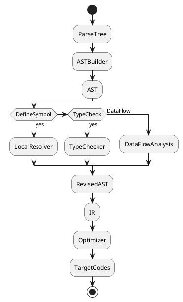

## 编译步骤流程图

```plantuml
@startuml
start
:ParseTree;
:ASTBuilder;
:AST;
if (DefineSymbol) then (yes)
  :LocalResolver;
elseif (TypeCheck) then (yes)
  :TypeChecker;
else (DataFlow)
  :DataFlowAnalysis;
endif
:RevisedAST;
:IR;
:Optimizer;
:TargetCodes;
stop
@enduml
```

## DONE
- [x] 通过访问者模式构建抽象语法树
- [x] 增加ASTree printer以检查语法树构建是否合乎期望

## Removed
~~- [ ] 增加类和接口定义~~