# EP18R 可视化模块 (vizvmr) 设计文档

## 📋 概述

**vizvmr** 是一个独立的可视化模块，为 EP18R 寄存器虚拟机提供实时的图形化执行过程展示。该模块采用观察者模式设计，通过事件监听器捕获虚拟机执行状态，使用 Java Swing 构建交互式 GUI 界面。

## 🎯 设计目标

1. **实时可视化**: 显示寄存器文件、内存、调用栈等虚拟机组件的实时状态
2. **交互式控制**: 提供单步执行、断点设置、暂停/继续等调试功能
3. **状态跟踪**: 记录和回放指令执行历史
4. **教学友好**: 界面直观，适合编译器原理教学演示
5. **模块化设计**: 独立模块，与 EP18R 虚拟机松耦合

## 🏗️ 系统架构

### 整体架构图
```
┌─────────────────────────────────────────────────────────┐
│                    vizvmr 可视化模块                     │
├─────────────────────────────────────────────────────────┤
│  ┌─────────┐  ┌─────────┐  ┌─────────┐  ┌─────────┐   │
│  │ GUI层   │  │控制层   │  │模型层   │  │集成层   │   │
│  │         │  │         │  │         │  │         │   │
│  └─────────┘  └─────────┘  └─────────┘  └─────────┘   │
└─────────────────────────────────────────────────────────┘
         │              │              │              │
         ▼              ▼              ▼              ▼
┌─────────────────────────────────────────────────────────┐
│                EP18R 寄存器虚拟机模块                    │
│                 (RegisterVMInterpreter)                  │
└─────────────────────────────────────────────────────────┘
```

### 架构层次
1. **GUI层 (Presentation Layer)**: Java Swing 组件，负责界面渲染和用户交互
2. **控制层 (Control Layer)**: 执行控制器、断点管理器、历史记录管理器
3. **模型层 (Model Layer)**: 状态模型、事件系统、数据管理层
4. **集成层 (Integration Layer)**: 虚拟机插桩适配器、桥接器、接口适配器

## 📁 模块结构

### 包结构
```
org.teachfx.antlr4.ep18r.vizvmr/
├── VizVMRLauncher.java            # 独立启动器
│
├── core/                          # 核心模型
│   ├── VMRStateModel.java         # 状态数据模型
│   └── VMRExecutionHistory.java   # 执行历史记录
│
├── event/                         # 事件系统
│   ├── VMRStateListener.java      # 状态监听器接口 (含vmStateChanged)
│   ├── VMRExecutionListener.java  # 执行监听器接口
│   ├── VMRStateEvent.java         # 状态事件基类
│   ├── RegisterChangeEvent.java   # 寄存器变化事件
│   ├── MemoryChangeEvent.java     # 内存变化事件
│   ├── PCChangeEvent.java         # 程序计数器变化事件
│   ├── InstructionExecutionEvent.java # 指令执行事件
│   └── VMStateChangeEvent.java    # 虚拟机状态变化事件
│
├── integration/                   # 集成层
│   ├── VMRInstrumentation.java    # 虚拟机插桩适配器
│   └── VMRVisualBridge.java       # 可视化桥接器
│
├── controller/                    # 控制器
│   ├── VMRStepController.java     # 单步执行控制器
│   └── VMRBreakpointManager.java  # 断点管理器
│
├── ui/                            # 用户界面
│   ├── MainFrame.java             # 主窗口框架
│   ├── panel/                     # UI组件
│   │   ├── RegisterPanel.java     # 寄存器显示面板
│   │   ├── MemoryPanel.java       # 内存显示面板
│   │   ├── CodePanel.java         # 代码显示面板
│   │   ├── StackPanel.java        # 调用栈面板
│   │   ├── ControlPanel.java      # 控制面板
│   │   ├── StatusPanel.java       # 状态面板
│   │   └── LogPanel.java          # 日志面板 (新增)
│   └── dialog/                    # 对话框 (预留)
│
└── util/                          # 工具类
    └── ConfigPersistence.java     # 配置持久化 (新增)
```

## 🔧 核心组件设计

### 1. 事件监听器系统 (Event Listener System)

#### 状态监听器 (VMRStateListener)
```java
public interface VMRStateListener extends EventListener {
    void registerChanged(RegisterChangeEvent event);
    void memoryChanged(MemoryChangeEvent event);
    void pcChanged(PCChangeEvent event);
    void vmStateChanged(VMStateChangeEvent event);  // 添加：虚拟机状态变化监听
    default void registersUpdated(RegisterChangeEvent[] events);
    default void memoryUpdated(MemoryChangeEvent[] events);
}
```

#### 执行监听器 (VMRExecutionListener)
```java
public interface VMRExecutionListener extends EventListener {
    default void instructionFetched(InstructionExecutionEvent event);
    default void beforeInstructionDecode(InstructionExecutionEvent event);
    default void beforeInstructionExecute(InstructionExecutionEvent event);
    default void afterInstructionExecute(InstructionExecutionEvent event);
    void vmStateChanged(VMStateChangeEvent event);
    default void executionError(Throwable error, int pc);
    default void executionStarted();
    default void executionFinished();
    default void executionPaused();
}
```

### 2. 状态模型 (VMRStateModel)

#### 职责
- 管理虚拟机所有状态（寄存器、内存、调用栈、PC等）
- 提供状态变更通知机制
- 维护修改追踪和性能统计
- 支持批处理更新以提高性能

#### 关键数据结构
```java
public class VMRStateModel {
    // 状态存储
    private final int[] registers;                 // 16个寄存器值
    private int[] heap;                            // 堆内存 (非final，支持restoreSnapshot)
    private int[] globals;                         // 全局变量 (非final，支持restoreSnapshot)
    private final StackFrame[] callStack;          // 调用栈
    private int framePointer;                      // 当前帧指针
    private int programCounter;                    // 程序计数器
    private int heapAllocPointer;                  // 堆分配指针

    // 修改追踪
    private final boolean[] registerModified;      // 寄存器修改标记
    private final Set<Integer> modifiedMemoryAddresses; // 内存修改地址
    private final Set<Integer> modifiedHeapAddresses;   // 堆修改地址

    // 监听器管理
    private final List<VMRStateListener> stateListeners;
    private final List<VMRExecutionListener> executionListeners;

    // 执行状态
    private volatile VMStateChangeEvent.State vmState;
    private long executionSteps;
    private long startTime;
    private int eventStepNumber;                   // 事件步数计数器
}
```

### 3. 虚拟机插桩适配器 (VMRInstrumentation)

#### 设计模式：适配器模式 + 反射
- **目的**: 在不修改 EP18R 源代码的情况下监听虚拟机内部状态
- **实现**: 使用 Java 反射访问虚拟机私有字段和方法
- **关键插桩点**:
  - 寄存器读写操作
  - 内存访问操作
  - 程序计数器更新
  - 调用栈操作
  - 指令执行前后

#### 反射字段访问
```java
public class VMRInstrumentation {
    // 反射字段缓存
    private Field registersField;
    private Field programCounterField;
    private Field framePointerField;
    private Field heapField;
    private Field heapAllocPointerField;
    private Field callStackField;
    private Field runningField;
    
    // 同步状态到模型
    public void syncState() {
        syncRegisters();
        syncMemory();
        syncCallStack();
        syncProgramCounter();
    }
}
```

### 4. 可视化桥接器 (VMRVisualBridge)

#### 职责
- 连接虚拟机和可视化界面
- 管理执行线程和控制流
- 提供反汇编支持
- 处理执行控制（启动、暂停、停止、单步）

#### 执行控制状态机
```
         ┌─────────┐
         │  空闲    │
         └────┬────┘
              │ loadProgram()
              ▼
         ┌─────────┐
         │  已加载  │
         └────┬────┘
              │ startExecution()
              ▼
         ┌─────────┐
         │ 执行中   │◄──┐
         └────┬────┘   │
    pause()   │   resume()│
              ▼          │
         ┌─────────┐    │
         │ 已暂停   │────┘
         └────┬────┘
              │ stopExecution()
              ▼
         ┌─────────┐
         │  已停止  │
         └─────────┘
```

### 5. GUI界面设计

#### 主窗口布局 (VizVMRLauncher - JavaFX)

**实际布局结构**:
```
┌─────────────────────────────────────────────────────────────────────────┐
│ ┌───────────────────────────────────────────────────────────────────┐ │
│ │ [菜单栏] 文件 视图 运行 帮助                        │ │
│ ├───────────────────────────────────────────────────────────────────┤ │
│ │ [工具栏] ▶ ⏸ ⏹ ⏭                                   │ │
│ └───────────────────────────────────────────────────────────────────┘ │
│ ┌───────────────────────────────────────────────────────────────────┐ │
│ │ ┌───────────────┬───────────────┐                     │ │
│ │ │   寄存器      │    代码       │                     │ │
│ │ │   RegisterView  │   CodeView    │                     │ │
│ │ │               │               │                     │ │
│ │ │  r0: 0x00    │ 0x004: li r1,100                    │ │
│ │ │  r1: 0x64    │ 0x008: add r2,r1,r1               │ │
│ │ │  r2: 0xC8    │ 0x00C: add r3,r2,r1               │ │
│ │ │  ...          │ ...                                  │ │
│ │ │  r15: 0x00    │                                      │ │
│ │ ├───────────────┴───────────────┤                     │ │
│ │ │    栈         │    内存        │                     │ │
│ │ │  StackView    │ MemoryView    │                     │ │
│ │ │               │               │                     │ │
│ │ │ Frame 0:     │ 0x0000: 0x12345678                 │ │
│ │ │   main(PC=4) │ 0x0004: 0x9abcdef0                  │ │
│ │ │ Frame 1:     │ 0x0008: 0xdeadbeef                  │ │
│ │ │  func1(PC=24)│ ...                                  │ │
│ │ │ ...          │                                      │ │
│ │ └───────────────────────────────┘                     │ │
│ └───────────────────────────────────────────────────────────────────┘ │
│ ┌───────────────────────────────────────────────────────────────────┐ │
│ │ [状态栏] 状态: 运行中 | PC: 0x0010 | 指令: 153      │ │
│ ├───────────────────────────────────────────────────────────────────┤ │
│ │ [日志] [INFO] 开始执行                                    │ │
│ └───────────────────────────────────────────────────────────────────┘ │
└─────────────────────────────────────────────────────────────────────────┘
```

**布局层次结构**:
```mermaid
graph TB
    Root[BorderPane - 根面板]
    
    Root --> Top[VBox - 顶部容器]
    Top --> MenuBar[MenuBar - 菜单栏]
    Top --> ToolBar[ToolBar - 工具栏]
    
    Root --> Center[SplitPane - 中央水平分割 40% | 60%]
    
    Center --> Left[SplitPane - 左侧垂直分割 50% | 50%]
    Left --> RegisterView[RegisterView - 寄存器视图]
    Left --> StackView[StackView - 调用栈视图]
    
    Center --> Right[SplitPane - 右侧垂直分割 50% | 50%]
    Right --> CodeView[CodeView - 代码视图]
    Right --> MemoryView[MemoryView - 内存视图]
    
    Root --> Bottom[VBox - 底部容器]
    Bottom --> StatusView[StatusView - 状态视图]
    Bottom --> LogView[LogView - 日志视图]
    
    style Root fill:#e1f5ff
    style Center fill:#fff3e0
    style Left fill:#fce4ec
    style Right fill:#e8f5e9
```

**组件说明**:

| 区域 | 组件 | 说明 |
|------|------|------|
| 菜单栏 | MenuBar | 文件(打开、重新加载、退出)、视图(寄存器、内存、刷新)、运行(开始、暂停、停止、单步)、帮助 |
| 工具栏 | ToolBar | ▶开始、⏸暂停、⏹停止、⏭单步执行 |
| 左上 | RegisterView | 4×4网格显示16个寄存器，支持颜色编码 |
| 左下 | StackView | 垂直列表显示调用栈帧信息 |
| 右上 | CodeView | 显示反汇编指令，支持PC高亮和断点 |
| 右下 | MemoryView | 可滚动表格显示堆内存和全局变量 |
| 底部状态栏 | StatusView | 显示VM状态、PC、指令数、执行时间、当前指令 |
| 底部日志栏 | LogView | 显示系统日志和执行信息 |

#### 组件详细设计

##### 寄存器面板 (RegisterPanel)
- **布局**: 4×4网格，显示16个寄存器
- **颜色编码**:
  - 🔴 红色: 最近修改的寄存器
  - 🔵 蓝色: 特殊寄存器 (r13-SP, r14-FP, r15-LR)
  - ⚪ 灰色: 未修改的寄存器
  - 🟢 绿色: 零寄存器 (r0)
- **显示格式**: 十六进制 (0x...) + 十进制 + 字符表示
- **交互**: 双击修改值，右键查看历史

##### 内存面板 (MemoryPanel)
- **布局**: 可滚动的表格，每行显示4个内存字
- **显示模式**:
  - 十六进制: `0x12345678`
  - 十进制: `305419896`
  - ASCII: 显示可打印字符 (32-126)
- **功能**: 地址搜索、跳转、内存范围查看

##### 代码面板 (CodePanel)
- **功能**: 显示反汇编指令，高亮当前PC
- **反汇编器**: 使用 EP18R 的 `RegisterDisAssembler`
- **标记**:
  - ● 红色圆点: 断点
  - 🟡 黄色背景: 当前PC位置
  - 🟢 浅绿背景: 已执行指令
- **交互**: 点击设置断点，右键跳转

##### 调用栈面板 (StackPanel)
- **显示**: 垂直列表，显示调用栈层次
- **信息**: 函数名、返回地址、局部变量数
- **展开/折叠**: 查看局部变量详情
- **导航**: 双击跳转到返回地址

##### 控制面板 (ControlPanel)
```java
public class ControlPanel extends JPanel {
    // 控制按钮
    private JButton btnStart;      // ▶ 开始执行
    private JButton btnPause;      // ⏸ 暂停执行
    private JButton btnStop;       // ⏹ 停止执行
    private JButton btnStep;       // ⏭ 单步执行
    private JButton btnStepOver;   // ⏭⏭ 单步步过
    private JButton btnStepOut;    // ⏭↗ 单步步出
    private JButton btnRunToBreak; // ⏭● 运行到断点
    
    // 断点管理
    private JButton btnAddBreak;   // +● 添加断点
    private JButton btnRemoveBreak;// -● 删除断点
    private JButton btnClearBreaks;// ×● 清除所有断点
}
```

##### 状态面板 (StatusPanel)
- **执行统计**: 已执行指令数、运行时间、指令频率
- **虚拟机状态**: 运行中、已暂停、已停止、错误
- **性能指标**: 平均指令时间、内存使用率
- **通知区域**: 显示警告、错误、信息消息

## 🔌 与EP18R的集成接口

### 1. 扩展 IVirtualMachine 接口
```java
// 建议在 EP18R 中扩展接口
public interface IVirtualMachineVisualizable extends IVirtualMachine {
    // 监听器管理
    void addStateListener(VMRStateListener listener);
    void removeStateListener(VMRStateListener listener);
    void addExecutionListener(VMRExecutionListener listener);
    void removeExecutionListener(VMRExecutionListener listener);
    
    // 状态获取
    int[] getRegisterValues();
    int getProgramCounter();
    StackFrame[] getCallStack();
    byte[] getCodeMemory();
    Object[] getConstantPool();
    
    // 执行控制
    void setExecutionMode(ExecutionMode mode);
    void setBreakpoints(Set<Integer> breakpoints);
    void pauseExecution();
    void resumeExecution();
}
```

### 2. 实际集成方案
由于不能修改 EP18R 源代码，采用 **反射适配器模式**：

1. **VMRInstrumentation**: 通过反射访问虚拟机内部状态
2. **状态同步**: 定期同步寄存器、内存、调用栈状态
3. **事件触发**: 在虚拟机关键位置插入事件触发点
4. **控制代理**: 通过桥接器控制虚拟机执行流程

### 3. 数据流
```
虚拟机执行 → 状态变化 → 事件触发 → 监听器通知 → 状态模型更新 → GUI刷新
    ↑           ↑           ↑           ↑           ↑           ↑
    │           │           │           │           │           │
控制命令 ←── 用户操作 ←── GUI事件 ←── 状态同步 ←── 模型查询 ←── 界面渲染
```

## 📊 数据结构设计

### 1. 事件数据结构
```java
public abstract class VMRStateEvent extends EventObject {
    private final long timestamp;      // 事件时间戳
    private final int stepNumber;      // 执行步数
    
    public abstract String getDescription(); // 事件描述
}

public class RegisterChangeEvent extends VMRStateEvent {
    private final int registerIndex;   // 寄存器索引 (0-15)
    private final int oldValue;        // 旧值
    private final int newValue;        // 新值
    private final String registerName; // 寄存器名称 (r0-r15)
}

public class MemoryChangeEvent extends VMRStateEvent {
    private final int address;         // 内存地址
    private final int oldValue;        // 旧值
    private final int newValue;        // 新值
    private final MemoryType type;     // 内存类型 (HEAP, GLOBAL, STACK)
}
```

### 2. 状态快照
```java
public class VMRStateSnapshot {
    private final int[] registers;     // 寄存器值快照
    private final int[] heap;          // 堆内存快照
    private final int[] globals;       // 全局变量快照
    private final StackFrame[] callStack; // 调用栈快照
    private final int programCounter;  // PC快照
    private final long timestamp;      // 快照时间
    private final int stepNumber;      // 执行步数
    
    // 序列化和反序列化支持
    public byte[] serialize() { ... }
    public static VMRStateSnapshot deserialize(byte[] data) { ... }
}
```

## 🚀 执行控制设计

### 1. 执行模式枚举
```java
public enum ExecutionMode {
    RUN,                    // 连续执行
    STEP,                   // 单步执行
    STEP_OVER,              // 单步步过（遇到call执行整个函数）
    STEP_OUT,               // 单步步出（执行到当前函数返回）
    STEP_TO_BREAKPOINT,     // 运行到下一个断点
    PAUSE,                  // 暂停执行
    STOP                    // 停止执行
}
```

### 2. 断点系统
```java
public class VMRBreakpointManager {
    private final Set<Integer> breakpoints; // 断点地址集合
    private final Map<Integer, BreakpointCondition> conditions; // 条件断点
    
    public static class BreakpointCondition {
        private final String expression; // 条件表达式
        private final Predicate<ExecutionContext> predicate; // 条件谓词
        
        public boolean evaluate(ExecutionContext context) {
            return predicate.test(context);
        }
    }
    
    // 断点命中检查
    public boolean shouldBreak(int pc, ExecutionContext context) {
        return breakpoints.contains(pc) && 
               (conditions.get(pc) == null || conditions.get(pc).evaluate(context));
    }
}
```

### 3. 单步执行控制器
```java
public class VMRStepController {
    private ExecutionMode currentMode = ExecutionMode.PAUSE;
    private final VMRVisualBridge bridge;
    private final VMRBreakpointManager breakpointManager;
    
    public void step() {
        if (currentMode == ExecutionMode.STEP) {
            bridge.executeSingleInstruction();
        } else if (currentMode == ExecutionMode.STEP_OVER) {
            executeStepOver();
        } else if (currentMode == ExecutionMode.STEP_OUT) {
            executeStepOut();
        }
    }
    
    private void executeStepOver() {
        int currentDepth = bridge.getCallStackDepth();
        do {
            bridge.executeSingleInstruction();
        } while (bridge.getCallStackDepth() > currentDepth);
    }
}
```

## 🎨 用户界面设计原则

### 1. 响应式设计
- **实时更新**: 状态变化立即反映到界面
- **性能优化**: 批处理更新，避免频繁重绘
- **线程安全**: Swing 更新在 EDT 中执行

### 2. 可用性原则
- **一致性**: 遵循 Java Swing 设计规范
- **反馈**: 用户操作立即得到视觉反馈
- **容错**: 错误处理和优雅降级

### 3. 可访问性
- **键盘导航**: 支持常用快捷键
- **高对比度**: 支持色盲友好配色方案
- **缩放支持**: 界面元素可缩放

### 4. 主题支持
```java
public enum VMRTheme {
    LIGHT("Light"),      // 亮色主题
    DARK("Dark"),        // 暗色主题
    CLASSIC("Classic"),  // 经典主题（类似IDE）
    HIGH_CONTRAST("High Contrast"); // 高对比度主题
}
```

## 🔧 配置管理

### 1. 配置文件格式 (JSON)
```json
{
  "window": {
    "width": 1200,
    "height": 800,
    "maximized": false,
    "position": {"x": 100, "y": 100}
  },
  "theme": "CLASSIC",
  "updateInterval": 100,
  "maxHistorySize": 1000,
  "breakpoints": [0x100, 0x200, 0x300],
  "showHexValues": true,
  "showDecimalValues": true,
  "showAsciiValues": false
}
```

### 2. 配置管理类
```java
public class VMRConfig {
    private int windowWidth;
    private int windowHeight;
    private boolean windowMaximized;
    private Point windowPosition;
    private VMRTheme theme;
    private int updateInterval;
    private int maxHistorySize;
    private Set<Integer> breakpoints;
    private boolean showHexValues;
    private boolean showDecimalValues;
    private boolean showAsciiValues;
    
    // 配置加载和保存
    public void loadFromFile(String path) { ... }
    public void saveToFile(String path) { ... }
    public void applyToUI(MainFrame frame) { ... }
}
```

## 🧪 测试策略

### 1. 单元测试
- **事件系统**: 测试事件创建、分发、处理
- **状态模型**: 测试状态更新、通知、序列化
- **工具类**: 测试格式化、颜色管理、资源加载

### 2. 集成测试
- **虚拟机集成**: 测试与 EP18R 的集成
- **GUI集成**: 测试组件协同工作
- **端到端测试**: 完整工作流测试

### 3. UI测试
- **功能测试**: 测试按钮点击、菜单操作
- **可视化测试**: 测试渲染正确性
- **交互测试**: 测试用户交互流程

### 4. 性能测试
- **内存使用**: 监控内存泄漏
- **响应时间**: 测试界面响应速度
- **并发测试**: 测试多线程环境下的稳定性

## 🔄 部署和维护

### 1. 构建配置 (Maven)
```xml
<dependencies>
    <dependency>
        <groupId>org.teachfx</groupId>
        <artifactId>ep18r</artifactId>
        <version>1.0.0</version>
    </dependency>
</dependencies>
```

### 2. 运行要求
- **Java版本**: JDK 21+
- **内存要求**: 最小 512MB，推荐 1GB
- **屏幕分辨率**: 最小 1024×768，推荐 1280×1024

### 3. 打包发布
- **JAR打包**: 包含所有依赖
- **启动脚本**: 提供跨平台启动脚本
- **安装程序**: 可选安装程序（未来版本）

## 📈 未来扩展

### 1. 功能扩展
- **性能分析器**: 指令频率分析、热点识别
- **内存分析器**: 内存泄漏检测、使用模式分析
- **代码覆盖**: 执行路径覆盖分析
- **反编译器**: 高级反汇编和代码分析

### 2. 技术升级

## 🚀 JavaFX 迁移计划

### 1. 迁移背景

#### 1.1 迁移原因

**技术层面**:
- **Swing已弃用**: Oracle已宣布Swing进入维护模式，不再添加新功能
- **性能差异**: JavaFX使用硬件加速，在现代硬件上性能更优（基准测试显示12-37%提升）
- **CSS支持**: JavaFX原生支持CSS样式，动画效果更流畅
- **Web集成**: JavaFX内置WebView，支持未来Web可视化扩展

**社区层面**:
- **活跃度**: JavaFX社区更活跃，第三方库更丰富
- **文档**: 官方文档更完善，迁移指南详尽
- **工具**: Scene Builder等专业工具支持

#### 1.2 兼容性确认

**Java版本**: Java 21
**JavaFX版本**: JavaFX 21.0.9 LTS (推荐) 或 JavaFX 23+ (最新)
**依赖配置**:

```xml
<properties>
    <javafx.version>21.0.9</javafx.version>
</properties>

<dependencies>
    <dependency>
        <groupId>org.openjfx</groupId>
        <artifactId>javafx-controls</artifactId>
        <version>${javafx.version}</version>
    </dependency>
    <dependency>
        <groupId>org.openjfx</groupId>
        <artifactId>javafx-fxml</artifactId>
        <version>${javafx.version}</version>
    </dependency>
    <dependency>
        <groupId>org.openjfx</groupId>
        <artifactId>javafx-graphics</artifactId>
        <version>${javafx.version}</version>
    </dependency>
</dependencies>
```

### 2. 迁移策略

#### 2.1 渐进式迁移

采用增量迁移策略，保持Swing版本作为后备：

1. **第一阶段**: 创建JavaFX基础设施（基类、事件适配器）
2. **第二阶段**: 迁移主窗口框架
3. **第三阶段**: 迁移面板组件
4. **第四阶段**: 测试和优化

#### 2.2 组件映射

| Swing组件 | JavaFX对应 | 迁移复杂度 |
|-----------|------------|------------|
| JFrame | Stage | 中 |
| JPanel | Pane/Region | 中 |
| JButton | Button | 低 |
| JLabel | Label | 低 |
| JTable | TableView | 中 |
| JMenuBar | MenuBar | 低 |
| JToolBar | ToolBar | 低 |
| JSplitPane | SplitPane | 低 |
| JOptionPane | Alert/Dialog | 中 |
| JFileChooser | FileChooser | 中 |

### 3. 架构变更

#### 3.1 当前架构 (Swing)

```
┌─────────────────────────────────────────────────┐
│ MainFrame (JFrame)                              │
├─────────────────────────────────────────────────┤
│ ┌──────────┐  ┌──────────────────────────────┐ │
│ │ MenuBar  │  │   JSplitPane Hierarchy       │ │
│ └──────────┘  │  ┌─────────┐  ┌──────────┐  │ │
│               │  │ Register│  │  Code    │  │ │
│ ┌──────────┐  │  │  Panel  │  │  Panel   │  │ │
│ │ ToolBar  │  │  └─────────┘  └──────────┘  │ │
│ └──────────┘  └──────────────────────────────┘ │
└─────────────────────────────────────────────────┘
```

#### 3.2 目标架构 (JavaFX)

```
┌─────────────────────────────────────────────────┐
│ PrimaryStage (Stage)                            │
├─────────────────────────────────────────────────┤
│ ┌──────────┐  ┌──────────────────────────────┐ │
│ │ MenuBar  │  │   BorderPane Layout          │ │
│ └──────────┘  │  ┌─────────┐  ┌──────────┐  │ │
│               │  │ Register│  │  Code    │  │ │
│ ┌──────────┐  │  │  View   │  │  View    │  │ │
│ │ ToolBar  │  │  └─────────┘  └──────────┘  │ │
│ └──────────┘  └──────────────────────────────┘ │
└─────────────────────────────────────────────────┘
```

#### 3.3 文件结构

```
vizvmr/src/main/java/org/teachfx/antlr4/ep18r/vizvmr/
├── VizVMRLauncher.java           # 修改: 支持双框架
├── ui/
│   ├── MainFrame.java            # 保留: Swing版本(后备)
│   ├── javafx/
│   │   ├── MainStage.fxml        # 新增: FXML布局
│   │   ├── MainStageController.java # 新增: FXML控制器
│   │   ├── RegisterView.java     # 新增: JavaFX版寄存器
│   │   ├── RegisterView.fxml     # 新增: FXML布局
│   │   ├── ControlView.java      # 新增: JavaFX版控制
│   │   ├── ControlView.fxml      # 新增: FXML布局
│   │   ├── MemoryView.java       # 新增: JavaFX版内存
│   │   ├── MemoryView.fxml       # 新增: FXML布局
│   │   ├── CodeView.java         # 新增: JavaFX版代码
│   │   ├── CodeView.fxml         # 新增: FXML布局
│   │   ├── StackView.java        # 新增: JavaFX版调用栈
│   │   ├── StackView.fxml        # 新增: FXML布局
│   │   ├── StatusView.java       # 新增: JavaFX版状态
│   │   ├── StatusView.fxml       # 新增: FXML布局
│   │   └── LogView.java          # 新增: JavaFX版日志
│   │   └── LogView.fxml          # 新增: FXML布局
│   └── panel/                    # 保留: Swing版本
└── integration/
    └── VMRVisualBridge.java      # 修改: 支持双UI框架
```

### 4. 关键技术点

#### 4.1 线程模型调整

**Swing模式**:
```java
SwingUtilities.invokeLater(() -> {
    // UI更新代码
});
```

**JavaFX模式**:
```java
Platform.runLater(() -> {
    // UI更新代码
});
```

#### 4.2 事件处理转换

**Swing模式**:
```java
button.addActionListener(new ActionListener() {
    public void actionPerformed(ActionEvent e) {
        // 处理事件
    }
});
```

**JavaFX模式**:
```java
button.setOnAction(event -> {
    // 处理事件
});
```

#### 4.3 CSS样式支持

```css
/* styles.css */
.register-cell {
    -fx-background-color: #DCDCDC;
    -fx-padding: 5px;
    -fx-border-color: #A9A9A9;
}

.register-modified {
    -fx-background-color: #FFB6C1;
}

.register-special {
    -fx-background-color: #ADD8E6;
}
```

```java
// 在Java代码中加载CSS
scene.getStylesheets().add(
    getClass().getResource("/css/vizvmr.css").toExternalForm()
);
```

#### 4.4 FXML布局示例

```xml
<?xml version="1.0" encoding="UTF-8"?>

<?import javafx.geometry.Insets?>
<?import javafx.scene.control.Label?>
<?import javafx.scene.layout.GridPane?>
<?import javafx.scene.layout.ColumnConstraints?>
<?import javafx.scene.layout.RowConstraints?>

<GridPane xmlns="http://javafx.com/javafx/21.0.3"
          xmlns:fx="http://javafx.com/fxml/1"
          fx:controller="org.teachfx.antlr4.ep18r.vizvmr.ui.javafx.RegisterViewController"
          fx:id="rootPane"
          hgap="5" vgap="5">
    
    <columnConstraints>
        <ColumnConstraints percentWidth="25"/>
        <ColumnConstraints percentWidth="25"/>
        <ColumnConstraints percentWidth="25"/>
        <ColumnConstraints percentWidth="25"/>
    </columnConstraints>
    
    <rowConstraints>
        <RowConstraints percentHeight="25"/>
        <RowConstraints percentHeight="25"/>
        <RowConstraints percentHeight="25"/>
        <RowConstraints percentHeight="25"/>
    </rowConstraints>
    
</GridPane>
```

### 5. 迁移时间表

#### 阶段一：基础设施 (第1周)
- [ ] 添加JavaFX依赖到POM
- [ ] 创建JavaFX基类JFXPanelBase
- [ ] 创建事件适配器JFXEventAdapter
- [ ] 配置模块路径

#### 阶段二：核心框架 (第2-3周)
- [ ] 迁移MainFrame → MainStage
- [ ] 迁移菜单系统
- [ ] 迁移工具栏
- [ ] 迁移布局管理器

#### 阶段三：面板组件 (第4-6周)
- [ ] 迁移RegisterPanel (高优先级)
- [ ] 迁移ControlPanel (高优先级)
- [ ] 迁移StatusPanel (高优先级)
- [ ] 迁移CodePanel (中优先级)
- [ ] 迁移MemoryPanel (中优先级)
- [ ] 迁移StackPanel (中优先级)
- [ ] 迁移LogPanel (低优先级)

#### 阶段四：测试优化 (第7-8周)
- [ ] 创建TestFX测试用例
- [ ] 性能基准测试
- [ ] 内存使用优化
- [ ] 端到端集成测试

### 6. 已知问题和解决方案

#### 6.1 macOS 14 Sonoma窗口激活
**问题**: 应用窗口无法正确激活
**解决方案**: 使用JavaFX 21.0.2或更新版本

#### 6.2 Linux GTK 3依赖
**问题**: JavaFX 21需要GTK 3
**解决方案**: 确保Linux系统安装GTK 3.8+
```bash
sudo apt-get install libgtk-3-dev libwebkit2gtk-4.0-dev
```

#### 6.3 性能回归
**问题**: CSS渲染性能问题
**解决方案**: 更新到JavaFX 21.0.9（包含性能修复）

### 7. 测试策略

#### 7.1 单元测试
保持现有JUnit测试覆盖业务逻辑。

#### 7.2 UI测试
使用TestFX替代AssertJ-Swing：

```java
@Test
public void testRegisterUpdate() {
    RegisterViewController controller = new RegisterViewController(visualBridge);
    
    controller.updateRegister(0, 100);
    
    // 验证UI更新
    verify(registerLabel).setText("0x00000064 (100)");
}
```

#### 7.3 性能测试
使用JMH进行基准测试：

```java
@Benchmark
@BenchmarkMode(Mode.AverageTime)
public void registerUpdateBenchmark() {
    controller.updateRegister(0, randomValue());
}
```

### 8. 回滚计划

#### 8.1 快速回滚机制
- 保留Swing版本作为后备
- 使用特性开关切换UI框架
- 配置文件控制默认框架

#### 8.2 回滚触发条件
- 关键功能测试失败
- 性能下降超过10%
- 内存使用增加超过20%

### 9. 验收标准

#### 功能验收
- [ ] 所有现有功能正常工作
- [ ] 事件系统兼容性完整
- [ ] 断点和单步执行功能正常
- [ ] 文件加载和保存功能正常

#### 性能验收
- [ ] UI响应时间 < 100ms
- [ ] 内存使用稳定
- [ ] 事件处理延迟 < 10ms

#### 兼容性验收
- [ ] 在Windows/Linux/macOS上正常运行
- [ ] 键盘快捷键正常工作
- [ ] 主题切换功能正常

- **JavaFX迁移**: 从 Swing 迁移到 JavaFX
- **Web版本**: 基于 Web 的可视化界面
- **插件系统**: 支持第三方插件扩展

### 3. 集成扩展
- **IDE集成**: 作为 IDE 插件
- **教学平台**: 集成到在线教学平台
- **CI/CD集成**: 自动化测试和验证

## 📝 设计决策记录

### 1. 架构决策
- **选择Java Swing**: 标准库，无额外依赖，成熟稳定
- **观察者模式**: 松耦合，易于扩展
- **反射适配器**: 不修改 EP18R 源代码，保持模块独立

### 2. 性能决策
- **批处理更新**: 减少事件通知频率
- **懒加载**: 按需加载反汇编和格式化数据
- **缓存机制**: 缓存频繁访问的数据

### 3. 用户体验决策
- **多主题支持**: 适应不同用户偏好
- **快捷键**: 提高专家用户效率
- **渐进式披露**: 高级功能默认隐藏

---

## 🔄 事件执行流程分析

### 概述

vizvmr 采用事件驱动架构，通过观察者模式实现虚拟机状态变化到 UI 组件的实时更新。事件流从虚拟机执行开始，经过桥接器、状态模型，最终传播到各个 UI 组件。

### 核心事件类型

| 事件类型 | 接口 | 触发时机 | 监听器 |
|---------|------|---------|---------|
| **寄存器变化** | `RegisterChangeEvent` | 寄存器值被修改 | `VMRStateListener` |
| **内存变化** | `MemoryChangeEvent` | 堆/全局变量被修改 | `VMRStateListener` |
| **PC变化** | `PCChangeEvent` | 程序计数器更新 | `VMRStateListener` |
| **VM状态变化** | `VMStateChangeEvent` | VM执行状态改变 | `VMRStateListener`, `VMRExecutionListener` |
| **指令执行** | `InstructionExecutionEvent` | 指令执行完成 | `VMRExecutionListener` |
| **执行错误** | `Throwable` + PC | 执行异常发生 | `VMRExecutionListener` |

---

## 🤖 关键 UI 组件状态机

### 1. VMRVisualBridge 状态机

**职责**: 作为中央执行协调器，连接虚拟机和可视化界面

```mermaid
stateDiagram-v2
    [*] --> CREATED: 初始化
    CREATED --> LOADED: loadCode()
    LOADED --> RUNNING: start()
    RUNNING --> PAUSED: pause()
    PAUSED --> RUNNING: resume()
    RUNNING --> STEPPING: step()
    STEPPING --> RUNNING: 指令完成
    RUNNING --> HALTED: stop()
    PAUSED --> HALTED: stop()
    HALTED --> LOADED: 重新加载代码

    note right of CREATED
        VM初始化完成
    end note

    note right of RUNNING
        VM执行指令中
    end note

    note right of PAUSED
        VM暂停等待用户操作
    end note

    note right of HALTED
        VM停止执行
    end note

    note right of STEPPING
        单步执行模式
    end note
```

**状态转换表**:

| 当前状态 | 触发事件 | 目标状态 | 条件 |
|---------|---------|---------|------|
| CREATED | loadCode() | LOADED | 代码加载成功 |
| LOADED | start() | RUNNING | VM启动 |
| RUNNING | pause() | PAUSED | 用户请求暂停 |
| PAUSED | resume() | RUNNING | 用户请求继续 |
| RUNNING | step() | STEPPING | 单步执行模式 |
| STEPPING | (指令完成) | RUNNING | 返回连续执行 |
| RUNNING | stop() | HALTED | 停止执行 |
| PAUSED | stop() | HALTED | 停止执行 |
| HALTED | loadCode() | LOADED | 重新加载代码 |

**状态属性**:
- `running`: AtomicBoolean - VM是否运行中
- `paused`: AtomicBoolean - VM是否暂停
- `executionThread`: Thread - VM执行线程

---

### 2. VMRStateModel 状态机

**职责**: 管理虚拟机所有状态，提供状态变更通知

```mermaid
stateDiagram-v2
    [*] --> CREATED: 初始化完成
    CREATED --> LOADED: 代码加载
    LOADED --> RUNNING: 开始执行
    RUNNING --> PAUSED: 暂停请求
    PAUSED --> RUNNING: 恢复执行
    RUNNING --> STEPPING: 单步执行
    STEPPING --> RUNNING: 完成单步
    RUNNING --> HALTED: 停止执行

    CREATED --> ERROR: 执行异常
    LOADED --> ERROR: 执行异常
    RUNNING --> ERROR: 执行异常
    PAUSED --> ERROR: 执行异常
    STEPPING --> ERROR: 执行异常
    HALTED --> ERROR: 执行异常

    note right of CREATED
        VM状态模型已创建
    end note

    note right of RUNNING
        VM正在执行指令
        触发: vmStateChanged(LOADED, RUNNING)
    end note

    note right of ERROR
        执行过程中发生异常
        触发: vmStateChanged(old, ERROR)
    end note
```

**状态事件触发**:

| 状态转换 | 触发事件 | 监听器通知 |
|---------|---------|-----------|
| CREATED → LOADED | loadCode()完成 | vmStateChanged(CREATED, LOADED) |
| LOADED → RUNNING | 开始执行 | vmStateChanged(LOADED, RUNNING) |
| RUNNING → PAUSED | 暂停请求 | vmStateChanged(RUNNING, PAUSED) |
| PAUSED → RUNNING | 恢复执行 | vmStateChanged(PAUSED, RUNNING) |
| RUNNING → HALTED | 停止执行 | vmStateChanged(RUNNING, HALTED) |
| 任意 → ERROR | 执行异常 | vmStateChanged(old, ERROR) |

**数据变化事件**:

| 操作 | 触发事件 | 事件参数 |
|------|---------|---------|
| setRegister() | registerChanged() | RegisterChangeEvent(寄存器索引, 旧值, 新值) |
| writeHeap() | memoryChanged() | MemoryChangeEvent(HEAP, 地址, 旧值, 新值) |
| writeGlobal() | memoryChanged() | MemoryChangeEvent(GLOBAL, 地址, 旧值, 新值) |
| setProgramCounter() | pcChanged() | PCChangeEvent(旧PC, 新PC) |
| 指令执行完成 | afterInstructionExecute() | InstructionExecutionEvent(PC, 操作码, 助记符, 操作数) |

**监听器管理**:
- `addStateListener()`: 注册状态监听器 - CopyOnWriteArrayList (线程安全)
- `addExecutionListener()`: 注册执行监听器 - CopyOnWriteArrayList (线程安全)
- `removeStateListener()`: 移除状态监听器
- `removeExecutionListener()`: 移除执行监听器

**状态快照**:
- `createSnapshot()`: 创建当前状态快照 - VMRStateSnapshot
- `restoreSnapshot()`: 从快照恢复状态 - 恢复寄存器、内存、栈、PC等

---

### 3. RegisterView 状态机

**职责**: 显示16个寄存器值，支持颜色编码和高亮

```mermaid
stateDiagram-v2
    [*] --> IDLE: 初始化UI
    IDLE --> ACTIVE: UI就绪
    ACTIVE --> REFRESHING: refresh()
    REFRESHING --> ACTIVE: 刷新完成
    ACTIVE --> HIGHLIGHTED: highlightRegister()
    HIGHLIGHTED --> ACTIVE: 清除高亮

    note right of ACTIVE
        寄存器显示正常
    end note

    note right of REFRESHING
        正在更新寄存器值
    end note

    note right of HIGHLIGHTED
        寄存器高亮显示
    end note
```

**每个寄存器单元格状态**:

```mermaid
stateDiagram-v2
    [*] --> NORMAL: 初始化
    NORMAL --> MODIFIED: setRegister()值改变
    MODIFIED --> NORMAL: 刷新后重置
    NORMAL --> ZERO: r0 (零寄存器)
    ZERO --> NORMAL: 非r0
    NORMAL --> SPECIAL: SP/FP/LR
    SPECIAL --> NORMAL: 非特殊寄存器

    note right of NORMAL
        未修改的普通寄存器
        颜色: #DCDCDC (浅灰)
    end note

    note right of MODIFIED
        最近修改的寄存器
        颜色: #FFB6C1 (浅红)
    end note

    note right of ZERO
        零寄存器 (仅r0)
        颜色: #90EE90 (浅绿)
        恒为0
    end note

    note right of SPECIAL
        特殊寄存器
        颜色: #ADD8E6 (浅蓝)
        SP(r13), FP(r14), LR(r15)
    end note
```

**颜色编码**:

| 颜色 | 十六进制值 | 应用条件 | 寄存器 |
|------|-----------|---------|--------|
| 浅绿色 | #90EE90 | r0 (零寄存器) | r0 |
| 浅红色 | #FFB6C1 | 最近修改的寄存器 | r1-r15 |
| 浅蓝色 | #ADD8E6 | 特殊寄存器 (SP, FP, LR) | r13-r15 |
| 浅灰色 | #DCDCDC | 未修改的普通寄存器 | r1-r12 |
| 黄色 | #FFFF00 | 用户高亮 | 任意 |

**事件处理流程**:
1. VM执行指令 → 寄存器值改变
2. VMRVisualBridge 接收到 RegisterChangeEvent
3. 通过 ExecutionCallback 传递到 UI 线程
4. Platform.runLater() 调度到 JavaFX 应用线程
5. RegisterView.updateRegister() 更新显示
6. applyColorCoding() 应用颜色编码
7. UI 重新渲染

---

### 4. CodeView 状态机

**职责**: 显示反汇编指令，高亮当前PC位置，支持断点

```mermaid
stateDiagram-v2
    [*] --> EMPTY: 初始化
    EMPTY --> LOADED: setInstructions()
    LOADED --> ACTIVE: PC变化
    ACTIVE --> HIGHLIGHTING: highlightPC()
    HIGHLIGHTING --> ACTIVE: 完成高亮
    ACTIVE --> BREAKPOINT_SET: toggleBreakpoint()
    BREAKPOINT_SET --> ACTIVE: 断点标记显示

    note right of EMPTY
        代码面板为空
    end note

    note right of LOADED
        代码已加载显示
    end note

    note right of ACTIVE
        代码面板活跃
    end note

    note right of HIGHLIGHTING
        高亮当前PC位置
        黄色背景
    end note

    note right of BREAKPOINT_SET
        断点已设置
        红色圆点标记
    end note
```

**代码行状态**:

| 状态 | 描述 | 显示样式 |
|------|------|---------|
| NORMAL | 普通指令行 | 默认样式 |
| CURRENT_PC | 当前执行位置 | 黄色背景 |
| BREAKPOINT | 断点位置 | 红色圆点 |
| EXECUTED | 已执行过的指令 | 浅绿背景 |

**事件处理**:

| 事件 | 触发条件 | UI更新 |
|------|---------|--------|
| setInstructions() | 代码加载成功 | 显示所有指令 |
| highlightPC() | PC变化 | 高亮当前行，更新状态栏 |
| toggleBreakpoint() | 用户点击代码行 | 添加/删除断点标记 |
| refresh() | 执行回调 | 刷新所有显示 |

**指令显示格式**:
- 格式: `"0x{PC:04X}  {助记符}  {操作数}"`
- 示例: `"0x0010  li      r1, 100"`

**交互操作**:
- 单击: 设置/清除断点
- 右键: 上下文菜单 (跳转、查看详情)
- 双击: 跳转到PC

---

### 5. StatusView 状态机

**职责**: 显示执行统计、VM状态、PC、指令信息

```mermaid
stateDiagram-v2
    [*] --> IDLE: 初始化
    IDLE --> READY: UI就绪
    READY --> TIMING: 执行开始
    TIMING --> STOPPED: 执行暂停/停止
    STOPPED --> TIMING: 重新开始

    note right of IDLE
        状态面板初始化
    end note

    note right of READY
        准备执行
        stateLabel: "状态: 就绪"
    end note

    note right of TIMING
        正在计时
        AnimationTimer运行中
        更新: 时间显示
    end note

    note right of STOPPED
        执行已停止
        AnimationTimer已停止
    end note
```

**状态属性**:

| 属性 | 显示格式 | 更新时机 |
|------|---------|--------|
| 状态 | "状态: {中文名称}" | vmStateChanged() |
| PC | "PC: 0x{PC:04X}" | pcChanged() |
| 指令数 | "指令: {步数}" | incrementExecutionSteps() |
| 时间 | "时间: {秒数}.3fs" | AnimationTimer (每帧) |
| 当前指令 | "当前: {助记符} {操作数}" | afterInstructionExecute() |

**计时器状态**:

```mermaid
stateDiagram-v2
    [*] --> NOT_STARTED: 初始化
    NOT_STARTED --> RUNNING: startTimer()
    RUNNING --> STOPPED: stopTimer()
    STOPPED --> RUNNING: 重新启动

    note right of NOT_STARTED
        计时器未启动
        startTime = 0
    end note

    note right of RUNNING
        计时器运行中
        触发频率: ~60 FPS (每16ms)
        更新内容: 经过时间
    end note

    note right of STOPPED
        计时器已停止
        停止显示时间更新
    end note
```

**UI布局**:

```
[状态: 运行中]  [PC: 0x0010]  [指令: 153]  [时间: 2.456s]  [当前: add r2, r1, r0]
    ↑               ↑              ↑              ↑                ↑
stateLabel      pcLabel       stepsLabel     timeLabel      instructionLabel
```

---

### 6. VMRStepController 状态机

**职责**: 管理单步执行模式和断点控制

```mermaid
stateDiagram-v2
    [*] --> CONTINUE: 初始化
    CONTINUE --> STEP_INTO: stepInto()
    STEP_INTO --> STEP_OVER: stepOver()
    STEP_OVER --> STEP_OUT: stepOut()
    STEP_OUT --> CONTINUE: continueExecution()

    CONTINUE --> RUN_TO_LINE: runToPC(pc)
    RUN_TO_LINE --> PAUSED: 到达目标PC

    note right of CONTINUE
        连续执行模式
    end note

    note right of STEP_INTO
        单步入
        执行下一条指令
        停止条件: 每条指令后
    end note

    note right of STEP_OVER
        单步步过
        执行函数但不进入
        停止条件: 当前栈深度不变
    end note

    note right of STEP_OUT
        单步步出
        执行到函数返回
        停止条件: 栈深度减少
    end note

    note right of RUN_TO_LINE
        运行到指定PC
        停止条件: 到达目标PC
    end note
```

**步执行模式对比**:

| 模式 | 行为 | 停止条件 |
|------|------|---------|
| STEP_INTO | 执行下一条指令 | 每条指令后停止 |
| STEP_OVER | 执行函数但不进入 | 当前栈深度不变时停止 |
| STEP_OUT | 执行到函数返回 | 栈深度减少时停止 |
| RUN_TO_LINE | 执行到指定PC | 到达目标PC时停止 |
| CONTINUE | 连续执行 | 遇到断点或程序结束 |

**断点交互**:

| 操作 | 动作 | VM接口 |
|------|------|--------|
| setBreakpoint() | 添加断点到管理器 | vm.addBreakpoint() |
| clearBreakpoint() | 从管理器删除断点 | vm.removeBreakpoint() |
| toggleBreakpoint() | 切换断点状态 | vm.hasBreakpoint() + add/remove |
| clearAllBreaks() | 清除所有断点 | 遍历删除 |

**条件断点检查流程**:

```mermaid
stateDiagram-v2
    [*] --> CheckPC: 指令执行
    CheckPC --> NoBreak: PC不在断点集合
    CheckPC --> CheckDisabled: PC在断点集合
    CheckDisabled --> NoBreak: 断点已禁用
    CheckDisabled --> CheckCondition: 断点已启用
    CheckCondition --> NoBreak: 条件评估为false
    CheckCondition --> ShouldPause: 条件评估为true
    CheckCondition --> ShouldPause: 无条件断点
    ShouldPause --> [*]: 返回 true (暂停)
    NoBreak --> [*]: 返回 false (继续)

    note right of ShouldPause
        触发暂停执行
        更新UI显示断点位置
    end note

    note right of NoBreak
        继续执行下一条指令
    end note
```

**条件断点检查 (`shouldPause(pc)`)**:
1. 检查PC是否在断点集合中
2. 检查断点是否被禁用
3. 如果是条件断点，评估条件表达式
4. 返回是否应该暂停

---

## 🏊 UI 事件流泳道图

### 整体事件流交互

```mermaid
sequenceDiagram
    autonumber
    participant 用户操作
    participant VizVMRLauncher
    participant VMRVisualBridge
    participant VMRStateModel
    participant RegisterVMInterpreter as VM
    participant UI组件

    用户操作->>VizVMRLauncher: 点击"开始"按钮
    VizVMRLauncher->>VMRVisualBridge: start()
    VMRVisualBridge->>VM: vmAdapter.run()
    VM->>VM: 开始执行指令
    VM-->>VM: 指令执行完成
    VM->>VMRStateModel: afterInstructionExecute()
    VMRStateModel->>VMRStateModel: syncRegisters()
    VMRStateModel->>VM: getRegister()
    VM-->>VMRStateModel: 返回寄存器值
    VMRStateModel->>VMRStateModel: registerChanged()
    VMRStateModel->>VMRVisualBridge: onRegisterChanged()
    VMRVisualBridge->>UI组件: Platform.runLater()
    UI组件->>UI组件: RegisterView.refresh()
    UI组件->>UI组件: 更新显示
    UI组件-->>用户操作: UI显示更新完成
```

### 单步执行流程

```mermaid
sequenceDiagram
    autonumber
    participant 用户
    participant VMRStepController
    participant VMRVisualBridge
    participant VM
    participant VMRStateModel
    participant UI组件

    用户->>VMRStepController: 点击"单步"
    VMRStepController->>VMRVisualBridge: stepInto()
    VMRVisualBridge->>VMRStateModel: setVMState(STEPPING)
    VMRVisualBridge->>VM: step()
    VM->>VM: 执行单条指令
    VM-->>VMRVisualBridge: afterInstructionExecute()
    VMRVisualBridge->>VMRStateModel: syncRegisters()
    VMRStateModel->>VM: getRegister()
    VM-->>VMRStateModel: 返回寄存器值
    VMRStateModel->>VMRVisualBridge: registerChanged()
    VMRVisualBridge->>UI组件: onRegisterChanged()
    UI组件->>UI组件: Platform.runLater()
    UI组件->>UI组件: RegisterView.refresh()
    UI组件->>UI组件: UI更新
    UI组件-->>用户: 单步完成
```

### 暂停/恢复流程

```mermaid
sequenceDiagram
    autonumber
    participant 用户
    participant VMRVisualBridge
    participant VM
    participant VMRStateModel
    participant UI组件

    用户->>VMRVisualBridge: 点击"暂停"
    VMRVisualBridge->>VM: pause()
    VM->>VM: vmAdapter.pause()
    VM-->>VMRVisualBridge: 暂停完成
    VMRVisualBridge->>VMRStateModel: setVMState(PAUSED)
    VMRStateModel->>VMRVisualBridge: vmStateChanged()
    VMRVisualBridge->>UI组件: onStateChanged()
    UI组件->>UI组件: Platform.runLater()
    UI组件->>UI组件: StatusView.updateState()
    UI组件->>UI组件: UI更新
    UI组件-->>用户: UI显示"已暂停"

    rect rgb(200, 220, 200)
    Note over 用户,UI组件: 用户请求恢复执行
    end

    用户->>VMRVisualBridge: 点击"继续"
    VMRVisualBridge->>VMRVisualBridge: paused.set(false)
    VMRVisualBridge->>VM: vm.setPaused(false)
    VMRVisualBridge->>VMRStateModel: setVMState(RUNNING)
    VMRStateModel->>VMRVisualBridge: vmStateChanged()
    VMRVisualBridge->>UI组件: onStateChanged()
    UI组件->>UI组件: Platform.runLater()
    UI组件->>UI组件: StatusView.updateState()
    UI组件->>UI组件: UI更新
    UI组件-->>用户: UI显示"运行中"
```

### 断点触发流程

```mermaid
sequenceDiagram
    autonumber
    participant 用户
    participant VMRStepController
    participant VMRBreakpointManager
    participant VM
    participant VMRStateModel
    participant UI组件

    用户->>VMRStepController: 点击代码行
    VMRStepController->>VMRBreakpointManager: toggleBreakpoint(pc)
    VMRBreakpointManager->>VMRBreakpointManager: setBreakpoint(pc)
    VMRBreakpointManager->>VM: vm.addBreakpoint()
    VMRBreakpointManager-->>UI组件: 断点已设置
    UI组件->>UI组件: Platform.runLater()
    UI组件->>UI组件: CodeView.toggleBreakpoint()
    UI组件->>UI组件: 显示断点标记
    UI组件-->>用户: UI显示断点

    rect rgb(255, 230, 200)
    Note over 用户,UI组件: 用户执行程序到断点
    end

    用户->>VMRStepController: 点击"继续"
    VMRStepController->>VMRVisualBridge: continueExecution()
    VMRVisualBridge->>VM: start()
    VM->>VM: 执行指令...
    VM->>VM: 到达断点PC
    VM->>VMRBreakpointManager: shouldPause(pc)
    VMRBreakpointManager-->>VM: 返回 true (暂停)
    VM->>VM: 执行暂停
    VM->>VMRStateModel: setVMState(PAUSED)
    VMRStateModel->>VMRVisualBridge: vmStateChanged()
    VMRVisualBridge->>UI组件: onStateChanged()
    UI组件->>UI组件: Platform.runLater()
    UI组件->>UI组件: CodeView.highlightPC()
    UI组件->>UI组件: StatusView.updateState()
    UI组件->>UI组件: LogView.info("在断点暂停")
    UI组件-->>用户: UI在断点处暂停
```
泳道: 用户操作 | VizVMRLauncher (UI框架) | VMRVisualBridge (桥接器) | VMRStateModel (状态模型) | RegisterVMInterpreter (VM) | UI组件 (RegisterView等)

时间流:

用户操作           VizVMRLauncher          VMRVisualBridge           VMRStateModel              VM               UI组件
   │                     │                        │                          │                    │                  │
   │ 点击"开始"按钮       │                        │                          │                    │                  │
   ├───────────────────>│                        │                          │                    │                  │
   │                     │ start()                  │                          │                    │                  │
   │                     ├─────────────────────────>│                          │                    │                  │
   │                     │                        │ vmAdapter.run()            │                    │                  │
   │                     │                        ├─────────────────────────>│                  │                  │
   │                     │                        │                          │ 开始执行指令        │                  │
   │                     │                        │                          ├──────────────────>│                  │
   │                     │                        │                          │ 指令执行完成        │                  │
   │                     │                        │                          │<──────────────────┤                  │
   │                     │                        │                          │                    │                  │
   │                     │                        │ afterInstructionExecute()    │                    │                  │
   │                     │                        │<─────────────────────────┤                    │                  │
   │                     │                        │                          │                    │                  │
   │                     │                        │ syncRegisters()            │                    │                  │
   │                     │                        │                          │ getRegister()       │                  │
   │                     │                        │                          ├──────────────────>│                  │
   │                     │                        │                          │<──────────────────┤                  │
   │                     │                        │                          │                    │                  │
   │                     │                        │ registerChanged()          │                    │                  │
   │                     │                        │                          │                    │                  │
   │                     │ onRegisterChanged()      │                          │                    │                  │
   │                     │<───────────────────────┤                          │                    │                  │
   │                     │                        │                          │                    │                  │
   │                     │ Platform.runLater()     │                          │                    │                  │
   │                     │                        │                          │                    │                  │
   │                     │                        │                          │                    │                  │
   │                     │                        │                          │                    │                  │
   │                     │                        │                          │                    │ RegisterView      │
   │                     │                        │                          │                    │ refresh()         │
   │                     │                        │                          │                    ├─────────────────>│
   │                     │                        │                          │                    │                  │
   │                     │                        │                          │                    │ 更新显示         │
   │                     │                        │                          │                    │                  │
   │                     │                        │                          │                    │<─────────────────┤
   │                     │                        │                          │                    │                  │
   │ UI显示更新完成       │                        │                          │                    │                  │
   │<────────────────────│                        │                          │                    │                  │
   │                     │                        │                          │                    │                  │

═══════════════════════════════════════════════════════════════════════════════════════════════
```

### 单步执行流程

```
泳道: 用户 | VMRStepController | VMRVisualBridge | VM | VMRStateModel | UI组件

时间流:

用户         VMRStepController    VMRVisualBridge      VM          VMRStateModel      UI组件
 │                 │                    │                │                │              │
 │ 点击"单步"       │                    │                │                │              │
 ├─────────────────>│                    │                │                │              │
 │                 │ stepInto()          │                │                │              │
 │                 ├───────────────────>│                │                │              │
 │                 │                    │ setVMState(STEPPING)│              │              │
 │                 │                    ├───────────────>│                │              │
 │                 │                    │                │                │              │
 │                 │                    │ step()          │                │              │
 │                 │                    ├───────────────>│                │              │
 │                 │                    │                │ 执行单条指令     │              │
 │                 │                    │                ├───────────────>│              │
 │                 │                    │                │                │              │
 │                 │                    │                │<───────────────┤              │
 │                 │                    │                │                │              │
 │                 │                    │ afterInstructionExecute()│              │              │
 │                 │                    │<───────────────┤                │              │
 │                 │                    │                │                │              │
 │                 │                    │ syncRegisters() │                │              │
 │                 │                    ├───────────────>│                │              │
 │                 │                    │                │ getRegister()   │              │
 │                 │                    │                ├───────────────>│              │
 │                 │                    │                │<───────────────┤              │
 │                 │                    │                │                │              │
 │                 │                    │ registerChanged()                │              │
 │                 │                    │<───────────────┤                │              │
 │                 │                    │                │                │              │
 │                 │ onRegisterChanged() │                │              │              │
 │                 │<───────────────────┤                │                │              │
 │                 │                    │                │                │              │
 │                 │                    │                │                │ Platform.runLater()
 │                 │                    │                │                │              │
 │                 │                    │                │                │              │ RegisterView.refresh()
 │                 │                    │                │                ├─────────────>│
 │                 │                    │                │                │              │
 │                 │                    │                │                │              │ UI更新
 │                 │                    │                │                │<─────────────┤
 │                 │                    │                │                │              │
 │ 单步完成         │                    │                │                │              │
 │<─────────────────│                    │                │                │              │

```

### 暂停/恢复流程

```
泳道: 用户 | VMRVisualBridge | VM | VMRStateModel | UI组件

时间流:

用户         VMRVisualBridge       VM              VMRStateModel      UI组件
 │                 │                  │                  │              │
 │ 点击"暂停"       │                  │                  │              │
 ├─────────────────>│                  │                  │              │
 │                 │ pause()           │                  │              │
 │                 ├─────────────────>│                  │              │
 │                 │                  │ vmAdapter.pause()   │              │
 │                 │                  ├─────────────────>│              │
 │                 │                  │                  │              │
 │                 │                  │<─────────────────┤              │
 │                 │ setVMState(PAUSED)│                  │              │
 │                 ├─────────────────>│                  │              │
 │                 │                  │ vmStateChanged()   │              │
 │                 │                  │<─────────────────┤              │
 │                 │ onStateChanged()  │                  │              │
 │                 │<─────────────────┤                  │              │
 │                 │ Platform.runLater()│                  │              │
 │                 │                  │                  │              │ StatusView.updateState()
 │                 │                  │                  ├────────────>│
 │                 │                  │                  │              │ UI更新
 │                 │                  │                  │<────────────┤
 │                 │                  │                  │              │
 │ UI显示"已暂停"   │                  │                  │              │
 │<─────────────────│                  │                  │              │
 │                 │                  │                  │              │
 ───────────────────────────────────────────────────────────────────────────
 │                 │                  │                  │              │
 │ 点击"继续"       │                  │                  │              │
 ├─────────────────>│                  │                  │              │
 │                 │ resume()          │                  │              │
 │                 │ paused.set(false) │                  │              │
 │                 │ vm.setPaused(false)                  │              │
 │                 ├─────────────────>│                  │              │
 │                 │                  │                  │              │
 │                 │ setVMState(RUNNING)│                  │              │
 │                 ├─────────────────>│                  │              │
 │                 │                  │ vmStateChanged()   │              │
 │                 │                  │<─────────────────┤              │
 │                 │ onStateChanged()  │                  │              │
 │                 │<─────────────────┤                  │              │
 │                 │ Platform.runLater()│                  │              │
 │                 │                  │                  │              │ StatusView.updateState()
 │                 │                  │                  ├────────────>│
 │                 │                  │                  │              │ UI更新
 │                 │                  │                  │<────────────┤
 │                 │                  │                  │              │
 │ UI显示"运行中"   │                  │                  │              │
 │<─────────────────│                  │                  │              │

```

### 断点触发流程

```
泳道: 用户 | VMRStepController | VMRBreakpointManager | VM | VMRStateModel | UI组件

时间流:

用户         VMRStepController  VMRBreakpointManager   VM           VMRStateModel      UI组件
 │                 │                    │                 │                  │              │
 │ 点击代码行       │                    │                 │                  │              │
 ├─────────────────>│                    │                 │                  │              │
 │                 │ toggleBreakpoint(pc) │                 │                  │              │
 │                 ├───────────────────>│                 │                  │              │
 │                 │                    │ setBreakpoint(pc)│                  │              │
 │                 │                    ├────────────────>│                  │              │
 │                 │                    │<────────────────┤                  │              │
 │                 │                    │                 │                  │              │
 │                 │                    │                 │                  │ Platform.runLater()
 │                 │                    │                 │                  │              │ CodeView.toggleBreakpoint()
 │                 │                    │                 │                  ├──────────>│
 │                 │                    │                 │                  │              │ 显示断点标记
 │                 │                    │                 │                  │<──────────┤
 │                 │                    │                 │                  │              │
 │ UI显示断点       │                    │                 │                  │              │
 │<─────────────────│                    │                 │                  │              │
 │                 │                    │                 │                  │              │
 ───────────────────────────────────────────────────────────────────────────────────────
 │                 │                    │                 │                  │              │
 │ 点击"继续"       │                    │                 │                  │              │
 ├─────────────────>│                    │                 │                  │              │
 │                 │ continueExecution()  │                 │                  │              │
 │                 ├───────────────────>│                 │                  │              │
 │                 │                    │                 │ start()           │              │
 │                 │                    │                 ├────────────────>│              │
 │                 │                    │                 │                  │              │
 │                 │                    │                 │ 执行指令...      │              │
 │                 │                    │                 ├────────────────>│              │
 │                 │                    │                 │                  │              │
 │                 │                    │                 │ 到达断点PC       │              │
 │                 │                    │                 ├────────────────>│              │
 │                 │                    │                 │                  │ shouldPause(pc)
 │                 │                    │                 │                  ├─────────>│
 │                 │                    │                 │<─────────────────┤              │
 │                 │                    │                 │ 返回 true (暂停)    │              │
 │                 │                    │                 │<─────────────────┤              │
 │                 │                    │                 │ 执行暂停           │              │
 │                 │                    │                 │                  │              │
 │                 │                    │                 │                  │ setVMState(PAUSED)
 │                 │                    │                 │                  ├─────────>│
 │                 │                    │                 │                  │              │ vmStateChanged()
 │                 │                    │                 │                  │<─────────┤
 │                 │                    │                 │                  │              │
 │                 │                    │                 │                  │              │ Platform.runLater()
 │                 │                    │                 │                  │              │ CodeView.highlightPC()
 │                 │                    │                 │                  │              │ StatusView.updateState()
 │                 │                    │                 │                  │              │ LogView.info("在断点暂停")
 │                 │                    │                 │                  │              │
 │                 │                    │                 │                  │<─────────┤
 │                 │                    │                 │                  │              │
 │ UI在断点处暂停   │                    │                 │                  │              │
 │<─────────────────│                    │                 │                  │              │

```

---

## 📊 事件执行流程总结

### 事件传播路径

```
[RegisterVMInterpreter]
        │
        │ 指令执行
        │ 寄存器变化
        │ 内存变化
        ▼
[VMRInstrumentation / RegisterVMVisualAdapter]
        │
        │ 反射读取VM状态
        │ 同步到VMRStateModel
        ▼
[VMRStateModel]
        │
        │ 触发状态事件
        │ (registerChanged, memoryChanged, pcChanged)
        ▼
[VMRVisualBridge]
        │
        │ 实现VMRStateListener接口
        │ 接收状态事件
        ▼
[ExecutionCallback]
        │
        │ Platform.runLater()调度
        │ (确保在JavaFX应用线程执行)
        ▼
[UI Components]
        │
        │ RegisterView.refresh()
        │ MemoryView.refresh()
        │ CodeView.highlightPC()
        │ StatusView.updateState()
        ▼
[UI更新和渲染]
```

### 线程模型

```
┌─────────────────────────────────────────────────────────────────┐
│ VM执行线程                                                 │
│ ┌───────────────────────────────────────────────────────────┐  │
│ │ RegisterVMInterpreter.execute()                         │  │
│ │ - 执行指令                                            │  │
│ │ - 修改寄存器                                          │  │
│ │ - 访问内存                                            │  │
│ │ - 更新PC                                              │  │
│ └───────────────────────────────────────────────────────────┘  │
└─────────────────────────────────────────────────────────────────┘
                            │
                            │ 状态变化
                            │ 触发事件
                            ▼
┌─────────────────────────────────────────────────────────────────┐
│ VMRStateModel (任何线程可调用)                              │
│ ┌───────────────────────────────────────────────────────────┐  │
│ │ CopyOnWriteArrayList<VMRStateListener>                   │  │
│ │ 线程安全的监听器遍历                                   │  │
│ └───────────────────────────────────────────────────────────┘  │
└─────────────────────────────────────────────────────────────────┘
                            │
                            │ 回调通知
                            │ (可能在VM线程)
                            ▼
┌─────────────────────────────────────────────────────────────────┐
│ ExecutionCallback (回调层)                                   │
│ ┌───────────────────────────────────────────────────────────┐  │
│ │ Platform.runLater(Runnable)                             │  │
│ │ 调度到JavaFX应用线程                                  │  │
│ └───────────────────────────────────────────────────────────┘  │
└─────────────────────────────────────────────────────────────────┘
                            │
                            │ UI更新请求
                            ▼
┌─────────────────────────────────────────────────────────────────┐
│ JavaFX应用线程 (EDT)                                       │
│ ┌───────────────────────────────────────────────────────────┐  │
│ │ RegisterView.refresh()                                  │  │
│ │ MemoryView.refresh()                                    │  │
│ │ CodeView.highlightPC()                                  │  │
│ │ StatusView.updateState()                                │  │
│ │ - 更新UI组件属性                                       │  │
│ │ - 触发重新渲染                                         │  │
│ └───────────────────────────────────────────────────────────┘  │
└─────────────────────────────────────────────────────────────────┘
```

### 性能优化策略

1. **批处理更新**: VMRStateModel 提供批量更新接口 (`registersUpdated`, `memoryUpdated`)
2. **线程安全监听器**: 使用 `CopyOnWriteArrayList` 避免并发修改异常
3. **UI线程调度**: `Platform.runLater()` 将所有UI更新调度到JavaFX应用线程
4. **增量更新**: UI组件只在值变化时更新对应的单元格
5. **颜色缓存**: RegisterView 记录 `previousValues[]`，只在值改变时触发重新着色

---

## 🔌 扩展指南

### 添加新UI组件

1. 继承 `JFXPanelBase` 基类
2. 实现 `refresh()` 方法更新显示
3. 在 `VizVMRLauncher.setupExecutionCallback()` 中添加事件处理
4. 在 `createScene()` 中添加到UI布局

### 添加新事件类型

1. 在 `VMRStateListener` 或 `VMRExecutionListener` 添加接口方法
2. 创建对应的事件类 (继承 `VMRStateEvent`)
3. 在 `VMRStateModel` 中触发事件
4. 在 `VMRVisualBridge` 中接收并转发到 `ExecutionCallback`

---

**文档版本**: 1.2
**创建日期**: 2026-01-14
**最后更新**: 2026-01-17
**维护者**: EP18R开发团队

### 更新记录

| 版本 | 日期 | 更新内容 |
|------|------|----------|
| 1.2 | 2026-01-17 | 添加事件执行流程分析章节；包含状态机图、泳道图、事件传播路径 |
| 1.1 | 2026-01-16 | 添加 `vmStateChanged()` 到 VMRStateListener；更新 VMRStateModel 的 heap/globals 为非 final；更新包结构以匹配实际实现 |
| 1.0 | 2026-01-14 | 初始版本 |
